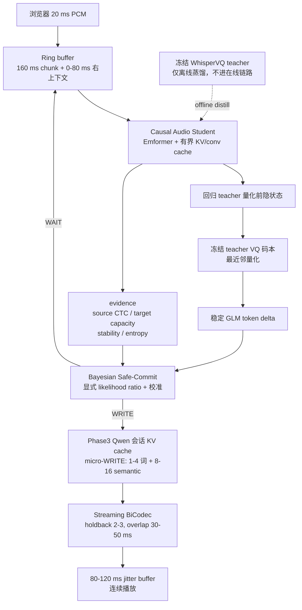
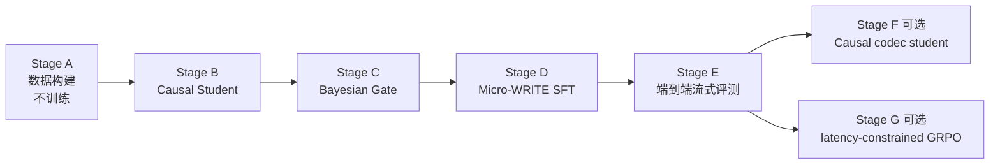

# Simul-UniSS 同声传译总纲：现状、诊断与完整方案

> 文档日期：2026-07-31
> 目标仓库：`/opt/dlami/nvme/jasonleeeli/projects/UniSS`
> 定位：simultaneous speech-to-speech translation 方向的唯一入口文档
> 边界：本文只做现状梳理、根因诊断与方案设计，不代表任何亚秒级模型已经训练完成

本文向下链接到三份细化文档，不复述其内容：

- [亚秒级延迟研究与实施计划](simul_uniss_true_subsecond_latency_research_and_implementation_plan.md)：Stage A--G 的逐节工程规范
- [Simul-UniSS 详细实施计划](simul_uniss_detailed_implementation_plan.md)：Stage 0--8 的原始设计
- [Stage3/4/6 流式评测计划](simul_uniss_stage3_stage4_stage6_streaming_evaluation_plan.md)：评测口径与分层定义

---

## 0. 结论先行

当前项目已经有一套**能跑通、能评测、指标完整的流式 S2ST 系统**，但它还不是同传系统。Stage4/Stage6 在 UniST full dev 上 StartOffset NCA 约 4.26 s、CA 约 7.2--7.4 s，Stage7A 最激进的 R2 策略 First WRITE 也只有 4111 ms。这些数字距离"同传"差一个数量级。

关键判断是：**这不是策略保守造成的，也不是 H200 算力不够。** 系统在收到足够源语音之前，根本没有稳定、因果、可提交的源表示。四个互相独立的延迟地板叠加起来，把首包硬钉在 3--6 秒：源表示地板（WhisperVQ 4 s block）、决策粒度地板（640 ms chunk × wait-k=2）、生成粒度地板（一次 WRITE 出整个短语）、音色注册地板（3.2 s speaker enrollment）。任何一个不拆，其余三个拆掉也没用。

拆源表示地板的方案（Causal Audio Student）代码已经写好并训过 pilot，**结构性测试全部通过，但表示质量彻底不达标**：GLM token agreement 只有 0.3735（pilot manifest）到 0.1785（E2 dev），门槛是 0.90。本文第 4 章从代码层面定位了五条根因，核心结论是：**当前 Stage B 用 CTC 让一个 512 维小模型从零学 16384 路 VQ 码本索引，既没有表示级监督，也丢掉了本来已知的定速对齐关系。** 这不是训练不够久的问题，是目标函数选错了。

对应的方案是把 Stage B 的 GLM 头从"预测码本索引"改成"回归 teacher 量化前隐状态 + 共享冻结码本量化"，用逐帧 L2/cosine 替代 CTC。这样 Qwen 兼容性由构造保证，误差退化为声学近邻码而不是任意码。其余三层（Bayesian Safe-Commit、Micro-WRITE、Streaming BiCodec）保持既定主线。

工程目标应当是 **p50 亚秒、p95 受控**，而不是强迫所有句子低于 1 秒。中英之间存在语序重排和否定歧义，安全的同传系统必须允许困难句子自适应等待。

---

## 1. 项目现状梳理

### 1.1 Offline UniSS 基线

UniSS 是单阶段 S2ST：一个 Qwen2 causal LM 在同一条序列里完成 listen → translate → speak，推理期没有独立的声学模型或 flow-matching decoder。

| 组件 | 实现 | 速率/规模 |
|---|---|---|
| Backbone | `Qwen2ForCausalLM`，vocab 扩到 180407 | 1.5B（论文）/ 0.5B（本地复现） |
| 源侧 linguistic token | GLM-4 Voice Tokenizer = WhisperVQ（Whisper encoder 第 16 层后接 VQ） | **12.5 token/s**，码本 16384 |
| 目标侧 semantic token | SparkTTS BiCodec quantizer | **50 token/s**，码本 8192 |
| 音色/全局 | BiCodec speaker encoder | 固定 **32** 个 global token |
| 训练框架 | Megatron-LM，packed seq 18000，GBS 128 | Phase1/2/3 |

词表布局固定在 [`training/constants_uniss.py`](../../training/constants_uniss.py)：BiCodec global 从 151665 起，BiCodec semantic 从 155761 起，GLM semantic 从 163953 起，控制 token 在 180372--180406。

Quality 模式的序列形态（[`uniss/cli/prompt.py`](../../uniss/cli/prompt.py)）是：

```text
prompt : <|task_s2s_translation|><|slow_mode|>{tgt_lang}
         <|start_global_token|>{32 个 bicodec_global}<|end_global_token|>
         {source_glm 序列}
         <|write_generate|><|task_asr|>{src_lang}<|speed_9|><|start_content|>
target : {转写}<|end_content|>
         <|task_s2t_translation|>{tgt_lang}<|speed_9|><|start_content|>
         {翻译}<|end_content|>
         <|start_semantic_token|>{target bicodec semantic}<|end_semantic_token|>
```

Phase1（ASR/TTS/S2TT/MT 对齐）→ Phase2（S2ST + CoT + 2:1 replay）→ Phase3（高质量退火）已在公开 UniST full198 上复现完成。

### 1.2 Simul-UniSS Stage 0--8

在 offline 基线之上，项目扩展出 WAIT/WRITE 交错的流式版本，复用同一词表：

| Token | ID | 作用 |
|---|---:|---|
| `<\|task_streaming_s2st\|>` | 180384 | 流式 S2ST 任务 |
| `<\|streaming_mode\|>` | 180406 | 会话标记 |
| `<\|wait_read\|>` | 180395 | WAIT，继续读源 |
| `<\|write_generate\|>` | 180396 | WRITE，提交目标短语 + semantic |
| `<\|start_glm\|>` / `<\|end_glm\|>` | 180389 / 180393 | 源 chunk 边界 |

交错样本由 [`training/simul_uniss/sample_builders.py`](../../training/simul_uniss/sample_builders.py) 构造，loss 权重 action : text : semantic = 4 : 2 : 1，源 chunk 与 header 权重为 0。

各 Stage 的实际完成度：

| Stage | 内容 | 状态 |
|---|---|---|
| 0A | Prefix 重编码基线 | 已实现，15-shard smoke |
| 1A/1B | Token / audio streaming student + CTC 头 | 已实现，仅 15-shard 训练，**未进入 full198 评测链路** |
| 2 | Source/Target CTC policy 头 | 与 Stage1 联合实现，**full198 规模未验证** |
| **3** | WAIT/WRITE action SFT | **full198 训完（v7, iter 4753）+ 已评测** |
| **4** | Phrase 级 interleaved S2ST | **full198 训完（v8, iter 4753）+ 已评测** |
| 5A | Overlap BiCodec 流式解码 | 已实现，Stage4 评测在用 |
| 5B | Chunk-aware BiCodec refinement | 仅 15-shard |
| **6** | Joint 低 LR refinement | **full198 训完（v8, iter 1189）+ 已评测** |
| 7 / 7A | GRPO 策略优化 | bootstrap + stage7a 独立线，**未在 full198 Qwen 上做** |
| 8 | NAR semantic 生成器 | 仅 bootstrap |

### 1.3 亚秒线 subsecond v1 / v2

针对"源表示地板"另开了一条独立命名空间的实验线：

| Stage | 内容 | 实现位置 | 状态 |
|---|---|---|---|
| A | 数据构建：重建音频、teacher 标签、强制对齐、support alignment、safe/unsafe 标签、micro-WRITE 事件 | `subsecond_v1/stage_a.py`、`subsecond_v2/prepare_a45.py`、`prepare_a68.py`、`formal_supervision.py` | 15-shard formal 已产出 `a45_parts` / `a68_parts` |
| B | Causal Audio Student（Emformer） | `subsecond_v1/model.py`、`train_stage_b.py` | 8 卡 pilot 训完，**质量门未过** |
| C | Bayesian Safe-Commit gate | `subsecond_v1/stage_c.py`、`train_stage_c.py`、`subsecond_v2/validate_stage_c.py` | 15-shard proxy + v2 smoke |
| D | Micro-WRITE SFT | `subsecond_v1/prepare_stage_d.py`、`subsecond_v2/prepare_stage_d.py` | proxy 15-shard 训到 iter 616，v2 仅 smoke |

Stage B 模型是 `CausalAudioStudentV2`：128 维 log-Mel（`center=False`，hop 10 ms）→ 4 帧堆叠得到 **40 ms/帧** → `torchaudio.models.Emformer`（默认 512 维 12 层 8 头）→ 四个头：teacher GLM CTC、source CTC、target capacity、stability。

### 1.4 Web demo

三套独立的 Gradio 演示：`web_demo/offline_s2st_phase3_v1`（离线）、`web_demo/streaming_s2st_r2_v1`（R2 流式，含麦克风与双声道对比播放器）、`web_demo/subsecond_e2_v1`（Stage B 前端诊断）。

### 1.5 能力边界：已成立 vs 未成立

**已成立**（有 full-dev/test 规模数据支撑）：

- offline UniSS 架构、词表、Phase1--3 训练链路完整可复现。
- Stage3/4/6 的 WAIT/WRITE 交错生成在 full198 上可训练、可自由运行解码、可产出真实 BiCodec 波形。
- 流式评测基础设施完整：策略指标、token 级 NCA 延迟、墙钟 CA 延迟、播放连续性、边界 click 全部有实现。
- Stage B 的因果性实现是**正确**的：cache parity 最大绝对误差 3.81e-6，future perturbation 最大绝对误差 0.0。

**未成立**（必须在任何对外结论中写明）：

- **所有 source chunk 边界仍来自 `pseudo_proportional_token_alignment`**，即按文本/token 长度比例切分，不是音频时间戳。策略从未学过"真实证据何时到达"，因此 Stage3/4/6 的全部延迟数字是**策略时间轴上的代理值**，不是真实同传延迟。
- Stage1/2 的 streaming frontend 与 CTC gate 从未接入 full198 评测链路；`StreamingController` 至今没有连上任何 Megatron checkpoint 做自由运行。
- Stage B 表示质量不达标，因此"用因果前端替换 WhisperVQ"这条路目前**没有被验证**。
- CVSS-T 上的 simultaneous 评测因缺少 Common Voice 4 源音频配对而阻塞。

---

## 2. 已有实测数据

以下都是 UniST full dev（7,965 条）自由运行 + 真实 BiCodec 波形的结果，来自各 run 目录下的报告。

### 2.1 Stage4 与 Stage6 流式延迟

| 指标 | Stage4 mean | Stage4 p95 | Stage6 mean | Stage6 p95 |
|---|---:|---:|---:|---:|
| First WRITE NCA proxy (ms) | 4263.2 | 7040.0 | 4264.4 | 7040.0 |
| StartOffset NCA (ms) | 4263.3 | 7040.0 | 4264.5 | 7040.0 |
| StartOffset CA (ms) | 7365.5 | 14077.2 | 7239.1 | 12729.9 |
| EndOffset CA (ms) | 10262.0 | 23646.9 | 9953.4 | 22152.1 |
| ATD proxy (ms) | 1923.0 | 3285.3 | 1922.3 | 3285.3 |
| RTF / source audio | 0.9986 | 2.0839 | 0.9779 | 1.9208 |
| WAIT/WRITE accuracy | 0.9385 | — | 0.9388 | — |
| Premature WRITE | 0.0260 | — | 0.0258 | — |
| Unnecessary WAIT | 0.1535 | — | 0.1531 | — |

Stage6 相对 Stage4 只在 CA 侧小幅改善（StartOffset CA -126 ms），NCA 几乎不动——**因为 NCA 完全由 pseudo schedule 决定，模型改不动它**。这本身就是"当前延迟不是策略问题"的直接证据。

### 2.2 流式 vs 离线的质量代价

Stage4 streaming 相对 offline quality 模式：

| 指标 | 方向 | Streaming | Offline quality | Δ |
|---|---|---:|---:|---:|
| text_bleu | cmn→eng | 28.32 | 40.46 | **-12.14** |
| text_bleu | eng→cmn | 37.48 | 44.88 | **-7.40** |
| speech_bleu | eng→cmn | 34.05 | 42.81 | -8.76 |
| autopcp | cmn→eng | 2.13 | 2.77 | -0.64 |
| slc_0_4 | cmn→eng | 0.59 | 0.83 | -0.24 |
| utmos | cmn→eng | 3.31 | 3.50 | -0.19 |

### 2.3 Stage7A GRPO 四路对比（full dev）

| 实验 | First WRITE ms | ATD ms | Premature | Unnecessary WAIT | Text-BLEU zh→en | Text-BLEU en→zh |
|---|---:|---:|---:|---:|---:|---:|
| R0 E3-v1 + WRITE bias | 4205.6 | 1890.0 | 0.032 | 0.150 | 27.59 | 37.72 |
| R1 rebalanced + coverage | 4234.1 | 1907.9 | 0.031 | 0.149 | 28.95 | 37.61 |
| **R2 explicit latency** | **4111.2** | 1861.4 | 0.037 | 0.141 | 28.98 | 37.46 |
| R3 bilingual + adaptive KL | 4157.5 | 1883.2 | 0.035 | 0.144 | 29.28 | 37.69 |

四个奖励设计跨越 **123 ms**。这是本文最重要的一张表：**在 pseudo schedule 和 4 s block 前端不变的前提下，策略优化的全部可达空间只有约 0.12 秒。** 继续在 reward 上做文章不可能达到亚秒。

### 2.4 Stage B pilot 验证结果

`checkpoints/simul_uniss_subsecond_v1/stage_b_pilot_15shard_vectorized_v2/stage_b_validation.json`：

```json
{
  "cache_max_abs": 3.814697265625e-06,
  "future_perturbation_max_abs": 0.0,
  "active_rtf": 0.1025,
  "glm_token_agreement": 0.3735,
  "structural_pass": true,
  "quality_pass": false,
  "status": "failed"
}
```

E2 真流式几何扫描（dev 全量 7,965 条，`experiments/simul_uniss_subsecond_e2_v1/unist_dev_full_7965_geometry_scan_v1/REPORT.md`）：

| chunk / right | First GLM NCA p50/p95 | stable 首 token 覆盖 | wait-k2 stable First WRITE CA p50 | active RTF p50 | **GLM agreement** |
|---|---:|---:|---:|---:|---:|
| 160 / 80 ms | 320 / 1920 ms | 31.0% | 337.4 ms | 0.1055 | **17.85%** |
| 320 / 80 ms | 640 / 1920 ms | 31.7% | 657.5 ms | 0.0541 | **16.70%** |
| 160 / 0 ms | 320 / 2080 ms | 31.6% | 337.2 ms | 0.1059 | **12.98%** |
| 320 / 0 ms | 640 / 2240 ms | 32.1% | 657.3 ms | 0.0543 | **13.69%** |

延迟侧全部达标：160 ms chunk 下首 token 320 ms、RTF 0.106。**质量侧全线崩溃**：agreement 13%--18%，且只有 31% 的样本能产出稳定首 token。

---

## 3. 为什么现在做不到同传：四个独立延迟地板

首包 3--6 秒不是单一原因，而是四个**可分别归因、必须分别拆除**的地板叠加。

### 3.1 源表示地板：WhisperVQ 的 4 秒块

`pretrained_models/UniSS/glm4_tokenizer/config.json` 实测：

```text
encoder_causal_convolution = True
encoder_causal_attention    = False
quantize_causal_encoder     = False
quantize_causal_block_size  = 200
pooling_kernel_size         = 4
pooling_position            = 16
```

卷积是因果的，**但 attention 不是**，量化 encoder 也不是。Whisper 卷积后约 20 ms 一帧，`quantize_causal_block_size=200` 对应约 **4 秒**。块内自由使用未来上下文，所以在线只能反复重编码越来越长的前缀，约 4 秒后 GLM 前缀才稳定下来。麦克风实测首个稳定 token 约 **4.22 s**。

这是模型结构和训练分布决定的，不是缓存没做好。

### 3.2 决策粒度地板：640 ms chunk

`tokens_per_chunk(640)` 在 12.5 token/s 下约 8 个 GLM token，`wait_k_chunks=2`：

```text
第 1 次动作机会 = 640 ms
再 WAIT 一次    = 1280 ms
```

即使计算时间为零，wait-k=2 已经超过 1 秒。亚秒模式必须走 80/160/240/320 ms 网格。

### 3.3 生成粒度地板：整短语 WRITE

一次 WRITE 生成完整短语文本加 100--700 个 semantic token（`max 700 tokens`）。codec 必须等大部分生成完才能开工，LM 与 codec 无法流水。50 Hz 下 700 个 token 是 14 秒语音。

### 3.4 音色注册地板：3.2 秒 speaker enrollment

麦克风模式需要约 3.2 秒音频才能提取并冻结 BiCodec speaker token。单这一项就超过 1 秒预算。"首次进入网页、无参考音色、要求复制当前说话人、还要 500 ms 输出"在当前 BiCodec speaker 建模下不可同时满足。

### 3.5 端到端延迟预算

目标是把系统地板压到 500--800 ms，公式为：

```text
L_first_audio_CA = L_capture + L_right_context + L_frontend_compute
                 + L_safe_commit + L_qwen_micro_write + L_codec + L_transport_buffer

L_total = L_system_floor + L_linguistic_wait
```

| 组件 | p50 预算 | p95 预算 | 依据 |
|---|---:|---:|---|
| 麦克风累积首个 chunk | 160 ms | 240 ms | `stream_every` 80--160 ms |
| encoder 有限右上下文 | 40--80 ms | 120 ms | 不能用 4 s block |
| causal student 计算 | 30--60 ms | 100 ms | E2 实测 active RTF 0.106 |
| CTC + Safe-Commit | 10--30 ms | 50 ms | 小 head，无长生成 |
| Qwen action + micro-WRITE | 120--220 ms | 350 ms | KV cache + 短输出 |
| BiCodec 首块 | 60--120 ms | 180 ms | 低 holdback |
| 网络与浏览器 buffer | 80--120 ms | 200 ms | 公网可能更高 |
| **合计** | **500--790 ms** | **1000--1240 ms** | 不含语言学必要等待 |

`L_linguistic_wait` 是模型因语义不确定而额外等待的时间，不应该也不可能被消除。

### 3.6 为什么调 `write_logit_bias` 或提前时间轴无效

三条独立理由：

1. **策略可达空间只有 123 ms。** Stage7A 四个奖励设计的 First WRITE 跨度见 §2.3。R2 已经是最激进的显式延迟奖励，仍然停在 4111 ms。
2. **NCA 由 pseudo schedule 决定。** Stage6 相对 Stage4 的 NCA 差异是 1.2 ms。模型无法改变一个由数据构造固定下来的时间轴。
3. **提前播放时间轴是自欺。** 源音频实时到达时，`t` 时刻的 GLM token 物理上还没形成。把生成结果在时间轴上前移不改变第一个目标 PCM 真实到达声卡的墙钟时间。

因此必须冻结三个防作弊定义：

```text
First WRITE NCA    : 策略首次提交非空目标内容时已消耗的源音频时长
First Audio CA     : 从浏览器开始采集，到第一段非静音目标 PCM 进入播放队列的真实墙钟时间
Useful First Audio : 第一段通过 prefix correctness 和 ASR 可懂度 gate 的目标音频到达时间
```

`Useful First Audio` 专门防止模型靠输出 "uh" / "the" / 噪声来刷延迟指标。

---

## 4. Stage B 根因诊断

这是本文相对既有文档新增的核心分析。

### 4.1 现象

延迟侧完全达标（首 token 320 ms、active RTF 0.106），因果性实现完全正确（cache parity 3.8e-6、future perturbation 0.0），**但 GLM token agreement 只有 13%--37%，门槛 90%**，且只有约 31% 的样本能产出稳定首 token。

延迟达标 + 因果正确 + 表示崩溃，这个组合说明问题不在工程实现，在**学习目标的设计**。

### 4.2 五条代码级根因

#### (a) 完全没有表示级监督

[`train_stage_b.py`](../../training/simul_uniss/subsecond_v1/train_stage_b.py) 的 `stage_b_losses` 实际只有四项：

```python
total = (
    teacher                          # GLM CTC，权重 1.0
    + source_weight * source         # 默认 0.1
    + capacity_weight * capacity     # 默认 0.0
    + stability_weight * stability   # 默认 0.2
    + connected_zero
)
```

[亚秒计划](simul_uniss_true_subsecond_latency_research_and_implementation_plan.md) §B4 要求的 `0.5 * L_hidden_distill` **一行都没有实现**。结果是：一个 512 维 12 层的模型要在**没有任何中间表示引导**的情况下，从零学会复现 WhisperVQ 第 16 层之后的 16384 路量化结果。teacher 的 hidden state 是 Whisper 大模型在完整上下文下算出来的，student 只有 CTC 这一个稀疏的、经过 argmax 的监督信号，信息带宽差了几个数量级。

#### (b) 用 CTC 建模一个已知的定速对齐

GLM 是**定速** 12.5 Hz 序列：每 80 ms 恰好一个 token。Student 的 `stack_factor=4`，hop 160 samples，得到 40 ms/帧即 25 Hz。**2:1 整数比，对齐由构造完全已知。**

在已知对齐上用 CTC 有两处实质损害：

1. **repeat-collapse 不可逆。** `greedy_ctc_tokens` 的定义就是折叠相邻相同 token：

```python
if value != blank and value != previous:
    result.append(value)
```

静音段、长元音、稳态噪声区的 GLM 序列本身包含连续重复码。这些重复在贪心 CTC 解码后**数学上无法恢复**，直接给 agreement 设了一个与音频内容相关的硬上限。

2. **路径预算紧张。** 目标含重复标签时，CTC 最短路径需要在重复之间插入 blank，所需输入帧数是 `len(target) + repeat_count`。输入只有目标的 2 倍，重复率一高就逼近甚至越过可行边界，`zero_infinity=True` 会把这些样本的梯度直接抹掉。

对一个已知一一对应的定速映射用 CTC，是把一个简单的逐帧分类问题人为变成了一个受约束的序列对齐问题，且付出了不可逆的信息损失。

#### (c) 预测码本索引，而不是量化前隐状态

`teacher_glm_head = nn.Linear(hidden_size, GLM_SEMANTIC_SIZE + 1)` 是 512 → 16385 的分类。VQ 码本里相邻的码在声学上可能几乎等价，但 exact-match 指标和 CE 损失都把"猜到隔壁码"和"猜到完全无关的码"同等惩罚。这既让训练信号极度稀疏，也让 agreement 成为一个过苛的评价指标。

#### (d) 标签与输入的域不匹配

[`data.py`](../../training/simul_uniss/subsecond_v1/data.py) 第 60 行加载的是 Stage A 用 BiCodec **重建**出的 FLAC：

```python
waveform, sample_rate = torchaudio.load(str(item["source_audio"]))
```

而 teacher label 默认取 `--teacher-glm-field source_glm`，即 UniST 里用**原始**音频算出的 GLM 序列。亚秒计划 §A3 自己就写明"重建音频经过有损 codec，重新编码得到的 GLM 序列不保证与数据内 `source_glm` 完全一致"。

于是当前的 `glm_token_agreement` 同时包含两项误差：**因果性损失**（该测的）和 **codec 重建损失**（不该混进来的）。两者未分离，导致无法判断 37% 里有多少是架构问题、有多少是数据构造问题。

#### (e) stability 标签是位置启发式

```python
stable_before = (lengths - stability_holdback_frames).clamp_min(0).unsqueeze(1)
stability_target = (positions < stable_before).float()
```

`stability_holdback_frames` 默认 4，即标签含义是"除最后 4 帧外全部算稳定"。这与计划书要求的定义（token 在 `t`、`t+160 ms`、`t+320 ms` 三个前缀下保持一致，且出现在最终 teacher 序列中）毫无关系。

后果很严重：**source-token commit 完全依赖这个头**。它学到的只是"离序列末尾有多远"，而不是"这个 token 会不会被后续音频推翻"。这直接解释了为什么只有 31% 的样本能产出稳定首 token。

#### 其余四个工程问题

| 问题 | 位置 | 后果 |
|---|---|---|
| `capacity_weight` 默认 0.0 | `train_stage_b.py` L194 | target capacity 头靠 `connected_zero` 挂在 DDP 图上，**从未被训练**；而 Stage C 的 gate 正要用它 |
| best.pt 按 `valid_total_loss` 选 | `train_stage_b.py` L364 | 计划书 §B8 明确要求不能只按总 loss 选；agreement 未参与选择 |
| pilot 用 Student-S | `train_stage_b.py` 默认 512/12/8/2048 | README 声明 formal 是 768 维 16 层 12 头 FFN 3072，pilot 结论不能外推 |
| 只有 15 shard | — | 1.5M 条 vs full198 的 19.3M 条 |

### 4.3 先做天花板判定实验（零训练成本）

在改任何模型之前，必须先把 (d) 从其余根因里分离出来。做法：

```text
用冻结 WhisperVQ，以完整上下文（非因果、原始 4 s block 设置）编码 Stage A 的重建 FLAC
  → 得到 glm_reencoded
对 UniST 的 source_glm 计算 agreement
  → 这就是当前数据构造下任何 student 的理论天花板
```

同时统计 `source_glm` 的**相邻重复率**和**最大重复 run**，用来量化 (b) 的 repeat-collapse 上限。参考量级：Stage4 报告里 BiCodec semantic 的 adjacent repeat rate 是 0.1083、最大 run 是 63。

三种结果对应三条不同的动作：

| 天花板 | 判定 | 动作 |
|---|---|---|
| 接近 1.0 | 问题在 (a)(b)(c)(e) | 按 §5.3 改造 loss 与 GLM 头，数据不动 |
| 0.5--0.9 | codec 重建是主要污染源 | teacher label 改为在重建音频上用冻结 WhisperVQ 重算；agreement 指标同步换基准 |
| 低于 0.5 | 重建音频不适合做 student 训练域 | Stage A 必须引入真实波形的 source-only 蒸馏数据 |

这个实验只需要一次前向，成本可以忽略，但它决定后面所有工作的方向。**在拿到这个数字之前不应该启动新的 Stage B 训练。**

### 4.4 诊断结论

Stage B 失败的**主因是目标函数设计**，不是训练不足、不是模型太小、不是数据太少。当前配置要求一个小模型在无表示监督的条件下、用一个会丢信息的序列损失、去精确命中一个 16384 路的量化 cell，同时还要在一个域不匹配的标签上被评分。任何一项单独都足以严重压制 agreement。

---

## 5. 完整方案

### 5.1 Motivation：三类不确定性，两类 commit

同传系统在每个决策时刻面对**三类性质完全不同的不确定性**：

1. **声学不确定性**：当前这 160 ms 音频是否已经形成稳定的音素/GLM token？
2. **翻译支持度不确定性**：当前源前缀是否足以支持一个不可回滚的目标短语？
3. **语音生成不确定性**：目标 semantic 是否稳定、非塌缩、可以立刻播放？

当前系统用**单个 WAIT/WRITE logit** 同时承担这三件事。这是 §2.3 里策略优化只有 123 ms 空间的深层原因：奖励信号无法区分"前端还没准备好"和"翻译还不安全"，梯度互相抵消。

对应地，系统里存在**两种不能混淆的 commit**：

- **source-token commit**：Causal Student 确认某些源 GLM token 已稳定，可以追加进 Qwen 上下文。解决声学抖动。可撤销（只是没进 context）。
- **target-audio commit**：Bayesian Gate 确认某个目标 micro-phrase 足够安全，可以生成并播放。解决语序重排与语义风险。**播放后不可撤销**。

把这两者分开，才能在出问题时知道该改前端还是改策略。

### 5.2 架构



在线推理只加载：Causal Student、Bayesian Gate 参数与校准表、Micro-WRITE Qwen、Streaming BiCodec、固定 speaker token。**不加载** full WhisperVQ teacher、WhisperX/FunASR/MFA、bilingual aligner、target reference audio、safe/unsafe 标签、未来音频。

### 5.3 逐层设计

#### 第 1 层：Causal Audio Student（源表示）

**Motivation：不改 WhisperVQ，改成蒸馏。** 直接把原 attention mask 翻成 causal 有五个风险：权重已适应块内未来帧、hidden state 会系统性偏移、VQ 码本边界改变导致 token 对 Qwen 的含义漂移、破坏原 checkpoint 的 offline 可复现性、且光改 mask 仍没有 cache。teacher 全程 `requires_grad=False`、`eval()`、只在离线出现。

**关键改造（针对 §4 的五条根因）：**

| 根因 | 改造 |
|---|---|
| (a) 无表示监督 | 加入 `L_hidden_distill`：student hidden 经线性投影后逼近对齐的 teacher hidden，权重 0.5。teacher hidden 离线缓存 1--3 个选定层 |
| (b) CTC 用错 | **去掉 GLM 头的 CTC**。12.5 Hz 与 40 ms 帧是 2:1，把相邻两个 student 帧 pool 成一个 80 ms 步，做逐帧监督。彻底消除 blank 与 repeat-collapse |
| (c) 预测码索引 | GLM 头改为**回归 teacher 量化前隐状态**，损失用 L2 + cosine；线上把 student 输出送进**共享的冻结 teacher 码本**做最近邻量化得到 token |
| (d) 域不匹配 | teacher label 改为在**同一段重建音频**上用冻结 WhisperVQ 全上下文重算（视 §4.3 天花板实验结果决定） |
| (e) stability 假标签 | 标签改为真实定义：token 在 `t`、`t+160`、`t+320` 三个前缀下保持一致**且**出现在最终 teacher 序列中，才标记稳定。未来信息只用于离线造标签 |

"回归隐状态 + 共享冻结码本"这一条是本方案的技术核心，它带来三个直接好处：

1. **Qwen 兼容性由构造保证**。token 一定落在原码本里，语义空间不漂移，不需要重训 Qwen 词表。
2. **损失变平滑**。从 16385 路 CE 变成连续回归，梯度信息量大幅提升。
3. **误差优雅退化**。预测偏差先表现为落到声学近邻码，而不是任意码；即使 exact-match agreement 没到 100%，下游翻译质量的退化也是渐进的。

其余保持既定规范：128 维 log-Mel（`center=False`）、因果卷积下采样、12--16 层 Chunk-Conformer/Emformer、左记忆 2--4 s **有界**、右上下文 0--80 ms、per-layer KV cache。此外把 `capacity_weight` 从 0.0 打开，否则 Stage C 无证据可用。

修订后的损失：

```text
L_B = 1.0 * L_glm_latent        # 逐帧 L2 + cosine，替代原 CTC
    + 0.5 * L_hidden_distill    # 新增
    + 0.3 * L_source_ctc        # 保留 CTC，这里对齐确实未知
    + 0.4 * L_target_capacity   # 打开
    + 0.2 * L_stability         # 标签重做
    + 0.1 * L_chunk_consistency # 新增
```

注意 `L_source_ctc` 保留 CTC 是正确的：源文字/音素与音频帧之间的对齐**确实未知**，CTC 在这里是对的工具。问题只出在 GLM 头把一个已知对齐当未知处理。

#### 第 2 层：Bayesian Safe-Commit Gate（目标提交）

**Motivation：** 不可回滚的播放需要一个**校准过的概率**，而不是一个未校准的 softmax。定义 `z_t = 1` 表示"此刻提交下一个目标 micro-phrase 是安全的"，用可审计的显式 likelihood ratio：

```text
log O_post = log O_prior + Σ_k log LR_k
P_safe     = O_post / (1 + O_post)
```

四组证据各自贡献一个 likelihood ratio：

| 组 | 内容 |
|---|---|
| acoustic | GLM token persistence、CTC blank 概率、student entropy、teacher-agreement proxy |
| translation | target-capacity margin、Qwen WAIT/WRITE logit margin、draft 连续 tick 一致率 |
| boundary | 静音、音节/词边界、标点概率、micro-chunk 能否自然结束 |
| history | 距上次 WRITE 时间、近期修订率、播放 buffer、累计等待 |

决策写成风险最小化，`fast`/`balanced`/`quality` 对应不同的 `C_latency / C_error` 比率和先验，而不是随手改阈值：

```text
Cost(WRITE) = (1 - P_safe) * C_irreversible_error
Cost(WAIT)  = C_latency_per_tick
提交条件    : Cost(WRITE) <= Cost(WAIT)
```

推理时加迟滞避免抖动：`posterior >= τ_write` 连续 2 tick 才 WRITE；`τ_draft <= posterior < τ_write` 只在内部生成 draft 不播放。

**必须在 dev_calibration 上做 temperature 或 isotonic 校准并画 reliability diagram**，验证 `P_safe = 0.9` 的样本确实约 90% 安全。未校准的 softmax 不能叫 Bayes。

#### 第 3 层：Qwen KV-cache + Micro-WRITE

**Motivation：** 把一次大提交拆成可流水的短事务，让 codec 与 LM 并行。

```text
传统 WRITE  : [完整短语文本 + 100-700 semantic] → decode → play
Micro-WRITE : [1-4 词 + 8-16 semantic] → 立即 decode/play
              同时生成下一块 semantic
```

50 Hz 下 8--16 个 semantic token 是 160--320 ms 语音。会话接口：

```python
state  = adapter.start_session(header)         # 只建立一次
state.append_source(new_glm_tokens)            # 只 prefill 新增 token
action = state.next_action()                   # 单 token decode
delta  = state.generate_micro_write(8, 16)     # 短文本 + 短 semantic
```

当前 web demo 的 `QwenLiveAdapter` 每次动作重新前向完整 prompt，必须换成复用 `past_key_values` 的真正会话状态。

**Micro-WRITE 必须进训练数据。** 只在推理阶段硬截断会破坏模型学到的序列格式。协议沿用现有 token，不扩词表：

```text
START_GLM x1 x2 END_GLM
WRITE_GENERATE
START_CONTENT "Tomorrow morning" END_CONTENT
START_SEMANTIC s1 ... s12 END_SEMANTIC

START_GLM x3 x4 END_GLM
WRITE_GENERATE
START_CONTENT "at nine" END_CONTENT
START_SEMANTIC s13 ... s24 END_SEMANTIC
```

从最佳 Phase3 checkpoint 初始化，混 20%--40% Phase3 replay 防止短块训练导致翻译与语音能力遗忘：

```text
L_micro = 1.0 L_action + 1.0 L_target_text + 1.0 L_semantic
        + 0.2 L_chunk_boundary + 0.1 L_duration
        + λ_replay L_phase3_replay
```

#### 第 4 层：Streaming BiCodec

短期复用现有 `StreamingBiCodecDecoder`，换低延迟参数：`left_context_tokens` 25--50、`holdback_tokens` 2--3（40--60 ms）、`overlap_ms` 30--50。中期蒸馏因果 codec student，去掉 overlap re-decode 可再省 50--150 ms。

防止短块之间出现咔哒声或音色跳变：整个会话固定 speaker token、保留 codec cache、相邻块 30--50 ms overlap-add、对边界做 waveform/STFT continuity 训练、浏览器用小而稳定的 jitter buffer 而不是每块新建播放器。

#### 第 5 层：音色策略

首版**固定目标音色**，把 3.2 s speaker enrollment 从关键路径彻底移除。source voice cloning 另设"预注册/历史会话缓存"模式。**不要**做"首包先用固定音色、2--3 秒后切换"——那会造成明显的音色突变。

#### 服务端流水线

```text
Thread A: 音频采集 + 重采样
Thread B: causal frontend cache 更新
Thread C: policy + Qwen KV decode
Thread D: BiCodec decode
Thread E: 浏览器网络与播放队列
```

每 160 ms tick：只处理新 PCM → 更新 frontend cache → 产出 0 个或多个稳定 GLM token → 更新 safe posterior → WAIT 或 micro-WRITE → **semantic 攒够 8 个就推给 codec，不等 WRITE 完整结束** → codec 首个稳定 PCM 立即发送。

---

## 6. 训练路线与验收门

严格串行，每阶段只让一个模块变化，否则出问题无法定位。



### 6.1 各阶段规格

| Stage | 训练什么 | 冻结什么 | 主要产出 | 验收门 |
|---|---|---|---|---|
| **A** | 不训练任何权重 | WhisperVQ / BiCodec / Phase3 全冻结 | 版本化 manifest、索引、统计、`STAGE_A_COMPLETE.json` | 音频 decode 成功率 ≥99%、source alignment 覆盖 ≥95%、高置信 bilingual support 覆盖 ≥90%、train/dev/test ID 交集 = 0、micro-write semantic 覆盖 100% |
| **B** | Causal Student 全部参数 + 四个头 | WhisperVQ teacher、Qwen、BiCodec | student checkpoint、cache 配置、stability 校准、`STAGE_B_COMPLETE.json` | p50 first stable GLM ≤400 ms、p95 ≤720 ms、**teacher agreement ≥90%**、committed rollback = 0、cache parity ≥99.9%、active RTF p95 <0.25、接冻结 Phase3 后 Text-BLEU 掉 ≤2 点、COMET 掉 ≤0.03 |
| **C** | prior / likelihood 参数 + 校准表 | Student、Qwen、BiCodec | gate 参数、calibration.json、reliability diagram | ECE ≤ 门槛、各模式 recall 达标、`P_safe=0.9` 的实际安全率约 90% |
| **D** | Qwen（从最佳 Phase3 初始化） | Student、BiCodec | micro-WRITE checkpoint | 短块格式合法率、Phase3 replay 质量不退化、duration 合理 |
| **E** | 不训练 | 全部 | 端到端流式评测报告 | 见 §7.3 |
| **F** | Causal BiCodec student（可选） | 其余 | 因果 codec | 首包再降 50--150 ms 且 boundary click 通过 |
| **G** | latency-constrained GRPO（可选） | 视情况 | 优化后策略 | 延迟改善且质量不退 |

### 6.2 Stage A 要产出什么

Stage A **是数据构建，不是模型训练**，它的 "checkpoint" 是版本化 manifest 而不是权重：

```text
UniST token 记录
  → BiCodec decoder 重建 source/target 16 kHz mono FLAC（不做 VAD trim）
  → 冻结 WhisperVQ teacher 标签（token / top-k logits / 选定层 hidden）
  → source 词/字时间戳（中文 FunASR-Paraformer，英文 WhisperX/MFA）
  → target 词与 semantic 时间戳（semantic_start_ms(k) ≈ 20k）
  → bilingual support alignment: support_end_ms(m_j) = max(end_ms(所需 source word))
  → safe/unsafe 标签
  → micro-WRITE 训练事件
  → 独立 subsecond manifest + STAGE_A_COMPLETE.json
```

**不能做 VAD 去首尾静音**，那会改变真实 streaming 时间戳和延迟指标。

`audio_origin` 必须记录 `{reconstructed, original, augmented}`，评估**分桶报告**，避免重建音频上的好结果掩盖真实麦克风域退化。

### 6.3 四类必做的因果性测试

只有 causal mask 不等于实现正确。Stage B 每个 checkpoint 都要跑：

| 测试 | 做法 | 通过标准 |
|---|---|---|
| **Future perturbation** | 两个音频前 640 ms 相同、之后不同 | 允许的 80 ms lookahead 之外，640 ms 前的 logits/token 必须完全相同 |
| **Cache parity** | 一次性 full causal forward vs 160 ms 增量 forward | 有效时间步 logits 在数值容差内一致，CTC token 序列一致 |
| **Chunk-boundary invariance** | 同一音频用 160 / 240 / 320 ms 分块 | 共同可见范围内稳定 token 高度一致 |
| **Long-session bounded memory** | 连续输入 30--60 分钟 | cache 显存有界、每 tick 计算时间不随通话长度增长、position offset 不溢出 |

当前 pilot 的前两项已经过（3.8e-6 / 0.0），后两项应补齐。

### 6.4 数据切分与 test 纪律

```text
train           : Student 训练、Bayesian likelihood/prior 拟合、Micro-WRITE SFT
dev_calibration : posterior 校准、fast/balanced/quality 阈值选择
dev_selection   : checkpoint 选择与消融
test            : 冻结模型、阈值和配置后只运行一次
```

`dev_calibration` 与 `dev_selection` 从 `dev-00000.parquet` **按样本 ID 哈希**确定性划分，不能按文件前后顺序切。所有划分按 `src_lang→tgt_lang` 分层。**test 不能用于选择 Bayesian 阈值、chunk size 或 micro-WRITE 长度。**

### 6.5 checkpoint 选择

不能只按 `valid_total_loss` 选（当前 Stage B 的做法）。每次 validation 至少记录：GLM latent 距离、teacher token agreement、source CER/WER、first stable GLM p50/p90/p95、uncommitted revision rate、committed rollback rate、cache/full-causal parity、active RTF p50/p95、audio seconds/s、接 Phase3 的 Text-BLEU/COMET。

---

## 7. 评测协议

### 7.1 三个冻结定义

见 §3.6。三者不可互相替代，报告必须同时给出。

### 7.2 报告纪律

以下三条是既有 Stage4/Stage6 报告已经踩过并写进"结论边界"的坑，必须继承：

1. **NCA 与 CA 必须分开报。** NCA 是策略时间轴，CA 加入真实计算与排队。
2. **批量吞吐与 batch=1 延迟必须分开解释。** 4-GPU 批量评测的吞吐不能当作单会话延迟。
3. **必须标注结论层级**：`teacher_forced_proxy` / `free_running_pseudo_streaming` / `real_audio_wall_clock_streaming`。当前所有 Stage3/4/6 结果都属于前两类。

### 7.3 第一阶段 gate

```text
Frontend:
  p50 first stable GLM      <= 400 ms
  p95 first stable GLM      <= 720 ms
  committed rollback         = 0
  teacher token agreement   >= 90%

Policy:
  p50 First WRITE NCA       <= 640 ms
  premature WRITE           <= 5%
  final flush                = 100%

End-to-end:
  p50 Useful First Audio CA <= 900 ms
  p95 Useful First Audio CA <= 1400 ms
  RTF p95                    < 0.6
  semantic collapse          = 0
  decode failure             = 0
```

质量 gate 以当前 R2 和 offline Phase3 为基线，按 dev 置信区间冻结，**不能训练结束后临时改**。

### 7.4 指标清单

**延迟**：Useful First Audio CA p50/p90/p95、First WRITE NCA、StartOffset CA/NCA、ATD/LAAL/DAL、per-chunk ACT、frontend/Qwen/codec/network 分项、RTF p50/p95、浏览器 underrun 与 buffer 增长。

**质量**：Text-BLEU/chrF/COMET、Speech-BLEU、prefix BLEU/COMET、premature WRITE、under-translation、hallucination、revision、semantic unique ratio 与最大重复 run、UTMOS/AutoPCP/SLC、speaker cosine、boundary click 与谱距离。

---

## 8. 风险、退路与里程碑

### 8.1 Stage B 改造后仍不达标的三条退路

| 退路 | 做法 | 代价 |
|---|---|---|
| **B-1 放宽几何** | 主右上下文从 80 ms 提到 160 ms，chunk 从 160 提到 240--320 ms | 直接增加 80--240 ms 算法延迟，p50 亚秒目标压力增大，但仍远优于 4 s |
| **B-2 Streaming-WhisperVQ clone** | 复制原 WhisperVQ 权重到新目录，block mask 改为 160--320 ms chunk + 0--80 ms lookahead，加每层 KV cache，用原 WhisperVQ 自蒸馏，沿用原码本 | 参数兼容性更好，但模型大、cache 工程复杂、RTF 可能不达标；作为 E2b 对照而非首选 |
| **B-3 文本枢轴 baseline** | streaming ASR → incremental MT → streaming TTS/BiCodec | 放弃 textless/unit-to-unit 的研究故事，ASR 错误会传递，韵律与 speaker preservation 变弱；但亚秒成功率最高，可作为可行性下界 |

判定顺序：先 §4.3 天花板实验 → 改造后重训 → 若 agreement 仍 <70%，走 B-1；仍不行走 B-2；B-2 的 RTF 不达标则接受 B-3 作为工程交付、B-2 继续作为研究分支。

### 8.2 主要风险

| 风险 | 表现 | 应对 |
|---|---|---|
| student token 与 teacher 不兼容 | Qwen 质量大幅下降 | 共享冻结码本（方案已内建）、hidden distill、offline/online 混训 |
| 过早翻译 | 否定/语序错误 | target support alignment、校准后的 posterior、premature 惩罚 |
| 频繁小 WRITE | 语音断裂 | micro-phrase boundary head、codec continuity loss |
| semantic collapse | 滋啦声、超长输出 | 保留现有 anti-collapse 与 Phase3 安全回退 |
| 固定音色降低 speaker preservation | 不像源说话人 | 明确标注为 low-latency 模式，另设预注册音色模式 |
| 公网抖动 | underrun | 80--120 ms 自适应 jitter buffer |
| 160 ms 计算不过实时 | backlog 增长 | cache、CUDA Graph、KV cache、NAR micro-chunk |
| 15-shard 过拟合 | dev 看似亚秒但 full 退化 | full198 正式训练 + 跨域 CVSS-T 测试 |

### 8.3 优先级与里程碑

**P0 — 先证明系统下限（不训练大模型）**

1. 跑 §4.3 天花板判定实验，拿到重建音频的 agreement 上限与 GLM 相邻重复率。
2. 冻结真实墙钟 profiler，把 frontend / Qwen / codec / network 分项测出来。
3. 固定目标音色，移除 3.2 s enrollment，单独量化它对当前延迟的贡献（对应 E1）。
4. 按 §5.3 改造 Stage B 的 GLM 头与 loss，在 15-shard 上重训。
5. fixed wait-k + 真实麦克风跑通诊断链路（对应 E2）。

**门**：若改造后 p50 first stable GLM 仍 >700 ms 或 agreement <70%，**不要**启动 GRPO，转 §8.1 退路。

**P1 — 真正亚秒主线**

精细 source/target support alignment → Source/Target CTC + 校准 safe posterior（E3）→ Qwen KV-cache + micro-WRITE SFT（E4）→ 低 holdback codec 扫描（E5）→ dev 上做 latency/quality Pareto 选择。

**P2 — 正式质量恢复**

full198 正式训练 → latency-constrained GRPO（Stage7B）→ bilingual quality constraints → offline replay 正则 → full dev/test/CVSS-T 与主观试听。

**P3 — 创新增强**

Bayesian uncertainty-aware latency budget、speculative speech draft/verification、causal BiCodec student、NAR semantic micro-chunk、source voice 预注册与跨会话缓存。

### 8.4 最小关键实验

如果只做一件事来回答"真正 <1 秒是否可行"，应该是：

```text
15-shard
+ 固定目标音色
+ 改造后的 160 ms causal Audio Student（隐状态回归 + 共享冻结码本）
+ 80 ms 右上下文
+ fixed wait-k = 2 baseline
+ Qwen KV-cache
+ 8--16 semantic micro-WRITE
+ holdback = 2 / overlap = 40 ms
```

它回答的核心问题是：**当前 UniSS/Qwen 在不使用 4 秒未来上下文的情况下，能否基于 320--640 ms 源信息生成可懂的目标语音。** 如果成立，再加 Target CTC、Bayesian safe commit 和 GRPO 恢复质量。如果这个 baseline 都无法在 320--640 ms 前缀上保持翻译质量，那么继续优化 WAIT/WRITE reward 不会解决问题，应转向 §8.1 的退路。

---

## 9. 参考工作

- SimulS2S-LLM: Unlocking Simultaneous Inference of Speech LLMs for Speech-to-Speech Translation
- StreamSpeech: Simultaneous Speech-to-Speech Translation with Multi-task Learning
- Textless Streaming Speech-to-Speech Translation using Semantic Speech Tokens
- High-Fidelity Simultaneous Speech-to-Speech Translation / Hibiki
- Simultaneous Speech-to-Speech Translation Without Aligned Data / Hibiki-Zero
- A Non-autoregressive Generation Framework for End-to-End Simultaneous Speech-to-Speech Translation / NAST-S2x
- Seamless / SeamlessStreaming 的 monotonic streaming translation

这些工作的共同结论是：亚秒级不是"更早按 WRITE"，而是**源表示必须因果可用、目标提交必须可校准、语音生成必须足够细粒度，并且所有模块都要以真实墙钟延迟联合评估**。
