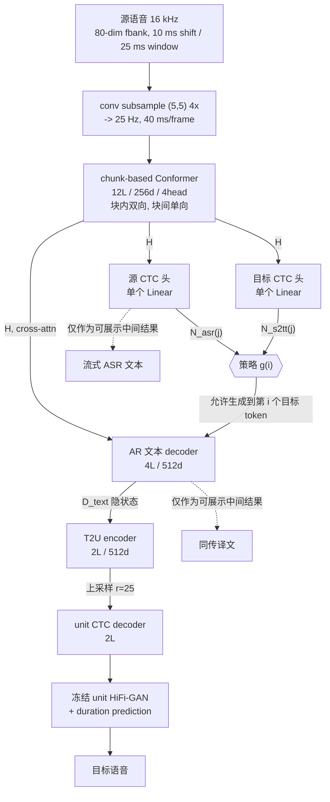
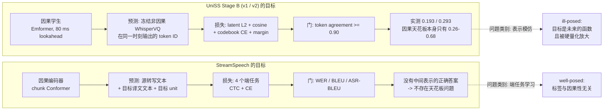
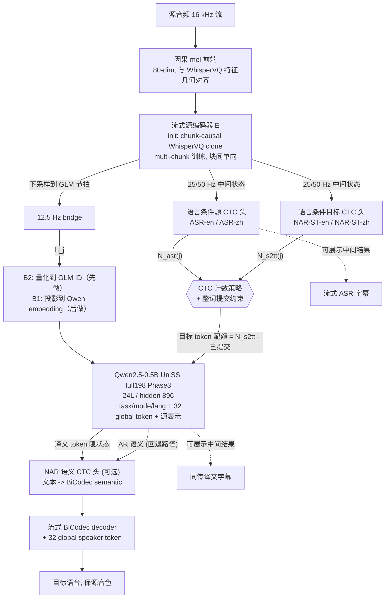

# StreamSpeech 深度解析与 UniSS CTC-Streaming 完整方案

> 文档目的：回答四个问题 —— StreamSpeech 的 motivation 和做法是什么；数据怎么构造、怎么训练推理；为什么用 CTC；UniSS 能否用这套方案改造成 Simultaneous S2ST。最后给出可执行的完整方案。
>
> 论文：Zhang et al., *StreamSpeech: Simultaneous Speech-to-Speech Translation with Multi-task Learning*, ACL 2024 ([arXiv:2406.03049](https://arxiv.org/abs/2406.03049), [ACL Anthology](https://aclanthology.org/2024.acl-long.485.pdf))
> 代码：[ictnlp/StreamSpeech](https://github.com/ictnlp/StreamSpeech) · 项目页：[demo](https://ictnlp.github.io/StreamSpeech-site/)
>
> 审计范围（2026-08-03）：完整阅读 arXiv 23 页论文，并逐文件核对官方仓库 `main` 中的 `preprocess_scripts/`、`researches/ctc_unity/`、`researches/chunk_unity/`、训练脚本和 SimulEval agent。文中会明确区分“论文描述”“官方代码实际行为”和“适配 UniSS 的建议”。
>
> 相关本地文档：
> - [`simul_uniss_simultaneous_s2st_master_plan.md`](./simul_uniss_simultaneous_s2st_master_plan.md) —— 当前主线的完整方案与诊断
> - [`stage_b_latent_15shard_h200_execution_report.md`](./stage_b_latent_15shard_h200_execution_report.md) —— Stage B latent v1/v2 的失败记录与因果天花板审计
> - [`student_v2_complete_process_and_colleague_briefing.md`](./student_v2_complete_process_and_colleague_briefing.md)

---

## 0. 结论先行

**一句话**：StreamSpeech 的核心贡献不是单独发明一个更大的模型，而是**用 CTC 把“什么时候该说话”变成“当前音频前缀已经支持多少源/目标 token”的可计数、无需时间戳标注的对齐问题**。它对当前 UniSS 很有价值，因为它不要求因果前端精确复现非因果 WhisperVQ 的离散 token ID，而是直接围绕 ASR、翻译和 speech-unit 端任务学习表示与策略。

三个关键判断：

**判断一：当前 Stage-B-v3/Stage-C 的结果支持暂时切换研究方向。** Stage-B-v3 已正常训练到 10,000 step，联合选择了 step 8,000，但 overall target agreement 仍只有 **17.70%**；冻结 full198 Phase3 的 32 条方向平衡探针为 ZH→EN **19.87 BLEU**、EN→ZH **32.35 BLEU**。随后 Stage C 虽得到较好的 calibrated ECE **0.0470**，但 fast/balanced/quality 三个 operating point 的 recall 都是 **0**，质量门失败。这不是程序崩溃，而是当前证据无法可靠选出“安全 WRITE”子集。StreamSpeech 改变的是问题定义：不再以 teacher token agreement 为核心门，而改用 ASR WER、NAR-S2TT token accuracy、下游 BLEU 和真实延迟。

**判断二：现有实验说明“精确 token 一致率”不是充分的下游指标。** 早期冻结 Phase3 敏感性探针中，`prefix-causal 80 ms` 即使与 full-context token 不完全一致，仍能保留相当一部分翻译质量；Stage-B-v3 也出现了 agreement 低但某一方向 BLEU 尚可的现象。因此更合理的路线是把 CTC 中间任务和端到端翻译质量同时作为训练与选模依据，而不是只追一个 16,384 类 codebook 的 exact match。

**判断三：你的 WAIT/WRITE 策略头已经学得很好了，但学的目标是错的。** Stage4 full-dev 报告里 WAIT/WRITE accuracy = 0.9385、Macro-F1 = 0.9118，可 StartOffset NCA 均值仍是 **4263 ms**。策略头以 93.85% 的准确率精确复现了一个由 `training/simul_uniss/schedule.py` 里 proportional 比例对齐生成的**伪 schedule**（`chunk_ms=640`、`wait_k_chunks=2`、无真实词时间戳）。**策略学得再准，也超不过标签的质量上限。** CTC 恰好解决"标签从哪来"：它从 (音频, 文本) 对里自己长出对齐，不需要任何时间戳。

**可移植性结论（详见第 9 章）**：

| 层 | StreamSpeech 组件 | 能否移植到 UniSS | 价值 |
| --- | --- | --- | --- |
| 策略层 | CTC 计数驱动的 READ/WRITE | **能移植；判定逻辑很轻，但必须先训练可靠的 CTC 头** | **高**：避免把比例伪 schedule 当作最终策略上限 |
| 前端层 | chunk Conformer + 端任务监督，不模仿 tokenizer | **能，且这是最大收益** | **高**：删掉 Stage B 整个失败模式 |
| 输出层 | 两遍 AR-text + NAR-unit CTC | **部分**：NAR 语义头可用于加速；但不能替换 BiCodec | **中**：论文自己承认无法保音色，这是 UniSS 的差异化优势，不能丢 |

**推荐主线**：保留当前最好的 **Qwen2.5-0.5B full198 Phase3** 与 BiCodec（翻译、语义和音色），新建独立 StreamSpeech-CTC 分支，把源侧流式前端的主监督从“模仿 WhisperVQ token”改为“ASR CTC + NAR-S2TT CTC + 下游 Phase3 损失”，再用两个 CTC 计数器控制提交。先保留离散 GLM 接口做低风险基线，确认有效后再测试连续 hidden→Qwen embedding 接口。

**先做第 11 章的 S0 探针（约 2–3 天，只训两个线性层）**，它能在不做任何大规模训练的前提下否决或确认整条路线。

---

## 1. StreamSpeech 的 motivation

### 1.1 它要解决的"双重难题"

Simul-S2ST 同时面对两个问题，论文称为 double challenge：

1. **翻译难题**：语音到语音直接翻译本身就难，因为语音除内容外还带音色、语调等信息，源和目标都是连续长序列。
2. **策略难题**：还要额外决定"什么时候开始说"。READ（继续听）还是 WRITE（输出一段目标语音），这个决策不像文本翻译那样有天然的 token 边界——语音是连续的，一个词占多长时间是不确定的。

此前的做法要么是**级联**（streaming ASR → Simul-MT → real-time TTS），要么是**给 offline 模型外挂一个策略模块**（如 SeamlessStreaming 的 EMMA）。级联的问题是误差逐级放大、无法联合优化；外挂策略的问题是策略与翻译分离训练，且需要专门的策略参数化。

### 1.2 它的核心洞察：让文本做桥梁

论文的关键想法是**引入源侧和目标侧的文本信息来同时指导翻译和策略**。理由很直接——一个合理的策略应该满足：

- 等到源语音里**确实出现了一个完整的词**再考虑输出 → 这需要「源语音 ↔ 源文本」的对齐；
- 输出的目标内容**不能超过已收到的源语音所支撑的量** → 这需要「源语音 ↔ 目标文本」的对齐；
- 一段目标文本**对应多少目标语音单元** → 这需要「目标文本 ↔ 目标语音」的对齐。

三个对齐全部用 CTC 获得，全部作为**辅助任务**与主任务联合训练。于是策略不是一个独立模块，而是从多任务学习里"长出来"的副产品。

这也顺带带来一个产品级好处：ASR 和翻译的中间结果本来就在算，可以直接显示给用户（论文 Figure 1 的 "All in One"）。

---

## 2. 架构逐层拆解

### 2.1 全景



总参数 **70 M**（UnitY 基线 67 M），4×RTX 3090 训练。注意两个 CTC 头**各自只是一个全连接层**——策略几乎不额外花参数和算力。

### 2.2 chunk-based Conformer（流式编码器）

Conformer 本身不能流式，因为自注意力是双向的、卷积的感受野跨越整个序列。论文的改法是**块内双向、块间单向**：

- **chunk 注意力**：帧 $x_i$ 只能看到自己所在块及之前所有块的帧。设块大小为 $C$ 帧（每帧 40 ms）：

$$\mathrm{ChunkAttn}(x_i, x_j) = \begin{cases}\mathrm{Attn}(x_i,x_j) & j \le \lceil i/C\rceil \times C\\ 0 & \text{otherwise}\end{cases}$$

- **chunk 卷积**：kernel size $k$ 的卷积在块右边界处被截断：

$$\mathrm{ChunkConv}(x_i) = \mathrm{Conv}\big(x_{i-\frac{k-1}{2}},\cdots,x_i,\cdots,x_{\min(i+\frac{k-1}{2},\ \lceil i/C\rceil\times C)}\big)$$

实现上用 mask 并行完成，训练时不需要真的分块循环。

**这个设计的取舍值得注意**：块内双向意味着块的**末尾帧几乎没有 lookahead，块的开头帧有接近整块的 lookahead**。所以一个 $C=8$（320 ms）的块，平均 lookahead 约 160 ms，最坏 0 ms。这和 UniSS 的 Emformer 固定 80 ms 右上下文是不同的取舍：StreamSpeech 用"块内自由看"换来更好的表示，代价是延迟由块大小决定而不是由固定 lookahead 决定。

代码落点：`researches/ctc_unity/modules/conformer_layer.py`、`researches/ctc_unity/models/s2t_conformer.py`。推理时 agent 直接改属性来切换块大小：

```python
# agent/speech_to_speech.streamspeech.agent.py:392-410
chunk_size = args.source_segment_size // 40
model.encoder.chunk_size = chunk_size
for conv in model.encoder.subsample.conv_layers:
    conv.chunk_size = chunk_size          # 16 if chunk_size>=16 else 8
for layer in model.encoder.conformer_layers:
    layer.conv_module.depthwise_conv.chunk_size = chunk_size
```

### 2.3 两个 CTC 头（策略的来源）

编码器输出 $H$ 之上挂两个 CTC decoder：

$$D^{asr} = \texttt{CTCDec}^{A}(H),\qquad D^{nar\text{-}s2tt} = \texttt{CTCDec}^{Y}(H)$$

分别用 ASR（$X\to A$，源转写）和 **非自回归** S2TT（$X\to Y$，目标译文）监督：

$$\mathcal{L}_{asr} = \mathrm{CTC}(D^{asr}, A),\qquad \mathcal{L}_{nar\text{-}s2tt} = \mathrm{CTC}(D^{nar\text{-}s2tt}, Y)$$

### 2.4 策略：两个计数器的合取

定义 $\mathcal{N}^{asr}_j$ 为「当前收到的音频 $X_{\le j}$ 所对齐的源 token 数」，$\mathcal{N}^{nar\text{-}s2tt}_j$ 为「所对齐的目标 token 数」。两者都是**把 CTC 输出折叠（去 blank、合并连续重复）后的长度**。

AR 文本 decoder 生成第 $i$ 个目标 token 的时刻：

$$g(i) = \underset{\{j\ \mid\ \mathcal{N}^{asr}_{j-1} < \mathcal{N}^{asr}_{j}\}}{\mathrm{argmin}}\big(\mathcal{N}^{nar\text{-}s2tt}_{j} \ge i\big)$$

拆开读：

- $\mathcal{N}^{asr}_{j-1} < \mathcal{N}^{asr}_{j}$ —— **"刚刚识别出一个新的源 token"**。这个条件保证不在一个词说到一半时就动，也保证策略只在信息真正增加时才推进。
- $\mathcal{N}^{nar\text{-}s2tt}_{j} \ge i$ —— **"已收到的音频足够支撑第 $i$ 个目标 token"**。这一条处理语序重排和源/目标长度比。

**两个条件都必要**。论文 §5.3 的 ablation（Figure 7）显示去掉任何一个都掉点：只用目标计数会在词中间开口；只用源计数（识别一个源词就输出一个目标词）无法处理重排和扩张比。

AR decoder 的损失就是 prefix 受限的交叉熵：

$$\mathcal{L}_{ar\text{-}s2tt} = -\frac{1}{|Y|}\sum_{i=1}^{|Y|}\log p\big(y_i \mid X_{\le g(i)},\ Y_{<i}\big)$$

**论文训练公式中**不能直接用硬折叠计数，因此改用**期望 token 数**（Appendix A, Eq. 13）：

$$\mathcal{N}^{asr}_j = \sum_{m=1}^{j}\Big(1 - p(\phi \mid D^{asr}_m) - \sum_{v\in\mathcal{V}} p(v\mid D^{asr}_m)\,p(v\mid D^{asr}_{m-1})\Big)$$

即「减去产生 blank 的概率，再减去与上一帧重复的概率」。论文指出 CTC 后验通常很尖锐，所以训练期望值与推理硬计数差别很小。

**这一步是论文策略定义的技术枢纽**：期望计数让训练时可以从 CTC 后验构造 prefix mask，不需要词级时间戳或 RL。不过必须区分论文公式和开源实现：官方 `streamspeech_model.py` 在得到 `asr_not_blank` / `st_not_blank` 后调用了 `.detach()`，随后又通过阈值、`round()` 和索引构造 hard mask。因此，开源实现里的 AR-S2TT loss **不会沿 READ/WRITE mask 反向传播到两个 CTC 头**；所谓联合学习主要来自共享 encoder 和四个任务 loss 的共同训练，而不是可微策略梯度。这一点不影响 CTC 作为对齐器，但影响我们对“端到端可微策略”的表述。

### 2.5 非自回归 T2U 生成

第二遍不用 AR，而是 NAR + CTC：

- T2U encoder（2 层 Transformer）吃 AR decoder 的隐状态 $D^{text}$；
- 输出**上采样 $r=25$ 倍**作为 unit CTC decoder 的输入，第 $i$ 个输入位置对应 $D^{text}_{\lceil i/r\rceil}$；
- unit CTC decoder 只能看 $\lceil i/r \rceil$ 之前的 T2U encoder 输出（保持因果）：

$$D^{unit}_i = \texttt{CTCDec}^{U}\big(D^{text}_{\le \lceil i/r\rceil}\big)$$

$$\mathcal{L}_{s2ut} = \mathrm{CTC}(D^{unit}, U)$$

$r=25$ 的来历（Appendix D）：unit 序列长度约为 subword 序列的 10 倍，NAT 惯例上采样 2–3 倍最优，$10\times 2.5 = 25$。换语言时论文建议先估 unit/subword 长度比再乘 2–3。

**为什么第一遍 AR、第二遍 NAR**：论文 §4.4 的解释很清楚——S2TT 涉及大量语序重排和长程依赖，需要 AR；T2U 基本是单调对齐的一对多扩张，NAR 足够且更快。这个 AR+NAR 组合是 3.6–4.5× 加速的来源，同时质量还超过全 AR 的 UnitY。

最后接**冻结的** unit-based HiFi-GAN（mHuBERT layer 11, km1000），带 duration prediction。

---

## 3. 为什么用 CTC（核心问题）

这一章单独展开，因为这是整篇论文最值得学的地方，也是判断能否移植到 UniSS 的关键。

### 3.1 CTC 在这里的身份：不是识别器，是**对齐器 / 计数器**

一个容易误读的点：这两个 CTC 头的**识别质量并不重要，对齐质量才重要**。证据在论文自己的 ablation（Table 3, Fr→En）：

| 任务组合 | ASR WER↓ | NAR-S2TT BLEU↑ / 1-gram ACC↑ | AR-S2TT BLEU↑ / ACC↑ | S2UT BLEU↑ | S2ST ASR-BLEU↑ |
| --- | ---: | ---: | ---: | ---: | ---: |
| UnitY 基线 | / | / | 31.31 / 61.0 | 33.47 | 27.77 |
| 仅 AR-S2TT + S2UT | / | / | 31.20 / 61.5 | 31.37 | 27.47 |
| + NAR-S2TT | / | 22.95 / 59.9 | 31.56 / 61.1 | 31.15 | 27.73 |
| + ASR | 20.70 | / | 32.28 / 62.3 | 31.42 | 28.18 |
| **全部** | **20.55** | **23.82 / 60.9** | **32.60 / 62.4** | **31.72** | **28.45** |

NAR-S2TT 的 BLEU 只有 23.82，比 AR-S2TT 的 32.60 低了近 9 点 —— 但 **1-gram ACC 是 60.9 vs 62.4，几乎一样**。论文脚注 2 明说了：NAR-S2TT 的 1-gram 准确率够好，但译文不流畅，所以**用 NAR-S2TT 抓对齐、用 AR-S2TT 出译文**。

换句话说，CTC 头只需要回答"到目前为止，大概出现了几个词、是哪些词"，不需要回答"完整通顺的译文是什么"。这个降低了的要求，正是它能在极短 lookahead 下工作的原因。

### 3.2 CTC 的四个数学性质，恰好是流式策略需要的

**性质一：路径单调。** CTC 的折叠函数 $\Pi$ 只允许单调路径——输出 token 的顺序必须与输入帧的顺序一致，不能回跳。这意味着「某个 token 首次成为非 blank 非重复的帧位置」是一个**合法的时间戳**。cross-attention 给不出这个（它是软的、非单调的）；AR decoder 完全给不出（它没有输入侧的时间索引）。

**性质二：固定因果帧路径的折叠计数单调不减。** 如果新输入不会改写历史帧 logits，那么 $|\Pi(Z_{\le j})|$ 随 $j$ 增大只增不减，适合做不可回退的提交计数。但真实系统仍需防御数值抖动、前缀重编码差异和跨块边界变化。官方 agent 保存历史最大计数，UniSS 适配时也应保留 monotonic clamp 与稳定性检查，而不是假设 CTC 自动解决所有安全提交问题。

**性质三：无需时间戳标注。** CTC 对所有可折叠到 $Y$ 的路径求和：

$$\mathrm{CTC}(\mathcal{X},\mathcal{Y}) = -\log\sum_{\mathcal{Z}\in\Pi^{-1}(\mathcal{Y})} p(\mathcal{Z}\mid\mathcal{X})$$

即**边缘化掉了对齐**。你只需要 (音频, 文本) 配对，不需要词级时间戳、不需要强制对齐器。这一条对 UniSS 是决定性的（见 9.1）。

**性质四：期望计数本身可微。** Eq. 13 可以从 CTC 后验连续地估计 token 数，因此理论上能构造可微策略。**但官方代码主动 detach 了该分支**，实际训练采用“CTC 辅助损失学对齐 + hard mask 约束 AR decoder”的稳定实现。UniSS 第一版建议忠实复现这一做法；只有在基线稳定后，才把 soft mask / straight-through policy 作为单独消融实验。

### 3.3 为什么不用别的

| 备选 | 为什么不如 CTC | 
| --- | --- |
| **cross-attention 权重** | 非单调、非归一化到"个数"、层与头之间不一致；只能做启发式阈值 |
| **monotonic attention / EMMA**（SeamlessStreaming） | 需要专门的策略参数化和期望训练，是额外模块；论文明确对比："StreamSpeech does not design any additional simultaneous policy such as EMMA" |
| **RL 学策略** | 奖励稀疏（延迟-质量权衡）、方差大、与翻译难以联合 |
| **强制对齐（MFA / Whisper 时间戳）** | 需要额外对齐器；对齐器本身是非因果的，流式推理时不可用，只能当训练标签；标签噪声直接成为策略上限 |
| **wait-k 固定策略** | 不自适应；论文实测低延迟区落后约 10 BLEU |
| **让 LLM 自己预测 WAIT/WRITE**（= UniSS 现状） | 需要 action 标签，而标签质量决定上限 —— 见下 |

### 3.4 对 UniSS 最重要的一条：CTC 解决的是"标签从哪来"

这是我认为你最应该带走的一点。

UniSS 现在的策略是：Qwen 在 `<|end_glm|>` 之后预测 `<|wait_read|>`(180395) 或 `<|write_generate|>`(180396)，由 `evaluation/simultaneous_streaming/stage4_streaming_generate.py` 驱动。这在机制上完全合理，问题在**监督信号**：

```python
# training/simul_uniss/schedule.py 文件头
"""Build deterministic pseudo-streaming schedules from tokenized UniST rows.
...
rows do not contain word timestamps.
"""
```

```python
# training/simul_uniss/prepare_data.py:53
"warning": "Bootstrap only: public UniST parquet has no word timestamps."
```

标签是用**比例对齐**造的伪 schedule（`chunk_ms=640`、`wait_k_chunks=2`、按标点切短语）。于是出现了一个很有欺骗性的现象：

| Stage4 full-dev 指标 | Mean | p95 |
| --- | ---: | ---: |
| WAIT/WRITE accuracy | 0.9385 | 1.0000 |
| Action Macro-F1 | 0.9118 | 1.0000 |
| **StartOffset NCA (ms)** | **4263.29** | 7040.00 |
| StartOffset CA (ms) | 7365.52 | 14077.21 |
| Unnecessary WAIT / WRITE | 0.1535 | 0.6667 |

**策略头以 93.85% 的准确率学会了一个错的目标。** 优化这个策略头、加大它的容量、上 GRPO（Stage 7A）—— 都不会把 4.26 s 降下来，因为标签本身就是 640 ms 块 + wait-2 的比例对齐，其隐含的 StartOffset 下界就在秒级。

CTC 把这个问题从根上去掉了：**它不需要你提供 schedule，它从 (音频, 转写) 和 (音频, 译文) 里自己学出对齐**。而这两样东西，UniST 的 1,978 万行里**每一行都有**（`transcription`、`translation`，见 `training/prepare_unist_s2st.py:26-35` 的 `REQUIRED_COLUMNS`）。

---

## 4. 数据如何构造

### 4.1 语料

CVSS-C（Jia et al. 2022b），从 CoVoST 2 派生，目标语音由 TTS 合成。实验方向：Fr→En、Es→En、De→En。

**注意 CVSS-C 的一个特点**：目标语音是**单一 TTS 音色**合成的。这是 StreamSpeech 无法做音色保持的根本原因（论文 Limitations 明确写了这一点），也是它与 UniSS 的核心差异。

本机当前数据审计结果：

| 资产 | 当前状态 | 能否直接复现 StreamSpeech 训练 |
| --- | --- | --- |
| UniST full198 train + dev/test parquet | 已存在于 `data/raw/UniST/`，共 198 个 train shard，另有 dev/test | **能用于 UniSS 适配路线**，字段包含 transcription、translation、source/target codec token |
| CVSS-T ZH→EN test | 已存在于 `/opt/dlami/nvme/jasonleeeli/CVSS/`，并已有本地 Phase3 评估产物 | 只能用于 ZH→EN 测试，不是 StreamSpeech 论文的 CVSS-C 训练集 |
| CVSS-C Fr/Es/De→En + 对应 CoVoST2 source audio | 当前没有发现完整解包训练目录 | **不能直接做论文同数据严格复现**；若要复现需另建隔离数据目录下载三方向完整训练/dev/test |

所以本方案明确分成两条：

1. **UniSS-Stream 适配主线**：使用现有 UniST 中英双向数据，保留 Phase3 与 BiCodec，验证 CTC 策略是否改善当前系统；
2. **StreamSpeech faithful reproduction 对照线**：以后单独准备 CVSS-C Fr/Es/De→En，使用官方 Fairseq 实现复现论文表格。两条线的 BLEU 不能直接横比。

还有一个迁移风险：论文所有方向都是 X→English，而 UniSS 是 ZH↔EN 双向。NAR-S2TT CTC 虽然不要求显式时间戳，但仍要求目标 token 按目标顺序沿源时间轴单调释放。遇到强语序重排时，它可能选择“更晚发射”而不是违反单调性，因此 ZH→EN 与 EN→ZH 必须分别报告 target-CTC accuracy 和延迟，不能只看总体平均。

### 4.2 特征与单元

| 侧 | 处理 |
| --- | --- |
| 源音频 | 重采样 16 kHz；80 维 mel-filterbank；**global-level CMVN**；conv subsample 4× 后每帧 **40 ms** |
| 目标音频 | 22050 Hz；**mHuBERT layer 11 + k-means 1000** 提离散 unit；配套冻结 unit HiFi-GAN 声码器 |
| 源文本 / 目标文本 | SentencePiece unigram，词表各 **6000** |

### 4.3 每条样本的字段

最终 `train.tsv` 是七列（来自 `preprocess_scripts/README.md`）：

```tsv
id  src_audio  src_n_frames  src_text  tgt_text  tgt_audio  tgt_n_frames
```

其中 `tgt_audio` 列存的是**离散 unit 序列**（空格分隔的整数），不是波形路径。举一条真实样本：

```
id:            common_voice_fr_17732749
src_audio:     .../src_fbank80.zip:17614448698:126208      # zip 内偏移+长度
src_n_frames:  394
src_text:      Madame la baronne Pfeffers.                  # 源转写 -> ASR CTC 目标
tgt_text:      madam pfeffers the baroness                  # 目标译文 -> NAR-S2TT CTC + AR-S2TT 目标
tgt_audio:     63 991 162 73 338 359 761 430 901 921 ...    # mHuBERT unit -> unit CTC 目标
tgt_n_frames:  59
```

**关键观察：一条样本同时喂四个任务，没有任何额外标注。**

| 任务 | 输入 | 目标 | 来自哪一列 |
| --- | --- | --- | --- |
| ASR（CTC） | src fbank | `src_text` | 本来就有 |
| NAR-S2TT（CTC） | src fbank | `tgt_text` | 本来就有 |
| AR-S2TT（CE） | src fbank | `tgt_text` | 同一列复用 |
| S2UT（CTC） | AR 隐状态 | `tgt_audio` unit | 本来就有 |

**没有时间戳、没有强制对齐、没有人工 schedule。** 这就是 3.2 性质三的实际价值。

### 4.4 多任务配置文件

`config_mtl_asr_st_ctcst.yaml` 定义三个辅助任务及权重：

```yaml
target_unigram:        # AR-S2TT
  decoder_type: transformer
  loss_weight: 8.0
  decoder_args: {decoder_layers: 4, decoder_embed_dim: 512, ...}
source_unigram:        # ASR (CTC)
  decoder_type: ctc
  loss_weight: 4.0
  decoder_args: {decoder_layers: 0, ...}      # 注意 layers=0 -> 纯线性头
ctc_target_unigram:    # NAR-S2TT (CTC)
  decoder_type: ctc
  loss_weight: 4.0
  decoder_args: {decoder_layers: 0, ...}      # 同样纯线性头
```

`decoder_layers: 0` 值得注意 —— 两个 CTC 头就是**共享编码器之上的一个线性投影**。策略的全部代价就是两个 `Linear(256, 6000)`。

### 4.5 预处理脚本流水线

`preprocess_scripts/` 下 0–9 编号顺序执行（`preprocess.sh` 串起来）：

| 脚本 | 作用 |
| --- | --- |
| `0.download_pretrain_models.sh` | 下载 mHuBERT + unit HiFi-GAN |
| `1.learn_KM_clustering_model.sh` | 名字叫“learn”，但当前脚本实际加载仓库随附的 `mhubert.km1000.layer11.pt` 对目标音频量化，并没有在该脚本中重新 fit k-means；脚本里的 `N_CLUSTERS=100` 也没有被使用 |
| `2.prep_cvss_c_multilingual_data.sh` | 提 fbank、打包 zip、建 `fbank2unit/{train,dev,test}.tsv` |
| `3.prep_cvss_c_multitask_data.sh` | 建 `tgt_unigram6000/` SPM 与词表 |
| `7.prep_cvss_c_multitask_asr_data.sh` | 建 `src_unigram6000/` SPM 与词表（ASR CTC 用） |
| `5. / 8.` | 抽 SimulEval 用的 `wav_list.txt` / `target.txt` / `src.txt` |
| `prep_global_cmvn.py` | 算全局 CMVN 统计 `gcmvn.npz` |

**评测数据格式极简**，只要两个纯文本文件：`wav_list.txt`（每行一个音频路径）和 `target.txt`（每行一句参考）。

---

## 5. 训练怎么做

### 5.1 单一联合目标

$$\mathcal{L} = \mathcal{L}_{s2ut} + \mathcal{L}_{ar\text{-}s2tt} + \mathcal{L}_{asr} + \mathcal{L}_{nar\text{-}s2tt}$$

实际权重（Appendix H / config）：`s2ut=1.0`、`ar_s2tt=8.0`、`asr=4.0`、`nar_s2tt=4.0`。**一次端到端训练，没有分阶段、没有冻结、没有蒸馏。**

### 5.2 multi-chunk 训练：一个模型覆盖所有延迟

论文写法是块大小 $C$ 在训练时从 $\mathcal{U}(1, |X|)$ 采样（$C=|X|$ 即 offline）。**官方代码并没有逐整数均匀采样**：`speech_to_speech_ctc_asr_st_criterion.py` 实际从 `[8, 16, 24, 32, 99999]` 离散采样 attention chunk，并把卷积 chunk 另行限制为 `[8, 16]`。因此复现论文时应同时记录“论文概念”和“代码配置”，UniSS 适配也应优先使用经过明确验证的离散 chunk 集合。

这个技巧的效果强得有点反直觉（Table 4，Fr→En offline ASR-BLEU）：

| 训练 \ 测试 | C=8 | C=16 | C=32 | C=64 | C=∞ |
| --- | ---: | ---: | ---: | ---: | ---: |
| C=8 | 24.91 | 24.72 | 25.03 | 24.82 | 23.37 |
| C=16 | 24.18 | 25.64 | 25.75 | 25.62 | 24.76 |
| C=32 | 23.06 | 24.69 | 25.82 | 25.85 | 25.75 |
| C=64 | 19.55 | 22.77 | 24.63 | 25.94 | 26.41 |
| **C=∞** | **1.42** | 7.12 | 14.58 | 21.76 | 26.90 |
| **Multi-Chunk** | **25.34** | **25.97** | **26.31** | **26.61** | 26.47 |

两个要点：

1. **offline 训练的模型直接拿去流式推理是灾难性的**：C=∞ 训练、C=8 测试只有 **1.42 BLEU**。这解释了为什么"拿 offline UniSS 直接分块推理"不可能work，也印证了 UniSS 需要专门的流式训练。
2. **multi-chunk 在每个块大小上都不比专门训练的差，小块上甚至明显更好**（C=8：25.34 vs 24.91）。论文认为这与"训练时引入未来信息有正向作用"的既有结论一致。

对 UniSS 的直接启示：**不要为 320 ms / 640 ms / 1280 ms 各训一个模型。用 multi-chunk 训一个，推理时改块大小即可。** 你现在的 Stage3/4/6 是绑定在 640 ms 上的。

### 5.3 实际训练配置

```bash
# researches/ctc_unity/train_scripts/train.simul-s2st.sh
fairseq-train $DATA \
  --user-dir researches/ctc_unity \
  --config-yaml config_gcmvn.yaml --multitask-config-yaml config_mtl_asr_st_ctcst.yaml \
  --task speech_to_speech_ctc --target-is-code --target-code-size 1000 --vocoder code_hifigan \
  --criterion speech_to_unit_2pass_ctc_asr_st --label-smoothing 0.1 \
  --arch streamspeech --share-decoder-input-output-embed \
  --encoder-layers 12 --encoder-embed-dim 256 --encoder-ffn-embed-dim 2048 --encoder-attention-heads 4 \
  --translation-decoder-layers 4 --synthesizer-encoder-layers 2 \
  --decoder-layers 2 --decoder-embed-dim 512 --decoder-ffn-embed-dim 2048 --decoder-attention-heads 8 \
  --k1 0 --k2 0 --n1 1 --n2 -1 \
  --chunk-size 8 --multichunk \
  --uni-encoder \
  --ctc-upsample-rate 25 \
  --lr 0.001 --lr-scheduler inverse_sqrt --warmup-init-lr 1e-7 --warmup-updates 10000 \
  --optimizer adam --adam-betas "(0.9,0.98)" --clip-norm 1.0 \
  --max-tokens 22000 --max-target-positions 1200 --update-freq 2 \
  --attn-type espnet --pos-enc-type rel_pos \
  --seed 1 --fp16 --num-workers 8
```

`--chunk-size 8 --multichunk` 是流式开关，`--uni-encoder` 打开块间单向。offline 版只是把这几项去掉。

### 5.4 论文与官方代码差异审计

这些差异不否定方法，但会直接影响严格复现和 UniSS 实现：

| 项目 | 论文描述 | 官方 `main` 实现 | 对 UniSS 的决定 |
| --- | --- | --- | --- |
| multi-chunk | $C\sim\mathcal{U}(1,|X|)$ | attention 从 `[8,16,24,32,99999]` 采样；卷积从 `[8,16]` 采样 | 第一版采用离散集合并做逐 chunk 验证，不宣称连续均匀 |
| policy gradient | Eq.13 的 expected count 可微 | CTC count 分支 `.detach()`，hard mask 不向 CTC 头回传 AR loss | 第一版复现稳定的 detached hard policy；soft policy 只做后续消融 |
| warmup | Appendix Table 8 写 `4000` | `train.simul-s2st.sh` 使用 `10000` | 报告必须写明采用哪一个；建议先忠实跟脚本 10k，再做 4k 对照 |
| k-means | mHuBERT L11 + km1000 | 脚本直接使用随附 km1000 模型量化 | 不要误以为官方预处理会重新训练聚类器 |
| 在线 encoder | 算法描述为逐 chunk 接收 | agent 每个决策点对“累计全部 prefix”重新提特征和编码 | UniSS 必须保留现有 state/cache，不能照搬其重复计算方式 |
| 在线 vocoder | 增量输出 speech | 每次重合成完整 unit prefix，只截取新增尾部 | BiCodec 侧应做真正增量解码或有限上下文 overlap-add |
| 整词提交 | 论文算法未强调阈值差异 | `source_segment_size >= 640` 才启用 whole-word；320 ms 会出现半词 | UniSS 的不可逆音频提交应在所有 chunk 下启用语言感知边界 |

因此，本文后面的 UniSS 方案不是机械复制官方 agent，而是保留 CTC 对齐思想，并修复它在缓存、半词提交、双向语言和音色保持上的不足。

---

## 6. 推理怎么做

### 6.1 算法（论文 Algorithm 1）

```
输入: 流式语音 X, 块大小 C, 已收到 X̂
while |X̂| ≤ |X|:
    Â ← ASR CTC 折叠结果          (源侧计数)
    Ŷ ← NAR-S2TT CTC 折叠结果     (目标侧计数)
    if |Â| > |A| and |Ŷ| > |Y|:            # WRITE
        A ← Â
        while |Y| < |Ŷ| and Y[-1] ≠ <eos>:
            y ← AR decoder 生成一个 token
            Y.append(y)
        U ← unit CTC 生成 Y 对应的 unit
        S ← Vocoder(U)
        输出新增的语音段
    else:                                   # READ
        X̂.append(X[|X̂| : |X̂|+C])
```

块大小在推理时任意设定（`--source-segment-size 320` 表示每 320 ms 决策一次），因为 multi-chunk 训练过。

### 6.2 实现里的几个重要细节

代码：`agent/speech_to_speech.streamspeech.agent.py` 的 `policy()`。

**(a) 每块全量重编码，不做增量缓存**：

```python
self.encoder_outs = self.generator.model.forward_encoder(
    {"src_tokens": src_indices, "src_lengths": src_lengths})   # src_indices 是累积全部特征
```

chunk mask 保证结果与增量等价，但计算是 $O(T^2)$ 累加的。这是它 RTF 偏高的主要原因（见 7.2）。

**(b) stride_n 门控**：源计数和目标计数**都**必须至少推进 `stride_n`（默认 1），否则 READ：

```python
if (src_ctc_prefix_length < self.src_ctc_prefix_length + self.stride_n
        or tgt_ctc_prefix_length < self.tgt_ctc_prefix_length + self.stride_n):
    return ReadAction()
```

**(c) 计数即配额**：默认 `lagging_k1=0, stride_n=1` 时

```python
subword_tokens = ((tgt_ctc_prefix_length - self.lagging_k1) // self.stride_n) * self.stride_n
new_subword_tokens = subword_tokens - self.tgt_subwords_indices.size(-1)
...
finalized_mt = self.generator_mt.generate_decoder(..., max_new_tokens=new_subword_tokens)
```

即 **AR decoder 被硬性限制只能生成 $\mathcal{N}^{nar\text{-}s2tt}$ 个 token**。`lagging_k1` 提供一个额外的保守偏置（延迟-质量旋钮）。

**(d) 整词提交，仅当块 ≥ 640 ms**：

```python
if args.source_segment_size >= 640:
    self.whole_word = True
...
if self.whole_word:                      # 回退到最后一个以 "▁" 开头的位置
    for j in range(tgt_subwords_indices.size(-1)-1, -1, -1):
        if self.generator_mt.tgt_dict[tgt_subwords_indices[0][j]].startswith("▁"):
            break
    tgt_subwords_indices = tgt_subwords_indices[:, :j]
```

**块 < 640 ms 时不做整词约束，会提交半个词**。README 的真实 trace 里就能看到 `i would like to sub` 这样的中间态。对文本字幕无所谓，**对语音输出是问题**——已经合成播放的 "sub" 收不回来。这是移植到 UniSS 时必须收紧的地方（见 10.4）。

**(e) unit 侧带 prefix 约束，音频只追加增量**：

```python
finalized = self.ctc_generator.generate(encoder_outs[0], prefix=self.tgt_units_indices)
...
cur_unit = unit if self.unit is None else unit[len(self.unit):]      # 只取新增 unit
wav, dur = self.vocoder(x, self.dur_prediction)                      # 整段重合成
cur_wav_length = dur[:, -len(cur_unit):].sum() * 320
new_wav = wav[-cur_wav_length:]                                      # 只发尾部
```

声码器每次对**整条 unit 序列**重新合成，但只把尾部新增的样本发出去。这保证播放连续，代价是重复计算。

### 6.3 完整例子：逐块走一遍

用仓库 README 里的真实运行 trace（`--source-segment-size 320`，Fr→En）：

> **源音频**：`example/wavs/common_voice_fr_17301936.mp3` 类同一条
> **源转写（真值）**：*je voudrais soumettre cette idée à la réflexion de lassemblée nationale*
> **目标译文（真值）**：*i would like to submit this idea to the reflection of the national assembly*

因为 `lagging_k1=0, stride_n=1`，**已提交的目标 subword 数恰好等于 $\mathcal{N}^{nar\text{-}s2tt}_j$**。所以下表的"$\mathcal{N}^{s2tt}$"一列可以直接从 trace 的译文长度读出来，不是我推测的：

| 决策时刻 | 已收音频 | ASR CTC 折叠（$\mathcal{N}^{asr}$ 内容） | 动作 | $\mathcal{N}^{s2tt}$ | AR 新增 | 累计译文 | 是否出音频 |
| ---: | ---: | --- | :---: | ---: | --- | --- | :---: |
| 1 | 320 ms | *(空)* | READ | 0 | — | — | 否 |
| 2 | 640 ms | *(空)* | READ | 0 | — | — | 否 |
| 3 | 960 ms | `je` | **WRITE** | 2 | `▁i ▁would` | i would | **是** |
| 4 | 1280 ms | `je voudrais` | **WRITE** | 4 | `▁like ▁to` | i would like to | 是 |
| 5 | 1600 ms | `je voudrais soumettre` | **WRITE** | 5 | `▁sub` | i would like to sub | 是 ⚠ |
| 6 | 1920 ms | `... cette` | **WRITE** | 6 | `mit` | i would like to submit | 是 |
| 7 | 2240 ms | `... idée` | **WRITE** | 7 | `▁this` | ... submit this | 是 |
| 8 | 2560 ms | `... à la` | **WRITE** | 9 | `▁idea ▁to` | ... this idea to | 是 |
| 9 | 2880 ms | `... réflexion` | **WRITE** | 10 | `▁the` | ... idea to the | 是 |
| 10 | 3200 ms | `... de` | **WRITE** | 11 | `▁reflection` | ... to the reflection | 是 |
| 11 | 3520 ms | `... lassemblée` | **WRITE** | 12 | `▁of` | ... reflection of | 是 |
| 12 | 3840 ms | `... nationale` | **WRITE** | 13 | `▁the` | ... of the | 是 |
| 13 | EOS flush | *(同上)* | **WRITE** | — | `▁national ▁assembly` | ... the national assembly | 是 |

读这张表要看四件事：

1. **前两块什么都不输出**（源 CTC 折叠为空 ⇒ 判定"还没有任何完整词"）。这就是自适应策略的价值：句首有静音或起音时它会自己等，不像 wait-k 那样机械地数块。StartOffset 落在 960 ms。
2. **步 3 出 2 个 token，步 8 出 2 个，步 5 出 1 个** —— 每步的产出量由 $\mathcal{N}^{s2tt}$ 决定，是自适应的，不是固定 1:1。这就是"源目标长度比 + 重排"被 CTC 计数自动吸收掉了。
3. **步 5 的 `▁sub` 是半个词**（⚠）。因为块 320 ms < 640 ms，`whole_word=False`。对语音输出这是隐患。
4. **步 3 就已经敢出 `i would`，此时源侧只识别出 `je`**。目标 CTC 已经"预判"了 2 个目标 token 的信息量。这是 NAR-S2TT 头在做隐式的预测——它看到 `je` 的声学前缀就知道英语侧至少要出 `i` 和一个助动词。

对照它的中间结果展示（`--output-asr-translation True`）：ASR 与译文是同一次前向的副产品，**推理时并不消费文本**（模块之间用隐状态连接），所以它仍然是 direct 模型。

---

## 7. 它真实的代价

论文的图表都很漂亮，但要移植就必须看清代价。这一节的数字对 UniSS 的预算尤其重要。

### 7.1 质量

Fr→En / Es→En / De→En offline ASR-BLEU（beam=10）：

| 模型 | #Param | Fr→En | Es→En | De→En | Avg |
| --- | ---: | ---: | ---: | ---: | ---: |
| UnitY (SOTA 基线) | 67 M | 27.77 | 24.95 | 18.74 | 23.82 |
| **StreamSpeech** | 70 M | **28.45** | **27.25** | **20.93** | **25.54** |

平均 +1.7 BLEU，且推理快 3.6–4.5×。Simul 场景比 wait-k 在低延迟区高约 10 BLEU。

**但绝对值不高**（Fr→En 28.45），因为 CVSS-C 规模有限、目标语音是合成的。**这与 UniSS 用 1,978 万行训练不是一个量级**，不要拿 BLEU 绝对值横向比。

### 7.2 延迟与算力：论文正文没有强调的部分

README 里那次 `chunk_size=320` 的真实运行（2 条句子）：

| 指标 | NCA | CA（含计算时间） | 比值 |
| --- | ---: | ---: | ---: |
| AL (ms) | 1724.90 | 2913.51 | 1.69× |
| DAL (ms) | 1358.81 | 3137.55 | 2.31× |
| **StartOffset (ms)** | **1280.00** | **2213.91** | 1.73× |
| LAAL (ms) | 1724.90 | 2913.51 | 1.69× |
| ATD (ms) | 1440.15 | 3389.37 | 2.35× |
| **SimulEval RTF** | **1.326** | 1.326 | — |

三个必须正视的事实：

1. **这里的 SimulEval RTF 不能直接解释成 GPU compute-RFT。** 官方 `latency_scorer.py` 对 speech output 的定义是“最后一个输出区间结束时间 / source duration”，所以 1.326 表示目标播放时间轴在源开始后的约 1.326 倍源时长结束；它混合了输出长度、等待与计算，不等价于纯推理耗时/音频时长。
2. **computation-aware 延迟约为理论延迟的 1.7–2.3 倍**，这能明确证明实现开销不可忽略。任何“亚秒”承诺如果只报 NCA 都不完整，但还应另外报告 wall-clock compute_RTF，不能拿上述 SimulEval RTF 代替。
3. **StartOffset 1.28 s 已经是 320 ms 块下的表现**。CTC 策略不是魔法——它把延迟降到信息与策略共同允许的水平，但该水平仍受语言对、语序重排、块大小和计算开销约束。

### 7.3 它明确不解决的问题

| 问题 | 说明 |
| --- | --- |
| **音色 / 表现力保持** | 论文 Limitations 原文承认："StreamSpeech currently focuses on synthesizing target speech with a unified voice, which limits its ability to clone the source speech's voice characteristics." 这是 UniSS 的核心差异化能力，**移植时绝不能丢** |
| **长音频 / 无句边界** | CVSS-C 是短句，agent 每句 `reset()`。真实同传是连续流，需要分句、上下文管理、状态截断 |
| **增量缓存** | 未实现，每块全量重编码 |
| **双向语言对** | 只做 X→En，目标端单一语言单一音色 |
| **半词提交** | 块 < 640 ms 时会提交半个 subword，对语音输出不安全 |

---

## 8. 对照 UniSS：为什么 Stage B 撞墙，StreamSpeech 没有这个问题

这一节是全文的转折点。

### 8.1 两条路线的目标函数对比



### 8.2 Stage B 为什么是 ill-posed，用你自己的数据说

**第一层，因果性**：WhisperVQ 配置是 `encoder_causal_attention: false`、`quantize_causal_encoder: false`。它在时刻 $t$ 的 token 是**整条 utterance** 的函数。因果学生在 $t$ 时刻要预测一个依赖未来的量 —— 这不是学得好不好的问题，是信息论上做不到。

你的 R0 因果天花板审计（报告 §10）给出了确切的代价：

| Lookahead | 与全上下文 teacher 即时一致率 | 320 ms 后仍被改写 | 首个"正确且稳定" p50 |
| ---: | ---: | ---: | ---: |
| 80 ms | 0.2632 | 0.6228 | 2880 ms |
| 160 ms | 0.3933 | 0.4791 | 2960 ms |
| 320 ms | 0.5465 | 0.3170 | 2960 ms |
| 640 ms | 0.6814 | 0.1830 | 2960 ms |

**连 640 ms 都到不了 0.70 的续训门。** 而"正确且稳定"的中位延迟约 2.9 s —— 这个数字本身就否定了"复现全上下文 token + 亚秒延迟"的组合。

**第二层，硬量化放大误差**：目标是 16384 路 Voronoi 单元的 argmin。你的 codebook 审计显示：到最近异码的每维中位平方距离约 0.01583，中点决策边界 MSE 约 0.00396，而学生的验证 latent MSE 约 0.014 —— **作为回归损失很小，但足以跨过大量决策边界**。诊断表说得很清楚：

| teacher-code rank | 命中率 |
| --- | ---: |
| top-1 | 0.1725 |
| top-5 | 0.4454 |
| top-10 | 0.5707 |
| top-100 | 0.8417 |
| 中位 rank | **7** |

学生**已经进入了正确的码本邻域**（中位 rank 7 / 16384），只是没让正确码成为最近邻。L2 和 cosine 都不直接优化这个边界。

**第三层，也是最关键的：这个离散目标对下游根本不重要。** 报告 §11 的冻结 Phase3 敏感性实验：

| 源 GLM 流 | EN→ZH Text-BLEU | ZH→EN Text-BLEU | 译文 NLL |
| --- | ---: | ---: | ---: |
| released | 33.45 | 26.61 | 1.629 |
| 重建音频全上下文 | 25.75 | 19.37 | 1.776 |
| **prefix-causal 80 ms** | **31.22** | **25.21** | 1.844 |
| prefix-causal 160 ms | 21.04 | 16.76 | — |
| prefix-causal 320 ms | 22.60 | 24.06 | 1.807 |
| prefix-causal 640 ms | 29.02 | 24.12 | 1.741 |
| streaming clone 160×80 ms | 22.95 | 22.46 | **1.536** |
| latent Student v1 | 18.69 | 12.86 | 1.938 |
| **Student v2 prefix-80** | 21.13 | 15.32 | 1.896 |

**`prefix-causal 80 ms` 与全上下文 teacher 的 token 一致率只有 0.263，但 Text-BLEU 保住了 31.22 / 25.21。** 也就是说：token ID 对不上完全没关系，只要携带的信息在。这直接说明**"token agreement" 是一个与下游质量弱相关的代理指标**，把它当作 90% 的验收门是选错了优化目标。

### 8.3 结论

Stage B 的困境可以精确概括为：**它在一个与下游弱相关的代理指标上，追求一个信息论上不可达的门槛，并且用硬量化把误差放大了。** 三个错误叠加。

StreamSpeech 一个都没有：它不定义中间表示的正确答案（无天花板），它的损失直接是下游任务（无代理指标偏差），它的输出是文本/unit 而非通过硬量化瓶颈（无量化放大）。

**这不是说 StreamSpeech 更聪明，而是说它选的问题类别更好解。** 而你现在恰好有条件切换到那个问题类别 —— 因为 `transcription` 和 `translation` 在 1,978 万行里全都有。

---

## 9. 能不能用？三层可移植性判定

必须分层判断，因为整体照搬会丢掉 UniSS 的核心价值。

### 9.1 策略层：能移植，但不是“零训练”

**判定：READ/WRITE 算法本身很轻，数据前置条件也满足；但必须先训练并验证源/目标 CTC 头，不能把公式直接接到现有模型上就认为完成。**

需要的前置条件全部满足：

| 前置条件 | UniSS 是否满足 | 证据 |
| --- | --- | --- |
| 每条样本有源转写 | ✅ | `transcription`，`training/prepare_unist_s2st.py:26-35` |
| 每条样本有目标译文 | ✅ | `translation`，同上 |
| 有 CTC 损失基础设施 | ✅ | `training/simul_uniss/streaming_student.py:200-214` 的 `F.ctc_loss(blank=0)` 封装 |
| 有流式因果编码器 | ✅ | Emformer 学生 + chunk-causal WhisperVQ clone |
| 不需要时间戳 | ✅ | 这正是 CTC 的优势；UniST 公开 parquet 没有时间戳 |

替换关系：

| 现状 | 改为 |
| --- | --- |
| Qwen 预测 wait_read (180395) / write_generate (180396) 动作 token | 两个 CTC 计数器的合取判定 |
| 标签来自 `schedule.py` 的 proportional 伪对齐 | 无标签，从 (音频,文本) 对里学 |
| 640 ms 固定块 | multi-chunk 训练，推理时任意块大小 |
| `forced_reason="invalid_action"` 兜底（Stage4 有 878 次强制动作） | 不再生成 action token；策略改为可审计的计数与阈值判定 |

**顺带改善的问题**：在严格因果、历史 logits 不被改写的前提下，CTC 折叠计数天然适合 monotonic commit。但工程上仍应保留历史最大计数、最小后验、连续两次稳定和整词边界等安全门；不能仅凭“用了 CTC”就删除所有 stability 机制。

### 9.2 前端层：能，且这是最大收益点

**判定：可移植度高，是主要工作量，也是主要收益。**

核心改动：**流式源侧前端的训练目标从"模仿 WhisperVQ token"改为"端任务多目标 CTC + 下游 LM 损失"。**

但有一个接口问题必须解决：**Qwen 是在离散 GLM ID（offset 163953）上训练的**。两个选项：

**B1（连续接口，天花板主线）**
```
流式编码器 -> Linear 投影 -> Qwen embedding 空间 -> 直接替换 GLM token embedding 的位置
```
- 优点：**删掉硬量化瓶颈**。8.2 第二层的失败模式直接消失。这也是 StreamSpeech 自己的做法（模块间用隐状态连接）。天花板最高。
- 代价：Qwen 需要适配连续源表示 ⇒ LoRA 或轻量全参微调，动到 Phase3。
- 风险控制：先冻 Qwen 只训投影层（探针），再放开 LoRA。

**B2（保离散接口，第一工程基线）**
```
流式编码器 -> 最近邻量化到冻结 WhisperVQ codebook -> GLM ID -> 现有 Phase3 完全不动
```
- 优点：Phase3 零改动，完全可回退，最适合先验证“CTC policy 是否优于伪 schedule”。
- 关键差别：**损失从 teacher token 模仿改成 straight-through 估计 + 下游 Qwen NLL**，即"让 Qwen 满意"而不是"让 teacher 满意"。
- 代价：量化瓶颈仍在，梯度经 VQ 有噪声，天花板低于 B1。

**初始化建议（重要）**：不要从零训 Conformer。用你已有的 **chunk-causal WhisperVQ clone**（`training/simul_uniss/subsecond_v2/streaming_whispervq_teacher.py`，160 ms 块 / 80 ms 右上下文，已导出 1280 维 pre-VQ 隐状态）作为编码器初始化。理由是它**零样本已经到 22.95 / 22.46，且 teacher-forced 译文 NLL 1.536 是所有流里最好的（比 released 的 1.629 还好）**。这说明它的表示对 Qwen 是高度可用的，只是贪心生成时分布有偏 —— 而这正是端任务微调能修的。

### 9.3 输出层：部分可移植，不能整体替换

**判定：NAR 语义头值得移植；两遍架构本身不要动；BiCodec 必须保留。**

| StreamSpeech 组件 | 对 UniSS 的判定 |
| --- | --- |
| mHuBERT unit + unit HiFi-GAN | ❌ **不要换**。它是单一音色的，论文自己承认无法克隆音色。UniSS 的 32 个 BiCodec global token 是差异化优势 |
| AR 文本 decoder（第一遍） | ✅ 已有等价物：Qwen 的 CoT/performance 模式先出译文再出语义 |
| **NAR unit CTC decoder（第二遍）** | ✅ **值得移植**。BiCodec 语义是 50 Hz，与文本基本单调对齐，是 RTF 的主要成本。仓库已有 `training/simul_uniss/nar_semantic.py`（NAST-S2x 式，已用 CTC），可以在此基础上做 |
| 上采样率 $r$ | ⚠️ 需要重估。StreamSpeech 的 $r=25$ 是 unit/subword ≈ 10 再乘 2.5。UniSS 要按 BiCodec-semantic/文本 token 的实际长度比重算 |

**NAR 语义头的双重价值**：既提供“这段文本需要多少个语义 token”的对齐（策略需要的第三个对齐），又有机会显著加速生成。UniSS 现有自研评估里的 wall-clock RTF/source audio 均值约 0.9986、p95 约 2.0839 —— 均值贴着实时线，p95 已破线。这里不能预先保证固定 3–4×，必须以同一硬件、同一数据的分项 profile 为准。

### 9.4 一句话汇总

> **保留 Qwen（翻译质量）和 BiCodec + global token（音色），替换源侧前端的训练目标（从模仿改端任务），用 CTC 计数替换学出来的 WAIT/WRITE，并加一个 NAR 语义头解决 RTF。**

---

## 10. 完整方案：UniSS-Stream

### 10.0 实验隔离与两条路线

不要把官方 Fairseq 复现代码直接塞进现有 Megatron 训练目录，也不要覆盖 Stage A–D、Stage3/4/6 或 Phase1–3 产物。实施时新建：

```text
experiments/streamspeech_reference_cvssc_v1/      # 论文同框架对照，Fairseq
experiments/uniss_streamspeech_ctc_v1/            # UniSS 适配，Megatron/PyTorch
data/processed/uniss_streamspeech_ctc_v1/         # tokenizer、CTC sidecar、index
checkpoints/uniss_streamspeech_ctc_v1/             # 新 checkpoint
runs/uniss_streamspeech_ctc_v1/                    # TensorBoard
reports/uniss_streamspeech_ctc_v1/                 # 分方向质量/延迟报告
evaluation/simultaneous_streaming/ctc_policy_v1/   # 新评估入口
```

| 路线 | 目的 | 数据 | 是否先执行 |
| --- | --- | --- | --- |
| Reference | 验证我们能否跑通官方模型和 SimulEval；复现论文趋势 | CVSS-C Fr/Es/De→En + CoVoST2，目前尚未完整准备 | 否，除非目标是论文严格复现 |
| UniSS-Stream | 回答“CTC policy 能否改善当前中英双向 Phase3” | 先用 UniST 15 shard，过门后 full198；CVSS-T ZH→EN 只用于外部测试 | **是** |

第一轮不要同时改前端、Qwen 接口、语义生成器和声码器。推荐因果链是：**CTC 探针 → 离散 B2 bridge → CTC policy → 连续 B1 bridge → NAR semantic**。这样每一步都能与当前 Phase3 和 streaming baseline 做单变量对照。

### 10.1 架构



与 StreamSpeech 的对应关系：

| StreamSpeech | UniSS-Stream | 说明 |
| --- | --- | --- |
| chunk Conformer | 流式源编码器 E（clone 初始化） | 复用已验证的 cache parity 实现 |
| 源 CTC 头 | 源 CTC 头 | `transcription` 监督，零新标注 |
| 目标 CTC 头 | 目标 CTC 头 | `translation` 监督，零新标注 |
| AR 文本 decoder (4L) | **当前 Qwen2.5-0.5B full198 Phase3** | 当前导出 checkpoint 为 24 层、hidden 896；继续复用现有最好模型 |
| T2U encoder + unit CTC | NAR 语义 CTC 头 | 复用 `nar_semantic.py` |
| unit HiFi-GAN（单音色） | **流式 BiCodec + global token** | **保音色，UniSS 的差异化优势** |

### 10.2 数据构造：零新标注

这是这条路线最强的一点。

| 需要的东西 | 从哪来 | 是否需要新造 |
| --- | --- | --- |
| 源音频 | Stage A 的 BiCodec 重建 FLAC（`source_audio`，15 shard 已完成 1,338,712 条） | 已有 |
| 源 CTC 目标 | `transcription` | 已有 |
| 目标 CTC 目标 | `translation` | 已有 |
| 目标语义 | `target_bicodec` | 已有 |
| 音色 | `bicodec_global`（32 token） | 已有 |
| 词级时间戳 | **不需要** | — |
| WAIT/WRITE schedule | **不需要** | — |
| WhisperVQ teacher token | **不需要** | — |

需要新建三样：

1. **CTC 专用词表**。不要直接让线性 CTC 头预测完整 18 万 Qwen 词表。建议英语 unigram 8k、中文字符/unigram 8k–12k；双向系统使用四个语言条件 head（source-en、source-zh、target-en、target-zh），或先做一个共享双语 16k head 作为消融。
2. **CTC 目标 id sidecar**，由对应语言 tokenizer 编码 `transcription` / `translation` 得到；不改原 parquet 和既有 Stage A 产物。
3. **帧率与长度审计**。CTC 必须满足输入时间步足够覆盖目标 token，连续重复 token 还需要 blank 间隔。建议 CTC 头挂在 25 Hz 中间层，GLM/Qwen bridge 仍可保持 12.5 Hz；逐语言统计 `T/U` 的 p1/p5，低于安全门的样本过滤或改用更高帧率。

### 10.3 必须正视的域问题：重建音频

UniST 只给 token，不给原始波形；Stage A 的音频是 BiCodec 重建的（`audio_origin: "bicodec_reconstructed"`，`subsecond_v1/stage_a.py:242`）。报告已量化了代价：

- 重建音频重编码出的 WhisperVQ token 与 released GLM 的一致率只有 **0.40476**；
- 重建全上下文流的 Text-BLEU 是 25.75 / 19.37，比 released 的 33.45 / 26.61 **低约 7.7 / 7.2 点**。

**但这个问题在新方案下性质完全不同，这一点很重要：**

| | Stage B（模仿式） | UniSS-Stream（端任务式） |
| --- | --- | --- |
| 标签 | WhisperVQ token（**从原始音频算的**） | 文本（**与音频重建无关，仍然完全正确**） |
| 重建失真的作用 | **标签-输入不匹配**（污染监督信号） | **输入增强**（只是输入变难了） |
| 后果 | 学到错的映射 | 学到更鲁棒的映射 |

所以重建失真从"监督噪声"降级为"输入噪声"。这是良性的，甚至可以主动利用（多种重建设置做增强）。

仍需做两件事：
1. 保留一个**真实音频对照子集**（任何本地可得的真实 zh↔en S2ST 或 ASR 音频），量化重建域与真实域的差距；
2. 前端训练允许混入纯 ASR 语料（只用源 CTC 损失），扩大声学覆盖。

### 10.4 策略：CTC 计数 + 语音特有的收紧

基础判定沿用 StreamSpeech，但**语音输出比文本输出更不可逆**，必须加两条约束：

```
每个决策节拍 j（每 C×80 ms）:
    N_asr(j)  = |collapse(源 CTC 头输出 [0..j])|
    N_s2tt(j) = |collapse(目标 CTC 头输出 [0..j])|

    WRITE 条件（全部满足）:
      (1) N_asr(j)  > N_asr(j-1)                      # 新源 token 完成
      (2) N_s2tt(j) > 已提交目标 token 数              # 有新配额
      (3) 【新增】配额边界落在整词边界上                 # 语音不能说半个词
      (4) 【新增】lookahead-only 帧不计入已提交音频      # 延迟口径诚实

    WRITE 时:
      让 Qwen 生成 min(N_s2tt(j) - 已提交, 词边界截断) 个译文 token
      对新提交的整词跨度生成 BiCodec 语义
      推送到流式 BiCodec decoder（只追加，永不回退）
```

条件 (3) 是把 StreamSpeech 的 `whole_word` 从"仅块 ≥ 640 ms 才启用"改成**始终启用**。代价是延迟略增（要等词尾），收益是不会合成半个词。中文按字/词切分需单独定义边界规则。

条件 (4) 直接继承 `stage_b_latent_15shard_h200_execution_report.md` §8.4 / R0 已建立的纪律。

**可保留的现有资产**：Bayesian Safe-Commit 的思路仍然有用，但作用点变了 —— 不再是给一个启发式 stability 头做校准，而是给 CTC 计数加一层置信度门（例如要求某个 token 的 CTC 后验在连续 2 个节拍都稳定）。这比原来的 `positions < lengths - 4` 位置启发式有明确得多的语义。

### 10.5 一个 UniST 样本如何完成一次训练迭代

假设一条 ZH→EN UniST 记录包含：

```text
transcription:  我明天上午去上海开会
translation:    I will go to Shanghai for a meeting tomorrow morning.
source_bicodec: 源语音 semantic token
source_glm:     原 UniSS 离散源 token（仅 B2 bridge/对照使用）
target_bicodec: 目标语音 semantic token
bicodec_global: 32 个说话人/global token
```

一次训练迭代按以下顺序执行：

1. 用现有 BiCodec decoder 将 `source_bicodec + bicodec_global` 重建成 16 kHz 源音频；训练 manifest 只保存路径和校验信息，不修改原 parquet。
2. 中文 CTC tokenizer 把 transcription 编成 source-zh target；英语 CTC tokenizer 把 translation 编成 target-en target。
3. 从 `{160, 320, 640, 1280, full}` ms 中随机采样一个 chunk 条件，流式 encoder 只允许块内/有限右上下文和历史 cache。
4. 25 Hz hidden 送入 source-zh CTC head，计算 `L_asr_ctc`；同一 hidden 送入 target-en CTC head，计算 `L_nar_st_ctc`。
5. 12.5 Hz bridge 走 B2 时量化到现有 GLM vocabulary，送入冻结 Phase3，计算 translation/semantic span 的下游 NLL；走 B1 时投影成 896 维 Qwen embedding，再计算相同 span loss。
6. 第一版对 CTC 计数 mask 使用 `detach + hard mask`，忠实采用官方稳定做法；四项 loss 在共享 encoder 上联合更新。
7. 每个 validation 周期分别记录 ZH→EN 与 EN→ZH 的 ASR WER、target-CTC token accuracy、CTC count MAE、Phase3 Text-BLEU 和 downstream NLL。任何方向不过门都不能被总体平均掩盖。

### 10.6 同一句话在线推理时如何逐块输出

下面是机制示例，不是当前模型已经测得的时间点。假设输入每 320 ms 到一个块，CTC 结果需要连续两个节拍稳定：

| 已收到音频 | source CTC 稳定内容 | target CTC 支持的配额 | 动作 | 累积输出 |
| ---: | --- | ---: | --- | --- |
| 0–320 ms | `我` 尚未连续稳定 | 0 | READ | — |
| 0–640 ms | `我 明天` | 2 个英语 subword | WRITE | `I will` 对应的第一小段目标音频 |
| 0–960 ms | `我 明天 上午` | 配额未增加或未到整词边界 | READ | 保持，不回退 |
| 0–1280 ms | `我 明天 上午 去` | 新增 `go to` | WRITE | 追加 `go to` 音频 |
| 0–1600 ms | `... 上海` | 新增 `Shanghai` | WRITE | 追加 `Shanghai` 音频 |
| 后续块 | `... 开会`，EOS | 释放剩余目标词 | WRITE/FINISH | 追加 meeting/time phrase 并结束 |

这里 target CTC 的职责不是生成最终英语句子，而是估计“当前源前缀最多安全支持多少目标 token”。最终文字仍由 Phase3 Qwen 自回归生成，音频仍由 BiCodec 生成并保留 global speaker 信息。遇到中英语序重排时，target CTC 可以选择暂不增加配额，因此会增加延迟，但不会强迫模型过早说出错误内容。

完整在线链路应为：

```text
麦克风 chunk
  -> 因果 encoder cache 更新
  -> source/target CTC 前缀计数 + confidence
  -> READ 或分配新的 Qwen 目标 token quota
  -> Qwen KV-cache 只生成新增整词
  -> AR semantic 回退或 NAR semantic head
  -> BiCodec 有限上下文增量解码
  -> 播放器追加目标声道，已播音频永不修改
```

---

## 11. 训练路线

七个阶段，前两个是低成本探针，可以在几天内否决整条路线。

### S0 —— 零训练/微训练可行性探针（约 2–3 天）★ 先做这个

**目的**：在不做任何大规模训练的前提下，判断"clone 编码器的表示能否支撑 CTC 对齐"。

**做法**：冻结 chunk-causal WhisperVQ clone 编码器，只在 25 Hz 中间表示上挂语言条件的线性 CTC 头，在 15-shard 子集上训。严格双向版本是四个 head：source-en、source-zh、target-en、target-zh；每条样本只激活与 `src_lang/tgt_lang` 对应的两个 head。可训参数仍只是一组线性投影，适合作为低成本探针。

**同时做一个 oracle 上界实验**：用 released GLM + 真值文本，直接算"如果 CTC 计数是完美的，策略能达到什么 StartOffset"。这给出理论下界，用来判断后续差距是策略问题还是表示问题。

**决策门**：

| S0 结果 | 判定 | 行动 |
| --- | --- | --- |
| ASR WER ≤ 40% 且 NAR-S2TT 1-gram ACC ≥ 40% | 表示可用 | 进 S2，冻结编码器只训头 + 轻量解冻 |
| WER 40–60% 或 ACC 25–40% | 表示部分可用 | 进 S2 但必须解冻编码器全参 |
| WER > 60% 或 ACC < 25% | 表示不支撑对齐 | 回到 S1，需要从更强的初始化或更多数据重训编码器 |

参照点：StreamSpeech 在 Fr→En 上 ASR WER 20.55、NAR-S2TT 1-gram ACC 60.9。但它的编码器是**为此专门训的**，S0 用的是冻结 clone，所以门设得宽。

### S1 —— 数据与词表准备（与 S0 并行）

- 用 `transcription` / `translation` 训练 CTC 专用英语/中文 tokenizer；不直接复用完整 Qwen 18 万词表；
- 生成 CTC 目标 id 序列，写入 15-shard manifest 的 sidecar（**不改动已完成的 Stage A**，沿用报告 R1 建议的 sidecar 纪律）；
- 校验 CTC 长度约束：不仅检查 `T >= U`，还检查考虑连续重复 token 后的最短 CTC path；默认把 CTC 头挂在 25 Hz 层，必要时升到 50 Hz；
- 划出真实音频对照子集与方向平衡的验证集（**ZH→EN 必须单独看**，报告 §13.2 已指出该方向下游差距更大）。

### S2 —— 流式前端多任务训练（核心工作量）

- **初始化**：chunk-causal WhisperVQ clone 编码器；
- **multi-chunk 训练**：块大小从 $\{2, 4, 8, 16, 32, \infty\}\times 80$ ms 采样。Table 4 的证据表明这一步不是可选优化，而是必需 —— 单块训练在其他块大小上会崩；
- **损失**：

$$\mathcal{L}_{S2} = 4.0\,\mathcal{L}^{ctc}_{asr(src\_lang)} + 4.0\,\mathcal{L}^{ctc}_{nar\text{-}s2tt(tgt\_lang)} + \lambda\,\mathcal{L}_{align}$$

其中 $\mathcal{L}_{align}$ 是与 Qwen 接口的对齐项：B1 下为冻结 Qwen 的下游 NLL（只回传到投影层和编码器）；B2 下为 straight-through 量化后的下游 NLL。**注意：这里没有任何 teacher token 模仿项**，这是与 Stage B 的根本区别。

- **门**：绝对指标（WER / 1-gram ACC），**不再用 token agreement**。

### S3 —— Qwen 侧接口适配

- **S3A / B2 先做**：Phase3 完全不动，保留离散 GLM 接口；先证明 CTC 多任务前端和 CTC policy 能在不改 Qwen 的情况下超过当前 streaming baseline；
- **S3B / B1 再做**：冻 Qwen 只训 1280→896 投影 P；再开 LoRA；最后（可选）轻量全参微调。每一步都用方向平衡的小探针快速看方向；
- **门**：冻结 Phase3 Text-BLEU 必须**超过现有最好因果流** —— 即超过 streaming clone 的 22.95 / 22.46，目标接近 prefix-80 的 31.22 / 25.21。

### S4 —— 策略替换（零训练）

- 用 CTC 计数替换 `stage4_streaming_generate.py` 与 `qwen_live_adapter.py` 里的动作 token 预测；
- 加整词提交约束和 lookahead-only 帧排除；
- 扫块大小 $\{160, 320, 640, 1280\}$ ms 和 `lagging_k1` 旋钮，画延迟-质量曲线；
- **这一步不需要训练**，可以在 S3 的任何中间 checkpoint 上立即验证策略收益。

### S5 —— NAR 语义头（RTF 治理）

- 在 `training/simul_uniss/nar_semantic.py` 基础上，重估 BiCodec-semantic / 文本 token 的长度比，确定上采样率 $r$；
- 训 NAR 语义 CTC 头，与 Qwen AR 语义路径做质量对比；
- **门**：RTF/source audio p95 < 0.5（当前 2.0839），质量掉点 ≤ 1 BLEU。

### S6 —— 端到端评测与扩量

- 15-shard 全量评测通过后才考虑 full198；
- 引入 SimulEval（仓库目前**没有**，全是自研指标）以便与 StreamSpeech / SeamlessStreaming 横向可比。

### 训练路线总览

| 阶段 | 训什么 | 冻什么 | 主要门 | 预估成本 |
| --- | --- | --- | --- | --- |
| S0 | 4 个语言条件线性 CTC 头 | 编码器 + Qwen | 双方向 WER/ACC 分别过门 | 单卡到双卡数小时 |
| S1 | — | — | CTC 长度约束校验通过 | CPU |
| S2 | 编码器 + CTC 头 + 投影 | Qwen | WER / 1-gram ACC 绝对门 | 8×H200 数天 |
| S3 | 投影 + LoRA | 编码器（后期解冻） | Phase3 BLEU > 22.95/22.46 | 8×H200 数天 |
| S4 | **无** | 全部 | StartOffset / 质量曲线 | 评测算力 |
| S5 | NAR 语义头 | 其余 | wall-clock compute_RTF p95 < 0.5 | 8×H200 1–2 天 |
| S6 | — | — | 端到端验收 | 评测算力 |

---

## 12. 评测协议与验收门

### 12.1 三类指标，分开报

沿用 StreamSpeech / SimulEval 口径，并保持报告 R0 建立的诚实性纪律：

| 类别 | 指标 | 注意事项 |
| --- | --- | --- |
| **延迟（NCA）** | StartOffset, AL, LAAL, DAL, AP, ATD, EndOffset | 策略时间轴 |
| **延迟（CA）** | 同上加 `_CA` 后缀 | **必须报**。StreamSpeech 实测 CA/NCA = 1.7–2.3× |
| **时间轴/流式程度** | SimulEval RTF, NumChunks, DiscontinuitySum/Ave/Num | SimulEval RTF 是最终输出结束时刻/source duration，不是纯 compute_RTF |
| **算力** | wall-clock compute_RTF、encoder/Qwen/codec 分项耗时、峰值显存 | compute_RTF p95 < 1 才表示绝大多数样本可实时计算；建议目标 < 0.5 留播放器余量 |
| **质量** | Text-BLEU, Speech-BLEU/ASR-BLEU, COMET, AutoPCP, SLC, UTMOS | AutoPCP/SLC 是 UniSS 特有的音色/表现力指标，StreamSpeech 没有 |
| **中间任务** | ASR WER, NAR-S2TT 1-gram ACC | **新增，且是 S2 的主门** |

### 12.2 验收门

**明确废弃的门**：`token agreement ≥ 0.90`。8.2 已论证它既不可达也与下游弱相关。

**新的门**：

| 阶段 | 门 | 依据 |
| --- | --- | --- |
| S0 | ASR WER ≤ 40%, NAR-S2TT 1-gram ACC ≥ 40% | 绝对指标，无 teacher 依赖 |
| S2 | ASR WER ≤ 30%, 1-gram ACC ≥ 50% | 向 StreamSpeech 的 20.55 / 60.9 靠 |
| S3 | 冻结 Phase3 Text-BLEU > 22.95 (EN→ZH) 且 > 22.46 (ZH→EN) | 超过现有最好因果流 |
| S3 拉伸目标 | Text-BLEU ≥ 29 / ≥ 24 | 接近 prefix-80 的 31.22 / 25.21 |
| S4 | StartOffset NCA p50 ≤ 1500 ms, CA p50 ≤ 2500 ms | 相对现状 4263 / 7366 是 2.8× 改善；先不承诺亚秒 |
| S5 | wall-clock compute_RTF/source p95 < 0.5 | 当前自研报告中的对应 p95 约 2.0839；必须与 SimulEval timeline RTF 分开命名 |
| 全局 | 已提交音频回退 = 0；cache parity ≥ 99.9%；future perturbation = 0 | 沿用现有结构门（这些已经全部通过，不要破坏） |

**关于"亚秒"的诚实说明**：StreamSpeech 在 320 ms 块下 StartOffset NCA 是 1280 ms、CA 是 2214 ms。它是这个领域的 SOTA。所以**先把目标定在 1.5 s NCA / 2.5 s CA**，把 4.26 s 打下来；亚秒作为 S5/S6 之后的拉伸目标，且必须同时给出 RTF 预算。承诺亚秒 CA 而不谈 RTF 是原来那条路线的一个隐性错误。

---

## 13. 风险、回退、里程碑

### 13.1 风险与缓解

| 风险 | 严重度 | 缓解 |
| --- | --- | --- |
| **Qwen 不接受连续源表示**（B1 失败） | 高 | B2 离散接口全程保留为可回退基线；先冻 Qwen 只训投影做探针 |
| **重建音频域差距吃掉收益** | 中高 | 端任务标签不受污染（10.3）；混入真实 ASR 语料；保留真实音频对照子集 |
| **中文 CTC 帧率不够** | 中 | CTC 头可挂 25 Hz / 50 Hz 层而非 12.5 Hz；中文词表调大 |
| **RTF 超标**（0.5B LLM 仍需高频决策） | 高 | 必须增量 KV cache（现有 cache parity 3.81e-6 实现可复用）；NAR 语义头（S5）；不要照搬 StreamSpeech 的全量重编码 |
| **ZH→EN 方向落后** | 中 | 方向平衡验证集；报告 §13.2 已标注该方向差距更大 |
| **半词/半字提交** | 中 | 整词提交约束始终启用（10.4 条件 3） |
| **CTC 头对齐好但内容差** | 低 | 这是可接受的（3.1）——只要 1-gram ACC 够，BLEU 低不影响策略 |

### 13.2 三条回退路径

| 若…… | 则回退到 |
| --- | --- |
| S0 门不过（表示不支撑 CTC 对齐） | 编码器从更强初始化重训（Whisper encoder 前 15 层 / wav2vec2），或直接训 StreamSpeech 式 Conformer |
| S3 的 B1 和 B2 都不过 Phase3 门 | **只做 9.1 的策略层移植**：保留现有 GLM 前端（用 streaming clone，22.95/22.46），仅把 WAIT/WRITE 换成 CTC 计数。这一条单独就能把 4.26 s 打下来，且几乎零风险 |
| 整条路线不过 | 现有 Stage3/4/6（640 ms 块、伪 schedule）仍然可用，是已验证的 fallback |

**注意第二条回退本身就是一个有价值的独立成果** —— 它不依赖前端改造成功。这让整个方案的下限相当高。

### 13.3 里程碑优先级

| 优先级 | 事项 | 为什么 |
| --- | --- | --- |
| **P0** | S0 探针 + oracle 上界 | 2–3 天内能否决整条路线，成本最低信息量最大 |
| **P0** | S4 策略层移植（可在现有 clone 前端上直接做） | 独立于前端改造，单独就能改善 StartOffset |
| **P1** | S1 数据/词表 + S2 前端多任务训练 | 主要工作量与主要收益 |
| **P1** | S3 Qwen 接口适配（B1 主线 / B2 对照） | 决定天花板 |
| **P2** | S5 NAR 语义头 | RTF 已破线，但可在质量确认后做 |
| **P2** | 引入 SimulEval | 横向可比性 |
| **P3** | full198 扩量、亚秒拉伸目标 | 15-shard 门全过之后 |

---

## 14. 代码落点与现有资产对应

**明确不修改任何代码**（本文档为分析与方案）。以下是实施时的落点参考。

### 14.1 可直接复用的现有资产

| 资产 | 路径 | 在新方案里的作用 |
| --- | --- | --- |
| chunk-causal WhisperVQ clone | `training/simul_uniss/subsecond_v2/streaming_whispervq_teacher.py` | **编码器初始化**（零样本 22.95/22.46，NLL 1.536） |
| CTC 损失封装 | `training/simul_uniss/streaming_student.py:200-214` | 两个新 CTC 头直接用 |
| NAR 语义生成器 | `training/simul_uniss/nar_semantic.py` | S5 的起点 |
| 15-shard Stage A manifest | `training/simul_uniss/subsecond_v1/stage_a.py` 产物（1,338,712 条） | S2 训练数据（加 CTC sidecar） |
| 流式推理编排 | `uniss/streaming/controller.py` | S4 策略替换的接入点 |
| Stage4 生成器 | `evaluation/simultaneous_streaming/stage4_streaming_generate.py` | S4 策略替换的主要改动处 |
| Live 适配器 | `web_demo/streaming_s2st_r2_v1/engine/qwen_live_adapter.py:174-199` | 同上（`choose_action`） |
| 延迟指标 | `evaluation/simultaneous_streaming/stage4_metrics.py` | 沿用，加 ASR WER / 1-gram ACC |
| 冻结 Phase3 敏感性探针 | `reports/simul_uniss_subsecond_v2/stage_b_phase3_token_stream_sensitivity_*.json` 的生成脚本 | S3 的快速方向判断工具 |
| 因果结构测试 | cache parity / future perturbation 测试 | 结构门，**不要破坏**（现已全部通过） |

### 14.2 需要新建的（sidecar 纪律，不改历史产物）

| 新建 | 说明 |
| --- | --- |
| SPM 模型与词表（src/tgt） | S1 |
| CTC 目标 sidecar | 独立版本化目录，不改 Stage A |
| 两个线性 CTC 头 + 投影 P | S0/S2 |
| CTC 计数策略模块 | S4，替换动作 token 判定 |
| multi-chunk 采样器 | S2 |

### 14.3 明确应当停止的

| 停止 | 理由 |
| --- | --- |
| 继续优化 token agreement | 8.2：不可达且与下游弱相关 |
| 依赖 `schedule.py` 的 proportional 伪 schedule 作为策略监督 | 3.4：策略头已 93.85% 准确，标签本身是瓶颈 |
| 位置启发式 stability 头（`positions < lengths - 4`） | CTC 前缀单调性直接提供更强保证 |
| 为每个块大小单独训模型 | Table 4：multi-chunk 全面更优 |
| 只报 NCA 延迟 | StreamSpeech 实测 CA/NCA = 1.7–2.3× |

---

## 15. 参考

**主文献**
- Zhang, Fang, Guo, Ma, Zhang, Feng. *StreamSpeech: Simultaneous Speech-to-Speech Translation with Multi-task Learning*. ACL 2024. [arXiv:2406.03049](https://arxiv.org/abs/2406.03049) · [ACL](https://aclanthology.org/2024.acl-long.485.pdf) · [代码](https://github.com/ictnlp/StreamSpeech) · [demo](https://ictnlp.github.io/StreamSpeech-site/)
- Graves et al. *Connectionist Temporal Classification*. ICML 2006. —— CTC 原始文献
- Inaguma et al. *UnitY: Two-pass Direct Speech-to-Speech Translation with Discrete Units*. ACL 2023. —— 基线与两遍架构来源
- Jia et al. *CVSS Corpus and Massively Multilingual Speech-to-Speech Translation*. LREC 2022.
- Ma et al. *SimulEval: An Evaluation Toolkit for Simultaneous Translation*. EMNLP 2020 Demo.
- Papi et al. *Length-Adaptive Average Lagging (LAAL)*. AutoSimTrans 2022.
- Seamless Communication et al. *Seamless: Multilingual Expressive and Streaming Speech Translation*. 2023. —— EMMA 外挂策略的代表，StreamSpeech 的主要对比对象
- Ma et al. *A Non-autoregressive Generation Framework for End-to-End Simultaneous Speech-to-Any Translation* (NAST-S2x). ACL 2024. —— `nar_semantic.py` 的思想来源
- Zhang et al. *Stream-Omni*. 2025. [arXiv:2506.13642](https://arxiv.org/abs/2506.13642) —— 同组把 "All-in-One" 扩展到多模态交互，值得关注

**本地文档**
- [`simul_uniss_simultaneous_s2st_master_plan.md`](./simul_uniss_simultaneous_s2st_master_plan.md)
- [`stage_b_latent_15shard_h200_execution_report.md`](./stage_b_latent_15shard_h200_execution_report.md)
- [`student_v2_complete_process_and_colleague_briefing.md`](./student_v2_complete_process_and_colleague_briefing.md)
- [`simul_uniss_true_subsecond_latency_research_and_implementation_plan.md`](./simul_uniss_true_subsecond_latency_research_and_implementation_plan.md)
- [`simul_uniss_stage3_stage4_stage6_streaming_evaluation_plan.md`](./simul_uniss_stage3_stage4_stage6_streaming_evaluation_plan.md)
