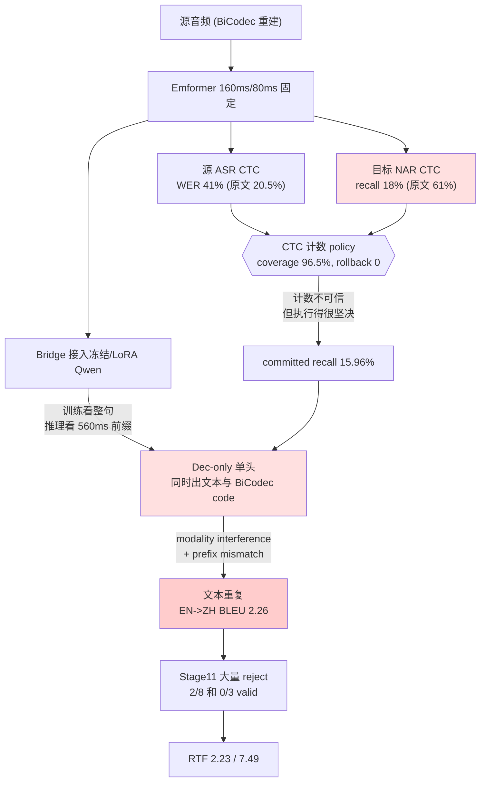

# StreamSpeech 路线失败诊断与可替代的 Simul-S2ST 方案调研

> 日期：2026-08-08
> 对象实验：`experiments/uniss_streamspeech_ctc_v1/` Stage00–13、`reports/uniss_phase3_whisper_streamspeech_joint_v6/`
> 前序文档：[`streamspeech_analysis_and_uniss_ctc_streaming_plan.md`](./streamspeech_analysis_and_uniss_ctc_streaming_plan.md)、[`uniss_emformer_stages_vs_streamspeech_original_training_audit.md`](./uniss_emformer_stages_vs_streamspeech_original_training_audit.md)

---

## 0. 结论先行

已有审计（`uniss_emformer_stages_vs_streamspeech_original_training_audit.md` §7）给出的五条原因是对的：target CTC 质量低、缺 `g(i)`、缺 NAR T2U、缺 multi-chunk、未过门的 checkpoint 被下游使用。本文档在此基础上补三条它没有强调、但我认为更致命的判断，并给出替代方案。

**判断一：CTC 计数器本身是坏的，policy 只是忠实地执行了一个坏计数。**
你的 NAR-S2TT unigram recall 是 **18.35% / 19.28%**，StreamSpeech 原文对应的 1-gram ACC 是 **60.9%**。差 3 倍以上。StreamSpeech 的整个策略建立在"目标 CTC 计数 $\mathcal{N}^{s2tt}_j$ 可信"这个前提上——计数错了，policy 越稳定（WRITE coverage 96.48%、rollback 0）越糟糕，因为它会零回滚地、坚定地提交错误内容。

**判断二：StreamSpeech 从未在 ZH↔EN 上验证过，而这个语言对恰好是它假设最容易崩的地方。**
原文只做 Fr/Es/De→En，全是语序相对单调的欧洲语言。$\mathcal{N}^{s2tt}_j$ = "源前缀支持多少目标 token" 这个量只有在对齐近似单调时才有定义。SimulS2ST-Omni 的消融给出了直接证据：**不做单调性过滤时，最低延迟档的 BLEU 从 21.14 崩到 4.59（En→Zh）、从 11.98 崩到 3.56（Zh→En）**。你的 Stage12 EN→ZH 是 2.26，量级完全吻合。你的流水线里没有任何单调性过滤或重排处理。

**判断三：你的架构正好是最新对照实验里被证否的那一侧。**
SimulS2ST-Omni 做了一个受控对比：encoder / tokenizer / 声码后端 / 数据全部对齐，只比较 **Dec-only**（把 16384 个 code token 追加进 LLM 词表，单个自回归头同时出文本和 code）与 **Thinker–Talker**（双流分离）。**UniSS 就是 Dec-only**——Qwen 词表扩到 180407，BiCodec semantic 在 offset 155761、global 在 151665，同一个 LM head 同时预测文本和语音 code。结论是 Thinker–Talker 在**所有延迟档**上都显著更好，且差距在低延迟端最大。作者的解释是 dense code 预测与语言规划之间的 modality interference。

这一条解释了一个你数据里的具体现象：**EN→ZH BLEU 2.26 且"文本重复"**。文本重复正是规划通路被 code 预测干扰的典型症状。而离线时看不出来（UniSS 离线在该论文 Table 1 里是 32.04 / 24.72，被引为 SOTA），因为离线只需要做一次规划；流式要在部分上下文下反复交替规划与发码。

**一句话**：不是 CTC policy 无效，而是（a）喂给它的计数是坏的，（b）语言对的重排问题从没被处理，（c）承载它的 Dec-only 架构在流式下本身就是劣势侧。

---

## 1. 失败诊断

### 1.1 证据链

| 阶段 | 关键指标 | 数值 | 参照 |
| --- | --- | ---: | --- |
| Stage02 冻结 latent + 线性头 | EN WER / ZH CER | 81.57% / 84.44% | 表示不可线性解码 |
| | NAR-S2TT recall EN / ZH | 4.73% / 5.59% | — |
| Stage03 解冻 Emformer | EN WER / ZH CER | 41.25% / 34.93% | StreamSpeech 20.55% |
| | NAR recall EN / ZH | 17.99% / 18.56% | StreamSpeech ACC 60.9% |
| Stage03b + AR | NAR recall EN / ZH | 18.35% / 19.28% | 加 AR 几乎没帮到 NAR |
| | AR token acc EN / ZH | 37.11% / 30.31% | — |
| Stage05 CTC policy | WRITE coverage | 96.48% | 策略结构成立 |
| | committed unigram recall | **15.96%** | **提交内容基本是错的** |
| | first WRITE p50 / p95 | 1320 / 4240 ms | 延迟本身不差 |
| | rollback | 0 | 单调性成立 |
| Stage08 Step1 iter800 | EN→ZH / ZH→EN BLEU | 21.99 / 17.15 | 门 22.95 / 22.46 |
| Step1-R iter350 | | 21.20 / 20.19 | 未过 |
| Step2 iter100 (Qwen LoRA) | | 21.85 / 20.07 | 未过 |
| **Stage12 端到端** | **EN→ZH BLEU** | **2.26** | 文本重复，2/8 valid |
| | ZH→EN BLEU | 14.35 | 0/3 valid，走 fallback |
| | RTF | 2.23 / 7.49 | **远超实时** |

Phase3 joint v6 那条线（`fixed_chunk_stage_a_v2_vs_stage_b_v3_v1`）也一致：Stage B 把 ASR CTC 从 34.88 降到 20.87（相对改善 40.17%）、NAR S2TT 从 33.44 降到 20.30（39.32%），**CTC 确实在学**；但 teacher agreement 在 5/5 个 chunk 上都没改善（12–16%），BiCodec CTC 仍在 9.77。

### 1.2 断裂点在哪

三个红色节点是根因，其余是症状。

### 1.3 补充：为什么 NAR CTC 只有 18%

三个叠加因素，按我判断的重要性排序：

1. **ZH↔EN 重排**。NAR-S2TT CTC 要求目标文本能被单调地对齐到源帧。中英之间的语序差异（时间/地点状语位置、定语从句、"把"字句、动词位置）让很多目标 token 根本没有单调的源锚点。CTC 只能对单调路径求和，非单调的部分它学不了，只能退化成输出高频词。
2. **重建音频域**。训练音频是 BiCodec 重建的（`audio_origin: "bicodec_reconstructed"`），不是原始波形。前序文档量化过：重建全上下文流的 Text-BLEU 比 released 低约 7.7 / 7.2 点。ASR WER 41% 里有一部分是这个。
3. **初始化目标错位**。Emformer 来自 Student v2/v3，其预训练目标是模仿 WhisperVQ token agreement，不是文本对齐。Stage02 的 81.57% WER 说明这个 latent 对文本任务几乎不可线性解码。

### 1.4 补充：RTF 是硬阻塞

Stage12 的 RTF 是 2.23（EN→ZH）和 7.49（ZH→EN）。即使质量修好，这个数字也不能上线。参照：Hibiki 用 2B 模型在单张 H100 上批量推理可达 3× 实时。你的问题主要来自每 chunk 重算与 AR 逐 token 生成长 semantic 序列，标准解法是 KV cache 管理（见 §2.3）与非自回归码生成。

---

## 2. 适合当前架构的五条替代思路

按与 UniSS 的契合度排序。每条给 motivation、做法、以及对 UniSS 的具体适配。

### 2.1 SimulS2ST-Omni：显式轨迹监督 + 双流分离（最对口）

> He et al., *SimulS2ST-Omni: Data-Efficient Streaming Speech-to-Speech Translation via Explicit Trajectory Supervision*, [arXiv:2607.19810](https://arxiv.org/html/2607.19810)（CUHK-Shenzhen）

**为什么最对口**：中英双向、LLM backbone、离散语义 code 输出、CVSS-T 评测——和 UniSS 完全同一个问题设置。而且它**直接把 UniSS 当 SOTA 基线对比**（Table 1，CVSS-T ASR-BLEU：UniSS(P) 30.09/23.77、UniSS(Q) 32.04/24.72，它的 Thinker–Talker 31.12/25.18）。

**Motivation**：长时流式 S2ST 是一个 latent path 问题——模型必须在没有逐步监督的情况下自己学会 read/wait/write。已有的轨迹方法只解决了文本输出；语音输出需要**不可撤销、时间敏感**地提交声学 code，这一步一直靠不稳定的外挂发射控制器。同时，配对 S2ST 数据极度稀缺（SOTA 系统往往要 4 万小时以上）。

**三个做法**：

1. **联合 text-code 提交路径（joint commitment path）**。构造显式轨迹 $\tau = \{(\mathbf{Y}^{text}_c, \mathbf{Y}^{code}_c, g_c)\}_{c=1}^{C}$，$g_c$ 是发射第 $c$ 块前必须读入的源帧边界，且 $g_1 \le g_2 \le \cdots \le g_C$。训练目标就是 chunk 分解的对数似然：

$$\log p(\mathbf{Y}^{text}, \mathbf{Y}^{code}\mid \mathbf{X}, \tau) = \sum_{c=1}^{C}\log p(\mathbf{Y}^{text}_c, \mathbf{Y}^{code}_c \mid \mathbf{X}_{1:g_c}, \mathbf{Y}^{text}_{<c}, \mathbf{Y}^{code}_{<c})$$

**关键点：没有独立的 policy 模块，也没有 WAIT/WRITE 动作 token。** 何时发射被编码在训练数据的 $g_c$ 里，模型自己学。离线 S2ST 只是 $C=1, g_1=|\mathbf{X}|$ 的特例。

2. **轨迹怎么造**（这是 UniSS 最缺的一环）：
   - 强制对齐拿到源/目标词级边界；
   - **SimAlign 抽跨语言词对齐** $\hat{\mathbf{A}}$；
   - 目标词 $y_i$ 对齐到源词 $x_{a(i)}$，取其源侧结束帧 $t_{a(i)}$，即"能提交 $y_i$ 的最早源前缀"；
   - **单调化**：$\tilde{t}_i = \max(\tilde{t}_{i-1}, t_{a(i)})$，强制写位置非降；
   - 目标语音 code 按目标词边界切段，继承同一个 $\tilde{t}_i$；
   - 按 1 秒源区间分组成离散 read/wait/write 步。

3. **两流 Thinker–Talker 分离**：

$$p(\mathbf{Y}^{text}_c, \mathbf{Y}^{code}_c \mid \mathcal{C}_c) = \underbrace{p_\theta(\mathbf{Y}^{text}_c\mid\mathcal{C}_c)}_{\text{Thinker 规划}}\cdot \underbrace{p_\phi(\mathbf{Y}^{code}_c\mid\mathcal{C}_c, \mathbf{Y}^{text}_c, \mathbf{H}_\theta)}_{\text{Talker 发码}}$$

Talker 只有 0.4B，条件于 Thinker 的隐状态和已生成文本。

**对 UniSS 最重要的三个数据点**：

| 消融 | 结果 | 含义 |
| --- | --- | --- |
| Dec-only vs Thinker–Talker（流式） | Talker 在**所有**延迟档大幅领先 | 「轨迹微调解决不了统一解码器的 text/code 内部冲突」 |
| 无 NIR 单调性过滤 vs 有 | m1 档 En→Zh **4.59 → 21.14**，Zh→En **3.56 → 11.98** | 低延迟鲁棒性的**首要驱动因素**是数据过滤 |
| 配对 S2ST 降到 10% + 保留辅助任务 | 与全量基本持平；去掉辅助任务掉近 8 ASR-BLEU | 辅助多任务是锚 |

**适配 UniSS**：
- 你已经有 `source_words` / `target_words`（带 `start_ms`/`end_ms`）在 `subsecond_v2/prepare_a45.py` 里——**轨迹构造的原料已经在了，只是从没用于流式监督**。缺的是 SimAlign 跨语言对齐和 NIR 过滤。
- Thinker–Talker 需要拆架构：Qwen 出文本 + 一个轻量 Talker 出 BiCodec semantic。BiCodec global（32 token）作为 Talker 的 speaker condition，**这恰好保住了 UniSS 的音色优势**。
- 延迟档用 latency multiplier $m\in\{1..12\}$ 合并源块，**一个 checkpoint 覆盖所有延迟**，替代 multi-chunk。
- 三阶段：Talker 在 TTS 上 warmup → ASR/S2TT/MT/TTS/S2ST 混合联合预训练（比例 0.2:1:0.5:1:1.5）→ 挂新 LoRA 做流式轨迹微调。
- 你的 CVSS-T 数据已经下载并对齐好了（见 `simuls2st_omni_cvss_t_data_preparation_and_evaluation_plan.md`，ZH→EN test 4,897 条齐备），可以直接做同协议对比。

### 2.2 Hibiki：把策略彻底删掉，延迟编进数据

> Labiausse et al., *High-Fidelity Simultaneous Speech-To-Speech Translation*, ICML 2025，[项目页](https://hibiki-s2st.github.io/) · [代码](https://github.com/kyutai-labs/hibiki)

**Motivation**：同传的本质困难是"积累刚好够的上下文"。与其外挂一个策略去决定何时说，不如让模型以**恒定帧率**同时处理源流和生成目标流——该等的时候它自然输出静音/填充。这样推理端只剩 vanilla temperature sampling，可批量、可上端侧。

**做法**：
- 基于 Moshi 的 **multistream** 架构：源语音流和目标语音流被同一个 decoder-only 模型联合建模，**恒定 12.5 Hz** 同时产出文本 token 和音频 token；
- **延迟来自数据**：用一个现成文本 MT 系统的 **perplexity** 弱监督地判定每个目标词的最优延迟——即"读到源的哪里，这个目标词才变得可预测"——据此造对齐的合成训练数据；
- **音色迁移**通过 CFG 系数控制（`--cfg-coef`，典型值 3），系数越大音色越像但过大伤翻译；
- 2B/1B backbone，120 s 序列，40 s 上下文，单 H100 批量推理 3× 实时。
- 后续 **Hibiki-Zero**（3B）**完全去掉了词级对齐需求**，支持 Fr/Es/Pt/De→En，新语言 <1000 h 即可适配。

**为什么值得认真考虑**：
1. 它**同时**解决了你的两个核心痛点——策略（删掉了）和音色（CFG 可控的 voice transfer），而 StreamSpeech 明确做不到音色。
2. 恒定帧率意味着**不存在"提交/拒绝/fallback"这一整类问题**。你 Stage11/12 的 2/8 valid、0/3 valid、fallback，在这个范式里不会出现。
3. UniSS 的 token 几何和它相当接近：GLM 源侧 12.5 Hz、BiCodec 语义 50 Hz，与 Moshi/Mimi 的多流 RVQ 是同一类结构。

**代价**：这是一次架构重构，不是增量修复。需要把 Qwen 从"prompt 里塞源 token"改成"源/目标双流并行"，训练数据也要按恒定帧率对齐重造。

### 2.3 InfiniSST：把流式建模成多轮对话 + Λ 形 KV cache

> Ouyang et al., *InfiniSST: Simultaneous Translation of Unbounded Speech with Large Language Model*, ACL 2025 Findings，[ACL](https://aclanthology.org/2025.findings-acl.157/) · [代码](https://github.com/LeiLiLab/InfiniSST)

**Motivation**：绝大多数工作假设语音已预切分，不适用真实场景；而每来一个新块就重算历史特征与已生成文本，计算代价高。把 SST 表述成**多轮对话**（交替的"读语音"轮和"写译文"轮），就能完整复用 LLM 的 KV cache。

**做法**：
- chunk-wise causal wav2vec2 编码器 + adapter（两层 1-D conv，kernel=2 stride=2，48 帧 → 12 个 LLM embedding）+ Llama-3.1-8B 解码器；
- 用 **EOT token** 控制读写切换（策略内嵌在 LLM 自回归里，不是外挂模块）；
- **轨迹构造**：MFA 强制对齐 + SimAlign，建立 语音→转写→译文 的单调映射；切成 30 块的 "robust segments"（**包含非语音段**以增强鲁棒性）；
- **multi-latency augmentation**：随机延迟倍数 $m\in[1,12]$ 合并连续块及其译文；
- **Λ 形 KV cache**：只保留 system instruction 的 KV + 最近 $w=1000$ 个 token 的 KV；**存储前去掉 RoPE，拼接后重新施加 RoPE**，实现无限长度外推；
- 推理块 960 ms。

**结果**：MuST-C En-Es/De/Zh 上，在同等翻译质量下把 **computation-aware 延迟降低 0.5–1 秒**。

**适配 UniSS**：
- Λ 形 KV cache 是**直接可移植的 RTF 治理手段**，对你 2.23/7.49 的 RTF 是对症的；且与你现有的 Stage10 Qwen KV-cache Micro-WRITE 是同一层的东西，只是缺了 RoPE 重施与窗口管理。
- "robust segments 包含非语音段"这一点值得注意——你现在按 utterance 训练，真实流里的静音、呼吸、犹豫从没见过。
- multi-latency augmentation 与 SimulS2ST-Omni 的 latency multiplier 是同一个想法，可以合并实现。

### 2.4 SimulS2S-LLM：离线训练 + test-time 策略（成本最低）

> Deng et al., *SimulS2S-LLM: Unlocking Simultaneous Inference of Speech LLMs for Speech-to-Speech Translation*, ACL 2025，[arXiv:2504.15509](https://arxiv.org/abs/2504.15509)

**Motivation**：Speech LLM 的困难在于语音是作为 prompt 一次性前置的，天然不流式。但**不一定要为流式重训**——可以保持离线训练，只在推理时加策略；关键是消除 train/inference 的 mismatch。

**做法**：
- **离线训练**speech LLM（文本 LLM 冻结），推理时用 **test-time wait-k**；
- 用 **CIF（Continuous Integrate-and-Fire）** 从流式编码器抽取**词边界感知的 speech prompt**，其长度在**文本 token 粒度**上——这是消除 mismatch 的关键：训练时看到的 prompt 长度语义和推理时一致，整个推理由 CIF 驱动；
- 新 speech prompt 到来时，需要相应更新含位置信息的 past K/V；源读完后不再受限，用 tail beam search 补完；
- **语音生成**：LLM 多层隐状态 → 上采样 $U$ 倍 → causal Transformer → **CTC logits**；用语音 token 的 n-gram LM 做 shallow fusion 缓解 CTC 独立性假设；**incremental beam search** 在每个 $U$ 长度窗口内逐帧 beam，末帧只留最高分，从而不增加延迟地扩大搜索空间；
- CVSS 上比同数据量方法在相近延迟下 ASR-BLEU 高约 3 点。

**适配 UniSS**：这是**改动最小的一条路**。你的 Phase3 已经是强离线模型（被 SimulS2ST-Omni 引为 SOTA），可以：
- 保持 Phase3 不动；
- 用 CIF 替代当前的 bridge，让源侧 prompt 在**文本 token 粒度**上增长（而不是固定 160 ms 帧粒度），这直接对齐了 Qwen 训练时见到的 prompt 分布；
- test-time wait-k 替代 CTC 计数策略；
- BiCodec semantic 用 CTC + 上采样 + incremental beam search 生成，替代当前的 AR 长序列生成——**同时治 RTF 和早期结构不完整**。

CIF 尤其值得注意：它给的是"到目前为止累积了几个语音单元"的**连续可导**计数，本质上和 CTC 计数是同一类信号，但**不需要目标侧文本可单调对齐**——它只在源侧做发放，因此**不受 ZH↔EN 重排影响**。这正好绕开 §1.3 的第一条根因。

### 2.5 修 prefix mismatch 的通用训练技巧（可叠加在任何路线上）

你的审计已经定位到 `g(i)` 缺失是最大训练缺口。这一族方法专门解决它：

| 方法 | Motivation | 做法 |
| --- | --- | --- |
| **Glancing Future**（[arXiv:2309.06179](https://arxiv.org/abs/2309.06179)，ICTNLP） | prefix2prefix 训练削弱了模型捕捉全局信息的能力，并引入强行预测/幻觉 | 课程学习：初期用 seq2seq 训练保证翻译能力，随训练进程**逐步减少**每个目标 token 可见的额外未来源 token 数 $f_i$，平滑过渡到 prefix2prefix。每个目标 token 在训练中见过**不同长度**的源前缀 |
| **PsFuture / Prefix-to-Full**（[arXiv:2410.04075](https://arxiv.org/pdf/2410.04075)） | 想保留双向注意力离线模型的表示能力，又要能低延迟工作 | P2F loss：把**随机长度**的源前缀翻译成**完整**句子，前缀长度均匀采样；零样本自适应策略 |
| **Future-Guided Incremental Transformer**（AAAI 2021） | wait-k 缺少未来源信息的指导，预测能力弱；且重算历史使代价平方增长 | 用一个 full-sentence NMT teacher 蒸馏给 incremental student，把未来信息**隐式**嵌入；配 average embedding layer 汇总已消费源信息，避免重算 |
| **HPO**（[ACL 2026](https://aclanthology.org/2026.acl-long.80/)） | 多轮对话式 SST 依赖 SFT 数据，而高质量对话式标注几乎没有，合成数据质量无保证 | 在不完美 SFT 数据上做**分层策略优化**后训练，分层奖励平衡翻译质量与延迟。En→Zh/De/Ja 在 1.5 s 延迟下 +7 COMET |

**对 UniSS 最直接的一条**：Glancing Future 的课程思路可以**几乎零成本**加到现有 Stage03b/Stage08 上——不需要实现完整的 `g(i)` CTC 期望计数，只需要在训练时对每个样本随机截断 AR decoder 可见的 Emformer hidden 范围，并让这个截断从"全可见"逐步收紧。这是验证"prefix mismatch 是否为主因"的最便宜的因果实验。

HPO 与你已有的 Stage7A GRPO 是同一层，可作为后期手段——但注意它的前提是先有一个能用的 SFT 模型。

### 2.6 其他值得知道的

- **SimulU**（[arXiv:2603.16924](https://www.arxiv.org/pdf/2603.16924)）：**training-free** 长时 S2ST 策略，直接用预训练模型（SeamlessM4T）的 cross-attention 决定何时发射**以及保留哪些历史上下文**。零训练成本，可作为快速上界探针。
- **LiveInterpret 2.0**：闭源 SOTA，SimulS2ST-Omni 的主要对比对象。RealSI 上 En→Zh 29.09 / Zh→En 22.19 ASR-BLEU。
- **RealSI / ACL60-60**：中英流式评测的实际基准，**全部是真人录音**（合成语音只用于造训练数据，从不作为评测目标）。你现在的评测是 UniST dev（重建音频），这一点应该改。

---

## 3. 三条路线的取舍

| | 路线 A：CIF + test-time 策略 | 路线 B：轨迹监督 + 双流 | 路线 C：多流恒定帧率 |
| --- | --- | --- | --- |
| 参照 | SimulS2S-LLM | SimulS2ST-Omni + InfiniSST | Hibiki |
| 改动范围 | 只换 bridge 和语音生成头 | 拆 Talker + 重造训练数据 | 架构重构 |
| Phase3 是否保留 | **完全保留** | Thinker 保留 | 不保留 |
| 是否需要词对齐 | 否 | **是**（SimAlign + 强制对齐） | 是（或用 Hibiki-Zero 免对齐） |
| 是否受 ZH↔EN 重排影响 | **否**（CIF 只在源侧发放） | 需 NIR 过滤 | 延迟由 MT perplexity 决定，隐式处理 |
| 音色保持 | 保留 BiCodec global | 保留（Talker 的 speaker condition） | CFG 控制的 voice transfer |
| RTF 前景 | 好（NAR CTC + incremental beam） | 好（轻量 Talker + rolling KV） | 最好（3× 实时已验证） |
| 预期天花板 | 中 | 高 | 高 |
| 风险 | 低 | 中 | 高 |

**我的建议顺序**：

1. **先做诊断实验（见 §4），不要先选路线。** 现在有三个候选根因（计数器坏 / 重排 / Dec-only 干扰），必须先知道哪个占主导，否则选哪条路都是赌。
2. **路线 A 作为主线**，因为它保留了你最值钱的资产（Phase3 离线质量，被外部论文引为 SOTA），改动集中在 bridge 和语音生成头，且 CIF 结构性地绕开了 ZH↔EN 重排这个根因。
3. **路线 B 的数据部分立刻开始做**，因为轨迹构造（强制对齐 + SimAlign + 单调化 + NIR 过滤）**对 A/B/C 三条路线都有用**，而且你已经有 `source_words`/`target_words` 的原料。NIR 过滤那个 4.59→21.14 的消融说明这可能是单项收益最大的一件事。
4. **路线 C 作为中期目标**，如果 A/B 都撞到 Dec-only 的天花板。

---

## 4. 立即可做的四个诊断实验

都不需要大规模训练，目的是把三个候选根因分开。

**D1：重排到底伤多少？（半天，纯数据分析，零训练）**
对 15-shard 用现有 `source_words`/`target_words` + SimAlign 算每条样本的 NIR（Normalized Inversion Rate），画分布；然后把 Stage05 的 committed unigram recall 按 NIR 分桶。
- 若低 NIR 桶的 recall 显著高于高 NIR 桶 → 重排是主因，优先做数据过滤（路线 B 的数据部分）。
- 若各桶无差别 → 重排不是主因，问题在表示或架构。

**D2：计数器的上界在哪？（一天，零训练）**
用**真值文本**构造 oracle 计数（每个源前缀真正对应多少目标词，由词对齐给出），喂给现有 Stage05 policy 和 Stage10 Qwen，看端到端 BLEU。
- 若 oracle 计数下 BLEU 就恢复到接近离线 → 问题全在 CTC 计数质量，修 NAR 头即可。
- 若 oracle 计数下 BLEU 仍然很低 → 问题在生成侧（prefix mismatch 或 Dec-only 干扰），修计数没用。

**这一条是最关键的实验**，它能一次性把"计数器坏"和"生成器坏"分开。

**D3：prefix mismatch 占多少？（2–3 天，小规模训练）**
在 Stage03b 上加 Glancing Future 式课程：训练时随机截断 AR decoder 可见的 Emformer hidden，从全可见逐步收紧。只改这一处，其余参数不变。
- 若 AR token accuracy 和端到端 BLEU 明显改善 → 补 `g(i)` 是对的，按审计 §8.2 继续。

**D4：Dec-only 干扰是否存在？（2–3 天）**
在冻结的 Phase3 上，用**真值译文**强制 teacher-forcing，只让模型生成 BiCodec semantic，测两种条件下的 semantic NLL 与生成质量：(a) 完整源 prompt；(b) 截断到 560/880 ms 的源 prompt。再对比"只出文本不出 code"时的文本质量。
- 若截断条件下**文本质量**掉得远比 semantic NLL 多，且出 code 时文本比不出 code 时明显差 → 证实 modality interference，需要考虑 Thinker–Talker 拆分。

---

## 5. 参考

**最相关（中英 / LLM / 语音输出）**
- He et al. *SimulS2ST-Omni: Data-Efficient Streaming Speech-to-Speech Translation via Explicit Trajectory Supervision*. [arXiv:2607.19810](https://arxiv.org/html/2607.19810) · [demo](https://hasaki321.github.io/SimulS2ST-Omni.demo/)
- Labiausse et al. *High-Fidelity Simultaneous Speech-To-Speech Translation* (Hibiki). ICML 2025. [项目页](https://hibiki-s2st.github.io/) · [代码](https://github.com/kyutai-labs/hibiki) · [Hibiki-Zero](https://huggingface.co/kyutai/hibiki-zero-3b-pytorch-bf16)
- Deng et al. *SimulS2S-LLM*. ACL 2025. [arXiv:2504.15509](https://arxiv.org/abs/2504.15509)
- Ouyang et al. *InfiniSST: Simultaneous Translation of Unbounded Speech with LLM*. ACL 2025 Findings. [ACL](https://aclanthology.org/2025.findings-acl.157/) · [代码](https://github.com/LeiLiLab/InfiniSST)

**策略与训练技巧**
- Ouyang et al. *Hierarchical Policy Optimization for Simultaneous Translation of Unbounded Speech*. ACL 2026. [ACL](https://aclanthology.org/2026.acl-long.80/)
- Djanibekov et al. *SimulU: Training-free Policy for Long-form Simultaneous S2ST*. [arXiv:2603.16924](https://www.arxiv.org/pdf/2603.16924)
- Guo et al. *Glancing Future for Simultaneous Machine Translation*. [arXiv:2309.06179](https://arxiv.org/abs/2309.06179) · [代码](https://github.com/ictnlp/Glance-SiMT)
- *PsFuture: A Pseudo-Future-based Zero-Shot Adaptive Policy for SiMT*. [arXiv:2410.04075](https://arxiv.org/pdf/2410.04075)
- Zhang et al. *Future-Guided Incremental Transformer for Simultaneous Translation*. AAAI 2021.
- Dong & Xu. *CIF: Continuous Integrate-and-Fire for End-to-End Speech Recognition*. ICASSP 2020.
- Jalili Sabet et al. *SimAlign: High Quality Word Alignments without Parallel Training Data*. EMNLP Findings 2020.

**基线与前序**
- Zhang et al. *StreamSpeech*. ACL 2024. [arXiv:2406.03049](https://arxiv.org/abs/2406.03049)
- Papi et al. *StreamLAAL / LAAL*. — 长时流式延迟指标

**本地文档**
- [`streamspeech_analysis_and_uniss_ctc_streaming_plan.md`](./streamspeech_analysis_and_uniss_ctc_streaming_plan.md)
- [`uniss_emformer_stages_vs_streamspeech_original_training_audit.md`](./uniss_emformer_stages_vs_streamspeech_original_training_audit.md)
- [`simuls2st_omni_cvss_t_data_preparation_and_evaluation_plan.md`](./simuls2st_omni_cvss_t_data_preparation_and_evaluation_plan.md)
- [`stage_b_latent_15shard_h200_execution_report.md`](./stage_b_latent_15shard_h200_execution_report.md)
