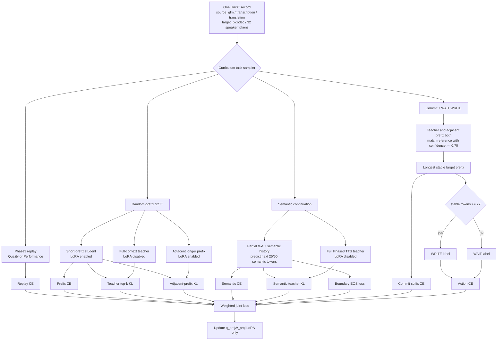

# UniSS Phase3 Prefix-Streaming V3：训练、推理、架构与改进建议报告

> 文档日期：2026-08-10 UTC
> 面向对象：需要快速理解当前系统设计、实验依据与局限的项目同事
> 当前正式训练：`uniss_phase3_prefix_streaming_full198_joint_v3`
> 当前推理 checkpoint：`iter_0008000`
> 当前系统性质：**在最佳 offline Phase3 上训练的 prefix/pseudo-streaming simultaneous S2ST**，不是 causal Whisper 真流式系统

## 1. 执行摘要

当前方案没有替换已训练成功的 UniSS Phase3 架构，也没有额外训练 Qwen3 Talker、Emformer 或独立 TTS。它从 full198 最佳 offline Phase3：

```text
checkpoints/exported_hf/qwen0p5b_phase3_unist198_iter_0009075_hf
```

开始，冻结约 0.52B 的 Qwen 主干，只在 24 层 attention 的 `q_proj`、`v_proj` 上训练 rank-16 LoRA。实际新增可训练参数为 `1,081,344`，约占主干参数的 0.21%。训练使用 UniST full198 的 19,285,109 条有效记录，通过一次 12,000-iteration、8×H200 的单阶段 curriculum，把以下能力联合加入原 Phase3：

1. 原 Phase3 Quality/Performance replay，保护 offline S2ST、ASR、翻译和语音生成能力；
2. 随机源前缀 S2TT，使模型只看到部分源语音 token 时也能翻译；
3. full-context Phase3 teacher top-k 蒸馏，降低部分上下文训练造成的质量坍缩；
4. 相邻前缀一致性，使短前缀与稍长前缀的预测不要剧烈变化；
5. stable-commit 监督，只提交 teacher 和相邻前缀都确认的连续目标前缀；
6. 自动派生 WAIT/WRITE 标签，使模型判断当前应继续听还是开始输出；
7. target BiCodec semantic 短块续写，使目标语音 token 能分块生成并增量解码。

当前系统之所以能够做 simultaneous S2ST，是因为推理时不再等到整句结束才运行一次 Phase3，而是随着 320/480/640 ms 新音频到达，反复执行：

```text
累计源前缀编码
→ 稳定源 token 提交
→ WAIT/WRITE
→ 目标文本稳定提交
→ 目标 semantic token 分块生成
→ BiCodec 增量解码
→ 播放目标语音
```

在已审计的 13.90 秒中文样本上，480 ms 配置首次 WRITE 为 3.68 秒、首次目标音频对应的源时间为 4.16 秒，证明它可以在源语音结束前输出目标语音。但是，当前 WhisperVQ/GLM 前端会对累计音频前缀重新编码，并非 causal cache，因此应准确称为 **pseudo-streaming/prefix-streaming**，不能称为严格真流式。

当前最大问题不是训练是否完成，而是正式 streaming 质量评估尚未完成：目前只有一条 13.90 秒样本的 320/480/640 ms 端到端结果，还没有在 UniST test 或 CVSS-T 上得到 streaming ASR-BLEU、COMET、AutoPCP、SLC、UTMOS、speaker similarity 的全量结果。因此本文对已有数字和未测数字严格分开。

## 2. 系统版本与资产

### 2.1 Offline 基座

```text
模型：Qwen2 0.5B 级 UniSS Phase3
checkpoint：checkpoints/exported_hf/qwen0p5b_phase3_unist198_iter_0009075_hf
训练数据：UniST full198
任务：ASR、S2TT、S2ST、TTS，以及 Quality/Performance 两种 S2ST 协议
```

主干配置：

| 项目 | 配置 |
| --- | ---: |
| Transformer 层数 | 24 |
| hidden size | 896 |
| FFN hidden size | 4,864 |
| attention heads | 14 |
| GQA query groups | 2 |
| vocabulary size | 180,407 |
| position embedding | RoPE，base 1,000,000 |
| normalization | RMSNorm |
| activation | SwiGLU |
| 最大 position | 32,768 |

### 2.2 Streaming 训练输出

```text
训练目录：experiments/uniss_phase3_prefix_streaming_full198_v1/
checkpoint：checkpoints/uniss_phase3_prefix_streaming_full198_joint_v3/
最终 iteration：iter_0012000
TensorBoard：runs/uniss_phase3_prefix_streaming_full198_joint_v3/tensorboard
训练日志：logs/uniss_phase3_prefix_streaming_full198_joint_v3.log
```

### 2.3 当前推理模型

虽然训练完成到 12,000 iteration，推理没有简单选择最后一步，而是按六项与 simultaneous inference 直接相关的验证 loss 做 rank-sum 选择。当前选中：

```text
checkpoints/uniss_phase3_prefix_streaming_full198_joint_v3/iter_0008000
```

导出的 LoRA：

```text
checkpoints/exported_adapters/
  uniss_phase3_prefix_streaming_full198_joint_v3_iter_0008000_lora_v1/
```

| LoRA 项目 | 数值 |
| --- | ---: |
| rank | 16 |
| alpha | 32 |
| scaling | 2.0 |
| training dropout | 0.05 |
| target modules | `q_proj,v_proj` |
| LoRA tensors | 96 |
| 可训练参数 | 1,081,344 |
| 权重文件大小 | 2,173,696 bytes |

## 3. 整体模型架构

### 3.1 端到端架构图

```mermaid
flowchart LR
    A["16 kHz source waveform"] --> B["Cumulative Prefix Frontend"]
    B --> C["Frozen WhisperVQ / GLM tokenizer"]
    C --> D["GLM candidate tokens"]
    D --> E["Stable source-prefix committer<br/>two-observation agreement<br/>holdback = 2 tokens"]
    E --> F["Committed source GLM tokens"]

    A --> G["BiCodec speaker encoder<br/>first prefix"]
    G --> H["32 global speaker tokens<br/>frozen for the session"]

    F --> I["Frozen Phase3 Qwen2-0.5B<br/>+ rank-16 q/v LoRA"]
    H --> I

    I --> J["WAIT / WRITE protocol"]
    J -->|WAIT| B
    J -->|WRITE| K["Streaming S2TT protocol<br/>greedy target-text hypothesis"]
    K --> L["Stable target-text committer<br/>holdback = 2 tokens"]
    L --> M["Committed target text"]

    M --> N["Streaming TTS protocol<br/>64 semantic tokens/block<br/>history = 200 tokens"]
    H --> N
    N --> O["Semantic quality gate<br/>invalid / repetition / diversity"]
    O --> P["Streaming BiCodec decoder<br/>50-token left context<br/>5-token holdback<br/>80 ms crossfade"]
    P --> Q["Target waveform chunks"]
    Q --> R["Timeline audio"]
    A --> S["Left channel: source"]
    R --> T["Right channel: translation"]
    S --> U["Aligned stereo listening output"]
    T --> U
```



这里的“WAIT/WRITE head、S2TT head、TTS head”是三个**任务协议/推理入口**，它们共享同一个 Qwen Transformer 和同一个 LM head，通过不同 task token、prompt 结构和输出 token 范围实现。当前没有新增三个独立 MLP head。

### 3.2 训练架构图



## 4. 数据与训练样本构造

### 4.1 full198 数据

| 项目 | 数量 |
| --- | ---: |
| UniST train 原始行数 | 19,785,924 |
| 有效训练行数 | 19,285,109 |
| 被拒绝的不完整/不兼容行 | 500,815 |
| 英文源有效记录 | 12,421,395 |
| 中文源有效记录 | 6,863,714 |
| shard 数 | 198 |

有效记录必须同时满足：

- `source_glm` 非空；
- `target_bicodec` 至少两个 semantic token；
- `bicodec_global` 恰好 32 token；
- transcription 与 translation 非空。

原始 parquet 不被改写。独立 direction index 把每个 shard 中的中、英文源记录分别索引，再使用 64-row direction-local block 交替读取。正式 global batch 为 128，因此每个优化步骤稳定获得 64 个 EN-source 和 64 个 ZH-source 样本。

### 4.2 重要边界：训练使用预计算 speech token，不直接训练 Whisper

当前训练读取的是 full utterance 已预计算的 `source_glm`，随后按照 0.25–1.00 的比例截断 token 前缀。训练过程中：

- 不读取源 waveform；
- 不重新运行 WhisperVQ；
- 不更新 WhisperVQ 参数；
- prefix ratio 是 GLM token 比例，不是严格的 320/480/640 ms 音频边界。

而推理时，系统对真实音频的 320/480/640 ms 累计前缀重新运行 WhisperVQ。这里存在一个重要 train–inference mismatch：训练看到的是“完整 utterance token 序列的截断”，推理看到的是“短音频独立重编码后产生、可能发生 revision 的 token 序列”。这是当前架构最需要改进的地方之一。

## 5. 每个训练模块的 motivation、实现与论文来源

当前实现不是某一篇论文的逐架构复现，而是以 UniSS Phase3 为主干，对多篇 simultaneous S2ST/SimulMT 工作做方法移植。下表中的“参考”表示借鉴其核心思想，不表示代码或实验协议完全相同。

### 5.1 Phase3 exact replay：保护 offline 能力

**问题与 motivation**

只训练短前缀和 WAIT/WRITE 容易让模型遗忘原来 Phase3 的完整 ASR、翻译、目标 semantic token 结构，导致 catastrophic forgetting。simultaneous 能力如果以大幅损失原 Phase3 质量为代价，没有实际意义。

**实现**

Replay 在 Quality/Performance 间 50/50 采样：

- Performance：完整 source GLM → translation → target semantic；
- Quality：完整 source GLM → transcription → translation → target semantic。

使用标准 causal CE，权重为 1。

**参考**

- *UniSS: Unified Expressive Speech-to-Speech Translation with Your Voice*：统一 task token、Quality/Performance 协议和 BiCodec speaker/semantic token；
- StreamSpeech 与 SimulS2ST-Omni 的 multi-task 结论：辅助任务/原能力锚点对于 simultaneous S2ST 质量非常重要。

**当前差异**

Replay 是本项目为保护已训练 Phase3 增加的扩展，不是 StreamSpeech 原论文的 exact loss。

### 5.2 Random-prefix S2TT：让模型在部分源信息下翻译

**问题与 motivation**

Offline Phase3 训练时始终看到完整 source token，推理时若只给短前缀会产生明显分布偏移。必须让 Qwen 在训练时经历不同长度源前缀，否则 WAIT/WRITE 即使提前，生成内容也可能 hallucinate 或严重欠翻译。

**实现**

从完整 `source_glm` 取前 `ratio` 比例，预测完整目标 translation。curriculum 逐步引入更短 prefix：

```text
0–1500:      0.70 / 0.85 / 1.00
1501–4000:   0.55 / 0.70 / 0.85 / 1.00
4001–7000:   0.40 / 0.55 / 0.70 / 0.85 / 1.00
7001–12000:  0.25 / 0.40 / 0.55 / 0.70 / 0.85 / 1.00
```

**参考**

- Ma et al., *STACL: Simultaneous Translation with Implicit Anticipation and Controllable Latency using Prefix-to-Prefix Framework*：prefix-to-prefix 和 READ/WRITE 的基本定义；
- *StreamSpeech: Simultaneous Speech-to-Speech Translation with Multi-task Learning*：multi-chunk training，用不同 chunk 训练同一个延迟可控模型；
- *FAST: Fast and Accurate Streaming Transformer*：从 offline teacher 向 streaming/prefix student 转移知识的思想。

**当前差异**

StreamSpeech 使用 chunk-based Conformer 和 CTC eligibility；当前实现没有 source/target CTC，而是直接截断预计算 GLM token。

### 5.3 Full-context teacher top-k distillation：限制短前缀质量下降

**问题与 motivation**

短前缀参考 translation 并不一定完全由当前源信息支持。如果对所有完整目标 token 施加同强度 hard CE，会鼓励模型猜未来。另一方面，完全取消完整 teacher 又会损失 Phase3 已学到的翻译分布。

**实现**

- teacher：相同 Phase3 主干、关闭 LoRA、完整 source；
- student：开启 LoRA、短 source prefix；
- teacher temperature：1.5；
- 每位置保存 top-32 概率；
- prefix/commit teacher KL 权重：0.25；
- semantic teacher KL 权重：0.20。

**参考**

- streaming ASR/MT 中 offline-teacher → streaming-student distillation；
- FAST 的 future-aware distillation 动机；
- Hibiki-Zero 中“当前前缀应该输出什么”的过程监督思想。

**当前差异**

当前 teacher 仍是句级 full-context Phase3，不是显式对齐到当前 source prefix 的 oracle translation prefix，因此 teacher KL 只是软约束，不能单独解决过早猜测。

### 5.4 Adjacent-prefix consistency：降低前缀 revision

**问题与 motivation**

同一句语音从 40% 增加到 55% 时，如果模型已经输出的前缀完全改写，就无法播放不可撤回的目标语音。simultaneous 系统必须优先保证已提交内容稳定，而不是每次都生成一条新的完整翻译。

**实现**

对相邻两个 source prefix `short` 和 `long`：

- long prefix 使用当前 LoRA；
- short prefix 的预测分布向 long prefix top-k 分布做 KL；
- 普通 prefix consistency 权重 0.20；
- commit task consistency 权重 0.25。

**参考**

- *Turning Whisper into Real-Time Transcription System* 的 LocalAgreement：连续两次前缀识别共同部分才提交；
- Hibiki 的 contextual alignment/safe emission：只在上下文足以支持目标内容时输出；
- incremental MT 的 prefix stability/erasure 控制。

### 5.5 Stable commit 与 WAIT/WRITE：无需人工词级轨迹自动造标签

**问题与 motivation**

当前 full198 没有人工 READ/WRITE trajectory。直接使用固定 wait-k 简单但不能根据句子难度变化。需要从已有 Phase3 teacher 自动判断当前前缀是否已经支持稳定翻译。

**实现**

一个目标位置被视为 stable，当且仅当：

1. full-context base teacher 的 argmax 等于 reference；
2. adjacent longer-prefix student 的 argmax 等于 reference；
3. 两者 confidence 都不低于 0.70。

从第一个 target token 开始取连续 stable prefix：

```text
stable_count >= 2  → WRITE
stable_count < 2   → WAIT
```

commit task 只对 stable suffix 计算 CE；WAIT/WRITE 两个 token 单独计算二分类 CE，权重 1.0。

**参考**

- STACL/wait-k 的 READ/WRITE action abstraction；
- *SimulS2S-LLM* 的 boundary-aware prompt 与 wait-k simultaneous inference；
- *High-Fidelity Simultaneous S2ST (Hibiki)* 的 safe contextual alignment；
- *Hibiki-Zero: Simultaneous S2ST Without Aligned Data*：不依赖词级对齐、用当前前缀支持程度形成过程监督；
- *SimulS2ST-Omni* 的 commitment trajectory motivation。

**当前差异**

当前不是 SimulS2ST-Omni 的显式 trajectory supervision，也没有 SimAlign/NIR 单调过滤；不是 Hibiki-Zero 的随机 delay + GRPO；不是 SimulS2S-LLM 的 CIF 计数。它是项目自定义的 teacher-stability proxy。

### 5.6 Streaming semantic continuation：把整段 TTS 改成短块续写

**问题与 motivation**

原 Phase3 倾向一次自回归生成完整 target semantic token。目标 BiCodec semantic rate 约 50 Hz，一秒语音约需 50 次 AR token，完整生成会造成高首包延迟。必须训练模型在已有 semantic history 后继续生成下一小块。

**实现**

- 随机选择 target semantic 序列 10%–90% 的 cut；
- 保留最多 200 个历史 semantic token；
- 当前文本只提供随机比例 prefix；
- 预测下一块 25 或 50 个 semantic token；
- hard semantic CE + teacher top-k KL；
- 对最后两个 token 加 boundary/EOS loss，权重 0.10。

推理时每个非 final WRITE 生成最多 64 semantic token；final flush 最多生成 8 个 block。

**参考**

- StreamSpeech 的 NAR text-to-unit 与增量 speech unit generation motivation；
- SimulS2S-LLM 的独立 speech generator；
- NAST-S2x 的 chunk-level target unit generation；
- Textless Streaming S2ST 的 semantic speech token streaming。

**当前差异**

当前仍然是 Qwen LM head 的 AR semantic generation，不是 StreamSpeech/NAST/SimulS2S-LLM 的 NAR CTC speech generator，因此降低了输出粒度，但没有从根本上消除 50 Hz 自回归成本。

### 5.7 Streaming BiCodec：增量解码与音频边界平滑

**问题与 motivation**

每个 semantic block 独立解码容易出现爆音、相位跳变、重复或空洞。必须保留左上下文并延迟一小段不稳定尾部。

**实现**

| 配置 | 数值 |
| --- | ---: |
| semantic rate | 50 Hz |
| left context | 50 tokens，约 1.0 秒 |
| holdback | 5 tokens，约 100 ms |
| overlap/crossfade | 80 ms |
| speaker condition | 会话固定 32 global tokens |

**参考**

- StreamSpeech、NAST-S2x 对 discontinuity/silence/stuttering 的分析；
- Hibiki 的连续 target audio stream 和 speaker conditioning motivation。

## 6. 联合 loss

当前每个样本只属于 replay、prefix、semantic、commit 四类任务之一。总 loss 可写为：

```text
L = mean_batch(
      L_base_CE
    + 0.25 L_teacher_KL(prefix/commit)
    + 0.20 L_teacher_KL(semantic)
    + 0.20 L_adjacent(prefix)
    + 0.25 L_adjacent(commit)
    + 0.10 L_boundary
    + 1.00 L_action
)
```

其中 `L_base_CE` 根据 task 分别是：

```text
replay   → Phase3 replay CE
prefix   → prefix S2TT CE
semantic → semantic continuation CE
commit   → stable target suffix CE
```

需要注意：日志中的 `loss/teacher_kl` 和 `loss/adjacent_consistency` 已包含对应权重，不应再次乘权重解释。

## 7. Curriculum 与正式训练配置

### 7.1 Curriculum

| Iteration | Replay | Prefix | Semantic | Commit | 训练重点 |
| ---: | ---: | ---: | ---: | ---: | --- |
| 1–1500 | 40% | 50% | 10% | 0% | 先保 Phase3 并适应较长 prefix |
| 1501–4000 | 30% | 50% | 15% | 5% | 引入 stable commit/action |
| 4001–7000 | 30% | 30% | 30% | 10% | 增强目标语音分块续写 |
| 7001–10000 | 30% | 25% | 25% | 20% | 加入 0.25 短前缀，强化决策 |
| 10001–12000 | 35% | 20% | 20% | 25% | 最终提高 replay 与 commit 稳定性 |

### 7.2 Megatron 配置

| 项目 | 配置 |
| --- | ---: |
| GPU | 8×NVIDIA H200 |
| framework | Megatron orchestration + PyTorch DDP |
| TP / PP | 1 / 1 |
| precision | BF16 |
| sequence length | 18,000 |
| 单样本最大训练 token | 4,096 |
| micro batch | 8/GPU |
| global batch | 128 |
| gradient accumulation | 2 |
| iterations | 12,000 |
| consumed samples | 1,536,000 |
| 初始 LR | 2e-5 |
| 最低 LR | 1e-6 |
| warmup | 300 iterations |
| schedule | cosine |
| Adam beta | 0.9 / 0.95 |
| weight decay | 0.01 |
| gradient clip | 0.5 |
| save / validation | 500 / 250 iterations |

### 7.3 完成状态与训练资源

| 指标 | 结果 |
| --- | ---: |
| 开始时间 | 2026-08-09 18:06:46 UTC |
| 结束时间 | 2026-08-09 20:21:06 UTC |
| 总耗时 | 约 2 小时 14 分 20 秒 |
| NaN iterations | 0 |
| skipped iterations | 0 |
| CUDA OOM | 0 |
| LoRA update RMS（最终） | 0.006005 |
| 平均 GPU utility | 39.9% |
| 峰值 GPU utility | 100% |
| 平均功率 | 202.1 W/GPU |
| 峰值功率 | 384.1 W/GPU |
| 日志峰值显存 | 90,152 MiB/GPU |

micro-batch 16 压力测试曾达到约 140.5 GiB/143.8 GiB，因此正式训练使用 micro-batch 8 保留 full198 动态长度异常样本的安全余量。

## 8. Checkpoint 选择与训练指标

`iter_0008000` 在六项 inference-relevant loss 中有五项排名第一，semantic CE 排名第八，总 rank-sum 为 13；第二名 `iter_0011500` 为 41。

### 8.1 iter_0008000 验证指标

| 指标 | 数值 | 含义 |
| --- | ---: | --- |
| Replay CE | 3.796032 | 保留原 Phase3 完整任务能力 |
| Prefix CE | **1.731546** | 部分 source prefix 下目标文本生成 |
| Semantic CE | 4.812450 | target semantic 短块续写 |
| Commit suffix CE | **0.108193** | 稳定目标前缀的 token CE |
| Teacher KL | **0.246496** | 与 frozen full-context Phase3 的分布距离 |
| Adjacent consistency | **0.104665** | 短/长相邻 prefix 分布一致性 |
| Action CE | **0.559680** | WAIT/WRITE 二分类 |
| Boundary/EOS | 0.231563 | semantic block 终止结构 |
| Teacher confidence | 0.570073 | frozen teacher 平均置信度 |
| Longer-prefix confidence | 0.639382 | 相邻长 prefix 平均置信度 |
| Stable target tokens mean | 1.091797 | 每个 commit 样本连续稳定 token 数 |
| WRITE target fraction | 0.234375 | 自动标签中 WRITE 比例 |
| LoRA update RMS | 0.005857 | LoRA 相对零初始化后的更新幅度 |

这些是训练/验证 proxy，不等于 BLEU、语音质量或真实延迟。尤其 Action CE 约 0.56 并不能直接说明同传延迟已经优秀。

## 9. 当前推理过程

### 9.1 输入与 source frontend

1. 上传音频统一转为 16 kHz 单声道；当前限制 0.5–60 秒、最大 100 MiB；
2. 默认先读取 3.2 秒 bootstrap；
3. 之后以 320/480/640 ms 增加 source prefix；
4. 每次对 `waveform[0:t]` 重新运行 frozen WhisperVQ/GLM tokenizer；
5. 连续两次 candidate 的最长公共前缀才允许提交，并保留 2 个 holdback token；
6. 第一次非 final encode 不提交 token，因为还没有第二次观察用于稳定性确认；
7. 从第一次 prefix 通过 BiCodec 提取 32 个 global speaker token，并在整个会话中冻结。

### 9.2 WAIT/WRITE

将 committed source GLM 和 32 speaker token 输入 action prompt，比较：

```text
logit(WAIT_READ) vs logit(WRITE_GENERATE)
```

若 `WRITE >= WAIT` 则 WRITE；source final 时即使模型倾向 WAIT 也强制 WRITE，以保证结束时能输出结果。

### 9.3 Streaming S2TT

WRITE 后用当前全部 committed source GLM 生成完整目标文本 hypothesis：

- greedy decode；
- `max_new_tokens=160`；
- repetition penalty 1.05；
- KV cache 只用于当前一次 `generate()`，不同 source event 之间没有持久化 Qwen cache。

目标文本也使用 LocalAgreement 风格 stable committer：相邻两次 hypothesis 的公共前缀减去 2-token holdback 才成为不可撤回文本。

### 9.4 Streaming TTS semantic

当有新 committed text 时：

- prompt 包含全部 committed text；
- 包含最近 200 个 target semantic history；
- 每次采样最多 64 semantic token；
- temperature 0.7；
- top-p 0.8；
- repetition penalty 1.05；
- 非 final 事件只生成一个 block；
- final 最多生成八个 block，目标长度至少 50 token，或约为 text token 数的 12 倍。

质量门拒绝：

- 非 BiCodec semantic vocabulary token；
- 空 semantic；
- 长度至少 16 时连续相同 token 达到 8；
- 长度至少 16 时 unique ratio 低于 0.10。

### 9.5 Incremental BiCodec 与播放时间线

通过 50-token 左上下文、5-token holdback 和 80 ms equal-power crossfade 解码。每个目标音频块的时间线起点取：

```text
max(对应 source WRITE 时间, 上一个目标块播放结束时间)
```

因此左右声道试听中：

- 左声道是源语音；
- 右声道在 First Audio 前严格静音；
- 右声道从实际模型允许播放的时间开始播放翻译语音。

## 10. 当前端到端延迟与生成指标

### 10.1 测试条件

```text
样本：magicdata_0000030545
方向：中文 → 英文
源时长：13.90 秒
checkpoint：iter_0008000
模式：累计前缀 pseudo-streaming
```

### 10.2 延迟主表

| Chunk | First WRITE | First Audio（source axis） | First Audio（upload compute wall） | AL | LAAL | AP | RTF |
| ---: | ---: | ---: | ---: | ---: | ---: | ---: | ---: |
| 320 ms | 13,900 ms | 13,900 ms | 11,079 ms | 7,132.9 ms | 7,132.9 ms | 1.000 | 0.797 |
| 480 ms | **3,680 ms** | **4,160 ms** | **1,063 ms** | **6,348.1 ms** | **6,348.1 ms** | **0.943** | 0.775 |
| 640 ms | 13,900 ms | 13,900 ms | 9,690 ms | 7,137.8 ms | 7,137.8 ms | 1.000 | **0.697** |

解释：

- First Audio source axis 表示模型需要观察多少源语音，是真正的策略等待量；
- upload compute wall 从完整文件已经上传后开始计时，因此 480 ms 的 1.063 秒不能解释成麦克风端到端延迟；
- 真实实时输入下，480 ms 的首次目标音频至少要等待 4.16 秒源语音，再叠加对应的计算、网络和播放缓冲；
- 当前 AL/LAAL 使用观测到的 target token 长度，没有 reference-aware denominator，因此两者相同；
- 320 ms 调用 frontend 次数最多，但仍 WAIT 到句尾，证明减小 chunk 不会自动降低延迟。

### 10.3 生成与稳定性

| Chunk | 总计算时间 | 目标音频时长 | Finalization lag | Text tokens | Semantic tokens | WAIT/WRITE | Frontend revisions |
| ---: | ---: | ---: | ---: | ---: | ---: | ---: | ---: |
| 320 ms | 11.079 s | 5.02 s | 5.02 s | 38 | 251 | 34 / 1 | 27 |
| 480 ms | 10.766 s | 6.74 s | 6.42 s | 37 | 337 | 21 / 3 | 14 |
| 640 ms | 9.690 s | 6.70 s | 6.70 s | 37 | 335 | 17 / 1 | 10 |

| Chunk | Semantic unique ratio | Max identical run | 判断 |
| ---: | ---: | ---: | --- |
| 320 ms | 0.793 | 2 | 通过质量门 |
| 480 ms | 0.760（首块） | 1 | 通过质量门 |
| 640 ms | 0.839 | 1 | 通过质量门 |

### 10.4 左右声道完整性

| Chunk | Left RMS | Right RMS | Left peak | Right peak | First Audio 前右声道峰值 |
| ---: | ---: | ---: | ---: | ---: | ---: |
| 320 ms | 0.0617 | 0.0231 | 0.8304 | 0.4493 | 0.0000 |
| 480 ms | 0.0596 | 0.0349 | 0.8304 | 0.7251 | 0.0000 |
| 640 ms | 0.0592 | 0.0424 | 0.8304 | 0.9482 | 0.0000 |

这证明 stereo 文件和时间线生成逻辑正确，但不能证明翻译质量已经达到 corpus-level 标准。

## 11. Offline Phase3 质量基线

当前 streaming LoRA 还没有完成 CVSS-T 全量客观指标。为了说明其初始化模型的质量水平，下面给出 **offline Phase3 iter_0009075** 在 CVSS-T 的本地已有结果。这些数值不是 streaming iter_0008000 的结果。

| Mode | 方向 | Speech-BLEU | Text-BLEU | AutoPCP | SLC-0.2 | SLC-0.4 | UTMOS |
| --- | --- | ---: | ---: | ---: | ---: | ---: | ---: |
| Performance | EN→ZH | 20.0099 | 20.4952 | 2.7715 | 0.7078 | 0.9592 | 3.8839 |
| Performance | ZH→EN | 6.9897 | 9.3984 | 2.8837 | 0.6372 | 0.9136 | 3.4853 |
| Quality | EN→ZH | **23.5820** | **24.1462** | 2.7889 | 0.7022 | 0.9592 | **3.8855** |
| Quality | ZH→EN | **12.0453** | **15.3345** | **2.9073** | 0.6343 | 0.9126 | 3.4725 |

该 CVSS-T 报告仍标记为 protocol-incomplete：部分方向存在生成失败或缺失文本，实际指标分母不是所有单元都达到 4,897。ZH→EN Whisper attention-mask bug 已修正并重算，但不能把该表描述为无缺失的正式论文复现。

### 11.1 当前 streaming 尚未得到的指标

| 指标 | 当前状态 |
| --- | --- |
| Streaming Text-BLEU / chrF / COMET | 未做 corpus-level 评估 |
| Streaming ASR-BLEU / ASR-COMET | 未做 corpus-level 评估 |
| Streaming AutoPCP / SLC / UTMOS | 未做 corpus-level 评估 |
| Streaming WavLM/SIM-O speaker similarity | 未测 |
| p50/p90/p95/p99 First Audio | 未测，当前仅一条 13.9 秒样本 |
| reference-aware LAAL / ATD | 未测 |
| 5–7 分钟 current-v3 成功率 | 未测；当前 runtime 限制 60 秒 |
| 真麦克风 causal wall-clock latency | 未测；当前 Gradio 录制结束后才提交文件 |

因此目前能得出的结论是“完整链路跑通，480 ms 在一条样本上提前输出”，不能得出“480 ms 普遍最优”或“streaming 质量保留了 offline Phase3”的结论。

## 12. 为什么当前系统可以做 simultaneous S2ST

一个系统要在源语音未结束时输出目标语音，至少需要满足五点：

1. **部分源输入可用**：当前以累计音频 prefix 得到 GLM token；
2. **输出时机决策**：当前训练 WAIT/WRITE token；
3. **不可撤回内容稳定**：当前对 source GLM 和 target text 都做相邻前缀 agreement；
4. **目标语音增量生成**：当前按 semantic block 续写，不要求一次生成整句；
5. **waveform 增量可播放**：当前 BiCodec 有 left context、holdback 和 crossfade。

480 ms 样本在源时间 4.16 秒产生目标音频，而源总长 13.90 秒，已经满足“源未结束、目标开始播放”的 simultaneous 定义。

但“simultaneous”不等于“真 causal streaming”。当前每次都重新编码 `audio[0:t]`，所以它满足增量可见性和提前输出，但不满足一次前向、有限缓存、计算量近似线性增长的真流式工程要求。

## 13. 当前架构与训练方案的缺点

### 13.1 训练 prefix 与推理 prefix 不一致

训练截断完整 `source_glm`；推理重新编码短 waveform prefix。短音频重编码可能导致 token revision，而训练数据没有模拟这种 revision。这会使 action/commit 在真实音频前缀上比验证集更保守。

**证据**：13.9 秒样本 frontend revision 为 320/480/640 ms 下的 27/14/10 次；320 ms 虽观察更频繁，却最终 WAIT 到句尾。

### 13.2 WhisperVQ 不是 causal，累计重编码不可扩展

每个新 chunk 都重算全部历史，计算量随会话长度近似二次增长。当前 runtime 直接限制为 60 秒；5 分钟完整历史模式既慢又容易造成 prompt/显存增长。

### 13.3 3.2 秒 bootstrap 直接阻止亚秒 First Audio

系统在 3.2 秒前不会运行第一次有效稳定提交，而且第一次 candidate 还需要第二次观察才能 commit。因此即使 action 完全正确，当前结构也不可能实现真正低于 1 秒的 First Audio。

### 13.4 WAIT/WRITE 标签是 proxy，不是真实轨迹

当前标签来自 teacher/reference/adjacent-prefix 的 token-level agreement：

- teacher 自身错误会污染标签；
- target token 不一定对应准确 source 时间；
- confidence 0.70 和 stable token ≥2 是人工阈值；
- 训练 validation WRITE fraction 只有 23.44%，可能形成保守策略；
- final 强制 WRITE 会掩盖一部分 action 失败。

### 13.5 目标文本每次 WRITE 都重新生成完整 hypothesis

虽然单次 `generate()` 使用 KV cache，但跨 source event 不保留缓存。每次 source prefix 变化都重新 prefill 和生成完整文本，浪费计算并增加 revision。

### 13.6 target semantic 仍是 50 Hz 自回归生成

“64-token block”只是把长序列切块，块内仍为 AR。目标语音一秒约 50 semantic token，final flush 可能执行多个 block，所以 480 ms 样本虽然 4.16 秒开始输出，最终仍有 6.42 秒 finalization lag。

### 13.7 文本 prefix 与 semantic cut 没有真实时间对齐

训练随机选择 text ratio 和 semantic cut，两者只通过相近随机 progress 弱关联，没有 forced alignment/CTC 保证“这些文字确实对应这段目标 semantic”。可能导致早期 semantic 内容与 committed text 不同步。

### 13.8 LoRA 容量较小

只训练 q/v、约 108 万参数，安全且不容易破坏 Phase3，但 action、prefix translation、semantic continuation 三种新行为竞争同一组低秩更新。semantic CE 在候选 checkpoint 中仍明显高于其他 CE，可能反映容量或任务冲突。

### 13.9 checkpoint 选择仍是 loss proxy

iter_0008000 是六项 loss rank-sum 最优，但没有使用 ASR-BLEU–LAAL Pareto、speaker similarity、长会话成功率直接选模。训练 loss 最优不保证实际声音、延迟或翻译质量最优。

### 13.10 当前评估样本太少

只有一条 13.9 秒样本无法估计方向差异、时长分布、p95/p99 延迟和失败率。当前不能判断 480 ms 是否普遍优于 320/640 ms。

### 13.11 当前网页不是真正浏览器音频流

Gradio 的录音/上传在音频结束后才把完整文件提交到后端，后端再做 pseudo-streaming replay。网页能试听 source-axis 同传时间线，但不是麦克风边录边把 PCM chunk 发送到服务器。

## 14. 改进建议、motivation 与学术依据

### 14.1 P0：先完成大规模、可配对的 streaming 评估

**做法**

- UniST dev 全量比较 320/480/640 ms；
- dev 选择两个 Pareto operating point；
- UniST test 冻结评估；
- CVSS-T 4,897 对双向评估；
- 报 Text/ASR-BLEU、COMET、LAAL/ATD、RTF、AutoPCP、SLC、UTMOS、speaker similarity；
- 结果按方向和时长分桶，报告 p50/p90/p95/p99。

**motivation**

当前最大风险是依据一条样本改架构。先量化质量损失来自 source frontend、action、text 还是 semantic/codec，后续训练才有正确优化目标。

**参考**

- StreamSpeech、SimulS2S-LLM、Hibiki、NAST-S2x 的 quality–latency Pareto 协议。

### 14.2 P0：用真实音频 prefix 轨迹重新训练 V4

**做法**

离线对训练音频按 320/480/640/960 ms 累计前缀实际运行 WhisperVQ，保存：

```text
audio_end_ms
candidate_glm
stable_committed_glm
revision count
speaker tokens from available prefix
```

训练时直接采样这些真实 inference frontend 输出，不再用 full-sequence `source_glm[:ratio]` 代替。

**motivation**

这是修复 train–inference mismatch 的最直接方法，预计会降低 action 保守性和 source token revision 对翻译的冲击。

**参考**

- StreamSpeech multi-chunk training；
- FAST offline-to-streaming distillation；
- Whisper LocalAgreement 实际 prefix revision。

### 14.3 P0/P1：把 checkpoint 选择改为质量–延迟 Pareto

**做法**

每 500 iteration checkpoint 在固定双向 dev 子集运行：

```text
Text-BLEU / COMET
First Audio p50/p95
LAAL / ATD
RTF p95
semantic rejection
speaker similarity
offline Phase3 replay retention
```

只从 non-dominated Pareto checkpoints 中选择，而不是对 loss 等权 rank-sum。

**motivation**

Action CE、semantic CE 的数值尺度不同；简单 rank-sum 不反映用户真正关心的翻译质量和延迟。

### 14.4 P1：降低 bootstrap，并把 speaker condition 与翻译前端解耦

**做法**

- 将 translation frontend bootstrap 降到 640–960 ms；
- speaker global token 可从可选参考音频获取；
- 没有参考音频时，对前几个 chunk 做 speaker embedding EMA；
- speaker token 更新与已输出目标语音设置安全边界，之后冻结；
- 训练中使用相同长度 prefix 提取的 speaker token，避免 full-utterance speaker token 与首 3.2 秒推理不一致。

**motivation**

当前 3.2 秒 bootstrap 是 First Audio 的硬下限。speaker 保真不应强制 translation policy 等待 3.2 秒。

**参考**

- Hibiki 的 speaker conditioning；
- SimulS2ST-Omni Thinker/Talker 中规划与发声条件解耦的思路。

### 14.5 P1：显式 trajectory supervision 或无对齐过程优化

有两条可选路线。

**路线 A：有对齐 trajectory**

- source/target ASR word timestamp；
- SimAlign 跨语言对齐；
- NIR/单调性过滤；
- 构造每个 source chunk 支持的 target text/semantic prefix；
- 训练 latency control token，如 `m=1,2,3,4,6`。

参考 SimulS2ST-Omni 的 explicit trajectory supervision。

**路线 B：不构造词级对齐**

- 随机 delay/silence 构造 coarse causal pairs；
- SFT 先保证模型探索过句中 WRITE；
- 再用 prefix quality + final quality + latency 的 GRPO/process reward；
- 奖励必须惩罚 unsupported guessing 和 WAIT-to-final。

参考 Hibiki-Zero 的 without-aligned-data 与 process reward。

**motivation**

当前 teacher-stability proxy 只能间接表示“可写”，而 trajectory/process reward 更直接优化 quality–latency trade-off。

### 14.6 P1：跨事件 Qwen KV cache

**做法**

- 把 system/task prompt 与已 committed source/text 的 KV 缓存持久化；
- 新 source chunk 只计算新增 committed GLM；
- 对 target hypothesis 使用 append-only committed text，未提交 tail 单独重算；
- 限制最近窗口并保留固定前缀 KV；
- 做 cached/full parity 测试。

**motivation**

当前每次 WRITE 都重算完整 prompt 和完整 translation hypothesis，长会话计算成本高。

**参考**

- InfiniSST 的 Λ-shaped KV cache；
- 通用 incremental decoding/cache reuse。

### 14.7 P1：增加 NAR CTC target semantic generator

**推荐结构**

```text
committed Qwen text/hidden
→ length/upsampling module
→ causal/lightweight Transformer
→ CTC over 8,192 BiCodec semantic classes + blank
→ incremental beam search
→ Streaming BiCodec
```

Qwen Phase3 可以先冻结；NAR head 读取 Qwen hidden 和 32 speaker token。AR semantic 路径保留为 offline/high-quality fallback，但正式 streaming 结果必须单独报告是否使用 fallback。

**motivation**

当前主要 target-side 计算仍是 50 Hz AR semantic generation。NAR CTC 可将一秒语音的 50 次串行 AR step 变为少数并行前向，降低 RTF 和 finalization lag，并通过 blank/repeat 自然控制不同 chunk 产生的 unit 数。

**参考**

- SimulS2S-LLM：causal Transformer + CTC speech generator、incremental beam search；
- StreamSpeech：NAR text-to-unit CTC；
- NAST-S2x：NAR chunk generation；
- Textless Streaming S2ST：直接 streaming semantic speech tokens。

### 14.8 P1：target text–semantic 显式同步

**做法**

- 用 target ASR/text timestamp 或 CTC posterior 对齐 target text 与 BiCodec semantic；
- semantic block 只能访问已 committed target text；
- 增加 text-to-unit monotonic alignment/CTC loss；
- 评估 premature audio、under-translation 和跨块重复。

**motivation**

当前随机 text ratio 与 semantic cut 可能不同步；显式同步能减少“文字已正确但语音块说了未来内容”或重复上一块的问题。

### 14.9 P1：长会话采用有限历史与状态压缩

**做法**

- source audio/Whisper 使用 15/30/60 秒 sliding window；
- 保留 committed GLM/text 和短 uncommitted tail；
- semantic history 固定窗口；
- speaker condition 会话级保存；
- 1/3/5/10 分钟做 RTF、显存、speaker drift 曲线。

**motivation**

避免累计前缀重编码和 Qwen prompt 随时长无界增长，使复杂度接近线性。

### 14.10 P2：增加可训练容量但保留 replay 安全门

**候选消融**

1. q/v LoRA rank 16 → rank 32；
2. q/v → q/k/v/o；
3. 再加入 MLP up/down/gate LoRA；
4. action 使用独立小 head，避免与 vocabulary logits 竞争；
5. semantic generator 使用独立 NAR head。

每次扩容必须同时监控 offline Phase3 replay BLEU/ASR-BLEU，不能只看 streaming loss。

**motivation**

当前 108 万参数要同时承担 action、prefix translation、commit 和 semantic continuation，可能存在容量与梯度冲突。独立小 head 能把决策和高维 vocabulary generation 解耦。

## 15. 推荐的下一版训练路线

### V4：先修训练输入与选模，不立即大改主干

```text
真实 320/480/640 ms audio-prefix WhisperVQ trajectories
+ Phase3 replay
+ full-context teacher KD
+ adjacent-prefix stability
+ explicit audio-time action labels
+ streaming semantic continuation
+ quality–latency Pareto checkpoint selection
```

主要目标：验证当前 conservative WAIT 是否主要来自 token-ratio prefix mismatch。

### V5：修 source 计算与 target 计算

```text
cached/causal source frontend
+ cross-event Qwen KV cache
+ NAR CTC semantic generator
+ incremental BiCodec
```

主要目标：把 RTF p95 降到 1 以下，并显著缩短 finalization lag。

### V6：显式轨迹或无对齐 RL 后训练

```text
trajectory SFT or coarse-delay SFT
→ quality/latency process reward
→ paired dev Pareto selection
```

主要目标：把 First Audio/LAAL 从当前约 4–7 秒区间推进到中英 simultaneous S2ST 更有竞争力的 2–3 秒区间，同时控制 offline 质量下降。

## 16. 建议验收标准

### 16.1 稳定性

- 短句成功率 ≥99%；
- 5 分钟会话成功率 ≥95%；
- OOM = 0；
- semantic rejection <1%；
- WAIT 到 final 才首次输出的比例 <10%；
- committed rollback = 0。

### 16.2 延迟与实时性

- RTF p95 <1.0；
- 每 chunk ACT p95 小于 chunk duration；
- First Audio source-time p50 ≤2.0 秒，p95 ≤3.5 秒；
- LAAL p50 ≤3.0 秒；
- 长会话显存和 buffer 不随时长无界增长。

亚秒 First Audio 可以作为长期研究目标，但当前 3.2 秒 bootstrap 架构在结构上不可能达到。

### 16.3 相对 offline Phase3 的质量保持

- Text-BLEU 下降 ≤1.0；
- ASR-BLEU 下降 ≤2.0；
- COMET 下降 ≤0.02；
- UTMOS 下降 ≤0.2；
- AutoPCP 下降 ≤0.15；
- speaker cosine 下降 ≤0.03。

## 17. 同事汇报时可使用的一句话版本

> 我们没有重新训练一个独立的流式模型，而是在 full198 最佳 UniSS Phase3 上冻结 0.52B 主干，只用约 108 万 q/v LoRA 参数做一次 12k-step 多任务训练。训练同时保留 Phase3 replay、加入真实目标的随机源前缀翻译、full-context teacher 蒸馏、相邻前缀稳定性、自动 WAIT/WRITE 和目标 BiCodec semantic 分块续写。推理时按音频前缀反复编码，模型决定 WAIT 或 WRITE，稳定提交目标文本，再分块生成语音并用 BiCodec 增量播放。当前 13.9 秒样本上 480 ms 配置在源时间 4.16 秒开始目标音频，RTF 0.775，但前端仍是累计重编码的 pseudo-streaming，而且 corpus-level streaming BLEU、speaker 和长会话指标尚未完成。下一步最关键的是用真实音频 prefix 轨迹重训、用质量–延迟 Pareto 选模，并加入跨事件 KV cache 与 NAR CTC target semantic generator。

## 18. 关键文件与可复现路径

### 训练

```text
experiments/uniss_phase3_prefix_streaming_full198_v1/README.md
experiments/uniss_phase3_prefix_streaming_full198_v1/COMPLETION_REPORT.md
experiments/uniss_phase3_prefix_streaming_full198_v1/run_megatron.sh
experiments/uniss_phase3_prefix_streaming_full198_v1/trainer.py
experiments/uniss_phase3_prefix_streaming_full198_v1/builders.py
experiments/uniss_phase3_prefix_streaming_full198_v1/curriculum.py
experiments/uniss_phase3_prefix_streaming_full198_v1/data.py
```

### 推理

```text
experiments/evaluation/uniss_phase3_prefix_streaming_v3_inference_v1/
experiments/evaluation/uniss_phase3_prefix_streaming_v3_inference_v1/EVALUATION_REPORT.md
web_demo/uniss_phase3_prefix_streaming_v3_stereo_v1/
```

### 当前试听结果

```text
eval_outputs/uniss_phase3_prefix_streaming_v3_iter8000_v1/chunk_320ms/
eval_outputs/uniss_phase3_prefix_streaming_v3_iter8000_v1/chunk_480ms/
eval_outputs/uniss_phase3_prefix_streaming_v3_iter8000_v1/chunk_640ms/
```

### Offline CVSS-T 基线

```text
eval_outputs/cvss_t_zh_en_phase3_full198_iter_0009075_v1/report/
  cvss_t_phase3_table1_report.md
```

## 19. 参考文献与对应借鉴点

1. *UniSS: Unified Expressive Speech-to-Speech Translation with Your Voice*, arXiv:2509.21144。借鉴/继承：Phase3 unified task protocol、Quality/Performance、GLM linguistic token、BiCodec speaker/semantic token。
2. Ma et al., *STACL: Simultaneous Translation with Implicit Anticipation and Controllable Latency using Prefix-to-Prefix Framework*, ACL 2019。借鉴：prefix-to-prefix、READ/WRITE、AL。
3. Zhang et al., *StreamSpeech: Simultaneous Speech-to-Speech Translation with Multi-task Learning*, ACL 2024, arXiv:2406.03049。借鉴：multi-task、multi-chunk、AR text 与增量 unit generation；当前未复现其 Conformer/CTC/NAR 架构。
4. Deng et al., *SimulS2S-LLM: Unlocking Simultaneous Inference of Speech LLMs for Speech-to-Speech Translation*, ACL 2025, arXiv:2504.15509。借鉴：WAIT/WRITE simultaneous inference、独立 speech generation 和 quality–latency 评估；当前未实现 CIF/NAR CTC。
5. Labiausse et al., *High-Fidelity Simultaneous Speech-to-Speech Translation (Hibiki)*, arXiv:2502.03382。借鉴：safe contextual emission、连续目标音频与 speaker conditioning；当前不是 Moshi 双流模型。
6. *Simultaneous Speech-to-Speech Translation Without Aligned Data (Hibiki-Zero)*, arXiv:2602.11072。借鉴：无词级对齐的 causal/process supervision motivation；当前未实现其 GRPO。
7. *SimulS2ST-Omni: Data-Efficient Streaming Speech-to-Speech Translation via Explicit Trajectory Supervision*, arXiv:2607.19810。借鉴：commitment trajectory、多延迟 operating point、NIR 过滤和 CVSS-T/RealSI 协议；当前没有显式 trajectory。
8. Macháček et al., *Turning Whisper into Real-Time Transcription System*, Interspeech 2023。借鉴：连续 prefix hypothesis 的 LocalAgreement stable commit。
9. Fu et al., *FAST: Fast and Accurate Streaming Transformer*, EMNLP 2023。借鉴：offline teacher 到 streaming student 的 future-aware distillation motivation。
10. Ouyang et al., *InfiniSST*, ACL Findings 2025。后续建议：Λ-shaped KV cache 与长会话增量推理。
11. *A Non-autoregressive Generation Framework for End-to-End Simultaneous Speech-to-Any Translation (NAST-S2x)*, arXiv:2406.06937。借鉴/后续建议：NAR chunk generation、CTC 和 discontinuity 评估。
12. *Textless Streaming Speech-to-Speech Translation using Semantic Speech Tokens*, arXiv:2410.03298。借鉴：直接流式生成 semantic speech token，以及将内容质量与 waveform 质量分开评估。

## 20. 最终结论

当前 prefix-streaming v3 是一条保守、兼容原 Phase3、实现成本较低的改造路线。它已经完成 full198 正式训练，证明同一个 Phase3 Qwen 能通过少量 LoRA 同时学习 prefix translation、WAIT/WRITE、stable commit 和 semantic continuation，并已经在真实音频上产生源结束前的目标语音。

但它仍处于“完整原型跑通”而不是“已证明高质量真流式”的阶段。最主要的科学与工程缺口依次是：

1. token-ratio prefix training 与真实 audio-prefix inference 不一致；
2. WhisperVQ 累计重编码，不是真 causal；
3. 3.2 秒 bootstrap 和保守 action 导致 First Audio 仍约 4 秒以上；
4. target semantic 仍为 50 Hz AR，finalization lag 较大；
5. checkpoint 尚未经过 corpus-level quality–latency Pareto 选择；
6. 当前 streaming BLEU、speaker、长会话成功率仍缺正式数字。

因此，最合理的下一步不是继续盲目调小 chunk，而是先完成大规模评估，再用真实音频 prefix trajectory 训练 V4，并把跨事件 KV cache、NAR CTC semantic generator 和更直接的 trajectory/process supervision 作为 V5/V6 的核心改进。
