# UniSS Phase3 真流式亚秒级 Deadline Micro-WRITE Full198 完整实施方案

> 文档状态：实施规格（implementation-ready）
> 日期：2026-08-10 UTC
> 目标模型：当前最佳 UniSS full198 Phase3 0.5B
> 正式数据：UniST full198，全部 198 个训练 shard
> 训练框架：当前项目同一套 Megatron-LM/8×H200 训练入口
> 核心约束：不使用 CTC 作为 WRITE、target-support 或 target semantic 的核心路径
> 延迟目标：First WRITE CA p95 ≤ 800 ms；First Useful Audio CA p95 ≤ 1000 ms

---

## 0. 一句话结论与“只训练一次”的准确含义

本方案从当前最佳 offline Phase3 checkpoint 初始化，在不修改历史 Phase1/2/3 资产的独立目录中，使用真实音频时间 prefix、显式 READ/WRITE trajectory、640/800 ms deadline、append-only Qwen KV cache 和 8–16 个 BiCodec semantic token 的 Micro-WRITE，完成一次 full198 正式联合训练。正式训练步数不预先硬编码，而是和 Phase3 v4 一样，在全部数据完成构造与 packing 后读取最终 `.count`，自动计算一个完整 packed epoch。

“只训练一次”在本方案中的准确含义是：

1. 数据索引、轨迹缓存、单元测试、1 GPU smoke、8 GPU 50-step distributed smoke 均通过后；
2. 只启动一个新的 full198 正式 Megatron 训练作业；
3. causal frontend adapter、Phase3 Qwen LoRA、support/safe-commit head 和 semantic micro-block 能力在同一个 optimizer、同一个训练作业中联合更新；
4. 训练内部使用 iteration curriculum，但不拆成 Stage A/B/C 三个需要分别重新启动的正式训练；
5. 周期 validation、online rollout 和 checkpoint 选择不属于额外训练。
6. 每一条通过新方案质量门的 full198 记录必须进入正式 replay/trajectory 构造，训练完成时完整消费一次最终 packed schedule。

这是一项工程目标，不是结果保证。若一次正式训练没有同时通过翻译质量、First Audio CA、premature WRITE 和 RTF 门，不能为了满足“训练一次”而把失败 checkpoint 宣称成功。方案通过充分的预处理、smoke、梯度检查和单次 curriculum 尽量把正式重跑风险降到最低。

---

## 1. 为什么现有方案不能直接微调到低于 1 秒

当前 full198 Prefix-Streaming V3 已经证明 Phase3 Qwen 可以学习 prefix translation、WAIT/WRITE 和 semantic continuation，但它仍有以下结构限制：

1. 训练 prefix 是完整 `source_glm` 的比例截断，不是 320/480/640 ms 真实音频 prefix；
2. 推理使用累计 WhisperVQ prefix 重编码，没有真正的 bounded causal cache；
3. learned WAIT 可以无限等待，训练 WRITE label 只占约 23%，final 强制 WRITE 会掩盖策略失败；
4. 每次 source prefix 变化都会重新生成完整目标 hypothesis，没有跨事件持久 Qwen KV cache；
5. semantic 生成块较大，WRITE token 出现不等于马上产生 PCM；
6. Gradio 上传完成后才开始服务端推理，不是浏览器实时音频流；
7. 长音频模式按窗口重置 speaker、semantic 和 codec 状态，导致长静音和音色漂移。

已有实验证据也说明“First WRITE NCA 很小”不等于真亚秒：

| 实验 | First WRITE | First Audio NCA | First Audio CA / RTF | 结果 |
|---|---:|---:|---:|---|
| Stage10 EN→ZH | 560 ms | 880 ms | 5.16 s | BLEU 2.26，实际计算失败 |
| wait-k=0 | 605 ms | — | RTF 2.83 | BLEU 2.56，过早乱说 |
| Prefix V3 13.9 s 样本 | 3.68 s | 4.16 s | RTF 约 0.775 | pseudo-streaming |
| 5分钟有界窗口 | 25.72 s | 25.72 s | RTF 1.021 | 15/18 分段 final 才发音 |

因此本方案必须同时改变数据、训练序列、调度、缓存和网页输入方式，而不是只修改 action bias 或 chunk size。

---

## 2. 成功定义与不可伪造的延迟口径

### 2.1 真流式定义

正式实现只有同时满足以下条件才能称为 true streaming：

- 只使用当前及过去的音频，不访问未来音频；
- 浏览器按 20–40 ms PCM frame 实时发送，不等待完整文件；
- frontend 每次只处理新 chunk，并复用有限历史 cache；
- Qwen source/target 序列 append-only，并复用跨事件 KV cache；
- 已播放目标语音不可撤回；
- speaker、semantic history 和 codec state 在整个会话中持续存在；
- 每个 chunk 的计算时间 p95 小于音频 chunk 到达间隔；
- 1/5/10 分钟会话显存和状态大小有界。

### 2.2 延迟起点

所有首包延迟从 VAD 检测到的有效 speech onset 开始计算。文件开头静音不计入，但 VAD 处理时间必须计入 CA。

### 2.3 必须同时报告的时间

```text
First WRITE NCA  : 源时间轴上何时决定 WRITE，不计计算
First WRITE CA   : 加入 frontend/policy/Qwen 实际计算
First Audio NCA  : 源时间轴上何时有目标 PCM
First Audio CA   : 加入全部计算、codec、网络和播放器 buffer
WRITE-to-PCM     : WRITE 决策到首个可播放 PCM 的时间
```

模型成功门：

```text
First WRITE CA p50 <= 640 ms
First WRITE CA p95 <= 800 ms
First WRITE CA p99 < 1000 ms

First Useful Audio CA p50 <= 850 ms
First Useful Audio CA p95 <= 1000 ms

WRITE-to-PCM p95 <= 200 ms
WAIT-to-final rate < 1%
empty-after-WRITE rate = 0
committed rollback rate = 0
premature WRITE rate <= 5%
per-chunk ACT p95 < 160 ms
streaming RTF p95 < 0.5
```

`First Useful Audio` 必须包含可被目标 ASR 识别、与参考翻译有内容对应的目标语音。单纯输出静音、呼吸声、固定提示音或无意义 token 不计入首包。

---

## 3. 学术 motivation 与参考来源

本方案不是逐代码复现某一篇论文，而是以 UniSS Phase3 为主干，组合可以移植且与已有失败证据相容的方法。

| 方案组件 | 主要参考 | 借鉴内容 | 当前扩展 |
|---|---|---|---|
| Phase3 replay、BiCodec、32 global speaker token | *UniSS: Unified Expressive Speech-to-Speech Translation with Your Voice* | 保留当前最佳 S2ST、speaker 和 semantic token 接口 | 不增加新 Talker |
| prefix-to-prefix、硬延迟预算 | *STACL: Simultaneous Translation with Implicit Anticipation and Controllable Latency using Prefix-to-Prefix Framework* | READ/WRITE 和可控延迟 | 640/800 ms 双 deadline |
| Speech LLM 显式动作 | *SimulS2S-LLM: Unlocking Simultaneous Inference of Speech LLMs for Speech-to-Speech Translation* | WAIT/WRITE 和 Speech LLM 同传 | learned action 降为辅助，硬 scheduler 最终兜底 |
| 真实轨迹监督 | *SimulS2ST-Omni: Data-Efficient Streaming Speech-to-Speech Translation via Explicit Trajectory Supervision* | 训练轨迹必须与在线推理一致 | 自动构造真实音频 prefix sidecar |
| continuous target audio、anticipation、speaker continuity | *High-Fidelity Simultaneous Speech-to-Speech Translation (Hibiki)* | 连续输出、上下文预测和说话人条件 | 固定 speaker anchor、跨块持久状态 |
| semantic token streaming | *Textless Streaming Speech-to-Speech Translation using Semantic Speech Tokens* | 增量 semantic token 与流式声码器 | 8–16 token AR micro-block |
| multi-chunk motivation | *StreamSpeech: Simultaneous Speech-to-Speech Translation with Multi-task Learning* | 多 chunk 训练、source/target 辅助任务 | 不复用已失败的 target CTC/NAR Unit CTC |
| monotonic safe commit | SeamlessStreaming / EMMA 系列 | 不回滚提交、质量—延迟平衡 | token-level safe-commit head |
| 长会话 cache | InfiniSST 等长上下文 simultaneous 工作 | bounded KV/cache | RoPE 正确裁剪前不启用破坏性 KV strip |

本方案相对已有工作的核心新增点是：

1. 用 `support ordinal + token safe-commit` 取代当前场景中失败的 target CTC；
2. 用 deadline survival loss 加硬 scheduler，延迟不再取决于模型是否愿意 WRITE；
3. 把 Phase3 输入输出改成可追加的 interleaved trajectory，使跨事件 KV cache 成为训练分布的一部分；
4. 保留当前 Phase3 AR semantic 能力，通过 micro-block 和 cache 降低计算，而不是再次训练已失败的 NAR Unit CTC。

---

## 4. 数据范围与 full198 的精确定义

### 4.1 正式输入

```text
train:
  data/raw/UniST/train-00000.parquet
  ...
  data/raw/UniST/train-00197.parquet

validation:
  data/raw/UniST/dev-00000.parquet

offline Phase3 initialization:
  checkpoints/exported_hf/qwen0p5b_phase3_unist198_iter_0009075_hf

speech tokenizer:
  pretrained_models/UniSS
```

现有审计口径：

```text
train raw rows       = 19,785,924
valid training rows  = 19,285,109
EN-source valid      = 12,421,395
ZH-source valid      =  6,863,714
rejected rows        =    500,815
shards               =        198
```

### 4.2 “使用全部数据”的正式含义

本方案必须采用与 Phase3 v4 相同的完整 packed-epoch 原则，而不是“198 shard 可采样但只抽取其中一部分”的口径。

Phase3 v4 的正式数据由 full198 全量构造后得到：

```text
Phase3 packed count = 1,161,587
GBS                 = 128
TRAIN_ITERS          = ceil(1,161,587 / 128) = 9,075
```

因此 Phase3 v4 完成了一个完整 Phase3 packed epoch。新方案必须同样满足：

- 198 个 train shard 全部进入 direction index；
- 每一条通过数据质量门的有效row至少构造一条正式 streaming trajectory；
- 每一条有效row同时进入 Phase3 replay构造，不能只对少数row做replay；
- 正式 replay/trajectory全部pack到 `seq-length=18000`；
- pack完成后保存不可变 `.count`；
- `TRAIN_ITERS=ceil(NEW_PACKED_COUNT/128)`；
- 正式训练完整消费一次最终packed schedule；
- 不允许用固定24,000 steps替代实际epoch计算；
- 不允许15-shard、13-shard或单语言子集作为正式数据；
- validation使用独立双向平衡dev数据。

这里的“一个完整 epoch”必须按 Megatron 实际消费的最终 packed artifact 定义：`9,075 × 128 = 1,161,600`，覆盖全部 `1,161,587` 条 Phase3 packed records；最后一个不满 global batch 的尾部最多需要 padding/repeat，Phase3 v4 这一轮对应 13 个补齐位置。因此可以说 Phase3 v4 把最终 Phase3 packed 训练数据完整遍历了一次，但不能误解成“1,928 万 raw rows 各自作为独立 optimizer sample 恰好训练一次”。

每条有效row至少生成：

```text
1 x Phase3 Quality replay
1 x Phase3 Performance replay
1 x early streaming trajectory
1 x middle/late streaming trajectory
```

早期trajectory必须覆盖320/480/640/800ms deadline区域；中后期trajectory覆盖连续micro-WRITE、句尾flush和semantic continuity。实现可以把同一row的多个任务pack进不同18k sequence，但任何被接受的row不能只存在于索引而没有进入最终packed artifact。

最终iteration在数据完成前未知。runner必须执行：

```bash
NEW_PACKED_COUNT="$(< data/megatron/uniss_true_subsecond_full198/packed_train.jsonl.count)"
TRAIN_ITERS="$(( (NEW_PACKED_COUNT + 128 - 1) / 128 ))"
```

`run_manifest.json`必须记录：

```json
{
  "full198_scope": "all_accepted_rows_materialized_and_packed",
  "strict_one_packed_epoch": true,
  "packed_count": "AUTO_FROM_COUNT_FILE",
  "train_iters": "CEIL_PACKED_COUNT_DIV_128",
  "global_batch_size": 128,
  "seq_length": 18000
}
```

注意：`ceil(19,285,109/128)=150,665`只适用于“一条raw row恰好等于一个batch sample且不packing”的简化口径。本方案会为每条row构造多个 replay/trajectory task并pack到18k，因此正式iteration只能由最终packed count计算，不能直接使用150,665。

### 4.3 当前 UniST 没有原始波形字段

当前 parquet 主要包含：

```text
id
transcription
translation
source_glm
target_glm
source_bicodec
target_bicodec
bicodec_global
dataset_name/src_lang/tgt_lang/split
```

因此 full198 的真实时间 prefix 需要从 `source_bicodec + bicodec_global` 临时解码 16 kHz source waveform。不能把 198 shard 全部永久解码成 WAV/FLAC，否则磁盘成本可能达到数 TB。

实施要求：

1. 每个 worker 读取一个 parquet row；
2. 使用当前 UniSS BiCodec decoder 临时恢复 source waveform；
3. 在内存中切出 prefix、计算 waveform duration、mel/Whisper hidden 和 teacher cache；
4. 只保存压缩 sidecar，不保存永久 WAV；
5. 临时文件写入 `/opt/dlami/nvme/jasonleeeli/...` 子目录并在成功后删除；
6. 对重建音频加入轻量噪声、增益、重采样和房间响应 augmentation，降低 codec 重建音频到真实麦克风音频的域差异；
7. 最终必须使用真实麦克风/外部 WAV 子集做 rollout validation，不能只在 BiCodec 重建音频上宣称公网麦克风成功。

---

## 5. 独立目录和禁止修改范围

所有新代码放在：

```text
experiments/uniss_phase3_true_subsecond_deadline_full198_v1/
```

建议目录：

```text
experiments/uniss_phase3_true_subsecond_deadline_full198_v1/
  README.md
  config.env
  __init__.py

  data/
    schema.py
    build_direction_index.py
    build_trajectory_schedule.py
    build_trajectory_cache.py
    validate_trajectory_cache.py
    dataset.py
    collate.py

  model/
    chunk_causal_whispervq.py
    frontend_adapter.py
    support_head.py
    safe_commit_head.py
    interleaved_phase3.py
    streaming_state.py

  training/
    builders.py
    losses.py
    curriculum.py
    trainer.py
    checkpoint_io.py
    metrics.py

  inference/
    scheduler.py
    session.py
    runtime.py
    websocket_protocol.py

  validation/
    teacher_forced.py
    streaming_rollout.py
    latency_metrics.py
    quality_metrics.py
    select_checkpoint.py

  scripts/
    prepare_full198.sh
    run_smoke_1gpu.sh
    run_smoke_8gpu.sh
    run_full198_8gpu.sh
    run_rollout_validation.sh
    start_tensorboard.sh
    status.sh

  tests/
    test_schema.py
    test_schedule.py
    test_no_future_leakage.py
    test_cache_parity.py
    test_hard_deadline.py
    test_interleaved_builder.py
    test_losses.py
    test_dataset.py
    test_checkpoint_isolation.py
    test_streaming_session.py
```

输出必须独立：

```text
data/processed/uniss_phase3_true_subsecond_deadline_full198_v1/
checkpoints/uniss_phase3_true_subsecond_deadline_full198_joint_v1/
runs/uniss_phase3_true_subsecond_deadline_full198_joint_v1/tensorboard/
logs/uniss_phase3_true_subsecond_deadline_full198_joint_v1.log
reports/uniss_phase3_true_subsecond_deadline_full198_v1/
eval_outputs/uniss_phase3_true_subsecond_deadline_full198_v1/
```

禁止修改或覆盖：

- 当前 Phase1/2/3 packed data；
- `checkpoints/uniss_qwen0p5b_phase*`；
- `checkpoints/uniss_phase3_prefix_streaming_full198_joint_v3`；
- 历史 StreamSpeech、Student、GRPO、Stage3/4/6 实验；
- 现有 offline 和 streaming Gradio demo；
- 历史 TensorBoard、日志、报告和评估输出。

所有 launcher 必须在目标路径存在时拒绝覆盖，只有显式 `RESUME=1` 且 checkpoint tracker 存在时才允许恢复。

---

## 6. trajectory 数据构造

### 6.1 为什么需要显式 READ/WRITE 数据

原始 Phase3 只监督完整 source 到完整 target，不包含：

- 320/480/640/800 ms 时听到了什么；
- 当前可以安全提交多少目标 token；
- 哪个 target token 未来不会被推翻；
- 本次 WRITE 应生成多少 text/semantic token；
- 首次 WRITE 是否超过 deadline。

新方案必须自动构造真实音频时间 trajectory。无需人工词对齐，但不能再用 `source_glm` 长度比例作为唯一时间代理。

### 6.2 prefix 时间采样

每条通过质量门、进入正式 full198 训练范围的记录都必须至少产生一个 trajectory sample，不能再做 row-level 部分采样。前 1 秒必须高密度覆盖：

```text
mandatory early ticks = [160, 320, 480, 640, 800, 960] ms
later candidate ticks  = every 320 or 480 ms
final tick              = utterance end
```

为控制缓存规模，不要求每条记录永久保存所有 tick。使用确定性 hash：

```text
early training rows:
  70% 从 [320,480,640,800] 选择
  20% 从 [960,1280,1600,2000] 选择
  10% 从 later/final 选择

同一 sample 在需要稳定性标签时额外计算：
  t
  t + 160 ms
  t + 320 ms
  final/full context
```

### 6.3 trajectory sidecar schema

`data/schema.py` 必须用 dataclass/Pydantic 或显式 validator 定义版本化 schema：

```json
{
  "schema_version": "uniss_true_subsecond_trajectory_v1",
  "sample_id": "...",
  "shard": 0,
  "row_index": 123,
  "src_lang": "cmn",
  "tgt_lang": "eng",

  "source_duration_ms": 2840,
  "chunk_end_ms": 640,
  "future_1_end_ms": 800,
  "future_2_end_ms": 960,
  "soft_deadline_ms": 640,
  "hard_deadline_ms": 800,

  "causal_source_glm": [1, 2, 3],
  "future_1_source_glm": [1, 2, 3, 4],
  "future_2_source_glm": [1, 2, 3, 4, 5],
  "frontend_token_cache": "part-000/bundle-000012.npz::causal:2",

  "translation_ids": [100, 101, 102],
  "teacher_prefix_topk_path": "part-000/00001234.npz",
  "teacher_future_1_topk_path": "...",
  "teacher_future_2_topk_path": "...",
  "teacher_full_topk_path": "...",

  "previous_committed_length": 0,
  "stable_target_length": 1,
  "new_supported_count": 1,
  "support_bucket": 1,
  "safe_commit_mask": [true, false, false],
  "natural_action_target": "WRITE",
  "deadline_action_target": "WRITE",
  "deadline_forced_target": false,

  "target_text_delta_ids": [100],
  "semantic_history_start": 0,
  "semantic_history_end": 0,
  "semantic_target_start": 0,
  "semantic_target_end": 12,
  "speaker_global": [0, 1, 2],

  "quality_flags": [],
  "checksum": "..."
}
```

正式实现不永久保存每个时间步的 1280 维 pre-VQ hidden。cache 保存 bounded-causal
WhisperVQ token ID，并在训练加载时使用同一冻结 WhisperVQ checkpoint 的
`codebook.weight[token_id]` 恢复 1280 维量化 hidden，再送入 causal adapter。这样保持
Phase3 的 GLM 离散接口并避免数 TB 级 hidden cache。`frontend_token_cache` 与 teacher
top-k 分别使用 `::causal:<row>` 和 `::teacher:<request>` 命名空间，禁止混用索引。

`speaker_global` 必须恰好 32 token；示例只为简写。

### 6.4 stable target 与 safe-commit 自动标签

对当前 prefix `t`、未来 prefix `t+160/t+320` 和 full teacher 分别获得 target token prediction/top-k distribution。

目标 token `y_i` 标为 safe 必须同时满足：

```text
current teacher top-1 == reference y_i
future1 teacher top-1 == reference y_i
future2 teacher top-1 == reference y_i
full teacher top-1 == reference y_i
current/future confidence >= threshold
此前所有 committed token 仍一致
```

`stable_target_length K_t` 是从第一个未提交 token 开始连续满足 safe 的最长长度。不能跳过中间不安全 token 提交后面的 token。

```text
new_supported_count = max(0, K_t - previous_committed_length)
support_bucket = min(new_supported_count, 4)
```

初始 confidence threshold 建议 0.70；数据构造报告必须输出 0.60/0.70/0.80 的覆盖率，正式值在预处理阶段冻结，训练开始后不能临时修改标签定义。

### 6.5 READ/WRITE 标签

区分两个标签：

```text
natural_action_target:
  new_supported_count > 0 -> WRITE
  else                    -> READ

deadline_action_target:
  t < soft_deadline and no support -> READ
  t >= soft_deadline and support   -> WRITE
  t >= hard_deadline               -> WRITE
```

硬 deadline WRITE 不代表标签内容一定安全，因此必须额外保存：

```text
deadline_forced_target
safe_commit_mask
new_supported_count
```

训练和评估需要分别统计自然 WRITE 与 deadline 强制 WRITE，防止用硬规则伪造模型已学会提前输出。

### 6.6 target text delta 与 semantic micro-block

目标文本只监督本次新增部分：

```text
target_text_delta = reference_translation[
  previous_committed_length : stable_target_length
]
```

如果 deadline 强制但 `new_supported_count == 0`，trajectory 使用 full Phase3 teacher 的 anticipation top-k 作为 soft target，不把错误猜测写成 hard reference CE。

semantic target 使用现有 `target_bicodec`，按 target text progress 和累计目标语音时长建立单调区间。第一版不使用 CTC：

- 8/12/16 semantic token 三种 block；
- 50 token/s，即约 160/240/320 ms 目标音频；
- previous semantic history 最多 200 token；
- 同一会话固定 32 speaker global token；
- 不允许 block 中间重新初始化 speaker 或 codec。

### 6.7 数据构造输出检查

必须生成：

```text
trajectory_summary.json
trajectory_histograms.json
rejected_rows.jsonl
checksum_manifest.json
```

至少报告：

- 每个 shard 接受/拒绝数量；
- EN→ZH / ZH→EN 数量；
- chunk_end_ms 分布；
- support bucket 分布；
- natural WRITE fraction；
- write-by-480/640/800 ms label rate；
- hard-deadline forced fraction；
- safe target token数量；
- teacher confidence 分布；
- semantic block 8/12/16 分布；
- 临时 audio 解码失败率；
- NaN/空文本/非法 token 数量。

数据门：

```text
198/198 shards indexed
accepted trajectory > 0 for every shard
both directions present in every global schedule epoch
speaker_global length failure = 0 after filtering
empty semantic block = 0
checksum mismatch = 0
future leakage test = 0 failures
```

---

## 7. 模型架构

### 7.1 总体结构

```mermaid
flowchart LR
    A["20–40 ms PCM frames"] --> B["VAD + 160 ms chunk buffer"]
    B --> C["Chunk-causal WhisperVQ adapter<br/>80 ms lookahead + bounded cache"]
    C --> D["Append-only stable source GLM"]
    D --> E["Support ordinal head<br/>delta K = 0,1,2,3,4+"]
    D --> F["Token safe-commit head"]
    E --> G["640/800 ms deadline scheduler"]
    F --> G
    G --> H["Phase3 Qwen + LoRA<br/>interleaved READ/WRITE KV cache"]
    H --> I["1–4 target text tokens"]
    I --> J["8–16 AR semantic tokens"]
    J --> K["Persistent Streaming BiCodec"]
    K --> L["PCM target chunk"]
    L --> M["80–120 ms browser buffer"]
```



### 7.2 Chunk-causal WhisperVQ adapter

保留当前 WhisperVQ/GLM codebook 和 Phase3 输入接口，不替换为 Emformer。实现要求：

```text
input chunk              = 160 ms
right context/lookahead  = 80 ms
explicit acoustic cache  = 2–4 s
attention cache          = bounded per layer
output cadence           = 80–160 ms
future visibility        = exactly 80 ms or less
```

原 WhisperVQ 参数默认冻结；新增可训练参数：

- chunk attention adapter；
- convolution boundary/cache adapter；
- pre-VQ hidden projection adapter；
- optional LoRA on upper Whisper attention `q/k/v/o`。

不能重新训练独立 8192/16384-class CTC head作为关键接口。frontend 通过：

- pre-VQ hidden distillation；
- GLM codebook CE；
- cache/full-causal parity；
- downstream real-prefix teacher KD；

保持与 Phase3 GLM token接口兼容。

### 7.3 Support ordinal head

输入当前 causal source representation 和已提交目标状态，输出：

```text
P(delta K = 0)
P(delta K = 1)
P(delta K = 2)
P(delta K = 3)
P(delta K >= 4)
```

推荐结构：

```text
LayerNorm
Linear(hidden, hidden/2)
SiLU
Dropout(0.1)
Linear(hidden/2, 5)
```

它只决定“一次最多支持多少目标 token”，不直接生成翻译。

### 7.4 Token safe-commit head

对 Qwen 当前候选的前 1–4 个目标 token分别输出 safe probability。输入应包含：

- current source state；
- candidate target token hidden；
- current time/deadline embedding；
- previous committed target state。

输出 sigmoid probability。推理默认阈值从 0.95 开始，在接近 deadline 时按预先冻结的 schedule 下降，但不能低于 validation 选定阈值。

### 7.5 Interleaved Phase3 Qwen

初始化：

```text
checkpoints/exported_hf/qwen0p5b_phase3_unist198_iter_0009075_hf
```

训练序列必须可追加：

```text
<streaming_s2st><streaming_mode><lang><speaker_global>
<start_glm> source_chunk_1 <end_glm> <wait_read>
<start_glm> source_chunk_2 <end_glm> <write_generate>
<start_content> target_text_delta_1 <end_content>
<start_semantic> semantic_delta_1 <end_semantic>
<start_glm> source_chunk_3 <end_glm> ...
```

source chunk/header token loss weight为0；action、target text、semantic和边界token有监督。

为了让 Qwen 适应新的 interleaved 分布，正式建议：

```text
LoRA rank             = 32
LoRA alpha            = 64
LoRA dropout          = 0.05
attention targets     = q_proj,k_proj,v_proj,o_proj
MLP targets           = gate_proj,up_proj,down_proj
base Qwen              = frozen
embedding/LM head      = frozen unless smoke proves special-token logits unusable
```

如果 H200 显存压力过大，优先把 MLP LoRA 限制到最后 12 层，而不是减小 global batch 或关闭真实 rollout。

### 7.6 Persistent semantic/BiCodec state

BiCodec 主模型第一版冻结。每个 session 保存：

```text
fixed speaker_global
semantic_history <= 200 tokens
codec left context
codec holdback = 1 or 2 tokens
overlap/crossfade = 40 ms 初始值
```

同一会话禁止按窗口重新提取speaker。严格亚秒模式要求会话前已经存在固定speaker anchor；如果没有参考音色，整个会话使用固定默认目标音色，不能在中途切换造成漂移。

---

## 8. Loss 完整定义

### 8.1 总损失

所有 loss 必须先按各自监督 token/sample 数归一化，不能让 semantic token数量天然压倒 action/text loss。

```text
L_total =
    1.00 * L_phase3_replay
  + 1.00 * L_interleaved_trajectory
  + 0.50 * L_real_prefix_kd
  + 0.30 * L_support_ordinal
  + 0.25 * L_token_safe_commit
  + w_deadline(progress) * L_deadline_survival
  + 0.20 * L_prefix_stability
  + 0.50 * L_ar_semantic_microblock
  + 0.05 * L_speaker_consistency
  + 0.05 * L_boundary_continuity
```

其中 `w_deadline(progress)` 在同一个epoch内按curriculum从0逐步升到最大0.30。上式列出的是统一loss集合和最大正式权重，不表示每种sample都无条件计算全部loss：replay sample只计算有监督标签的Phase3 replay项；trajectory sample计算interleaved/KD/support/safe/deadline/stability/semantic等有对应mask的项；speaker/boundary若需要真实波形rollout，则只在规定的auxiliary batch或validation计算。

第一版核心路径不包含：

```text
source ASR CTC
target NAR-S2TT CTC
BiCodec Unit CTC
CTC-count policy
```

### 8.2 `L_phase3_replay`

完整保留原 Phase3 Quality/Performance causal LM CE。

Quality：

```text
full source GLM -> transcription -> translation -> target semantic
```

Performance：

```text
full source GLM -> translation -> target semantic
```

作用：保护 offline ASR、S2TT、S2ST、speaker和semantic生成能力。

### 8.3 `L_interleaved_trajectory`

对真实 trajectory 中 action、target text delta、semantic delta和边界token做 causal CE：

```text
action weight   = 4.0 within trajectory sample
text weight     = 2.0
semantic weight = 1.0
headers/source  = 0.0
```

整体 sample loss再归一化后乘 `lambda=1.0`。作用是让训练序列和 append-only inference 序列完全一致。

### 8.4 `L_real_prefix_kd`

学生只看 causal real-audio prefix，teacher提供 current/future/full top-k分布。使用温度 `T=1.5`：

```text
KL(student_current || teacher_current)       weight 0.50
KL(student_current || teacher_future_stable) weight 0.25
KL(student_current || teacher_full)          weight 0.25
```

只对参考翻译中当前 trajectory 允许预测的目标区域计算，不能把未来 reference hard token无条件泄漏给学生。

### 8.5 `L_support_ordinal`

目标为 `support_bucket in {0,1,2,3,4+}`。第一版使用 class-balanced CE；如果类别0占比过高，使用 inverse-sqrt frequency，不使用随训练动态变化的权重。

同时记录 MAE：

```text
abs(predicted_supported_count - target_supported_count)
```

### 8.6 `L_token_safe_commit`

每个候选 target token 做 binary focal BCE：

```text
gamma = 2.0
positive alpha 根据预处理统计冻结
```

safe label必须来自 current/future/full一致性。该 loss负责减少 premature WRITE 和 rollback。

### 8.7 `L_deadline_survival`

令 `p_t` 为 tick `t` 的 WRITE概率，到 deadline `D` 尚未 WRITE 的概率：

```text
S(D) = product_{t <= D} (1 - p_t)
L_deadline = -log(1 - S(D) + eps)
```

同时使用：

```text
D_soft = 640 ms, weight 0.7
D_hard = 800 ms, weight 1.0
```

deadline loss只对已经检测到有效speech且满足最短语音长度的样本计算。纯静音不强制生成目标内容。

推理仍有硬 scheduler；该loss的目标是让 deadline 强制率尽量低，而不是取消硬保证。

### 8.8 `L_prefix_stability`

比较 `t/t+160/t+320` 对已提交目标区域的分布：

```text
top-k symmetric KL
+ committed token CE
+ explicit rollback penalty
```

未提交候选允许变化，已提交目标不允许变化。

### 8.9 `L_ar_semantic_microblock`

给定固定speaker、已提交文本和最近semantic history，自回归预测下一个8/12/16 semantic token：

```text
block length mix = 0.30 / 0.40 / 0.30
history max      = 200 tokens
```

保留 Phase3 AR semantic能力，不使用NAR Unit CTC。

### 8.10 `L_speaker_consistency`

第一版以固定 `speaker_global` 条件一致性和周期 rollout speaker embedding cosine实现，不要求每个训练step都解码波形：

```text
1 - cosine(generated_chunk_speaker_embedding, session_anchor_embedding)
```

如果周期波形 rollout成本过高，该项只在 validation/auxiliary batch计算，主训练通过固定speaker condition保证。

### 8.11 `L_boundary_continuity`

第一版优先使用：

- semantic hidden boundary continuity；
- premature EOS penalty；
- persistent codec state；
- 40 ms crossfade。

只有在可微/周期 codec rollout可用时才增加 F0、energy、multi-resolution STFT边界loss。不能为了这项破坏训练吞吐或引入不稳定梯度。

---

## 9. 单次正式训练 curriculum

### 9.1 训练参数初值

```text
RUN_NAME          = uniss_phase3_true_subsecond_deadline_full198_joint_v1
GPUS              = 8 H200
TP/PP             = 1/1
MICRO_BATCH_SIZE  = 2
GLOBAL_BATCH_SIZE = 128
SEQ_LENGTH        = 18000
PACKED_COUNT      = read from immutable packed_train.jsonl.count
TRAIN_ITERS       = ceil(PACKED_COUNT / 128)
LR_QWEN_LORA      = 1.0e-5
LR_FRONTEND       = 5.0e-6
LR_NEW_HEADS      = 5.0e-5
MIN_LR            = 1.0e-6
WARMUP_ITERS      = max(200, ceil(0.025 * TRAIN_ITERS)), capped at 1000
LR_DECAY_STYLE    = cosine over the complete packed epoch
WEIGHT_DECAY      = 0.1
ADAM_BETAS        = 0.9,0.95
CLIP_GRAD         = 0.5
BF16              = true
FLASH_ATTENTION   = true
RECOMPUTE         = true
DATALOADER_TYPE   = cyclic
NO_DATA_SHARDING  = true
SAVE_INTERVAL     = 100
EVAL_INTERVAL     = 100
FULL_VALIDATION   = true
EVAL_MICRO_BATCH  = 1
EVAL_GLOBAL_BATCH = 8
ROLLOUT_INTERVAL  = max(500, ceil(0.05 * TRAIN_ITERS))
```

这些设置中，8 GPU、TP/PP=1、micro-batch=2、GBS=128、seq-length=18000、BF16、cosine、weight decay=0.1、Adam betas、clip-grad=0.5、cyclic shuffle、no-data-sharding、Flash Attention、activation recompute、每100 iteration保存/验证以及完整teacher-forced validation均优先继承Phase3 v4。新方案只对不同参数组使用不同学习率，因为frontend adapter和新heads并不存在于原Phase3。

与 Phase3 v4 的继承/修改关系固定如下：

| 项目 | Phase3 v4 | 新正式训练 | 决策理由 |
|---|---:|---:|---|
| 数据范围 | full198 Phase3 packed artifact | full198 replay + trajectory最终packed artifact | 都必须覆盖全部正式packed数据 |
| epoch口径 | `ceil(1,161,587/128)=9,075` | `ceil(NEW_PACKED_COUNT/128)` | 新数据任务数不同，不能机械复用9,075 |
| GPU / TP / PP | 8 / 1 / 1 | 8 / 1 / 1 | 保持一致 |
| micro / global batch | 2 / 128 | 2 / 128 | 保持optimizer update尺度和稳定性 |
| sequence length | 18,000 | 18,000 | 保持packing和显存几何 |
| Qwen主学习率 | `1e-5 -> 1e-6` | Qwen LoRA `1e-5 -> 1e-6` | 最大限度继承Phase3已验证尺度 |
| frontend学习率 | 不存在 | `5e-6 -> 1e-6` | 因果adapter直接影响已学语音表征，使用更保守学习率 |
| 新heads学习率 | 不存在 | `5e-5 -> 1e-6` | 随机初始化的小head需要更快学习；必须经50-step smoke确认无梯度尖峰 |
| warmup | 200 | `max(200, ceil(2.5% epoch))`，上限1,000 | 最少继承200；最终epoch可能显著长于9,075且含随机新head，但禁止回到历史失败的4,000-step长warmup |
| decay | 一个epoch内cosine | 一个epoch内cosine | 按各自真实epoch长度重算scheduler |
| optimizer | wd 0.1，betas 0.9/0.95，clip 0.5 | 相同 | 保持一致 |
| save/eval | 每100 iter | 每100 iter | 保持检查粒度，不因新epoch变长而降低异常可见性 |
| validation | full validation，eval MBS/GBS=1/8 | 完整teacher-forced dev，eval MBS/GBS=1/8 | 保持Phase3 v4选模口径；真实streaming rollout另按较低频率执行 |
| shuffle | cyclic + no-data-sharding | 相同 | 保持确定性全局shuffle |

因此，本方案不是“把Phase3 v4的9,075直接再跑一次”，而是复用它已经验证稳定的训练几何，再由新数据最终packed count决定唯一正确的iteration数。curriculum也只是在这个单一epoch内部改变loss权重，不额外增加第二个epoch。

正式micro-batch默认保持Phase3 v4的2。只有8 GPU stress证明micro-batch 4/8在以下条件全部等价时才允许提高：

- GBS仍为128；
- optimizer update、loss归一化和sample顺序一致；
- validation loss与micro-batch=2数值对齐；
- 至少15%显存余量；
- 不减少teacher/rollout计算或改变trajectory分布。

提高micro-batch只是吞吐优化，不能修改正式epoch、有效global batch或loss权重。

### 9.2 一个完整packed epoch内部的curriculum

curriculum边界必须用epoch进度而不是固定iteration。令：

```text
progress = current_iteration / TRAIN_ITERS
```

| Epoch progress | Replay loss权重/采样目标 | Trajectory loss权重/采样目标 | Deadline权重 | Frontend LR multiplier | 目的 |
|---:|---:|---:|---:|---:|---|
| 0–8.3% | 45% | 55% | 0→0.10 | 0.25→1.0 | 稳定新格式和cache，不立即强迫乱说 |
| 8.3–33.3% | 40% | 60% | 0.10→0.30 | 1.0 | 学真实prefix、support和micro-WRITE |
| 33.3–75% | 35% | 65% | 0.30 | 1.0 | 主亚秒训练，强化640/800ms |
| 75–100% | 40% | 60% | 0.30 | 0.5 | 恢复质量、稳定speaker和边界 |

trajectory sample内部同时计算 trajectory/KD/support/safe/deadline/stability/semantic loss，不把它们拆成独立训练作业。

最终packed schedule必须在构造阶段保证所有replay和trajectory artifact都被消费一次；curriculum的比例是loss/sample编排目标，不得通过永久丢弃某部分full198记录实现。

#### 9.2.1 Curriculum切换时loss如何继承

不同curriculum区间不是不同模型、不同训练stage或互相替换的loss集合。正式实现必须遵守：

1. 所有loss模块和head从iteration 0就完成构建，并随同一optimizer/checkpoint保存；
2. 进入新区间时不删除前一区间的loss，不重置optimizer，也不清空已经学到的参数；
3. replay与trajectory主loss在四个区间始终保留，只调整确定性任务编排目标和相对影响；
4. deadline loss在最初区间由0平滑升到0.10，随后升到0.30，这是同一loss的coefficient ramp，不是中途新增一种loss；
5. frontend LR multiplier只改变该参数组的更新速度，不改变loss定义；
6. 对某个sample没有监督标签的loss通过mask置零，不能伪造标签强行计算；
7. curriculum边界前后的首个batch必须连续，不能重新从packed文件开头采样。

从期望目标看，可以写成：

```text
L_replay_sample = L_phase3_replay

L_trajectory_sample =
    1.00 * L_interleaved_trajectory
  + 0.50 * L_real_prefix_kd
  + 0.30 * L_support_ordinal
  + 0.25 * L_token_safe_commit
  + w_deadline(progress) * L_deadline_survival
  + 0.20 * L_prefix_stability
  + 0.50 * L_ar_semantic_microblock
  + applicable auxiliary losses

L_total(progress) = mean loss over the deterministic replay/trajectory mix at progress
```

所以curriculum表达的是“同一套联合目标在一个epoch内逐渐改变训练重点”，不是“先训练loss A并丢掉，再换成loss B”。最后25%重新把replay目标从35%提高到40%，正是为了继续保留和恢复Phase3原有质量，而不是只剩deadline loss。

### 9.3 梯度冲突保护

每100 iteration记录各loss对以下参数组的gradient norm：

```text
frontend adapter
Qwen attention LoRA
Qwen MLP LoRA
support head
safe-commit head
```

如果某项gradient norm超过总中位数10倍：

1. 先检查归一化和监督token数量；
2. 不允许训练中临时修改正式权重后继续而不更改run name；
3. 正式run开始前必须用8 GPU 50-step smoke冻结权重和scale。

### 9.4 checkpoint恢复

恢复必须保存：

- Megatron optimizer/scheduler；
- Qwen LoRA；
- frontend adapter；
- support/safe heads；
- curriculum iteration；
- sampler/global shuffle状态；
- sidecar schema/checksum；
-随机数状态。

resume后前10个batch的sample id和未中断运行必须一致。

---

## 10. Validation loss 和 TensorBoard

### 10.1 teacher-forced validation

每 `EVAL_INTERVAL=100` iteration在不可变的完整双向dev packed artifact上做一次teacher-forced full validation，使用 `EVAL_MICRO_BATCH=1`、`EVAL_GLOBAL_BATCH=8`。固定1024条双向平衡dev只允许用于正式训练前的smoke和数值对齐，不能代替正式run的full validation。完整验证计算：

```text
valid/loss/total
valid/loss/phase3_replay
valid/loss/interleaved_trajectory
valid/loss/real_prefix_kd
valid/loss/support_ordinal
valid/loss/token_safe_commit
valid/loss/deadline_survival
valid/loss/prefix_stability
valid/loss/ar_semantic_microblock
valid/loss/speaker_consistency
valid/loss/boundary_continuity
```

同时记录：

```text
valid/support/accuracy
valid/support/mae
valid/safe_commit/precision
valid/safe_commit/recall
valid/safe_commit/f1
valid/action/predicted_write_fraction
valid/action/predicted_wait_fraction
valid/action/natural_write_by_640ms_rate
valid/action/natural_write_by_800ms_rate
valid/action/deadline_forced_rate
```

### 10.2 streaming rollout validation

每 `ROLLOUT_INTERVAL=max(500, ceil(0.05*TRAIN_ITERS))` iteration，在固定256条dev上运行完整真实chunk pipeline：

```text
128 EN->ZH
128 ZH->EN
short/medium/long duration stratified
160 ms chunk
80 ms lookahead
真实cache和硬scheduler
真实Qwen generation
真实BiCodec PCM
```

TensorBoard tags：

```text
rollout/latency/first_write_nca_ms_p50
rollout/latency/first_write_nca_ms_p95
rollout/latency/first_write_ca_ms_p50
rollout/latency/first_write_ca_ms_p95
rollout/audio/first_audio_ca_ms_p50
rollout/audio/first_audio_ca_ms_p95
rollout/audio/write_to_pcm_ms_p95

rollout/policy/write_by_480ms_rate
rollout/policy/natural_write_by_640ms_rate
rollout/policy/natural_write_by_800ms_rate
rollout/policy/deadline_forced_write_rate
rollout/policy/wait_to_final_rate
rollout/policy/empty_after_write_rate
rollout/policy/inter_write_gap_ms_p95
rollout/policy/max_wait_streak_ms_p95

rollout/quality/premature_write_rate
rollout/quality/committed_rollback_rate
rollout/quality/under_translation_rate
rollout/quality/text_bleu
rollout/quality/chrf
rollout/quality/comet
rollout/quality/asr_speech_bleu

rollout/runtime/chunk_act_ms_p50
rollout/runtime/chunk_act_ms_p95
rollout/runtime/rtf_p50
rollout/runtime/rtf_p95
rollout/runtime/backlog_ms_p95

rollout/speaker/cosine_mean
rollout/speaker/cosine_std
rollout/audio/silence_ratio
rollout/audio/silence_gap_ms_p95
rollout/audio/boundary_click_rate
```

### 10.3 最重要的六条曲线

TensorBoard首页固定显示：

```text
valid/loss/deadline_survival
rollout/policy/natural_write_by_640ms_rate
rollout/policy/wait_to_final_rate
rollout/latency/first_write_ca_ms_p95
rollout/audio/first_audio_ca_ms_p95
rollout/quality/premature_write_rate
```

成功趋势：

```text
deadline loss               下降
natural WRITE by 640 ms     上升
WAIT-to-final               降到接近0
First WRITE CA p95          降到800 ms以下
First Audio CA p95          降到1000 ms以下
premature WRITE             保持5%以下
```

### 10.4 当前已有tag中不能误用的指标

现有 Prefix V3：

```text
loss/action_ce
stream/write_target_fraction
```

`write_target_fraction`只是标签分布，不是模型实际WRITE率；`action_ce`也可能在类别不平衡时掩盖always-WAIT。新方案必须记录预测WRITE率、自然WRITE率、deadline强制率和真实rollout时间。

---

## 11. Checkpoint选择

不能按 `valid_total_loss` 单独选模。

### 11.1 硬拒绝门

任何一项失败即不能成为正式best：

```text
NaN/skipped update > 0
future leakage test failure > 0
cache/full-causal parity failure > tolerance
empty-after-WRITE > 0
semantic collapse > 0
committed rollback > 0
WAIT-to-final >= 1%
First WRITE CA p95 > 800 ms
First Audio CA p95 > 1000 ms
RTF p95 >= 0.5
premature WRITE > 5%
```

### 11.2 质量门

对比当前最佳 offline Phase3和Prefix V3固定dev：

- final Text-BLEU/chrF/COMET不能出现统计显著灾难性下降；
- ASR-Speech-BLEU必须可懂；
- speaker cosine相对offline下降不超过预先冻结阈值，建议0.03；
- semantic unique ratio、maximum run、decode failure必须通过现有anti-collapse门。

### 11.3 通过门后的排序

对所有通过硬门的 checkpoint，使用固定rank-sum：

```text
1. First Audio CA p95 ascending
2. premature WRITE ascending
3. final Text-BLEU descending
4. ASR-Speech-BLEU descending
5. RTF p95 ascending
6. speaker cosine descending
```

选择过程写入：

```text
reports/uniss_phase3_true_subsecond_deadline_full198_v1/checkpoint_selection.json
reports/uniss_phase3_true_subsecond_deadline_full198_v1/checkpoint_selection.md
```

---

## 12. 推理调度器

### 12.1 session状态

```text
vad_state
speech_onset_wall_time
frontend_conv_cache
frontend_attention_cache
committed_source_glm
qwen_past_key_values
committed_target_text
support_state
safe_commit_state
fixed_speaker_global
semantic_history
codec_state
playback_buffer
last_write_time
last_audio_time
```

### 12.2 每160 ms tick

```text
1. 收到新PCM并更新VAD
2. frontend只编码新chunk和80ms lookahead
3. append稳定source GLM
4. support head预测delta K
5. safe-commit head评估候选token
6. scheduler检查自然WRITE和640/800ms deadline
7. Qwen基于持久KV只生成1–4个新增目标文本token
8. 生成8–16个semantic token
9. persistent BiCodec输出PCM
10. PCM立即送入80–120ms浏览器buffer
```

### 12.3 scheduler规则

```python
if not vad_has_speech:
    READ
elif elapsed_ms < 480:
    READ
elif safe_supported_tokens > 0:
    NATURAL_WRITE
elif elapsed_ms >= 800 and no_previous_write:
    DEADLINE_WRITE
elif elapsed_ms >= 640 and anticipation_confidence >= threshold:
    NATURAL_WRITE
elif elapsed_since_last_write >= 800 and speech_progressed:
    DEADLINE_WRITE
else:
    READ
```

`DEADLINE_WRITE` 必须在日志中单独标记，不能与 natural WRITE 合并。

### 12.4 speaker模式

严格亚秒 + 音色一致模式要求：

- 会话前提供5–10秒speaker enrollment；或
- 使用固定系统目标音色。

首次见到说话人的前1秒不足以同时完成高质量voice cloning和亚秒发音。禁止先用默认音色再无提示切换到源说话人音色。

---

## 13. Web 实时服务

正式真流式服务不能使用“完整文件上传后调用一次函数”的Gradio路径。建议：

```text
frontend UI: Gradio layout可复用
transport: WebRTC优先，WebSocket PCM fallback
server: one StreamingSession per browser session
audio frame: 20 or 40 ms
server tick: 160 ms
output packet: 80–240 ms PCM
jitter buffer: 80–120 ms
```

开发阶段文件replay必须按真实墙钟160ms逐块喂入，禁止读取完整文件后高速循环，否则CA延迟不可信。

5分钟文件和麦克风使用同一 `StreamingSession.feed()` API，差别只在输入transport。

---

## 14. 测试要求

### 14.1 unit tests

```text
schema reject invalid speaker/token fields
schedule always includes early deadline ticks
same sample/seed produces same trajectory
no future samples reach causal frontend
cache forward equals full causal forward within tolerance
committed target never rolls back
hard deadline emits WRITE by 800 ms for eligible speech
silent input does not produce fake useful audio
semantic block length is 8/12/16 only
historical output paths cannot be overwritten
resume restores sampler/curriculum state
```

### 14.2 1 GPU smoke

```text
8 reconstructed train samples
8 dev samples
forward/backward finite
all loss fields finite
support/safe heads receive gradients
one checkpoint save/load
one streaming session emits PCM
```

### 14.3 8 GPU smoke

至少50 optimizer steps：

```text
GBS 128 exact
direction 64/64 per step or block-pair
no rank hangs
no OOM
checkpoint distributed save/load
TensorBoard contains all mandatory tags
GPU/step time/ACT记录正常
```

### 14.4 正式前的亚秒系统测试

在未训练或smoke checkpoint上不要求质量，但必须验证架构上：

```text
hard WRITE <= 800 ms
append-only KV cache
WRITE-to-PCM pipeline可运行
5分钟内存有界
no cumulative full-prefix re-encode
```

### 14.5 训练后最终评估

数据：

- UniST dev：选模；
- UniST test/eval：最终报告，不能参与选模；
- CVSS-T重叠方向：跨域质量和延迟；
- 真实麦克风/长音频：30秒、1分钟、5分钟；
- 单说话人与多说话人分别报告。

指标：

- Text-BLEU、chrF、COMET；
- ASR-Speech-BLEU；
- AL、LAAL、DAL、AP、ATD；
- First WRITE/Audio NCA与CA；
- premature、rollback、under-translation；
- RTF、ACT、backlog、underrun；
- UTMOS、AutoPCP、SLC、speaker cosine；
- silence ratio、gap p95、boundary click。

---

## 15. 实施顺序

Codex执行时必须按以下顺序，每一步通过后再进入下一步：

1. 建立独立实验目录和只读复用接口；
2. 实现schema、direction index和trajectory schedule；
3. 实现临时BiCodec解码与无永久WAV缓存；
4. 实现teacher prefix cache和stable/safe标签；
5. 验证198 shard数据统计与checksum；
6. 实现chunk-causal WhisperVQ adapter及future leakage/cache parity测试；
7. 实现support/safe heads；
8. 实现interleaved sample builder和loss mask；
9. 实现所有loss和TensorBoard tags；
10. 实现persistent Qwen KV + semantic + codec session；
11. 实现640/800ms scheduler；
12. 运行unit tests；
13. 运行1 GPU smoke；
14. 运行8 GPU 50-step smoke并冻结超参；
15. 生成正式run manifest；
16. 启动唯一一次full198正式8 GPU训练；
17. 周期teacher-forced validation和streaming rollout；
18. 训练结束执行固定checkpoint selection；
19. 在UniST test/CVSS-T/真实长音频评估；
20. 最后才建立WebRTC公网demo。

任何一步发现旧实验路径被写入，立即停止，不得通过清理历史结果继续。

---

## 16. 建议命令接口

实现后的命令应固定为：

```bash
# 1. full198索引和轨迹计划
bash experiments/uniss_phase3_true_subsecond_deadline_full198_v1/scripts/prepare_full198.sh

# 2. 单测
/opt/dlami/nvme/jasonleeeli/conda_envs/uniss-train/bin/python -m unittest discover \
  -s experiments/uniss_phase3_true_subsecond_deadline_full198_v1/tests -v

# 3. smoke
bash experiments/uniss_phase3_true_subsecond_deadline_full198_v1/scripts/run_smoke_1gpu.sh
bash experiments/uniss_phase3_true_subsecond_deadline_full198_v1/scripts/run_smoke_8gpu.sh

# 4. 正式单次训练
tmux new-session -d -s uniss_true_subsecond_full198_v1 \
  "cd /opt/dlami/nvme/jasonleeeli/projects/UniSS && \
   bash experiments/uniss_phase3_true_subsecond_deadline_full198_v1/scripts/run_full198_8gpu.sh"

# 5. TensorBoard
bash experiments/uniss_phase3_true_subsecond_deadline_full198_v1/scripts/start_tensorboard.sh

# 6. 状态
bash experiments/uniss_phase3_true_subsecond_deadline_full198_v1/scripts/status.sh
```

launcher必须检查：

- Python只来自 `/opt/dlami/nvme/jasonleeeli/conda_envs/uniss-train`；
- 所有下载、cache、临时文件和输出均在 `/opt/dlami/nvme/jasonleeeli` 下；
- 8 GPU空闲且没有启动仓库外进程操作；
- Phase3 init、198 shard index、dev数据、speech tokenizer存在；
- smoke成功标记和冻结config hash存在；
- 正式输出路径不存在；
- git commit和配置hash写入run manifest。

---

## 17. 风险与fallback

| 风险 | 识别指标 | 首选处理 | 禁止做法 |
|---|---|---|---|
| deadline前乱说 | premature WRITE上升、BLEU下降 | 提高safe阈值、加强real-prefix KD和trajectory质量 | 只奖励更早WRITE |
| 仍WAIT到final | natural write低、deadline forced高 | 检查support label覆盖和deadline loss | 单纯修改action bias |
| WRITE早但PCM慢 | WRITE-to-PCM、RTF高 | 持久KV、8–16 semantic、减少prefill | 把NCA当CA汇报 |
| frontend质量下降 | Phase3 prefix BLEU下降 | hidden/codebook KD、降低frontend LR | 再以CTC loss下降作为成功 |
| semantic collapse | unique ratio低、重复run高 | Phase3 replay、anti-collapse、降低semantic LR | 接入失败的NAR CTC checkpoint |
| speaker漂移 | speaker cosine std高 | 固定anchor、persistent codec | 每窗口重提speaker |
| reconstruction domain gap | mic明显差于dev重建音频 | augmentation、真实mic valid集 | 只在token重建音频上宣称真麦克风成功 |
| one-run不通过 | 任一硬门失败 | 保留结果并出失败分析，重新设计后新run name | 放宽门后宣称成功 |

---

## 18. 最终验收清单

### 数据

- [ ] 198/198 train shard进入index；
- [ ] 无15-shard正式路径；
- [ ] 所有通过质量门的row都能在replay/trajectory manifest中按`sample_id`审计，不存在只建索引未物化的row；
- [ ] 每条有效row至少有Quality replay、Performance replay、early trajectory和middle/late trajectory四类覆盖；
- [ ] 最终packed文件、`.count`、checksum和构造manifest冻结且彼此一致；
- [ ] `TRAIN_ITERS=ceil(PACKED_COUNT/128)`由runner自动计算，最后一个global batch之外不存在未消费packed record；
- [ ] trajectory schema和checksum冻结；
- [ ] 真实时间prefix不是GLM比例截断；
- [ ] 无永久full198 WAV复制；
- [ ] 双向和early tick覆盖通过。

### 训练

- [ ] 从最佳Phase3初始化；
- [ ] 原Phase3 Quality/Performance replay保留；
- [ ] 无核心CTC loss；
- [ ] interleaved trajectory + persistent cache分布一致；
- [ ] deadline/support/safe/semantic loss全部有梯度；
- [ ] 8 GPU smoke和resume parity通过；
- [ ] Phase3 v4可继承项保持MBS=2、GBS=128、seq=18000、cosine、wd=0.1、betas=0.9/0.95、clip=0.5、cyclic和no-data-sharding；
- [ ] 正式训练只启动一个full198 run，并完成一个完整最终packed epoch。

### 延迟

- [ ] natural WRITE与forced WRITE分开统计；
- [ ] First WRITE CA p95 ≤800ms；
- [ ] First Useful Audio CA p95 ≤1000ms；
- [ ] WAIT-to-final <1%；
- [ ] WRITE-to-PCM p95 ≤200ms；
- [ ] RTF p95 <0.5；
- [ ] 5分钟无backlog无限增长。

### 质量与音色

- [ ] premature WRITE ≤5%；
- [ ] committed rollback=0；
- [ ] empty-after-WRITE=0；
- [ ] Text/Speech质量通过预设门；
- [ ] speaker anchor全会话固定；
- [ ] speaker drift和boundary click通过。

### 推理

- [ ] 浏览器实时PCM而非完整文件callback；
- [ ] frontend不累计重算完整历史；
- [ ] Qwen跨事件KV持久；
- [ ] codec/semantic/speaker状态持久；
- [ ] 文件replay和麦克风共用同一session API。

---

## 19. 最终建议

本方案可以设计成“预处理完成后只做一次 full198 正式联合训练”，而且比再次拆成很多互相不兼容的小Stage更容易保证训练—推理一致。但它仍不是简单地在当前 Prefix V3 上加一个deadline loss：真正亚秒需要 causal frontend、真实trajectory、interleaved Qwen KV和micro semantic同时到位。

最重要的项目决策是：

```text
延迟由640/800ms硬scheduler保证；
自然提前输出由deadline/support/safe loss学习；
翻译和语音质量由Phase3 replay与真实prefix KD保护；
实际可听首包必须用CA和真实PCM rollout验证；
CTC不再是当前方案的关键路径。
```

只有当 `First Audio CA p95 <= 1000 ms`、`premature WRITE <= 5%`、`WAIT-to-final < 1%`、`RTF p95 < 0.5` 和质量门同时通过时，才可以将该checkpoint称为“真正亚秒级 simultaneous speech-to-speech”。
