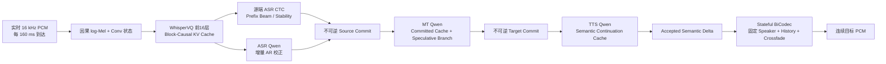
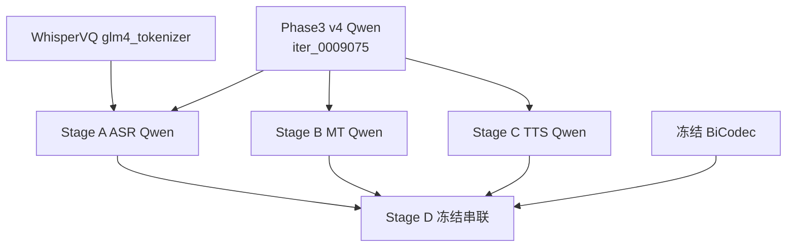

# UniSS Phase3 v4 质量优先真流式 ASR→增量 MT→分段 TTS 训练与推理计划

> 文档状态：可直接据此实现的工程与实验计划，尚未执行本计划中的新训练。
>
> 审计日期：2026-08-15。
>
> 实验范围：UniST 固定 `train-00000` 至 `train-00014`，只在对应 train/validation 上寻找可行方法；本轮不声称 full198、test、CVSS-T 或未见域泛化。
>
> 核心目标：先保证真流式条件下 ASR、翻译、分段 TTS 和连续 BiCodec 播放都正确，再优化首个 WRITE/PCM 延迟；不允许用整段离线 fallback、重复计算完整历史或强制 WRITE 冒充成功。

## 1. 执行结论

本计划不再把 ASR、翻译策略、目标 semantic 生成和停止决策压进一个高度耦合的联合目标。推荐从同一个 **canonical final/evaluated Phase3 v4 checkpoint** 分叉出三个相互隔离的专业模型：

1. **Stage A：真流式 ASR**——Chunk/Block-Causal WhisperVQ、源端 ASR CTC、增量 AR-ASR Qwen；
2. **Stage B：增量文本翻译**——只消费 Stage A 已不可逆提交的源文本，生成不可逆目标文本 delta；
3. **Stage C：连续分段 TTS**——只消费 Stage B 已不可逆提交的目标文本 delta，生成与真实目标音频严格对齐的 BiCodec semantic delta；
4. **Stage D：冻结串联评估**——A、B、C 不再反向传播，接入 stateful BiCodec，验证完整真流式 S2ST。

因此总计是 **3 次正式训练 + 1 次冻结集成评估**，不是把十几个历史版本继续串起来训练。三个 Qwen checkpoint 都从 Phase3 v4 的 canonical `iter_0009075` 单独初始化，Stage B 不继承 Stage A 的 optimizer，Stage C 也不继承 Stage B；这样可以避免文本翻译与 8192-way dense semantic 生成互相破坏。

最终运行链为：

```text
实时 PCM
  → 真增量 WhisperVQ 声学缓存
  → CTC/AR-ASR 稳定源文本
  → 增量 MT 稳定目标文本
  → 分段 TTS semantic delta
  → Stateful BiCodec
  → 连续 PCM
```

本计划第一版的成功定义是：输入只逐块到达、输出在源音频结束前开始、提交内容不回改、音频连续可播放、翻译和音色达到质量门。首 PCM 小于 1 秒是后续优化目标，不作为第一轮掩盖内容错误的硬门。

## 2. 为什么改用这一条路线

### 2.1 历史实验已经排除的误区

已有 wait-k、StreamSpeech/CTC、dense event rollout、runtime-parity 和多版 overfit/generalize 实验已经说明：

- 单样本可以学会自然 WRITE、文本、semantic 和 EOS，但不等于多样本可用；
- 训练长期使用 oracle action/text/semantic 历史，而推理把自己的早期错误写入 persistent KV，会形成严重 exposure mismatch；
- target NAR translation CTC 和 BiCodec unit CTC 可以下降，但并不保证 AR runtime 的文本、音频和停止行为正确；
- Whisper 表示、Qwen 内容、策略、TTS semantic、EOS 同时联合更新时，很难定位是哪一层破坏了 Phase3 质量；
- 仅增加 epoch、shuffle、WAIT/WRITE 权重或 GPU 吞吐，不能修复监督对象和部署状态机不一致。

本路线先把问题拆成三个可以独立验收的条件模型。只有上游通过，才允许下游开始；下游不能用自己的能力掩盖上游错误。

### 2.2 为什么仍然从 Phase3 v4 开始

Phase3 v4 已经具备最重要的离线能力先验：

- 源语音 GLM/BiCodec prompt 理解；
- ASR 和 S2TT 能力由 Phase1/Phase2 继承；
- 文本翻译与 TTS prompt grammar；
- 高质量目标文本和 BiCodec semantic 自回归生成；
- 说话人 global token 条件控制。

新训练要学习的是“局部可见输入、不可逆增量输出和跨片段连续状态”，而不是从头重新学习双语内容和语音生成。

### 2.3 为什么不用单个共享 Qwen 作为首版

Phase3 Qwen 只有约 0.5B，H200 可以容纳三个 BF16 副本。首版采用三个副本能得到更干净的因果诊断：

| 模型 | 输入 | 输出 | 主要风险 |
|---|---|---|---|
| ASR Qwen | causal WhisperVQ delta | 源文本 delta | 声学前端漂移、漏词 |
| MT Qwen | committed source text delta | target text delta | 幻觉、重复、回改 |
| TTS Qwen | committed target text delta + speaker state | semantic delta | 静音、音色漂移、semantic collapse |

如果一开始共享全部参数，某个 loss 改善时无法判断是否正在损坏另一个任务。等三个条件模型都通过后，才考虑蒸馏为共享 trunk；该蒸馏不属于本轮。

## 3. 已审计的权重、架构与离线质量锚点

### 3.1 权威 checkpoint

Megatron 原生权重是唯一训练权威：

```text
checkpoints/uniss_qwen0p5b_phase3_unist198_after_phase2_v4/iter_0009075
```

这里要区分“正式最终/已完整评估”和“单一 validation LM loss 最低”：`iter_0009000` 的 validation LM loss `3.809553`，略低于 `iter_0009075` 的 `3.809850`；但现有完整音频评估、报告和 demo 均以 `9075` 为基准。因此本计划固定使用 **canonical final/evaluated `9075`**，不把它误写成严格 validation-loss best。若未来要改用 `9000`，必须先在完全相同的 pilot15 baseline 上补齐端到端评估，并在任何新训练开始前一次性冻结 base manifest。

精确 HF 导出用于推理、teacher 和 compound trainer parity：

```text
checkpoints/exported_hf/qwen0p5b_phase3_unist198_iter_0009075_hf
```

Qwen2 配置：

| 项目 | 数值 |
|---|---:|
| layers | 24 |
| hidden size | 896 |
| attention heads | 14 |
| KV heads | 2 |
| FFN hidden | 4864 |
| logical tokenizer vocab | 180407 |
| padded embedding vocab | 180480（含 73 padding rows） |
| max positions | 32768 |
| dtype | BF16 |
| cache | `use_cache=true` |

任何新 run 都必须记录 native checkpoint SHA/iteration、HF 导出 manifest 和 native↔HF 输出 parity。不得仅凭文件名假设导出正确。

### 3.2 WhisperVQ 是独立配套模型

WhisperVQ 不在 Phase3 Megatron checkpoint 内。它必须独立加载：

```text
pretrained_models/UniSS/glm4_tokenizer
```

关键配置：

| 项目 | 数值/状态 |
|---|---|
| Whisper encoder layers | 配置为 32 层 |
| 实际量化前可用层 | 前 16 层，`pooling_position=quantize_position=16` |
| hidden size | 1280 |
| attention heads | 20 |
| 原始 encoder attention | 双向，`encoder_causal_attention=false` |
| convolution | causal 已开启 |
| codebook | 16384 |
| pooling kernel | 4 |
| max source positions | 1500 |

必须准确表述：新 Stage A 是“Phase3 v4 Qwen + 独立 WhisperVQ 权重”的 compound checkpoint，不是“Phase3 checkpoint 内包含 Whisper”。

### 3.3 Phase3 v4 训练几何

Phase3 v4 的正式配置是：

```text
8 × H200
TP=1, PP=1
seq-length=18000
micro-batch-size=2
global-batch-size=128
BF16 + Flash Attention + activation recompute
Adam beta1/beta2=0.9/0.95
weight decay=0.1
clip-grad=0.5
cosine decay
LR=1e-5, min LR=1e-6, warmup=200
dataloader-type=cyclic
--no-data-sharding
严格全局 shuffle
完整 validation
```

Phase3 的 `1,161,587` 个 packed train sample 对应 `9,075` iteration，约为一次完整 packed coverage。新计划沿用其并行和 pack 几何，但 iteration 必须根据本计划实际生成的 pack 数计算，不能复制 `9075`。

### 3.4 离线质量锚点

现有 full198 UniST dev Phase3 指标只作为“模型原始能力”背景，不可直接与新的 pilot15 validation 做胜负比较：

| Mode | 方向 | Text-BLEU | Speech-BLEU |
|---|---|---:|---:|
| Performance | ZH→EN | 33.3860 | 16.5154 |
| Performance | EN→ZH | 37.8105 | 35.9432 |
| Quality | ZH→EN | 40.4631 | 21.3884 |
| Quality | EN→ZH | 44.8822 | 42.8128 |

正式判断质量保持率时，必须先在同一 pilot15 validation 上重跑 Phase3 offline baseline，再与新模型比较。

## 4. 真流式系统架构



### 4.1 checkpoint 继承关系



每个箭头表示加载模型参数，不表示加载前一个新阶段的 optimizer。三个训练目录必须完全独立。

### 4.2 本计划对“真流式”的硬定义

只有同时满足以下条件才允许标记为 true streaming：

1. evaluator 每次只把当前新增 PCM block 交给系统，模型看不到未来 PCM；
2. log-Mel、卷积和 Whisper attention 都只增量计算，不能每 tick 重算句首至当前；
3. 已提交的源文本、目标文本、semantic 和 PCM 都不可回改；
4. 新输出通过真实 stateful BiCodec 播放，不是事后整段解码再切片；
5. 源音频结束前至少产生一个内容正确、非静音的目标音频片段；
6. 禁止 offline fallback、forced WRITE、预先读取完整音频或用 reference text 替换真实 ASR；
7. 缓存与无缓存的同因果计算在 token/decision 上等价。

达到这些条件但首 PCM 为 1.5 秒，仍是真流式但低延迟尚未达标；整句结束后才播放，即使处理很快，也不是 simultaneous 输出。

## 5. 缓存设计：需要，而且不能只打开 `use_cache`

### 5.1 需要维护的状态

一个会话至少有六类状态：

1. PCM/STFT 左上下文；
2. Whisper causal convolution 左状态；
3. WhisperVQ 前 16 层逐层 projected K/V；
4. ASR、MT、TTS 三个独立 Qwen DynamicCache；
5. 已 committed 的源文本、目标文本和 semantic ledger；
6. BiCodec semantic history、pending tail 和固定 32 个 speaker tokens。

Qwen 的 `use_cache=true` 只解决 decoder KV；它不会自动让原始双向 Whisper encoder 变成流式，也不会自动保证 candidate reject 后主 cache 不被污染。

### 5.2 当前已有可复用实现

训练侧现有实现：

```text
training/phase3_whisper_streamspeech_joint/whisper_frontend.py
training/phase3_whisper_streamspeech_joint/whisper_multichunk.py
```

它在整段 forward 中应用 chunk-causal mask，但不会复用历史 attention 计算。

项目已有更接近部署需求的隔离原型：

```text
experiments/uniss_phase3_runtime_parity_streaming_v2/frontend/cached_whispervq.py
experiments/uniss_phase3_runtime_parity_streaming_v2/frontend/audio_cached_frontend.py
```

该原型已经实现：

- 160 ms PCM block；
- `center=False` 的 causal STFT；
- PCM、mel、conv 左状态；
- WhisperVQ 前 16 层 block-causal K/V；
- 每 160 ms 输出 2 个 80 ms GLM token；
- full block-mask 与 cached encoder 的基础 parity 测试。

它目前是 inference-only、只支持 `right_context=0`，且绝对位置超过 Whisper 上限会报错。计划应复用其逻辑并改造成训练/部署共享 frontend，而不是重新写第三套不一致实现。

### 5.3 当前必须先修复的 frontend mismatch

现有 compound 训练 frontend 与缓存部署 frontend 存在两个真实差异：

| 项目 | 现有训练路径 | cached 部署原型 |
|---|---|---|
| STFT | 默认 `center=True` | `center=False` |
| log-Mel 归一化 | 整条 utterance 的全局最大值 | 只依赖已到达 block 的局部归一化 |

这会导致同一 PCM 在训练和部署时产生不同 hidden/GLM token。**Stage A 数据准备和训练在 frontend parity 通过前不得开始。**

推荐把 causal PCM frontend 抽成唯一共享模块；离线训练也逐块调用相同实现，或者构造与其严格等价的 full block reference。不得训练一种 frontend、部署另一种 frontend。

### 5.4 160 ms、80 ms right context 与首版选择

已有 exact cache 原型只支持 `right_context=0`。因此实现顺序为：

1. 首先用 `160 ms block + 0 ms right context` 建立严格 cached/full parity；
2. 如果内容质量明显不足，再增加固定 `80 ms lookahead`；
3. 增加 right context 时，必须 hold 住当前 block，直到 lookahead 到达后才提交；不能提前输出后再修订；
4. 训练 mask、缓存位置、commit timestamp 和 evaluator 必须使用同一配置。

计划中的 multi-chunk curriculum 可以包含 320/640/960/1280 ms block；最终 deployment block 以 parity 已通过的 160 ms 配置为准。

### 5.5 Whisper 长音频状态

Whisper 绝对位置上限约对应 30 秒声学段。第一版采用：

- 在 VAD 静音或稳定从句边界重置 acoustic cache；
- 单个声学 cache epoch 最长控制在 25–30 秒；
- 重置 Whisper 时，已经提交的源/目标文本状态不回退；
- MT/TTS 可以保留文本摘要或开始新的 Qwen cache epoch；
- 同一会话的 speaker tokens 保持不变。

这仍然是真流式，因为任何时刻都没有使用未来 PCM。长期方案才是 bounded acoustic cache、位置重映射或相对位置编码，不应在首版同时引入。

### 5.6 Qwen preview/commit 分支

候选生成不能直接污染 persistent main cache。每次生成遵循：

```text
main committed cache
  └─ fork speculative branch
       ├─ reject → 丢弃 branch，main 长度/hash 完全不变
       └─ accept → 将很短的 accepted delta 在 main 上重放一次
```

正确性 smoke 可使用 `DynamicCache` deep copy；正式服务改成 copy-on-write，或“branch 生成、接受后 delta replay”。现有 `stage10_cached_micro_write/adapter.py` 会把 WRITE 和候选 token 直接写入 main cache，只能复用基础 forward/cache-length 逻辑，不能原样用于可拒绝候选。

当前 Qwen2 + FlashAttention2 路径默认使用 DynamicCache。StaticCache 只有在实模型 parity 通过后才允许开启。

## 6. 数据边界、隔离目录与全局 shuffle

### 6.1 本轮数据范围

固定使用：

```text
data/processed/phase1_unist198_sharded/train-00000.jsonl
...
data/processed/phase1_unist198_sharded/train-00014.jsonl
```

这些文件是现有 task sample；Stage A/C 还需要回溯到其源 manifest、音频和 timestamp/alignment artifact。禁止仅从 packed token 序列按文本长度猜测音频时间。

本轮约束：

- train：只来自 shard 00000–00014 的 train records；
- validation：固定、不可变、双向平衡，样本 ID 在首次生成后冻结；
- 不使用 test、CVSS-T 和 full198；
- 可以在 train/validation 上证明方法工作，但报告必须明确“不证明泛化性”。

### 6.2 新实验目录

```text
experiments/uniss_phase3_v4_quality_first_true_streaming_pilot15_v1/
  README.md
  experiment.env
  stage00_baseline/
  stage_a_causal_whisper_asr/
  stage_b_incremental_mt/
  stage_c_segment_tts/
  stage_d_runtime/
  evaluation/
  scripts/
  tests/
```

对应 artifact 必须独立：

```text
data/processed/uniss_phase3_v4_quality_first_true_streaming_pilot15_v1/
data/megatron/uniss_phase3_v4_quality_first_true_streaming_pilot15_v1/
checkpoints/uniss_phase3_v4_quality_first_true_streaming_pilot15_v1/
runs/uniss_phase3_v4_quality_first_true_streaming_pilot15_v1/
logs/uniss_phase3_v4_quality_first_true_streaming_pilot15_v1/
reports/uniss_phase3_v4_quality_first_true_streaming_pilot15_v1/
```

脚本若发现输出目录已存在且没有相同 run manifest，必须拒绝启动；不能覆盖历史实验。

环境、模型缓存、编译缓存、pip 缓存和临时大文件也必须落在：

```text
/opt/dlami/nvme/jasonleeeli/
```

或其子目录。优先复用现有 UniSS 训练环境，不在系统盘或其他用户目录新建 Conda/venv。

### 6.3 严格全局 shuffle

每个阶段先生成稳定 `pack_id` 和 `.count`，再使用：

```text
--dataloader-type cyclic
--no-data-sharding
固定 global shuffle seed
```

规则：

- shuffle 单位是完整 pack/event session，不允许打乱 session 内事件顺序；
- 所有 data-parallel rank 共享同一个全局 permutation，再按 rank 取样；
- resume 必须恢复 optimizer、RNG、sampler consumed count；
- fresh fine-tune 从 Phase3 加载时不加载 Phase3 optimizer/RNG；
- 每个 epoch 写出首尾 pack ID、全局 permutation hash 和各 rank 无重复/无遗漏审计。

## 7. 公共数据 schema 与质量审计

每个原始样本至少包含：

```json
{
  "schema_version": "quality_first_streaming_pilot15_v1",
  "sample_id": "...",
  "source_manifest": "...",
  "source_index": 0,
  "split": "train",
  "src_lang": "eng",
  "tgt_lang": "cmn",
  "source_audio": "...",
  "sample_rate": 16000,
  "source_duration_ms": 4380,
  "source_text": "Good morning, everyone.",
  "translation": "大家早上好。",
  "source_words": [
    {"text": "Good", "start_ms": 120, "end_ms": 430}
  ],
  "target_words": [
    {"text": "大家", "start_ms": 160, "end_ms": 520}
  ],
  "bicodec_global": [0, 1, 2],
  "target_bicodec": [123, 456, 789],
  "target_duration_ms": 4020,
  "alignment_kind": "provided_or_forced",
  "alignment_score": 0.97
}
```

实际 `bicodec_global` 必须严格为 32 个 token；示例为节省篇幅而缩短。

数据 gate：

- 音频必须可解码、16 kHz 或有确定的重采样记录；
- transcript、translation、source/target semantic 均非空；
- word timestamp 单调、不越界；
- target semantic 数量与目标音频时长在 50 Hz 附近一致；
- source/target 文本 normalization 前后均保留；
- 记录音频、文本、semantic、alignment 的 SHA256；
- 所有过滤原因按 shard、方向和语言统计，不能静默丢样本。

## 8. Stage 00：Phase3 与 frontend 基线审计

Stage 00 不训练，但它是后续所有结果可解释的前提。

### 8.1 必做检查

1. native Phase3 `iter_0009075` 与 HF 导出在固定 prompt 上 top-1 token 完全一致；
2. 重新构造 pilot15 matching validation 的 offline ASR、MT、TTS、Phase3 S2ST 基线；
3. 对真实 WhisperVQ checkpoint 和真实 PCM 做 full block-causal vs cached parity；
4. 统一训练/部署 STFT、归一化、conv state、position offset；
5. 验证真实 BiCodec one-shot 与不同 semantic push 分块的音频边界行为；
6. 固定 validation ID、speaker token、方向比例和随机 seed；
7. 建立所有后续 checkpoint 的统一 evaluator 和报告 schema。

### 8.2 Stage 00 硬门

| 检查 | 通过条件 |
|---|---|
| Whisper real-PCM future perturbation | 修改第 k block 后的 PCM，第 k block 前 hidden/GLM 不变 |
| Whisper cached/full token parity | GLM token ID 100% 相同 |
| Whisper hidden parity | FP32 参考 `rtol<=2e-5, atol<=2e-6`；BF16 单列容差 |
| Qwen cached/full parity | top-1 100%，BF16 logits cosine `>=0.9999` |
| BiCodec coverage | semantic 零 gap、零 overlap、总采样数一致 |
| Phase3 export | native/HF 固定样本输出一致 |

若 frontend parity 未通过，后续训练全部停止；不能先训练再寄希望于部署补偿。

## 9. Stage A：Chunk-Causal WhisperVQ + 增量 ASR

### 9.1 Motivation

Stage A 只回答一个问题：当 PCM 逐块到达且声学 encoder 看不到未来时，能否稳定地产生正确的源文本增量。

此前 target NAR translation CTC 或 BiCodec unit CTC 失败，不等于 source ASR CTC 不适用。源 ASR CTC 的输入和标签天然单调：语音时间从左到右，对应源语言 token 从左到右；它在本计划中负责帧级对齐、prefix stability 和提交触发，最终内容仍由 AR-ASR 路径保护。

### 9.2 Stage A 数据

每条训练记录由原始音频、源文本、source word timestamp 和共享 causal frontend 生成：

```json
{
  "sample_id": "NCSSD_R_EN_0000000000",
  "source_audio": "...",
  "src_lang": "eng",
  "asr_speaker_condition": "fixed_neutral_or_prefix_enrolled_only",
  "frontend_config": {
    "block_ms": 160,
    "encoder_frame_ms": 20,
    "right_context_ms": 0,
    "stft_center": false,
    "token_hop_ms": 80,
    "normalization": "shared_causal_v1"
  },
  "chunks": [
    {
      "tick_index": 0,
      "pcm_start_sample": 0,
      "pcm_end_sample": 2560,
      "source_end_ms": 160,
      "glm_start": 0,
      "glm_end": 2,
      "transcript_delta": "",
      "is_final": false
    },
    {
      "tick_index": 3,
      "pcm_start_sample": 7680,
      "pcm_end_sample": 10240,
      "source_end_ms": 640,
      "glm_start": 6,
      "glm_end": 8,
      "transcript_delta": "Good",
      "is_final": false
    }
  ],
  "full_transcript": "Good morning, everyone.",
  "ctc_target_ids": [1234, 5678],
  "offline_teacher_checkpoint": "phase3_v4_iter_0009075"
}
```

空白 tick 不必全部变成独立 packed sample。可以按以下规则把事件合并：

- 至少一个完整 source word 结束时建立一次监督事件；
- 超过 1280 ms 仍无完整词时强制建立 empty-delta 事件；
- 最后一个事件必须覆盖完整源音频和完整 transcript；
- 所有事件拼接后的 GLM span 必须从 0 连续覆盖到最后，无 gap、无 overlap；
- transcript delta 拼接后必须严格还原 normalization 后的完整 source text。

Stage A sampler 建议：

| 样本类型 | 比例 | 作用 |
|---|---:|---|
| streaming ASR event | 60% | 学习增量可见性与不可逆 delta |
| full causal standalone ASR replay | 20% | 保护长上下文内容完整性 |
| standalone offline ASR task replay | 15% | 保护 Phase1 ASR grammar 和完整句能力 |
| exact Phase3 v4 Quality/Performance replay | 5% | 保护原始 S2ST prompt grammar |

### 9.3 Stage A 模型改造

Whisper 不替换为 Emformer 或 Zipformer，仍使用 Phase3 配套 WhisperVQ：

1. 把训练 frontend 统一成共享 causal PCM frontend；
2. 前 16 层使用 block-causal attention；
3. 保留原始绝对位置 embedding，但显式维护 frame offset；
4. codebook、EMA、pooling、post-VQ 路径冻结；
5. pre-VQ hidden 接一个源 ASR CTC head；
6. quantized GLM/continuous bridge 进入 Phase3 ASR Qwen；
7. Qwen 使用增量 event grammar 生成 transcript delta，而不是预测独立 WAIT/WRITE policy。

CTC 不直接投影到 180407 个逻辑 Qwen token。复用现有 `training/phase3_whisper_streamspeech_joint/tokenizer_maps.py` 思路，为 ENG/CMN 分别构造 deterministic compact CTC vocabulary，再把 compact ID 映射回 Qwen ID。map 只能由 train target 或与标签无关的固定 tokenizer inventory 构造；validation OOV 必须显式统计。若 OOV 非零，训练前选择 byte/character fallback 或新增受审计的 UNK class，禁止静默丢 token。

推荐 event grammar 复用现有 UniSS special token，避免扩 vocab：

```text
TASK_ASR, language, fixed_neutral_or_prefix_enrolled_speaker,
START_GLM, glm_delta_1, END_GLM,
WRITE_GENERATE, language, START_CONTENT, transcript_delta_1, END_CONTENT,
START_GLM, glm_delta_2, END_GLM,
WRITE_GENERATE, language, START_CONTENT, transcript_delta_2, END_CONTENT,
...
EOS
```

模型不需要决定何时 READ。系统按固定音频 block 读取；CTC stability 或 word boundary 决定何时请求 AR-ASR delta。这样先把“内容正确”与“策略学习”分开。

这里还有一个容易忽略的未来泄漏：现有 `bicodec_global` 往往由完整 source audio 提取。如果把它直接放入最早的 ASR prompt，声学 attention 即使严格 causal，系统仍然提前使用了未来语音。Stage A 默认使用固定 neutral speaker 条件；如需 speaker-aware ASR，只允许使用会话开始前已注册的 enrollment，或仅由已到达 PCM 递推得到并在首次 commit 前冻结的 causal speaker state。Stage 00 future-perturbation 必须覆盖 speaker 分支。

### 9.4 可训练参数与学习率

Stage A 必须采用 Megatron 训练生命周期、optimizer、DDP、checkpointing 和 sampler。现有 `training/phase3_whisper_streamspeech_joint/pretrain_joint_megatron.py` 可复用数据、loss 和参数组设计，但它内部通过 HF `AutoModelForCausalLM` 构造 Qwen，并不是 `training/pretrain_uniss_megatron.py` 使用的原生 Megatron GPTModel。为满足“与 Phase3 一样基于 Megatron”的要求，新 Stage A 正式入口应使用 native Megatron Qwen model provider，直接加载 native `iter_0009075`；HF 导出只用于 teacher/parity，不能成为正式训练权威。

建议以 `base LR=1e-4` 建立参数组，实际有效 LR 如下：

| 参数组 | 初始化 | 是否训练 | 建议 max LR | 说明 |
|---|---|---:|---:|---|
| ASR CTC head | 新增 | 是 | `1e-4` | 新分类器 |
| continuous/GLM bridge | 现有或新增 | 是 | `5e-5` | 吸收 causal/offline 表示差异 |
| Whisper pre-VQ layers 8–15 | WhisperVQ | 是 | `1e-6` | 先解冻顶部 8 层 |
| Whisper pre-VQ layers 0–7 | WhisperVQ | 后期开启 | `2e-7` | parity/teacher gate 稳定后扩到 16 层 |
| Whisper conv | WhisperVQ | 可选低 LR | `1e-7` | 只在 frontend 对齐后开启 |
| Whisper pooling/codebook/EMA | WhisperVQ | 否 | `0` | 禁止 code identity 漂移 |
| Whisper post-VQ | WhisperVQ | 否 | `0` | 当前 runtime 不使用该路径 |
| Qwen 24 transformer layers | Phase3 v4 | 是 | `2e-6` | 保守全参 SFT，不把 LoRA 作为默认方案 |
| tied embedding/lm_head | Phase3 v4 | 是 | `5e-7` | 极低 LR 保护 token geometry |

权重衰减对 norm、bias、新 CTC bias 设为 0；其他可训练矩阵沿用 `0.1`。如 gradient norm 持续异常，先降低新 head/bridge LR，不允许靠重新冻结全部内容路径掩盖问题。

内部解冻 schedule：

- 前 5% update：只训新 head/bridge，Qwen 暂时冻结；
- 5%–30%：开启 Qwen 全层低 LR + Whisper 顶部 8 层；
- 30%–100%：若 teacher/cached parity 未恶化，扩展到全部 16 个 pre-VQ 层；
- codebook、EMA、post-VQ 全程冻结。

这是一次连续训练中的 optimizer param-group schedule，不是重新初始化三个 Stage A checkpoint。

### 9.5 Stage A loss

主 loss：

\[
\mathcal{L}_A =
1.00\mathcal{L}_{AR\text{-}ASR}
+0.30\mathcal{L}_{source\text{-}CTC}
+0.20\mathcal{L}_{offline\text{-}teacher\text{-}KL}
+0.10\mathcal{L}_{hidden\text{-}chunk\text{-}consistency}
+0.10\mathcal{L}_{cache/full\text{-}consistency}.
\]

各项含义：

| loss | 含义 |
|---|---|
| `AR-ASR CE` | 对增量 transcript delta 和完整 transcript 做自回归交叉熵 |
| `source CTC` | 从 causal pre-VQ hidden 到源文本 token 的单调对齐 |
| `offline teacher KL` | causal student 的文本 posterior 接近冻结 Phase3 teacher，但只蒸馏当前 prefix 已支持的 token |
| `hidden/chunk consistency` | 不同 chunk 大小在共同可见、已稳定的中心区域 hidden 接近 |
| `cache/full consistency` | cached 执行与同一 block-causal full reference 的 logits/hidden 一致 |

teacher 不得在早期 prefix 上看完整音频后蒸馏未来转写；允许的是 same-prefix teacher，或 full teacher 中被 alignment/LCP 证明已由当前音频支持的 token mask。standalone ASR replay 与 exact Phase3 Quality/Performance replay 都使用各自原始 CE，不强行套 CTC。所有 loss 必须分别记录 numerator、denominator 和有效 token 数，禁止因 blank/短样本造成“平均 loss 看似下降”。

### 9.6 Multi-chunk curriculum

所有阶段都保留上述 loss；curriculum 只改变 block 分布和可训练层，不会丢弃旧 loss：

| coverage 进度 | block 分布 | 目的 |
|---|---|---|
| 0%–10% | 1280 ms | 先恢复 causal 内容能力 |
| 10%–30% | 1280/960 ms | 减少上下文 |
| 30%–60% | 960/640 ms | 训练中等 chunk |
| 60%–85% | 640/320 ms | 接近在线行为 |
| 85%–100% | 320/160 ms | 匹配最终部署 |

每个样本的 chunk 选择由 `seed + sample_id + coverage_epoch` 决定，所有 rank 可复现。最终 20% update 必须以 deployment chunk 为主，否则 validation 不能代表部署。

### 9.7 Stage A 训练几何

```text
framework          = Megatron 单机 8×H200
TP / PP            = 1 / 1
sequence length    = 18000
micro batch        = 1（Whisper+Qwen compound）
global batch       = 128
gradient accum     = 16 microsteps/rank-equivalent global update
precision          = BF16
clip grad          = 0.5
optimizer          = AdamW, betas 0.9/0.95
schedule           = cosine
primary coverage   = 3 epochs
validation         = full fixed validation
```

如果 MBS=2 能在真实 peak memory 下稳定通过，可提高到 2；不能为了显存占用强行增加 padding 或改变样本语义。GPU 满载通过 pack、prefetch、异步 CPU 解码和减少 Python dispatch 实现，不运行与训练无关的 synthetic load。

Stage A checkpoint 是一个原子 compound bundle，至少包含：native Megatron Qwen shards、WhisperVQ 可训练层、bridge、CTC heads、compact maps、optimizer/RNG/sampler state 和 manifest。保存或 resume 时缺少任一组件都必须失败，防止只恢复 Qwen 却把 Whisper/CTC 重置。

### 9.8 Stage A 验证与通过门

| 指标 | 第一轮通过门 |
|---|---|
| cached/full GLM token parity | 约 100%，任何系统性差异均阻塞 |
| future perturbation | 未来 PCM 变化不能改变过去提交 |
| committed rollback | 0 |
| final WER/CER | 相对 matching offline Phase3 ASR 退化不超过 15% |
| pre-final source commit | 长样本在 source EOS 前有正确 commit |
| all-blank/final-only collapse | 0 |
| cache growth | 与已到达 frame/token 线性一致，无完整历史重算 |

还要分别报告：CTC-only、AR-only、CTC+AR；gold segmentation 与真实 VAD；160/320/640/1280 ms。Stage A 只选同时满足内容和 causality 的 checkpoint，不按最低 train loss 选。

## 10. Stage B：只基于 committed source text 的增量 MT

### 10.1 Motivation

Stage B 不再从不稳定 GLM agreement 猜翻译。它只接收 Stage A 已不可逆提交的源文本，因此可以把问题缩成“有噪声、逐步增长的文本前缀如何生成不可逆翻译 delta”。

Stage B 从 Phase3 v4 单独初始化；Whisper、Stage A Qwen、BiCodec 均不参与反向传播。

### 10.2 增量翻译监督如何构造

本计划不要求人工标注 WAIT/WRITE action，但需要构造 **incremental prefix supervision**。它不是一个独立策略标签集，而是由已有双语文本、时间戳和 teacher 自动派生：

1. 按 Stage A 的 source commit 序列得到 `source_delta_1...n`；
2. 使用 source↔target word alignment 建立单调安全前缀；
3. 对非单调语序，只有当目标词的全部源依赖已可见时才允许提交；
4. 用冻结 Phase3 full-MT teacher 对相邻 source prefix 生成候选；
5. 取连续 2–3 个 prefix candidate 的 longest common prefix 作为稳定 target prefix；
6. 强制 `target_prefix_t` 以前一 target prefix 为前缀，禁止回改；
7. 最后一步使用完整人工 translation 收尾，确保所有目标 token 被覆盖。

这会产生 target delta，但不让模型独立学习 WAIT/WRITE policy。没有新稳定翻译时，delta 为空；系统继续读取下一次 source commit。

示例：

```json
{
  "sample_id": "...",
  "input_variant": "stage_a_asr",
  "events": [
    {
      "event_index": 0,
      "source_commit_ms": 640,
      "source_delta_text": "Good morning",
      "committed_source_text": "Good morning",
      "previous_target_text": "",
      "target_delta_text": "早上好",
      "alignment_confidence": 0.96
    },
    {
      "event_index": 1,
      "source_commit_ms": 1440,
      "source_delta_text": "everyone",
      "committed_source_text": "Good morning everyone",
      "previous_target_text": "早上好",
      "target_delta_text": "，大家",
      "alignment_confidence": 0.93
    }
  ],
  "full_target_text": "早上好，大家。"
}
```

### 10.3 Stage B 数据混合

| 输入类型 | 比例 | 目的 |
|---|---:|---|
| gold source prefix | 40% | 学习理想增量翻译上限 |
| Stage A 实际 ASR/noisy prefix | 40% | 匹配部署错误分布 |
| full MT / replay pool | 20% | 其中建议 15% standalone full-MT、5% exact Phase3 Quality/Performance replay |

Stage A noisy prefix 必须由固定的 selected Stage A checkpoint 离线生成并带 provenance；不能每个 epoch 在线变化，否则训练集无法复现。

### 10.4 增量 grammar 与 KV cache

推荐复用现有内容/语言边界 token 构成 append-only transcript。`WAIT_READ` 在这里是 runtime 写入的确定性事件分隔符，不是模型要学习的策略 action：

```text
TASK_T2T_TRANSLATION, target_language,
WAIT_READ, source_language, START_CONTENT, source_delta_1, END_CONTENT,
WRITE_GENERATE, target_language, START_CONTENT, target_delta_1, END_CONTENT,
WAIT_READ, source_language, START_CONTENT, source_delta_2, END_CONTENT,
WRITE_GENERATE, target_language, START_CONTENT, target_delta_2, END_CONTENT,
WAIT_READ, source_language, START_CONTENT, END_CONTENT,
WRITE_GENERATE, target_language, START_CONTENT, final_target_delta, END_CONTENT,
...
EOS
```

空的 target delta 显式编码为 `START_CONTENT, END_CONTENT`；空的 source delta 只允许作为“source 已结束”的 final marker。训练时把完整 event transcript 放在一个 packed causal sequence 中；推理时按完全相同顺序追加到 Qwen DynamicCache。这样 full forward 与 cached forward 的位置、边界和历史完全一致。

候选 target delta 先在 speculative branch 生成。通过结构、重复、语言和稳定性检查后，把 accepted token delta 重放到 main cache；拒绝分支不得改变主状态。

### 10.5 Stage B 可训练参数

| 参数组 | 初始化 | 是否训练 | 建议 max LR |
|---|---|---:|---:|
| Qwen 24 transformer layers | Phase3 v4 | 是 | `5e-6` |
| tied embedding/lm_head | Phase3 v4 | 是 | `1e-6` |
| 可选 boundary confidence head | 新增 | 是 | `5e-5` |
| Whisper / ASR CTC | Stage A | 否 | `0` |
| BiCodec | 预训练 | 否 | `0` |

默认是全参保守 SFT，不使用 LoRA 作为唯一训练路径。fresh run 使用 `FINETUNE=1, LOAD_OPTIM=0, LOAD_RNG=0` 从 Phase3 v4 初始化。

### 10.6 Stage B loss

\[
\mathcal{L}_B =
1.00\mathcal{L}_{target\text{-}delta\text{-}CE}
+0.50\mathcal{L}_{full\text{-}MT\text{-}replay}
+0.25\mathcal{L}_{offline\text{-}teacher\text{-}KL}
+0.20\mathcal{L}_{adjacent\text{-}prefix\text{-}consistency}
+0.10\mathcal{L}_{boundary/EOS}.
\]

| loss | 含义 |
|---|---|
| target-delta CE | 只在当前应该新增的目标 token 上计算 |
| full MT replay | 完整源句到完整译文，保护内容上限 |
| teacher KL | 增量 posterior 接近冻结 teacher 的 same-source-prefix posterior |
| adjacent-prefix consistency | 相邻 source prefix 的已提交 target posterior 不发生翻转 |
| boundary/EOS | 学习 fragment 结束和最终完成，避免无限重复或过早 EOS |

teacher KL 也只能计算在当前 source prefix 已支持的 target delta mask 上。禁止对尚不可安全提交的未来 target token 计算普通 CE/KL，否则模型会被训练成提前幻觉。

### 10.7 Stage B curriculum

Stage B 仍是一个连续 run：

- 0%–10%：80% gold prefix、20% full replay；
- 10%–40%：gold/noisy/replay = 60/20/20；
- 40%–100%：固定为 40/40/20；
- 最后 20% 增加长 prefix、ASR 删除/替换错误和标点缺失样本。

所有 loss 始终存在，仅改变输入噪声比例。

### 10.8 Stage B 训练与验证

Stage B 使用 native Megatron GPTModel 和原生 `iter_0009075` 初始化。训练几何沿用 Phase3 v4：`seq=18000, MBS=2, GBS=128, 8×H200, BF16, TP=PP=1`。建议完成 2 个 incremental-MT primary coverage epoch。

必须分开报告四条链：

1. gold full source → offline Phase3 MT；
2. gold source commits → Stage B incremental MT；
3. Stage A ASR commits → Stage B incremental MT；
4. Stage A 最终 transcript → full-MT replay path。

通过门：

| 指标 | 第一轮门 |
|---|---|
| committed target rollback | 0 |
| gold transcript Text-BLEU/chrF | 接近 matching Phase3 baseline，保留率目标 `>=95%` |
| Stage A transcript 结果 | 单独报告，不与 gold 混合 |
| final target coverage | 参考译文有效 token 覆盖高，无系统性欠译 |
| hallucination/repetition | 无批量通用短词、循环或跨语言污染 |
| cached/full parity | top-1 100%，canonical transcript/cache length 一致 |

COMET 可作为语义辅助，但 checkpoint 不能只按 COMET 选；必须同时满足 rollback、完整性和语言正确率。

## 11. Stage C：真实对齐的分段 TTS continuation

### 11.1 Motivation

Stage C 只回答：给定已经 committed 的目标文本短语和固定 speaker 条件，能否生成对应、连续、可播放的目标 semantic delta。

此前 streaming 音频监督失败的核心原因之一，是 text delta 与 semantic span 不是真实对应：按文字长度比例切 semantic 会把一个词的声学 token 分到错误片段，平均每句真正受到监督的目标音频又很短。Stage C 必须先解决对齐，再谈 loss 和训练轮数。

Stage C 使用独立 Phase3 v4 Qwen 副本。Whisper、ASR、MT 和 BiCodec 参数不参与训练。

### 11.2 必须是真实 text↔audio↔semantic 对齐

优先级：

1. 使用已有可靠 `target_words[start_ms,end_ms]`；
2. 若缺失，先把完整 `target_bicodec` 解码为 target WAV；
3. 对 target translation 与 target WAV 做 language-specific forced alignment；
4. alignment coverage、置信度、单调性不达门的样本剔除或只用于 full-TTS replay；
5. 禁止按字符数、token 数或源/目标时长比例粗切 semantic。

50 Hz semantic span 由目标音频边界计算：

\[
s_i=\left\lfloor 50\cdot t^{start}_i/1000\right\rfloor,
\quad
e_i=\left\lceil 50\cdot t^{end}_i/1000\right\rceil.
\]

相邻 fragment 的边界必须统一修整，使：

```text
semantic_start[0] = 0
semantic_end[i] = semantic_start[i+1]
semantic_end[last] = len(target_bicodec)
gap = 0
overlap = 0
```

文本 fragment 拼接后也必须还原完整 translation。只有同时满足文本完整覆盖和 semantic 完整覆盖的 session 才能进入 primary Stage C 数据。

### 11.3 fragment 设计

第一轮建议：

- 4–20 个目标文本 token；
- 0.8–3.0 秒目标音频；
- 优先在标点、从句、停顿和 forced-alignment word boundary 截断；
- 不在一个词内部截断；
- 过长词组可以延后到下一个 fragment，不用强行满足固定时钟；
- 前一个 semantic tail 保留 50 token（约 1 秒）作为 codec/TTS continuation context。

示例：

```json
{
  "sample_id": "...",
  "speaker_global": [32, "pre_enrolled_or_fixed_tokens"],
  "target_text": "大家早上好。今天我们讨论流式翻译。",
  "fragments": [
    {
      "fragment_index": 0,
      "text_delta": "大家早上好。",
      "target_word_start": 0,
      "target_word_end": 3,
      "target_audio_start_ms": 0,
      "target_audio_end_ms": 1320,
      "semantic_start": 0,
      "semantic_end": 66,
      "semantic_delta": [123, 456],
      "previous_semantic_tail": [],
      "clause_boundary": true,
      "is_final": false,
      "alignment_score": 0.96
    }
  ],
  "semantic_rate_hz": 50
}
```

示例的 semantic 列表同样为节省篇幅而缩短，实际长度必须等于 `semantic_end-semantic_start`。

### 11.4 必须显式训练 interleaved TTS grammar

标准 Phase3 TTS grammar 是“完整文本在前，完整 semantic 在后”。如果推理时先生成 semantic_1，之后又把新 text_2 追加到同一个 cache，分布已经改变；不能声称原始 Phase3 TTS cache 会自动支持这种交替。

因此 Stage C 必须训练明确的 append-only interleaved grammar：

```text
TASK_TTS, target_language, speaker_global,
WAIT_READ, target_language, START_CONTENT, text_delta_1, END_CONTENT,
WRITE_GENERATE, target_language, START_SEMANTIC, semantic_delta_1, END_SEMANTIC,
WAIT_READ, target_language, START_CONTENT, text_delta_2, END_CONTENT,
WRITE_GENERATE, target_language, START_SEMANTIC, semantic_delta_2, END_SEMANTIC,
WAIT_READ, target_language, START_CONTENT, END_CONTENT,
...
EOS
```

训练和推理的 canonical transcript 必须逐 token 相同。若 interleaved grammar 尚未通过，首版只能采用 phrase-local bounded prompt 重算 + persistent semantic/BiCodec state，并在报告中准确标记；不能将其称为 TTS Qwen persistent-cache parity 已完成。

### 11.5 Stage C 数据混合

| 样本类型 | 比例 | 作用 |
|---|---:|---|
| aligned interleaved fragment TTS | 60% | 学习连续 semantic delta |
| standalone full target-side TTS replay | 20% | 保护完整文本到完整语音能力 |
| exact Phase3 v4 Quality/Performance replay | 20% | 保护原始 S2ST 目标语音和 prompt grammar |

full target-side TTS replay 使用 target translation、target_bicodec 和本轮选定的 fixed/pre-enrolled speaker 条件重新构造；不能误用 source transcript/source_bicodec 代替目标侧监督。

严格真流式模式也不能直接使用“由完整 source audio 提取”的 speaker global。首版二选一并分别报告：

- **固定目标音色模式**：训练和推理使用同一组预先固定的 neutral speaker tokens，最容易验证无未来泄漏和音色一致；
- **预注册音色模式**：speaker enrollment clip 在会话开始前已提供，或先消费固定 1–2 秒 source prefix 后冻结 speaker tokens，再允许第一段目标音频输出。

未来才考虑在线更新 speaker representation；一旦已经播放目标 PCM，speaker token 不能继续变化，否则会导致跨片段音色跳变。

### 11.6 Stage C 可训练参数

| 参数组 | 初始化 | 是否训练 | 建议 max LR |
|---|---|---:|---:|
| Qwen 24 transformer layers | Phase3 v4 | 是 | `3e-6` |
| tied embedding/lm_head | Phase3 v4 | 是 | `5e-7` |
| 可选 duration/length head | 新增 | 是 | `5e-5` |
| speaker global token values | 数据输入 | 不是参数 | `0` |
| Whisper / MT | 其他阶段 | 否 | `0` |
| BiCodec tokenizer/decoder | 预训练 | 完全冻结 | `0` |

Stage C 不默认改成 NAR Unit CTC。保留 Phase3 已证明质量更好的 autoregressive semantic 生成；duration head 只提供长度辅助，不能取代 semantic content CE。

### 11.7 Stage C loss

\[
\mathcal{L}_C =
1.00\mathcal{L}_{semantic\text{-}delta\text{-}AR}
+0.50\mathcal{L}_{full\text{-}TTS/Phase3\text{-}replay}
+0.20\mathcal{L}_{offline\text{-}teacher\text{-}KL}
+0.10\mathcal{L}_{boundary/EOS}
+0.05\mathcal{L}_{duration/length}.
\]

| loss | 含义 |
|---|---|
| semantic-delta AR CE | 当前真实对齐 semantic span 的自回归 token CE |
| full TTS/Phase3 replay | 防止片段训练破坏整句语音质量 |
| teacher KL | teacher 只看当前已 committed text 与 semantic history；full-context teacher 只用于 full-TTS replay |
| boundary/EOS | 正确结束当前 fragment，并只在最终 fragment 后 EOS |
| duration/length | 预测当前 fragment semantic 数量，抑制过长/过短输出 |

duration loss 权重很低，因为“长度正确”不代表 semantic 内容正确。不能因 duration MAE 下降就宣称语音成功。

### 11.8 Stage C curriculum

- 0%–15%：1.5–3.0 秒、标点边界、gold previous semantic；
- 15%–50%：0.8–3.0 秒，加入非标点稳定短语；
- 50%–80%：逐步使用模型生成的 accepted previous semantic tail；
- 80%–100%：完全匹配 runtime 的 interleaved cache 和 fragment 长度分布；
- full-TTS/Phase3 replay 全程保留，不在后期移除。

模型生成 history 只能来自固定 checkpoint 的离线 rollout artifact，或受控 on-policy branch；必须记录来源，不能让同一 epoch 数据无审计地漂移。

### 11.9 Stage C 训练几何与 coverage

Stage C 同样使用 native Megatron GPTModel，并从原生 `iter_0009075` fresh fine-tune。Qwen-only Megatron 设置沿用 Phase3：

```text
8×H200, TP=PP=1
seq-length=18000
MBS=2, GBS=128
BF16, Flash Attention, recompute
strict global pack-ID shuffle
3 primary fragment-TTS coverage epochs
full fixed validation
```

### 11.10 Stage C 数据与生成通过门

数据门：

| 指标 | 通过条件 |
|---|---|
| source/target alignment coverage | 建议 `>=0.85` |
| accepted session semantic coverage | 每条 100% |
| 全体可保留 session 比例 | 目标 `>=95%`，不足时先修 alignment |
| semantic gap/overlap | 均为 0 |
| text fragment reassembly | 100% 还原完整 translation |

生成门：

| 指标 | 第一轮通过门 |
|---|---|
| playable / non-silent | 约 100% |
| target-ASR fragment recovery | 能还原输入 fragment，无批量错读 |
| Speech-BLEU retention | 相对 matching full-TTS 目标 `>=90–95%` |
| speaker cosine | 相对 full-TTS 下降不超过约 `0.03` |
| AutoPCP | 相对 full-TTS 下降不超过约 `0.15` |
| semantic collapse | 无长相同码 run、低 unique-ratio 批量塌缩 |
| seam/click/long silence | 不得有系统性边界爆音或长空白 |
| cached/full transcript parity | top-1 100%，cache token 数等于 canonical positions |

固定 32 个 speaker token 只是必要条件，不足以证明音色一致。还必须审计 semantic speaker leakage、跨 fragment speaker embedding 方差和 5 分钟试听中的音色漂移。

## 12. Stateful BiCodec 的准确定位

复用：

```text
uniss/streaming/bicodec_streamer.py
```

当前 wrapper 行为：

- speaker tokens 固定为 32 个，session 内不允许改变；
- semantic rate 约 50 Hz；
- 每次保留 50 token（约 1 秒）左上下文；
- holdback 5 token（约 100 ms）；
- 80 ms equal-power crossfade；
- 保存 semantic history 和 pending waveform tail。

必须准确表述：这是 stateful wrapper，不是 BiCodec 神经网络内部 KV cache。底层 detokenize 仍会重解码最近 semantic 窗口。

真实 codec 必须新增以下验证：

1. 同一 semantic sequence 采用不同 push 划分时，总采样数一致；
2. 无 gap、无重复播放、final flush 后 pending tail 为 0；
3. one-shot 与 streaming 报告波形相关、SNR、边界 click energy，不要求 bitwise 相同；
4. speaker token 变更必须抛错；
5. 5 分钟会话中音色 embedding 无系统漂移；
6. BiCodec 只消费 accepted semantic，speculative semantic 绝不能提前播放。

## 13. Stage D：冻结串联与真流式端到端评估

### 13.1 Stage D 不训练

Stage D 加载：

```text
selected Stage A compound checkpoint
selected Stage B MT checkpoint
selected Stage C TTS checkpoint
frozen BiCodec
```

所有参数 `requires_grad=false`。Stage D 的目的不是继续用端到端 loss 修补错误，而是确认三个独立条件模型在真实 free-running、append-only runtime 下可以组成系统。

### 13.2 每个 160 ms tick 的状态机

1. 浏览器/文件流只提交当前新 PCM block；
2. shared causal frontend 更新 PCM/mel/conv/Whisper cache；
3. CTC prefix beam 更新候选，达到稳定条件时请求 ASR Qwen delta；
4. accepted source delta 写入 source ledger 和 ASR main cache；
5. MT branch 根据 source delta 生成 candidate target delta；
6. candidate 通过语言、重复、完整性和 stability 检查后写入 MT main cache；
7. TTS branch 根据 accepted target delta 生成 semantic delta；
8. semantic 通过结构、范围、长度和 collapse 检查后写入 TTS main cache；
9. accepted semantic 交给 stateful BiCodec，输出新增 PCM；
10. evaluator 记录 source-time、wall-time、每层 cache 长度和所有 commit hash。

任意 branch reject 时，persistent main state 必须完全不变。

### 13.3 会话重置

| 状态 | 重置时机 |
|---|---|
| Whisper acoustic cache | VAD/稳定句界或 25–30 秒上限 |
| ASR cache | utterance 结束；可把已提交摘要写入新 header |
| MT cache | 目标句完成或达到 32768 position 上限 |
| TTS cache | 目标句完成；同一会话 speaker 不变 |
| BiCodec | final fragment flush；新 utterance 可清 semantic history |

5 分钟输入由多个真流式 acoustic epoch 组成，而不是把 5 分钟一次性离线送入模型。

### 13.4 必做 oracle ablation

| Ablation | 输入/替换 | 定位问题 |
|---|---|---|
| A0 | gold source text → Stage B/C | 移除 ASR 错误 |
| A1 | Stage A final/committed text → Stage B/C | 观察 ASR 传播损失 |
| A2 | gold target text fragments → Stage C | 隔离 MT 错误 |
| A3 | reference semantic → BiCodec | 隔离 TTS semantic 与 codec |
| A4 | full offline Phase3 | 质量上限锚点 |

没有这些 ablation，端到端 Speech-BLEU 下降时无法判断是 ASR、重排序、TTS 还是 codec seam。

### 13.5 Stage D 指标

内容与语音质量：

- final ASR WER/CER；
- final Text-BLEU、chrF、COMET；
- Speech-BLEU；
- AutoPCP、SLC-0.2、SLC-0.4、UTMOS；
- speaker cosine、跨片段 speaker variance；
- non-silent/playable ratio；
- semantic unique ratio、maximum identical run；
- seam click energy、长静音比例。

流式指标：

- first stable ASR source-time；
- first target text commit source-time/wall-time；
- first semantic source-time/wall-time；
- first non-silent PCM source-time/wall-time；
- Average Lagging/LAAL、ATD；
- non-computation-aware 与 computation-aware latency；
- RTF p50/p95；
- backlog 随时间变化；
- finalization lag；
- source/target commit rollback count；
- pre-final useful audio coverage。

即使本轮不设小于 1 秒硬门，也必须完整记录这些指标，以便下一轮只优化真实瓶颈。

### 13.6 Stage D 第一轮总门

1. no offline fallback；
2. committed source/target/semantic rollback 全为 0；
3. 源音频结束前出现内容正确的非静音 target PCM；
4. final ASR/MT/TTS 分别通过各自 Stage gate；
5. 端到端 Text/Speech-BLEU 相对 matching offline baseline 的 retention 达预设门；
6. 5 分钟 validation session 内存有界、无 cache 泄漏、无音色漂移和大段空白；
7. RTF、backlog 和 finalization lag 完整报告；进入实际实时产品前仍要求 RTF<1；
8. 所有结果来自真实 free-running cache，不是 teacher-forced validation loss。

## 14. iteration、coverage epoch 与训练时长口径

不能把 Phase3 的 `9075` 直接复制给 pilot15。每个阶段在数据 pack 完成后读取真实 `.count`，用：

\[
I_s=\left\lceil
\frac{E_s\,N_{primary\_packs}}
{GBS\,p_{primary}}
\right\rceil
\]

其中：

- `I_s`：该阶段正式 train iteration；
- `E_s`：希望覆盖 primary 数据的 epoch 数；
- `N_primary_packs`：primary dataset 严格 pack 后的 pack 数；
- `GBS=128`；
- `p_primary`：global batch 中 primary sample 的采样比例。

建议：

| Stage | primary 定义 | `p_primary` | coverage epoch |
|---|---|---:|---:|
| A | streaming ASR event | 0.60 | 3 |
| B | gold/noisy incremental MT | 0.80 | 2 |
| C | aligned interleaved fragment TTS | 0.60 | 3 |

数据生成后必须把公式、输入 count、计算结果和预估 wall time写入 `run_manifest.json`。在没有真实 pack count 和 100-step 稳态吞吐前，不给出虚假的小时数。

每个 coverage epoch 必须检查：

- 全局 pack permutation 无遗漏、无重复；
- 各方向和任务采样比例符合配置；
- validation 没有混入 train；
- 每个 session 内事件顺序未被 shuffle；
- primary effective sample count 与公式一致。

## 15. 公共训练超参数

| 参数 | Stage A | Stage B | Stage C |
|---|---:|---:|---:|
| GPUs | 8 | 8 | 8 |
| TP / PP | 1 / 1 | 1 / 1 | 1 / 1 |
| sequence length | 18000 | 18000 | 18000 |
| micro batch | 1 | 2 | 2 |
| global batch | 128 | 128 | 128 |
| precision | BF16 | BF16 | BF16 |
| optimizer | AdamW | AdamW | AdamW |
| betas | 0.9/0.95 | 0.9/0.95 | 0.9/0.95 |
| weight decay | 0.1 | 0.1 | 0.1 |
| clip grad | 0.5 | 0.5 | 0.5 |
| schedule | cosine | cosine | cosine |
| min LR | 各组 max LR 的 0.1 | 同左 | 同左 |
| warmup | `min(200, ceil(0.03*iters))` | 同左 | 同左 |
| log interval | 10 | 10 | 10 |
| save interval | 100 + epoch end | 同左 | 同左 |
| validation | fixed full validation | fixed full validation | fixed full validation |

短 smoke run 可用更小 seq length 验证代码，但正式 checkpoint 必须使用 `18000`；smoke checkpoint 不允许被 runtime 误当正式模型。

### 15.1 GPU 吞吐原则

目标是训练稳定阶段 GPU utility 接近 90–100%，但功率不是模型正确性的替代指标。优化顺序：

1. 数据、音频和 alignment artifact 全部预放本机 NVMe；
2. CPU 数据准备使用多进程分 shard，输出原子 rename 和 resume marker；
3. pack 到 18000，减少 padding；
4. pinned memory、persistent worker、足够 prefetch；
5. compound Stage A 缓存静态 teacher artifact，减少重复 CPU 解码；
6. 采用 Flash Attention、BF16、activation recompute；
7. profile data wait、host-to-device、Whisper、Qwen、all-reduce 分项时间；
8. 只有 peak memory 和 loss parity 通过后再提高 MBS。

禁止为了显示 700 W 同时运行 synthetic GPU load；那会抢占训练算力并污染性能测量。

### 15.2 多任务 batch 同步

Stage A/C 有多种 sample family。每个 global step 所有 data-parallel rank 必须处理同一种 family，避免某些 rank 走 Whisper、另一些 rank 只走 replay 导致 collective deadlock。可复用 compound trainer 的 synchronized task sampler 思路，并记录：

```text
sampler/streaming_fraction
sampler/standalone_replay_fraction
sampler/exact_phase3_replay_fraction
```

## 16. TensorBoard 与运行时监控

### 16.1 目录

```text
runs/uniss_phase3_v4_quality_first_true_streaming_pilot15_v1/
  stage_a/<run_id>/tensorboard/
  stage_b/<run_id>/tensorboard/
  stage_c/<run_id>/tensorboard/
  stage_d/<run_id>/metrics/
```

端口不在计划里硬编码。启动时选择未占用端口，把准确命令、内网地址和 SSH tunnel 命令写入每个 run 的 `TENSORBOARD.md`。

### 16.2 公共训练曲线

- total loss 与每项 raw/weighted loss；
- 每项 numerator、denominator、有效 token/frame 数；
- learning rate by parameter group；
- grad norm、clip fraction、non-finite count；
- tokens/s、audio-seconds/s、samples/s；
- data wait、forward、backward、optimizer 时间；
- GPU memory、GPU utility、power、temperature；
- train/validation split、direction、chunk、fragment 长度分布；
- global shuffle consumed count 和 coverage epoch。

### 16.3 Stage A 额外曲线

- AR-ASR CE、CTC loss、CTC blank ratio；
- WER/CER by direction and chunk；
- source commit recall、final-only ratio、rollback；
- cached/full parity；
- teacher KL；
- codebook active-code count、perplexity、maximum-code frequency；
- exact offline GLM-ID agreement 只作为诊断，不作为主要质量门。

因果 chunk 与 offline 双向 teacher 的 exact GLM agreement 存在结构性上限；它下降并不必然代表 ASR/翻译下降。但 active-code/perplexity collapse 仍然是硬风险，所以 codebook/EMA 必须冻结并持续监控。

### 16.4 Stage B 额外曲线

- target-delta CE、full-MT replay、same-prefix KL；
- gold/noisy input Text-BLEU、chrF、COMET；
- target commit precision/recall、rollback；
- hallucination、repetition、under-translation；
- empty-delta rate、final completeness、EOS recall；
- cache preview accept/reject 和 cache hash isolation。

### 16.5 Stage C 额外曲线

- semantic AR CE、duration MAE、boundary/EOS；
- semantic token accuracy、unique ratio、identical-run；
- playable/non-silent、target-ASR fragment WER；
- Speech-BLEU、AutoPCP、SLC、UTMOS；
- speaker cosine/variance；
- seam click energy、silence ratio；
- accepted/rejected semantic branch 数。

## 17. checkpoint 选择规则

checkpoint 选择采用“先硬门，后质量排序”，不按最低 train loss：

### Stage A

1. frontend causality/cache parity 通过；
2. rollback=0、非 final-only；
3. WER/CER 退化门通过；
4. 在通过者中选择 validation WER/CER 最优且 codebook 稳定者。

### Stage B

1. cache branch isolation、rollback、final completeness 通过；
2. 无系统性幻觉/重复；
3. gold-source 和 Stage-A-source 指标都达门；
4. 在通过者中按 Text-BLEU + chrF + COMET 的预注册综合顺序选。

### Stage C

1. 数据完整对齐门、playable/non-silent 和 semantic collapse 门通过；
2. speaker/seam 门通过；
3. Speech-BLEU retention 达门；
4. 在通过者中按 Speech-BLEU、speaker cosine、UTMOS 的预注册顺序选。

每个 selected checkpoint 写入不可变 `SELECTED_CHECKPOINT.json`：包含路径、iteration、指标、evaluator git SHA、数据 manifest hash 和选择理由。Stage D 只读取该文件，不扫描“latest”。

## 18. 实现文件与脚本契约

建议在新实验目录内新增，不修改历史 experiment：

```text
stage00_baseline/
  audit_phase3_native_hf.py
  audit_frontend_real_pcm.py
  audit_bicodec_partition.py

stage_a_causal_whisper_asr/
  shared_causal_frontend.py
  cached_trainable_whispervq.py
  asr_ctc_head.py
  asr_event_dataset.py
  pretrain_stage_a_megatron.py

stage_b_incremental_mt/
  build_prefix_trajectories.py
  mt_event_dataset.py
  pretrain_stage_b_megatron.py

stage_c_segment_tts/
  build_target_alignments.py
  build_fragment_manifest.py
  tts_event_dataset.py
  pretrain_stage_c_megatron.py

stage_d_runtime/
  cache_branch.py
  session_state.py
  streaming_engine.py
  evaluate_free_running.py

evaluation/
  evaluate_asr.py
  evaluate_mt.py
  evaluate_tts.py
  evaluate_end_to_end.py
  summarize_report.py

scripts/
  prepare_stage_a.sh
  train_stage_a_8gpu.sh
  prepare_stage_b.sh
  train_stage_b_8gpu.sh
  prepare_stage_c.sh
  train_stage_c_8gpu.sh
  run_stage_d_eval.sh
  launch_pipeline_tmux.sh
  status.sh
  start_tensorboard.sh
```

所有入口支持：

```text
--dry-run
--config
--run-id
--resume
--manifest
```

fresh run 遇到已有输出目录必须失败；resume 只有在 config hash、base checkpoint、data hash、world size 和 code commit 完全一致时才允许。

## 19. 必须实现的测试

### 19.1 Frontend/Whisper

- 159/160/161 ms block；
- final partial block；
- 静音、极短音频、29.9 秒边界；
- `center=False` 和 normalization parity；
- real checkpoint/PCM cached vs full block reference；
- future perturbation；
- acoustic reset 前后 position、token coverage；
- 训练态 full simulation 与部署态 cached execution 的等价性。

### 19.2 Qwen ASR/MT/TTS

- native/HF token parity；
- `input_ids` 和 `inputs_embeds` 各占一个正确 position；
- cached logits vs canonical full transcript；
- preview reject 后 main cache length/hash 不变；
- accept 后 delta replay 与完整 transcript 等价；
- fused append vs step append；
- empty delta、source final、drain、EOS；
- 32768 position 上限和 cache reset；
- DynamicCache 默认，StaticCache 拒绝或单独 parity。

### 19.3 数据

- shard 只包含 00000–00014；
- train/validation ID 无交集；
- source/target word timestamp 单调；
- Stage A GLM/transcript 完整拼接；
- Stage B target prefix 单调、delta 拼回完整 translation；
- Stage C semantic/text 零 gap、零 overlap、完整覆盖；
- pack 不拆 session，global shuffle 无重复/遗漏；
- 数据过滤、方向和语言比例有 golden summary。

### 19.4 BiCodec/端到端

- speaker tokens 固定；
- 不同 semantic push partition；
- final flush；
- 非静音、seam、click、重复样本；
- source EOS 前 target PCM；
- no-fallback；
- 5 分钟 session bounded memory；
- 四组 oracle ablation。

每个阶段先通过 CPU/tiny-model unit test，再通过单卡 real-checkpoint test，最后通过 8 卡 20–50 step smoke。smoke 输出和正式输出目录必须分离。

## 20. 自动执行顺序与 gate

```text
00 repository/worktree audit
01 Phase3 native↔HF baseline
02 shared causal frontend parity
03 Stage A data build + audit
04 Stage A 8-GPU smoke
05 Stage A formal train + select
06 Stage A free-running ASR evaluation
07 Stage B trajectory build from selected A
08 Stage B 8-GPU smoke
09 Stage B formal train + select
10 Stage B gold/noisy evaluation
11 Stage C alignment/fragment build
12 Stage C 8-GPU smoke
13 Stage C formal train + select
14 Stage C real audio evaluation
15 Stage D frozen end-to-end evaluation
16 5-minute session + oracle ablations
17 final Markdown/JSON/audio report
```

流水线只在前一步写出 `GATE_PASSED.json` 后进入下一步。训练进程退出码为 0 但质量门失败时，必须停止，不能自动把失败 checkpoint 传给下游。

每个 gate 文件包含：

```json
{
  "stage": "stage_a",
  "passed": true,
  "checkpoint": "...",
  "data_manifest_sha256": "...",
  "code_commit": "...",
  "metrics": {},
  "failed_checks": [],
  "created_at_utc": "..."
}
```

## 21. 故障恢复与诊断顺序

### 21.1 数据处理失败

- worker 按 shard/part 写临时文件，校验后原子 rename；
- 每个 part 记录 input/output count 和 checksum；
- 重启只处理缺失或 checksum 不匹配 part；
- merge 前检查 ID 唯一、方向比例和覆盖率；
- 不允许一边训练一边无版本地修改 manifest。

### 21.2 训练 OOM/低利用率

先 profile，再按顺序处理：

1. 降低 worker CPU contention；
2. 提高预取和本地 cache；
3. 开启/校验 activation recompute；
4. Stage A 保持 MBS=1，使用 gradient accumulation；
5. 只在数值 parity 通过后使用 fused kernel；
6. 不改变 GBS=128 和 global shuffle；
7. 不通过缩短正式 seq length 隐式改变样本分布。

### 21.3 loss 正常下降但运行时失败

按以下顺序定位：

| 症状 | 优先检查 |
|---|---|
| ASR final-only/all blank | CTC length/mask、blank ratio、causal alignment |
| ASR cache/full 不同 | STFT/normalization/position/conv/KV parity |
| MT 输出通用短词 | noisy prefix 分布、oracle history、candidate cache 污染 |
| target rollback | stable-prefix label 与 branch commit 实现 |
| TTS 静音/错读 | text-semantic 对齐、semantic offset、EOS/length |
| semantic 重复码 | classifier/logits、history、sampling、alignment |
| 音色跳变 | speaker 来源是否变化、codec reset、semantic leakage |
| 长音频越来越慢 | 历史重算、cache 无界增长、branch deep copy |
| teacher-forced 好、free-running 差 | event grammar 与 persistent-KV exposure mismatch |

修复后必须使用新 run ID，从最后一个已知好 checkpoint 或 Phase3 v4 重新开始；不得覆盖失败 run。失败结果同样保留在报告中。

## 22. 学术思路来源与本方案的取舍

| 设计 | 参考思路 | 本计划如何使用 |
|---|---|---|
| Phase3 质量先验 | UniSS，arXiv:2509.21144 | 保留 Qwen、WhisperVQ、BiCodec token grammar 和 Quality/Performance replay |
| source ASR CTC + 多任务 | StreamSpeech，arXiv:2406.03049 | 只保留适合单调源 ASR 的 CTC；不照搬已失败的 target NAR/unit CTC |
| chunk/block causal frontend | streaming ASR、Whisper local-agreement 类方法 | 固定可见前缀、cached encoder、稳定 commit |
| 显式增量 trajectory | SimulS2ST-Omni 等 simultaneous S2ST 工作 | 自动构造 source/target delta，但不先学习独立 WAIT/WRITE policy |
| stateful incremental audio | Hibiki/高保真 simultaneous S2ST 类工作 | persistent semantic history、固定 speaker、连续 codec 输出 |
| committed/speculative cache | 增量解码和 speculative execution | 候选不污染 main cache，accepted delta 才不可逆写入 |

本计划是针对 UniSS Phase3 资产和本地失败证据做的组合设计，不宣称逐项复现某一篇论文。最重要的取舍是：

- 保留 source ASR CTC，放弃把 ZH↔EN target 重排序强塞进 NAR target CTC；
- 保留 Phase3 AR semantic 质量，暂不以并行 unit head 换速度；
- 用确定性稳定提交代替第一轮 learned WAIT/WRITE policy；
- 用三个条件模型降低耦合，之后再考虑蒸馏和加速。

## 23. 已知缺点与后续改进

### 23.1 级联误差传播

ASR 错误会进入 MT，错误 target commit 又会进入 TTS。四组 oracle ablation 能定位误差，但不能自动消除。后续可做 uncertainty-aware commit、ASR n-best MT 和轻量 joint rescoring；首轮先不引入复杂 Bayesian/GRPO policy。

### 23.2 三个 Qwen 增加计算量

三个 0.5B 模型显存可控，但串行计算会增加 wall latency。质量链通过后再做：

- 共享 embedding 或 frozen lower layers；
- ASR/MT trunk distillation；
- continuous batching；
- speculative decoding；
- CUDA Graph；
- 保持行为等价的 cache fusion。

### 23.3 AR TTS 可能仍然 RTF>1

历史结果显示逐 semantic token AR 的内容质量最好，但速度可能较慢。本轮必须先得到内容正确的 baseline。如果 Stage C 质量通过而 RTF>1，再以它作为 teacher 训练 causal microblock/NAR student；不能在 teacher 还不正确时先优化速度。

### 23.4 speaker 模式的取舍

固定 neutral voice 最干净但不保留源说话人；prefix enrollment 可以保留音色但增加最早输出时间。任何使用完整未来 source audio 得到 speaker token 的评估都必须标为 offline speaker oracle，不能计入严格 streaming 主结果。

### 23.5 Whisper 30 秒位置上限

VAD reset 可能损失长距离声学上下文。文本上下文仍可通过 committed source/target 摘要保留。只有当 5 分钟评估证明 reset 是主要瓶颈时，才实现 bounded KV 和位置重映射。

### 23.6 pilot15 不证明泛化

本轮目标是先在数据优先范围内找到可工作的训练与 runtime。即使 train/validation 通过，也不能宣称 full198 或外部数据泛化；下一步才是固定方案扩展 full198 并重新预注册门。

## 24. 对关键问题的直接回答

### 是否仍然使用原来的 Whisper 架构？

是。仍使用 `pretrained_models/UniSS/glm4_tokenizer` 的 WhisperVQ，不换 Emformer。改造的是 attention 可见性、增量 STFT/conv、逐层 K/V cache 和 Stage A 的可训练上层；codebook 和量化 geometry 保持不变。

### Whisper 是否需要额外训练？

需要。仅把双向 mask 改成 causal 通常会损失 ASR。Stage A 训练 pre-VQ 上层、bridge、CTC head 和低 LR Qwen；但 codebook、EMA、post-VQ 冻结。

### 是否需要 KV cache？

需要。Whisper、ASR Qwen、MT Qwen、TTS Qwen 都需要状态；BiCodec 使用 semantic history wrapper。cache 本身不是一个单独“学习出的参数”，但训练序列、position、mask 和推理 cache 必须通过严格 parity。

### 是一次训练就可以吗？

不是一个 monolithic run。推荐 3 次训练：A、B、C；每个阶段内部 curriculum 在同一个 run 中完成。随后 Stage D 冻结串联，不训练。

### 三个模型是否都从 Phase3 v4 继续？

是。三个 Qwen 都独立从 `iter_0009075` 初始化，不串接前一新阶段 optimizer。Stage A 另外加载独立 WhisperVQ。

### 是否需要人工构造 WAIT/WRITE timing 数据？

不需要人工 action 标签，但需要自动构造 prefix/delta supervision 和真实 text-semantic alignment。`WAIT_READ`/`WRITE_GENERATE` 在首版主要是确定性的 event delimiter，不是单独策略分类目标。

### 第一轮能保证小于 1 秒吗？

不能在训练前诚实保证。它能保证算法结构是真流式并完整记录 first ASR/target/semantic/PCM。内容和语音通过后，才针对 RTF、commit threshold、fragment length 和 AR TTS 加速；小于 1 秒必须由真实 free-running wall-clock 报告证明。

### 什么时候可以做 Gradio？

Stage D 通过 no-fallback、pre-final target PCM、音频质量和 5 分钟 session 门后，再建立独立 Gradio。未通过前的页面只能标为诊断 demo，不能标为可用 simultaneous S2ST。

## 25. 最终验收清单

- [ ] 只使用 shard 00000–00014，train/validation ID 冻结且无交集；
- [ ] native Phase3 与 HF 导出 parity 通过；
- [ ] 训练/部署共享 causal STFT、normalization、conv 和 Whisper cache；
- [ ] speaker 条件无未来泄漏；
- [ ] Stage A source CTC/AR-ASR free-running 通过；
- [ ] Stage B same-prefix teacher、target rollback=0；
- [ ] Stage C 使用真实 target text↔audio↔semantic 对齐；
- [ ] Stage B/C interleaved grammar 的 cached/full parity 通过；
- [ ] standalone ASR/MT/TTS replay 与 exact Phase3 Q/P replay 被明确区分；
- [ ] 三个 Qwen 都从 Phase3 v4 独立初始化；
- [ ] Stage D 没有 offline fallback 或强制 WRITE；
- [ ] source EOS 前已有正确、非静音 target PCM；
- [ ] 5 分钟 session 无 cache 泄漏、大段静音或音色跳变；
- [ ] 所有 loss、质量、延迟、RTF、backlog 和 oracle ablation 写入报告；
- [ ] 所有新输出路径隔离，不覆盖历史 checkpoint、脚本、日志和音频；
- [ ] 只有 gate 通过的 selected checkpoint 才进入下一阶段。

## 26. 推荐的第一条实际实现动作

第一条代码工作不是立即启动 8 卡训练，而是新建隔离实验目录并完成 Stage 00 的 **真实 PCM frontend parity**：统一 `center=False`、causal normalization、conv state 和 WhisperVQ 前 16 层 block-cache，然后用真实 WhisperVQ checkpoint 验证 cached/full GLM token 100% 一致以及 future perturbation 为 0。

这一门通过后，Stage A 训练才有可信意义。若跳过它，后续即使 train/validation loss 下降，也可能再次得到“训练时有效、部署时完全不一致”的结果。
