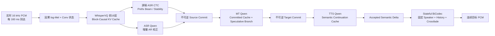
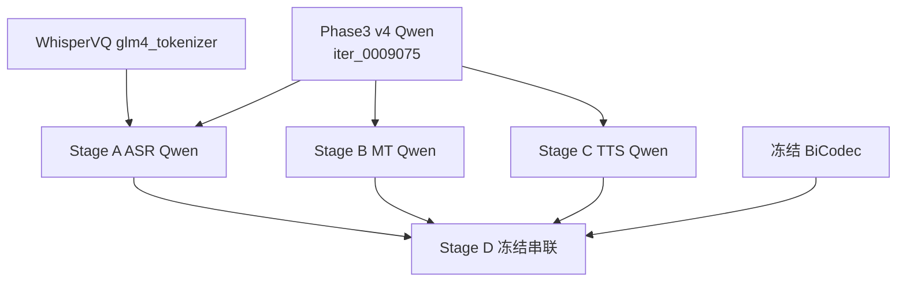

# UniSS Phase3 v4 质量优先单模型真流式 E2E Simultaneous S2ST 训练与推理计划

> 文档状态：可直接据此实现的工程与实验计划，尚未执行本计划中的新训练。
>
> 审计日期：2026-08-18（Stage B 最终推荐设计已根据 Stage A V1/V9 free-running 结果更新）。
>
> **2026-08-18最终需求更新：** 最终交付必须是一个模型级 end-to-end simultaneous S2ST student，而不只是A→B→C三个模型的级联系统。第27节是当前最高优先级的最终执行方案；第9--13节保留为teacher构造、oracle诊断和级联上限，不再代表最终部署形态。
>
> 实验范围：UniST 固定 `train-00000` 至 `train-00014`，只在对应 train/validation 上寻找可行方法；本轮不声称 full198、test、CVSS-T 或未见域泛化。
>
> 核心目标：先保证真流式条件下 ASR、翻译、分段 TTS 和连续 BiCodec 播放都正确，再优化首个 WRITE/PCM 延迟；不允许用整段离线 fallback、重复计算完整历史或强制 WRITE 冒充成功。

## 1. 执行结论

历史A/B/C模块化设计保留为teacher、oracle ablation和故障定位资产：

1. **Stage A：真流式 ASR**——Chunk/Block-Causal WhisperVQ、源端 ASR CTC、增量 AR-ASR Qwen；
2. **Stage B：增量文本翻译**——只消费 Stage A 已不可逆提交的源文本，生成不可逆目标文本 delta；
3. **Stage C：连续分段 TTS**——只消费 Stage B 已不可逆提交的目标文本 delta，生成与真实目标音频严格对齐的 BiCodec semantic delta；
4. **Stage D：冻结串联评估**——A、B、C 不再反向传播，接入 stateful BiCodec，验证完整真流式 S2ST。

最终交付按第27节执行：从当前free-running ASR内容最好的V1 compound checkpoint初始化，冻结其Causal WhisperVQ、bridge/adapter和BiCodec，只用一个共享Qwen在一次正式Megatron run内联合学习streaming ASR delta、incremental MT delta和target semantic delta。Phase3 v4 `iter_0009075`与冻结V1副本作为teacher/replay来源；不再把三个独立Qwen作为最终部署形态。

最终运行链为：

```text
实时 PCM
  → 冻结V1 Causal WhisperVQ声学缓存
  → 单个共享Qwen交错生成ASR/MT/semantic delta
  → Stateful BiCodec
  → 连续 PCM
```

本计划第一版的成功定义是：输入只逐块到达、输出在源音频结束前开始、提交内容不回改、音频连续可播放、翻译和音色达到质量门。首 PCM 小于 1 秒是后续优化目标，不作为第一轮掩盖内容错误的硬门。

## 2. 为什么改用这一条路线

### 2.1 历史实验已经排除的误区

已有 wait-k、StreamSpeech/CTC、dense event rollout、runtime-parity 和多版 overfit/generalize 实验已经说明：

- 单样本可以学会自然 WRITE、文本、semantic 和 EOS，但不等于多样本可用；
- 训练长期使用 oracle action/text/semantic 历史，而推理把自己的早期错误写入 persistent KV，会形成严重 exposure mismatch；
- target NAR translation CTC 和 BiCodec unit CTC 可以下降，但并不保证 AR runtime 的文本、音频和停止行为正确；
- Whisper 表示、Qwen 内容、策略、TTS semantic、EOS 同时联合更新时，很难定位是哪一层破坏了 Phase3 质量；
- 仅增加 epoch、shuffle、WAIT/WRITE 权重或 GPU 吞吐，不能修复监督对象和部署状态机不一致。

本路线先把问题拆成三个可以独立验收的条件模型。只有上游通过，才允许下游开始；下游不能用自己的能力掩盖上游错误。

### 2.2 为什么仍然从 Phase3 v4 开始

Phase3 v4 已经具备最重要的离线能力先验：

- 源语音 GLM/BiCodec prompt 理解；
- ASR 和 S2TT 能力由 Phase1/Phase2 继承；
- 文本翻译与 TTS prompt grammar；
- 高质量目标文本和 BiCodec semantic 自回归生成；
- 说话人 global token 条件控制。

新训练要学习的是“局部可见输入、不可逆增量输出和跨片段连续状态”，而不是从头重新学习双语内容和语音生成。

### 2.3 为什么仍保留三个模块化teacher/oracle

Phase3 Qwen 只有约 0.5B，H200 可以容纳多个冻结teacher副本。A/B/C模块化路径能得到更干净的因果诊断：

| 模型 | 输入 | 输出 | 主要风险 |
|---|---|---|---|
| ASR Qwen | causal WhisperVQ delta | 源文本 delta | 声学前端漂移、漏词 |
| MT Qwen | committed source text delta | target text delta | 幻觉、重复、回改 |
| TTS Qwen | committed target text delta + speaker state | semantic delta | 静音、音色漂移、semantic collapse |

这些模型不再是最终部署目标，而是为第27节单模型student提供ASR/MT/semantic teacher、oracle输入和错误归因。最终student共享一个Qwen，因此训练与validation必须同时保留模块化oracle，才能判断某个loss改善时是否正在损坏另一个任务。

## 3. 已审计的权重、架构与离线质量锚点

### 3.1 权威 checkpoint

Megatron 原生权重是唯一训练权威：

```text
checkpoints/uniss_qwen0p5b_phase3_unist198_after_phase2_v4/iter_0009075
```

这里要区分“正式最终/已完整评估”和“单一 validation LM loss 最低”：`iter_0009000` 的 validation LM loss `3.809553`，略低于 `iter_0009075` 的 `3.809850`；但现有完整音频评估、报告和 demo 均以 `9075` 为基准。因此本计划固定使用 **canonical final/evaluated `9075`**，不把它误写成严格 validation-loss best。若未来要改用 `9000`，必须先在完全相同的 pilot15 baseline 上补齐端到端评估，并在任何新训练开始前一次性冻结 base manifest。

精确 HF 导出用于推理、teacher 和 compound trainer parity：

```text
checkpoints/exported_hf/qwen0p5b_phase3_unist198_iter_0009075_hf
```

Qwen2 配置：

| 项目 | 数值 |
|---|---:|
| layers | 24 |
| hidden size | 896 |
| attention heads | 14 |
| KV heads | 2 |
| FFN hidden | 4864 |
| logical tokenizer vocab | 180407 |
| padded embedding vocab | 180480（含 73 padding rows） |
| max positions | 32768 |
| dtype | BF16 |
| cache | `use_cache=true` |

任何新 run 都必须记录 native checkpoint SHA/iteration、HF 导出 manifest 和 native↔HF 输出 parity。不得仅凭文件名假设导出正确。

### 3.2 WhisperVQ 是独立配套模型

WhisperVQ 不在 Phase3 Megatron checkpoint 内。它必须独立加载：

```text
pretrained_models/UniSS/glm4_tokenizer
```

关键配置：

| 项目 | 数值/状态 |
|---|---|
| Whisper encoder layers | 配置为 32 层 |
| 实际量化前可用层 | 前 16 层，`pooling_position=quantize_position=16` |
| hidden size | 1280 |
| attention heads | 20 |
| 原始 encoder attention | 双向，`encoder_causal_attention=false` |
| convolution | causal 已开启 |
| codebook | 16384 |
| pooling kernel | 4 |
| max source positions | 1500 |

必须准确表述：新 Stage A 是“Phase3 v4 Qwen + 独立 WhisperVQ 权重”的 compound checkpoint，不是“Phase3 checkpoint 内包含 Whisper”。

### 3.3 Phase3 v4 训练几何

Phase3 v4 的正式配置是：

```text
8 × H200
TP=1, PP=1
seq-length=18000
micro-batch-size=2
global-batch-size=128
BF16 + Flash Attention + activation recompute
Adam beta1/beta2=0.9/0.95
weight decay=0.1
clip-grad=0.5
cosine decay
LR=1e-5, min LR=1e-6, warmup=200
dataloader-type=cyclic
--no-data-sharding
严格全局 shuffle
完整 validation
```

Phase3 的 `1,161,587` 个 packed train sample 对应 `9,075` iteration，约为一次完整 packed coverage。新计划沿用其并行和 pack 几何，但 iteration 必须根据本计划实际生成的 pack 数计算，不能复制 `9075`。

### 3.4 离线质量锚点

现有 full198 UniST dev Phase3 指标只作为“模型原始能力”背景，不可直接与新的 pilot15 validation 做胜负比较：

| Mode | 方向 | Text-BLEU | Speech-BLEU |
|---|---|---:|---:|
| Performance | ZH→EN | 33.3860 | 16.5154 |
| Performance | EN→ZH | 37.8105 | 35.9432 |
| Quality | ZH→EN | 40.4631 | 21.3884 |
| Quality | EN→ZH | 44.8822 | 42.8128 |

正式判断质量保持率时，必须先在同一 pilot15 validation 上重跑 Phase3 offline baseline，再与新模型比较。

## 4. 真流式系统架构



### 4.1 checkpoint 继承关系



每个箭头表示加载模型参数，不表示加载前一个新阶段的 optimizer。三个训练目录必须完全独立。

### 4.2 本计划对“真流式”的硬定义

只有同时满足以下条件才允许标记为 true streaming：

1. evaluator 每次只把当前新增 PCM block 交给系统，模型看不到未来 PCM；
2. log-Mel、卷积和 Whisper attention 都只增量计算，不能每 tick 重算句首至当前；
3. 已提交的源文本、目标文本、semantic 和 PCM 都不可回改；
4. 新输出通过真实 stateful BiCodec 播放，不是事后整段解码再切片；
5. 源音频结束前至少产生一个内容正确、非静音的目标音频片段；
6. 禁止 offline fallback、forced WRITE、预先读取完整音频或用 reference text 替换真实 ASR；
7. 缓存与无缓存的同因果计算在 token/decision 上等价。

达到这些条件但首 PCM 为 1.5 秒，仍是真流式但低延迟尚未达标；整句结束后才播放，即使处理很快，也不是 simultaneous 输出。

## 5. 缓存设计：需要，而且不能只打开 `use_cache`

### 5.1 需要维护的状态

一个会话至少有六类状态：

1. PCM/STFT 左上下文；
2. Whisper causal convolution 左状态；
3. WhisperVQ 前 16 层逐层 projected K/V；
4. ASR、MT、TTS 三个独立 Qwen DynamicCache；
5. 已 committed 的源文本、目标文本和 semantic ledger；
6. BiCodec semantic history、pending tail 和固定 32 个 speaker tokens。

Qwen 的 `use_cache=true` 只解决 decoder KV；它不会自动让原始双向 Whisper encoder 变成流式，也不会自动保证 candidate reject 后主 cache 不被污染。

### 5.2 当前已有可复用实现

训练侧现有实现：

```text
training/phase3_whisper_streamspeech_joint/whisper_frontend.py
training/phase3_whisper_streamspeech_joint/whisper_multichunk.py
```

它在整段 forward 中应用 chunk-causal mask，但不会复用历史 attention 计算。

项目已有更接近部署需求的隔离原型：

```text
experiments/uniss_phase3_runtime_parity_streaming_v2/frontend/cached_whispervq.py
experiments/uniss_phase3_runtime_parity_streaming_v2/frontend/audio_cached_frontend.py
```

该原型已经实现：

- 160 ms PCM block；
- `center=False` 的 causal STFT；
- PCM、mel、conv 左状态；
- WhisperVQ 前 16 层 block-causal K/V；
- 每 160 ms 输出 2 个 80 ms GLM token；
- full block-mask 与 cached encoder 的基础 parity 测试。

它目前是 inference-only、只支持 `right_context=0`，且绝对位置超过 Whisper 上限会报错。计划应复用其逻辑并改造成训练/部署共享 frontend，而不是重新写第三套不一致实现。

### 5.3 当前必须先修复的 frontend mismatch

现有 compound 训练 frontend 与缓存部署 frontend 存在两个真实差异：

| 项目 | 现有训练路径 | cached 部署原型 |
|---|---|---|
| STFT | 默认 `center=True` | `center=False` |
| log-Mel 归一化 | 整条 utterance 的全局最大值 | 只依赖已到达 block 的局部归一化 |

这会导致同一 PCM 在训练和部署时产生不同 hidden/GLM token。**Stage A 数据准备和训练在 frontend parity 通过前不得开始。**

推荐把 causal PCM frontend 抽成唯一共享模块；离线训练也逐块调用相同实现，或者构造与其严格等价的 full block reference。不得训练一种 frontend、部署另一种 frontend。

### 5.4 160 ms、80 ms right context 与首版选择

已有 exact cache 原型只支持 `right_context=0`。因此实现顺序为：

1. 首先用 `160 ms block + 0 ms right context` 建立严格 cached/full parity；
2. 如果内容质量明显不足，再增加固定 `80 ms lookahead`；
3. 增加 right context 时，必须 hold 住当前 block，直到 lookahead 到达后才提交；不能提前输出后再修订；
4. 训练 mask、缓存位置、commit timestamp 和 evaluator 必须使用同一配置。

计划中的 multi-chunk curriculum 可以包含 320/640/960/1280 ms block；最终 deployment block 以 parity 已通过的 160 ms 配置为准。

### 5.5 Whisper 长音频状态

Whisper 绝对位置上限约对应 30 秒声学段。第一版采用：

- 在 VAD 静音或稳定从句边界重置 acoustic cache；
- 单个声学 cache epoch 最长控制在 25–30 秒；
- 重置 Whisper 时，已经提交的源/目标文本状态不回退；
- MT/TTS 可以保留文本摘要或开始新的 Qwen cache epoch；
- 同一会话的 speaker tokens 保持不变。

这仍然是真流式，因为任何时刻都没有使用未来 PCM。长期方案才是 bounded acoustic cache、位置重映射或相对位置编码，不应在首版同时引入。

### 5.6 Qwen preview/commit 分支

候选生成不能直接污染 persistent main cache。每次生成遵循：

```text
main committed cache
  └─ fork speculative branch
       ├─ reject → 丢弃 branch，main 长度/hash 完全不变
       └─ accept → 将很短的 accepted delta 在 main 上重放一次
```

正确性 smoke 可使用 `DynamicCache` deep copy；正式服务改成 copy-on-write，或“branch 生成、接受后 delta replay”。现有 `stage10_cached_micro_write/adapter.py` 会把 WRITE 和候选 token 直接写入 main cache，只能复用基础 forward/cache-length 逻辑，不能原样用于可拒绝候选。

当前 Qwen2 + FlashAttention2 路径默认使用 DynamicCache。StaticCache 只有在实模型 parity 通过后才允许开启。

## 6. 数据边界、隔离目录与全局 shuffle

### 6.1 本轮数据范围

固定使用：

```text
data/processed/phase1_unist198_sharded/train-00000.jsonl
...
data/processed/phase1_unist198_sharded/train-00014.jsonl
```

这些文件是现有 task sample；Stage A/C 还需要回溯到其源 manifest、音频和 timestamp/alignment artifact。禁止仅从 packed token 序列按文本长度猜测音频时间。

本轮约束：

- train：只来自 shard 00000–00014 的 train records；
- validation：固定、不可变、双向平衡，样本 ID 在首次生成后冻结；
- 不使用 test、CVSS-T 和 full198；
- 可以在 train/validation 上证明方法工作，但报告必须明确“不证明泛化性”。

### 6.2 新实验目录

```text
experiments/uniss_phase3_v4_quality_first_true_streaming_pilot15_v1/
  README.md
  experiment.env
  stage00_baseline/
  stage_a_causal_whisper_asr/
  stage_b_incremental_mt/
  stage_c_segment_tts/
  stage_d_runtime/
  evaluation/
  scripts/
  tests/
```

对应 artifact 必须独立：

```text
data/processed/uniss_phase3_v4_quality_first_true_streaming_pilot15_v1/
data/megatron/uniss_phase3_v4_quality_first_true_streaming_pilot15_v1/
checkpoints/uniss_phase3_v4_quality_first_true_streaming_pilot15_v1/
runs/uniss_phase3_v4_quality_first_true_streaming_pilot15_v1/
logs/uniss_phase3_v4_quality_first_true_streaming_pilot15_v1/
reports/uniss_phase3_v4_quality_first_true_streaming_pilot15_v1/
```

脚本若发现输出目录已存在且没有相同 run manifest，必须拒绝启动；不能覆盖历史实验。

环境、模型缓存、编译缓存、pip 缓存和临时大文件也必须落在：

```text
/opt/dlami/nvme/jasonleeeli/
```

或其子目录。优先复用现有 UniSS 训练环境，不在系统盘或其他用户目录新建 Conda/venv。

### 6.3 严格全局 shuffle

每个阶段先生成稳定 `pack_id` 和 `.count`，再使用：

```text
--dataloader-type cyclic
--no-data-sharding
固定 global shuffle seed
```

规则：

- shuffle 单位是完整 pack/event session，不允许打乱 session 内事件顺序；
- 所有 data-parallel rank 共享同一个全局 permutation，再按 rank 取样；
- resume 必须恢复 optimizer、RNG、sampler consumed count；
- fresh fine-tune 从 Phase3 加载时不加载 Phase3 optimizer/RNG；
- 每个 epoch 写出首尾 pack ID、全局 permutation hash 和各 rank 无重复/无遗漏审计。

## 7. 公共数据 schema 与质量审计

每个原始样本至少包含：

```json
{
  "schema_version": "quality_first_streaming_pilot15_v1",
  "sample_id": "...",
  "source_manifest": "...",
  "source_index": 0,
  "split": "train",
  "src_lang": "eng",
  "tgt_lang": "cmn",
  "source_audio": "...",
  "sample_rate": 16000,
  "source_duration_ms": 4380,
  "source_text": "Good morning, everyone.",
  "translation": "大家早上好。",
  "source_words": [
    {"text": "Good", "start_ms": 120, "end_ms": 430}
  ],
  "target_words": [
    {"text": "大家", "start_ms": 160, "end_ms": 520}
  ],
  "bicodec_global": [0, 1, 2],
  "target_bicodec": [123, 456, 789],
  "target_duration_ms": 4020,
  "alignment_kind": "provided_or_forced",
  "alignment_score": 0.97
}
```

实际 `bicodec_global` 必须严格为 32 个 token；示例为节省篇幅而缩短。

数据 gate：

- 音频必须可解码、16 kHz 或有确定的重采样记录；
- transcript、translation、source/target semantic 均非空；
- word timestamp 单调、不越界；
- target semantic 数量与目标音频时长在 50 Hz 附近一致；
- source/target 文本 normalization 前后均保留；
- 记录音频、文本、semantic、alignment 的 SHA256；
- 所有过滤原因按 shard、方向和语言统计，不能静默丢样本。

## 8. Stage 00：Phase3 与 frontend 基线审计

Stage 00 不训练，但它是后续所有结果可解释的前提。

### 8.1 必做检查

1. native Phase3 `iter_0009075` 与 HF 导出在固定 prompt 上 top-1 token 完全一致；
2. 重新构造 pilot15 matching validation 的 offline ASR、MT、TTS、Phase3 S2ST 基线；
3. 对真实 WhisperVQ checkpoint 和真实 PCM 做 full block-causal vs cached parity；
4. 统一训练/部署 STFT、归一化、conv state、position offset；
5. 验证真实 BiCodec one-shot 与不同 semantic push 分块的音频边界行为；
6. 固定 validation ID、speaker token、方向比例和随机 seed；
7. 建立所有后续 checkpoint 的统一 evaluator 和报告 schema。

### 8.2 Stage 00 硬门

| 检查 | 通过条件 |
|---|---|
| Whisper real-PCM future perturbation | 修改第 k block 后的 PCM，第 k block 前 hidden/GLM 不变 |
| Whisper cached/full token parity | GLM token ID 100% 相同 |
| Whisper hidden parity | FP32 参考 `rtol<=2e-5, atol<=2e-6`；BF16 单列容差 |
| Qwen cached/full parity | top-1 100%，BF16 logits cosine `>=0.9999` |
| BiCodec coverage | semantic 零 gap、零 overlap、总采样数一致 |
| Phase3 export | native/HF 固定样本输出一致 |

若 frontend parity 未通过，后续训练全部停止；不能先训练再寄希望于部署补偿。

## 9. Stage A：Chunk-Causal WhisperVQ + 增量 ASR

### 9.1 Motivation

Stage A 只回答一个问题：当 PCM 逐块到达且声学 encoder 看不到未来时，能否稳定地产生正确的源文本增量。

此前 target NAR translation CTC 或 BiCodec unit CTC 失败，不等于 source ASR CTC 不适用。源 ASR CTC 的输入和标签天然单调：语音时间从左到右，对应源语言 token 从左到右；它在本计划中负责帧级对齐、prefix stability 和提交触发，最终内容仍由 AR-ASR 路径保护。

### 9.2 Stage A 数据

每条训练记录由原始音频、源文本、source word timestamp 和共享 causal frontend 生成：

```json
{
  "sample_id": "NCSSD_R_EN_0000000000",
  "source_audio": "...",
  "src_lang": "eng",
  "asr_speaker_condition": "fixed_neutral_or_prefix_enrolled_only",
  "frontend_config": {
    "block_ms": 160,
    "encoder_frame_ms": 20,
    "right_context_ms": 0,
    "stft_center": false,
    "token_hop_ms": 80,
    "normalization": "shared_causal_v1"
  },
  "chunks": [
    {
      "tick_index": 0,
      "pcm_start_sample": 0,
      "pcm_end_sample": 2560,
      "source_end_ms": 160,
      "glm_start": 0,
      "glm_end": 2,
      "transcript_delta": "",
      "is_final": false
    },
    {
      "tick_index": 3,
      "pcm_start_sample": 7680,
      "pcm_end_sample": 10240,
      "source_end_ms": 640,
      "glm_start": 6,
      "glm_end": 8,
      "transcript_delta": "Good",
      "is_final": false
    }
  ],
  "full_transcript": "Good morning, everyone.",
  "ctc_target_ids": [1234, 5678],
  "offline_teacher_checkpoint": "phase3_v4_iter_0009075"
}
```

空白 tick 不必全部变成独立 packed sample。可以按以下规则把事件合并：

- 至少一个完整 source word 结束时建立一次监督事件；
- 超过 1280 ms 仍无完整词时强制建立 empty-delta 事件；
- 最后一个事件必须覆盖完整源音频和完整 transcript；
- 所有事件拼接后的 GLM span 必须从 0 连续覆盖到最后，无 gap、无 overlap；
- transcript delta 拼接后必须严格还原 normalization 后的完整 source text。

Stage A sampler 建议：

| 样本类型 | 比例 | 作用 |
|---|---:|---|
| streaming ASR event | 60% | 学习增量可见性与不可逆 delta |
| full causal standalone ASR replay | 20% | 保护长上下文内容完整性 |
| standalone offline ASR task replay | 15% | 保护 Phase1 ASR grammar 和完整句能力 |
| exact Phase3 v4 Quality/Performance replay | 5% | 保护原始 S2ST prompt grammar |

### 9.3 Stage A 模型改造

Whisper 不替换为 Emformer 或 Zipformer，仍使用 Phase3 配套 WhisperVQ：

1. 把训练 frontend 统一成共享 causal PCM frontend；
2. 前 16 层使用 block-causal attention；
3. 保留原始绝对位置 embedding，但显式维护 frame offset；
4. codebook、EMA、pooling、post-VQ 路径冻结；
5. pre-VQ hidden 接一个源 ASR CTC head；
6. quantized GLM/continuous bridge 进入 Phase3 ASR Qwen；
7. Qwen 使用增量 event grammar 生成 transcript delta，而不是预测独立 WAIT/WRITE policy。

CTC 不直接投影到 180407 个逻辑 Qwen token。复用现有 `training/phase3_whisper_streamspeech_joint/tokenizer_maps.py` 思路，为 ENG/CMN 分别构造 deterministic compact CTC vocabulary，再把 compact ID 映射回 Qwen ID。map 只能由 train target 或与标签无关的固定 tokenizer inventory 构造；validation OOV 必须显式统计。若 OOV 非零，训练前选择 byte/character fallback 或新增受审计的 UNK class，禁止静默丢 token。

推荐 event grammar 复用现有 UniSS special token，避免扩 vocab：

```text
TASK_ASR, language, fixed_neutral_or_prefix_enrolled_speaker,
START_GLM, glm_delta_1, END_GLM,
WRITE_GENERATE, language, START_CONTENT, transcript_delta_1, END_CONTENT,
START_GLM, glm_delta_2, END_GLM,
WRITE_GENERATE, language, START_CONTENT, transcript_delta_2, END_CONTENT,
...
EOS
```

模型不需要决定何时 READ。系统按固定音频 block 读取；CTC stability 或 word boundary 决定何时请求 AR-ASR delta。这样先把“内容正确”与“策略学习”分开。

这里还有一个容易忽略的未来泄漏：现有 `bicodec_global` 往往由完整 source audio 提取。如果把它直接放入最早的 ASR prompt，声学 attention 即使严格 causal，系统仍然提前使用了未来语音。Stage A 默认使用固定 neutral speaker 条件；如需 speaker-aware ASR，只允许使用会话开始前已注册的 enrollment，或仅由已到达 PCM 递推得到并在首次 commit 前冻结的 causal speaker state。Stage 00 future-perturbation 必须覆盖 speaker 分支。

### 9.4 可训练参数与学习率

Stage A 必须采用 Megatron 训练生命周期、optimizer、DDP、checkpointing 和 sampler。现有 `training/phase3_whisper_streamspeech_joint/pretrain_joint_megatron.py` 可复用数据、loss 和参数组设计，但它内部通过 HF `AutoModelForCausalLM` 构造 Qwen，并不是 `training/pretrain_uniss_megatron.py` 使用的原生 Megatron GPTModel。为满足“与 Phase3 一样基于 Megatron”的要求，新 Stage A 正式入口应使用 native Megatron Qwen model provider，直接加载 native `iter_0009075`；HF 导出只用于 teacher/parity，不能成为正式训练权威。

建议以 `base LR=1e-4` 建立参数组，实际有效 LR 如下：

| 参数组 | 初始化 | 是否训练 | 建议 max LR | 说明 |
|---|---|---:|---:|---|
| ASR CTC head | 新增 | 是 | `1e-4` | 新分类器 |
| continuous/GLM bridge | 现有或新增 | 是 | `5e-5` | 吸收 causal/offline 表示差异 |
| Whisper pre-VQ layers 8–15 | WhisperVQ | 是 | `1e-6` | 先解冻顶部 8 层 |
| Whisper pre-VQ layers 0–7 | WhisperVQ | 后期开启 | `2e-7` | parity/teacher gate 稳定后扩到 16 层 |
| Whisper conv | WhisperVQ | 可选低 LR | `1e-7` | 只在 frontend 对齐后开启 |
| Whisper pooling/codebook/EMA | WhisperVQ | 否 | `0` | 禁止 code identity 漂移 |
| Whisper post-VQ | WhisperVQ | 否 | `0` | 当前 runtime 不使用该路径 |
| Qwen 24 transformer layers | Phase3 v4 | 是 | `2e-6` | 保守全参 SFT，不把 LoRA 作为默认方案 |
| tied embedding/lm_head | Phase3 v4 | 是 | `5e-7` | 极低 LR 保护 token geometry |

权重衰减对 norm、bias、新 CTC bias 设为 0；其他可训练矩阵沿用 `0.1`。如 gradient norm 持续异常，先降低新 head/bridge LR，不允许靠重新冻结全部内容路径掩盖问题。

内部解冻 schedule：

- 前 5% update：只训新 head/bridge，Qwen 暂时冻结；
- 5%–30%：开启 Qwen 全层低 LR + Whisper 顶部 8 层；
- 30%–100%：若 teacher/cached parity 未恶化，扩展到全部 16 个 pre-VQ 层；
- codebook、EMA、post-VQ 全程冻结。

这是一次连续训练中的 optimizer param-group schedule，不是重新初始化三个 Stage A checkpoint。

### 9.5 Stage A loss

主 loss：

\[
\mathcal{L}_A =
1.00\mathcal{L}_{AR\text{-}ASR}
+0.30\mathcal{L}_{source\text{-}CTC}
+0.20\mathcal{L}_{offline\text{-}teacher\text{-}KL}
+0.10\mathcal{L}_{hidden\text{-}chunk\text{-}consistency}
+0.10\mathcal{L}_{cache/full\text{-}consistency}.
\]

各项含义：

| loss | 含义 |
|---|---|
| `AR-ASR CE` | 对增量 transcript delta 和完整 transcript 做自回归交叉熵 |
| `source CTC` | 从 causal pre-VQ hidden 到源文本 token 的单调对齐 |
| `offline teacher KL` | causal student 的文本 posterior 接近冻结 Phase3 teacher，但只蒸馏当前 prefix 已支持的 token |
| `hidden/chunk consistency` | 不同 chunk 大小在共同可见、已稳定的中心区域 hidden 接近 |
| `cache/full consistency` | cached 执行与同一 block-causal full reference 的 logits/hidden 一致 |

teacher 不得在早期 prefix 上看完整音频后蒸馏未来转写；允许的是 same-prefix teacher，或 full teacher 中被 alignment/LCP 证明已由当前音频支持的 token mask。standalone ASR replay 与 exact Phase3 Quality/Performance replay 都使用各自原始 CE，不强行套 CTC。所有 loss 必须分别记录 numerator、denominator 和有效 token 数，禁止因 blank/短样本造成“平均 loss 看似下降”。

### 9.6 Multi-chunk curriculum

所有阶段都保留上述 loss；curriculum 只改变 block 分布和可训练层，不会丢弃旧 loss：

| coverage 进度 | block 分布 | 目的 |
|---|---|---|
| 0%–10% | 1280 ms | 先恢复 causal 内容能力 |
| 10%–30% | 1280/960 ms | 减少上下文 |
| 30%–60% | 960/640 ms | 训练中等 chunk |
| 60%–85% | 640/320 ms | 接近在线行为 |
| 85%–100% | 320/160 ms | 匹配最终部署 |

每个样本的 chunk 选择由 `seed + sample_id + coverage_epoch` 决定，所有 rank 可复现。最终 20% update 必须以 deployment chunk 为主，否则 validation 不能代表部署。

### 9.7 Stage A 训练几何

```text
framework          = Megatron 单机 8×H200
TP / PP            = 1 / 1
sequence length    = 18000
micro batch        = 1（Whisper+Qwen compound）
global batch       = 128
gradient accum     = 16 microsteps/rank-equivalent global update
precision          = BF16
clip grad          = 0.5
optimizer          = AdamW, betas 0.9/0.95
schedule           = cosine
primary coverage   = 3 epochs
validation         = full fixed validation
```

如果 MBS=2 能在真实 peak memory 下稳定通过，可提高到 2；不能为了显存占用强行增加 padding 或改变样本语义。GPU 满载通过 pack、prefetch、异步 CPU 解码和减少 Python dispatch 实现，不运行与训练无关的 synthetic load。

Stage A checkpoint 是一个原子 compound bundle，至少包含：native Megatron Qwen shards、WhisperVQ 可训练层、bridge、CTC heads、compact maps、optimizer/RNG/sampler state 和 manifest。保存或 resume 时缺少任一组件都必须失败，防止只恢复 Qwen 却把 Whisper/CTC 重置。

### 9.8 Stage A 验证与通过门

| 指标 | 第一轮通过门 |
|---|---|
| cached/full GLM token parity | 约 100%，任何系统性差异均阻塞 |
| future perturbation | 未来 PCM 变化不能改变过去提交 |
| committed rollback | 0 |
| final WER/CER | 相对 matching offline Phase3 ASR 退化不超过 15% |
| pre-final source commit | 长样本在 source EOS 前有正确 commit |
| all-blank/final-only collapse | 0 |
| cache growth | 与已到达 frame/token 线性一致，无完整历史重算 |

还要分别报告：CTC-only、AR-only、CTC+AR；gold segmentation 与真实 VAD；160/320/640/1280 ms。Stage A 只选同时满足内容和 causality 的 checkpoint，不按最低 train loss 选。

## 10. Stage B：只基于 committed source text 的增量 MT

### 10.1 Motivation

Stage B 不再从不稳定 GLM agreement 猜翻译。它只接收 Stage A 已不可逆提交的源文本，因此可以把问题缩成“有噪声、逐步增长的文本前缀如何生成不可逆翻译 delta”。

Stage B 从 Phase3 v4 单独初始化；Whisper、Stage A Qwen、BiCodec 均不参与反向传播。

### 10.2 增量翻译监督如何构造

本计划不要求人工标注 WAIT/WRITE action，但需要构造 **incremental prefix supervision**。它不是一个独立策略标签集，而是由已有双语文本、时间戳和 teacher 自动派生：

1. 按 Stage A 的 source commit 序列得到 `source_delta_1...n`；
2. 使用 source↔target word alignment 建立单调安全前缀；
3. 对非单调语序，只有当目标词的全部源依赖已可见时才允许提交；
4. 用冻结 Phase3 full-MT teacher 对相邻 source prefix 生成候选；
5. 取连续 2–3 个 prefix candidate 的 longest common prefix 作为稳定 target prefix；
6. 强制 `target_prefix_t` 以前一 target prefix 为前缀，禁止回改；
7. 最后一步使用完整人工 translation 收尾，确保所有目标 token 被覆盖。

这会产生 target delta，但不让模型独立学习 WAIT/WRITE policy。没有新稳定翻译时，delta 为空；系统继续读取下一次 source commit。

示例：

```json
{
  "sample_id": "...",
  "input_variant": "stage_a_asr",
  "events": [
    {
      "event_index": 0,
      "source_commit_ms": 640,
      "source_delta_text": "Good morning",
      "committed_source_text": "Good morning",
      "previous_target_text": "",
      "target_delta_text": "早上好",
      "alignment_confidence": 0.96
    },
    {
      "event_index": 1,
      "source_commit_ms": 1440,
      "source_delta_text": "everyone",
      "committed_source_text": "Good morning everyone",
      "previous_target_text": "早上好",
      "target_delta_text": "，大家",
      "alignment_confidence": 0.93
    }
  ],
  "full_target_text": "早上好，大家。"
}
```

### 10.3 Stage B 数据混合

| 输入类型 | 比例 | 目的 |
|---|---:|---|
| gold source prefix | 40% | 学习理想增量翻译上限 |
| Stage A 实际 ASR/noisy prefix | 40% | 匹配部署错误分布 |
| full MT / replay pool | 20% | 其中建议 15% standalone full-MT、5% exact Phase3 Quality/Performance replay |

Stage A noisy prefix 必须由固定的 selected Stage A checkpoint 离线生成并带 provenance；不能每个 epoch 在线变化，否则训练集无法复现。

### 10.4 增量 grammar 与 KV cache

推荐复用现有内容/语言边界 token 构成 append-only transcript。`WAIT_READ` 在这里是 runtime 写入的确定性事件分隔符，不是模型要学习的策略 action：

```text
TASK_T2T_TRANSLATION, target_language,
WAIT_READ, source_language, START_CONTENT, source_delta_1, END_CONTENT,
WRITE_GENERATE, target_language, START_CONTENT, target_delta_1, END_CONTENT,
WAIT_READ, source_language, START_CONTENT, source_delta_2, END_CONTENT,
WRITE_GENERATE, target_language, START_CONTENT, target_delta_2, END_CONTENT,
WAIT_READ, source_language, START_CONTENT, END_CONTENT,
WRITE_GENERATE, target_language, START_CONTENT, final_target_delta, END_CONTENT,
...
EOS
```

空的 target delta 显式编码为 `START_CONTENT, END_CONTENT`；空的 source delta 只允许作为“source 已结束”的 final marker。训练时把完整 event transcript 放在一个 packed causal sequence 中；推理时按完全相同顺序追加到 Qwen DynamicCache。这样 full forward 与 cached forward 的位置、边界和历史完全一致。

候选 target delta 先在 speculative branch 生成。通过结构、重复、语言和稳定性检查后，把 accepted token delta 重放到 main cache；拒绝分支不得改变主状态。

### 10.5 Stage B 可训练参数

| 参数组 | 初始化 | 是否训练 | 建议 max LR |
|---|---|---:|---:|
| Qwen 24 transformer layers | Phase3 v4 | 是 | `5e-6` |
| tied embedding/lm_head | Phase3 v4 | 是 | `1e-6` |
| 可选 boundary confidence head | 新增 | 是 | `5e-5` |
| Whisper / ASR CTC | Stage A | 否 | `0` |
| BiCodec | 预训练 | 否 | `0` |

默认是全参保守 SFT，不使用 LoRA 作为唯一训练路径。fresh run 使用 `FINETUNE=1, LOAD_OPTIM=0, LOAD_RNG=0` 从 Phase3 v4 初始化。

### 10.6 Stage B loss

\[
\mathcal{L}_B =
1.00\mathcal{L}_{target\text{-}delta\text{-}CE}
+0.50\mathcal{L}_{full\text{-}MT\text{-}replay}
+0.25\mathcal{L}_{offline\text{-}teacher\text{-}KL}
+0.20\mathcal{L}_{adjacent\text{-}prefix\text{-}consistency}
+0.10\mathcal{L}_{boundary/EOS}.
\]

| loss | 含义 |
|---|---|
| target-delta CE | 只在当前应该新增的目标 token 上计算 |
| full MT replay | 完整源句到完整译文，保护内容上限 |
| teacher KL | 增量 posterior 接近冻结 teacher 的 same-source-prefix posterior |
| adjacent-prefix consistency | 相邻 source prefix 的已提交 target posterior 不发生翻转 |
| boundary/EOS | 学习 fragment 结束和最终完成，避免无限重复或过早 EOS |

teacher KL 也只能计算在当前 source prefix 已支持的 target delta mask 上。禁止对尚不可安全提交的未来 target token 计算普通 CE/KL，否则模型会被训练成提前幻觉。

### 10.7 Stage B curriculum

Stage B 仍是一个连续 run：

- 0%–10%：80% gold prefix、20% full replay；
- 10%–40%：gold/noisy/replay = 60/20/20；
- 40%–100%：固定为 40/40/20；
- 最后 20% 增加长 prefix、ASR 删除/替换错误和标点缺失样本。

所有 loss 始终存在，仅改变输入噪声比例。

### 10.8 Stage B 训练与验证

Stage B 使用 native Megatron GPTModel 和原生 `iter_0009075` 初始化。训练几何沿用 Phase3 v4：`seq=18000, MBS=2, GBS=128, 8×H200, BF16, TP=PP=1`。建议完成 2 个 incremental-MT primary coverage epoch。

必须分开报告四条链：

1. gold full source → offline Phase3 MT；
2. gold source commits → Stage B incremental MT；
3. Stage A ASR commits → Stage B incremental MT；
4. Stage A 最终 transcript → full-MT replay path。

通过门：

| 指标 | 第一轮门 |
|---|---|
| committed target rollback | 0 |
| gold transcript Text-BLEU/chrF | 接近 matching Phase3 baseline，保留率目标 `>=95%` |
| Stage A transcript 结果 | 单独报告，不与 gold 混合 |
| final target coverage | 参考译文有效 token 覆盖高，无系统性欠译 |
| hallucination/repetition | 无批量通用短词、循环或跨语言污染 |
| cached/full parity | top-1 100%，canonical transcript/cache length 一致 |

COMET 可作为语义辅助，但 checkpoint 不能只按 COMET 选；必须同时满足 rollback、完整性和语言正确率。

### 10.9 Stage B 最终冻结设计（2026-08-18）

本节是 Stage B 的当前最终推荐，优先级高于本章前面仍带有“建议”措辞的初版描述。它吸收了 Stage A V1--V9 的正式结果，特别是“teacher-forced 指标好但 free-running 错误累积严重”的经验。实现时不得只复制 Phase3 的完整句 Quality/Performance 任务，也不得只训练一个没有 replay、consistency 和真实 rollout 的 target-delta CE。

#### 10.9.1 当前依赖与 checkpoint 关系

当前 Stage A 中，按真实 free-running 内容质量，V1 优于 V9：

| Stage A | causal-full 加权错误率 | event-streaming 加权错误率 | 中文 CER | 英文 WER | 用途 |
|---|---:|---:|---:|---:|---|
| V1 `iter_0000381` | 14.45% | 27.14% | 21.01% | 35.34% | 当前仅用于生成 Stage B noisy source prefix |
| V9 `iter_0000381` | 24.86% | 43.84% | 34.79% | 55.94% | CTC/几何诊断，不用于 Stage B 数据主版本 |

V1 的权威 Megatron checkpoint 为：

```text
checkpoints/uniss_phase3_v4_quality_first_true_streaming_pilot15_v1/
  stage_a_formal/stage_a_formal8_20260816T224100Z/iter_0000381
```

但 Stage B **绝不加载 V1 或 V9 的模型权重**。三个模型仍按本计划第1节从同一个不可变 Phase3 v4 checkpoint 分叉：

```text
Phase3 v4 iter_0009075
  ├── Stage A V1/V10...：streaming ASR
  ├── Stage B：incremental MT
  └── Stage C：streaming TTS
```

Stage B fresh run 的初始化必须是：

```text
FINETUNE=1
LOAD_OPTIM=0
LOAD_RNG=0
LOAD=checkpoints/uniss_qwen0p5b_phase3_unist198_after_phase2_v4/iter_0009075
```

V1 只作为一个固定、带 provenance 的离线数据生成器，产生 `committed_source_delta` 和 `committed_source_prefix`。这样 Stage B 训练不会修改 Stage A 的 Whisper、CTC、adapter 或 Qwen，也不会使 Stage A CER/WER 进一步退化。未来若 V10 超过 V1，必须生成一个新版本 noisy-prefix 数据集，禁止静默覆盖 V1 数据。

#### 10.9.2 最终任务集合：Phase3 思想，但不照搬 Phase3

Phase3 的多任务能力来自 `Quality` / `Performance` 样本、任务控制 token 和统一 next-token CE，而不是来自多个独立网络。Stage B 继承这一思想，但主任务必须改成 append-only incremental MT。最终只保留以下四个数据族：

| task family | 稳态采样比例 | 输入 | 目标 | 主要作用 |
|---|---:|---|---|---|
| `incremental_mt_gold` | 40% | gold committed source delta/prefix + previous target prefix | 当前安全 target delta | 学习理想增量翻译上限 |
| `incremental_mt_v1_noisy` | 40% | V1 committed source delta/prefix + previous target prefix | 当前安全 target delta | 匹配部署时 ASR 删除、替换、标点和分段噪声 |
| `offline_full_mt_replay` | 15% | 完整 gold source text | 完整人工 translation | 保护 Phase3 完整句翻译和最终 coverage |
| `exact_phase3_qp_replay` | 5% | 原始 Phase3 Quality/Performance prompt | 原始 target token sequence | 保护任务 token、文本/semantic 词表和 Phase3 生成几何 |

这里的 `40/40/15/5` 是 **global-step task-family 采样概率**，不是把所有 token 混在一起后再按 token 数自然平均。所有 data-parallel rank 在同一个 global step 必须选择同一 task family，避免某些 rank 走 text-only、另一些 rank 走长 semantic replay 导致 collective 分支不一致。

禁止把 exact Phase3 replay 提高到主任务比例。典型 Quality 样本可能只有约20个转录 token、25个翻译 token，却有数百个 semantic token；若直接做全局 token mean，semantic 梯度会压过增量文本任务，使模型重新倾向完整句 S2ST，而不是 target-delta generation。

#### 10.9.3 统一多任务 CE 的正确定义

四类任务都使用 Phase3 风格的 next-token CE，但必须先在各 task family 内归一化，再由同步 sampler 决定长期贡献：

\[
\mathcal L_{\mathrm{MTCE}}(f)
=
\frac{
\sum_{s\in f}\sum_t m_{s,t}\,
\mathrm{CE}(p_\theta(y_{s,t}\mid h_{s,t}),y_{s,t})
}{
\sum_{s\in f}\sum_t m_{s,t}
},
\qquad
f\in\{gold,noisy,fullMT,phase3QP\}.
\]

优化器每一步最终仍只反向传播一个 scalar loss；“多任务”来自不同 task-conditioned 样本和 loss mask，而不是来自 scalar 数量。日志必须分别记录四个 family 的 numerator、denominator、有效 target token 数和采样次数，禁止只记录一个无法审计的 `lm_loss`。

Incremental 样本的 loss mask 必须满足：

| token span | 普通 CE mask | 说明 |
|---|---:|---|
| runtime 写入的 `WAIT_READ` / source delta | 0 | 这是条件，不是模型目标 |
| 已提交 previous target prefix | 0 | 已经发生，不能重复学习成新输出 |
| 当前 `WRITE_GENERATE` 后的 target delta | 1 | Stage B 主监督 |
| `END_CONTENT` | 1 | fragment 边界 |
| source-final 后的最终 `EOS` | 1 | 只有最终事件允许 |
| 尚未被当前 source prefix 支持的未来译文 | 0/不存在 | 禁止未来泄漏和提前幻觉 |

Exact Phase3 replay 保持历史 prompt、target 和 loss mask 完全不变；它是回放，不允许为了适配 Stage B 重写历史样本。

#### 10.9.4 最终推荐总 Loss

推荐把 task-family CE 作为主体，把不能由普通硬标签 CE 表达的 streaming 约束作为辅助项：

\[
\boxed{
\mathcal L_B
=
1.00\mathcal L_{\mathrm{MTCE}}
+0.25\mathcal L_{\mathrm{same\text{-}prefix\ teacher\ KL}}
+0.20\mathcal L_{\mathrm{committed\ prefix\ consistency}}
+0.10\mathcal L_{\mathrm{boundary/EOS}}
}
\]

其中 `MTCE` 的长期任务贡献由 `40/40/15/5` sampler 决定，不再额外乘一次 `0.40/0.40/0.15/0.05`，避免重复降权。各项含义和实现边界如下：

| loss | 权重 | 有效位置 | 作用 | 失败时表现 |
|---|---:|---|---|---|
| `multi-task CE` | 1.00 | 当前 task family 的 target mask | 同时学习 gold/noisy增量翻译、完整MT和少量Phase3 replay | 欠译、错误翻译、任务遗忘 |
| `same-prefix teacher KL` | 0.25 | 当前 source prefix 已由 alignment/LCP 证明支持的 target delta | 保留冻结 Phase3 teacher 的软分布，不把单个硬译文当唯一答案 | 文体漂移、低频翻译错误、过拟合硬标签 |
| `committed-prefix consistency` | 0.20 | 相邻 source prefix 共享且已经提交的 target prefix | 新输入到达后，已提交译文 posterior 不翻转 | rollback、同一句前半段反复改写 |
| `boundary/EOS` | 0.10 | `END_CONTENT`、空 delta、final `EOS` | 学会本次无可写内容、fragment停止与整句最终结束 | 重复、无限生成、过早EOS |

`same-prefix teacher KL` 必须使用冻结的 Phase3 v4 teacher，并且 teacher 和 student 都只能看到相同 source prefix。禁止让 teacher 看完整源句后把未来译文蒸馏给早期 prefix。

`committed-prefix consistency` 推荐使用 stop-gradient teacher branch：旧 prefix 的已提交 posterior 作为固定目标，新 prefix 在相同已提交位置与其计算 KL；已经提交的离散 token 还必须由数据审计保证是严格前缀关系。loss 不能替代数据级 `rollback=0` 检查。

`boundary/EOS` 使用类别均衡，避免大量“继续等待/空 delta”样本让模型学成永不 WRITE，也避免 final 样本比例过高让模型过早 EOS。

#### 10.9.5 必须加入 model-generated target history

Stage A 已经证明：teacher-forced token accuracy 高不代表 free-running 正确。Stage B 不得始终把 gold previous target prefix 放回下一 event。推荐在同一个连续 run 内逐步引入受控 DAgger/scheduled-sampling 历史：

| coverage progress | source family | previous target history |
|---|---|---|
| 0%--10% | gold为主 + full replay | 100% gold，先恢复Phase3翻译先验 |
| 10%--40% | gold/noisy/replay=`60/20/20` | 80% gold，20%模型生成 |
| 40%--80% | gold/noisy/full/QP=`40/40/15/5` | 70% gold，30%模型生成 |
| 80%--100% | 同稳态比例，增加长event和ASR错误 | 60% gold，40%模型生成 |

模型生成历史必须来自当前 checkpoint 的冻结 rollout snapshot 或可复现的 on-policy worker，并记录 `generator_checkpoint_sha256`、随机种子、采样参数和 accepted/rejected delta。禁止每个 dataloader worker 临时无版本地生成历史，否则无法resume和复现实验。

生成历史中的错误不能被直接当成正确 target label；它只替换下一 event 的 `previous_target_prefix` 条件，当前 event 的监督仍来自单调 gold/teacher target delta。这样训练的是“从自己可能犯错的历史继续恢复”，而不是奖励错误内容。

#### 10.9.6 数据构造与静态审计

Stage B 数据准备顺序固定为：

1. 固定15-shard train/validation ID和原始双语文本；
2. 用 V1 `iter_0000381` 在完全相同的 event runtime 下生成 source commits；
3. 分别保存 gold source trajectory 和 V1 noisy source trajectory；
4. 用 source↔target alignment、相邻 prefix teacher 候选和2--3次 LCP构造安全 target prefix；
5. 最终事件强制以完整人工 translation 收尾；
6. 生成15% standalone full-MT replay索引；
7. 从不可变 Phase3 packed pool确定性抽取5% Quality/Performance replay；
8. 进行静态审计后才允许Megatron packing。

每条 incremental trajectory 必须通过：

```text
source_prefix[t-1] is prefix of source_prefix[t]，或显式记录V1 commit边界
target_prefix[t-1] is strict prefix/equal of target_prefix[t]
concat(target_delta[0..T]) == full_target_text
target rollback == 0
final target coverage == 100%
non-final EOS count == 0
future unsupported target token count == 0
language direction matches src_lang/tgt_lang
```

V1 noisy prefix 中无法对齐、跨语言污染或内容严重损坏的样本不能伪装成高置信度正常样本；应保留并标记 `noise_severity`，用于分层评估。只有结构损坏到无法解析 event grammar 的样本才剔除，并必须报告剔除数量与原因。

#### 10.9.7 参数、Megatron几何与冻结范围

| 参数组 | 初始化 | 是否训练 | max LR |
|---|---|---:|---:|
| Qwen 24 transformer layers | Phase3 v4 `iter_0009075` | 是 | `5e-6` |
| tied embedding / lm_head | Phase3 v4 | 是 | `1e-6` |
| boundary confidence head（若实现） | 新增、零偏置审计 | 是 | `5e-5` |
| Stage A Whisper/CTC/adapter/Qwen | V1 | 否，且不加载进Stage B | `0` |
| BiCodec encoder/decoder | 预训练 | 否 | `0` |

正式训练几何：

```text
framework       = native Megatron GPTModel
GPUs            = 8 × H200
TP / PP         = 1 / 1
sequence length = 18000
micro batch     = 2
global batch    = 128
precision       = BF16
optimizer       = AdamW, betas 0.9/0.95
weight decay    = 0.1（norm/bias除外）
clip grad       = 0.5
schedule        = cosine
coverage        = 2 incremental-MT primary coverage epochs
shuffle         = Phase3 v4同类的严格全局shuffle，固定seed并保存sampler state
```

不能通过合并样本、增加重复padding或提高Phase3 replay比例来制造GPU利用率。吞吐优化只允许使用pack、prefetch、异步CPU tokenization、pinned memory和减少Python dispatch，不能改变有效task比例和loss语义。

#### 10.9.8 Validation 必须同时包含 teacher-forced 与 free-running

每个保存点先运行固定validation；候选checkpoint还必须运行真实append-only DynamicCache free-running。四条链分开报告：

| eval path | 输入 | 目的 |
|---|---|---|
| `P0` | gold full source → Phase3 offline MT | matching质量锚点 |
| `B0` | gold source commits → Stage B | 排除ASR错误后的incremental MT上限 |
| `B1` | V1 source commits → Stage B | 当前真实ASR噪声传播结果 |
| `B2` | V1 final transcript → Stage B full-MT replay path | 区分增量边界损失与纯ASR内容损失 |

每条链至少报告：

- Text-BLEU、chrF、COMET（若环境可用）；
- target token coverage、欠译率、重复率、跨语言率；
- committed target rollback；
- target delta/event、空delta比例、final EOS正确率；
- first target WRITE、Average Lagging/LAAL（有可靠时间轴时）；
- cached/full top-1 parity、cache length和完整历史重算次数；
- teacher-forced CE/accuracy与free-running质量差距。

Checkpoint 不按最低training loss或最高teacher-forced accuracy选择。第一轮硬门为：

| gate | 要求 |
|---|---|
| committed target rollback | `0` |
| cached/full top-1 parity | `100%`，canonical transcript/cache length一致 |
| gold-prefix BLEU/chrF保留率 | 相对matching Phase3 full-MT均不低于`95%` |
| final target coverage | `>=98%`，且无系统性欠译 |
| non-final EOS | `0` |
| hallucination/repetition | 无批量通用短句、循环或跨语言污染 |
| semantic leakage in incremental tasks | `0`；Stage B增量任务只输出文本 |
| free-running availability | B0/B1必须都完成，禁止只报teacher-forced |

由于V1本身中文CER 21.01%、英文WER 35.34%，B1 不能与B0混合成一个平均数，也不能要求 Stage B 凭空恢复所有源信息。Stage B 的自身通过结论以 B0 为主，B1 用于衡量当前端到端文本链的实际可用性和ASR传播损失。只有未来Stage A通过相对offline `+15%`门后，才允许把A→B称为候选业务链路。

#### 10.9.9 执行顺序与停止条件

Stage B 首轮固定按以下顺序执行：

1. 新建独立 `stage_b_incremental_mt` 目录、schema和provenance；
2. 生成固定V1 commits，写入不可覆盖版本目录；
3. 构造gold/noisy incremental trajectories；
4. 构造15% full-MT和5% exact Phase3 replay索引；
5. 运行CPU静态审计和packing单元测试；
6. 运行1--2步Megatron smoke，验证四task family、loss denominator和反向传播；
7. 运行短canary，必须至少经历一次model-generated history比例切换；
8. 在固定validation上运行teacher-forced与小规模free-running；
9. canary通过后，从Phase3 `iter_0009075`重新启动正式2-coverage-epoch run；
10. 每个候选保存点运行B0/B1 free-running subset；
11. 最终候选运行完整P0/B0/B1/B2评估并写gate；
12. 只有Stage B硬门通过，才允许准备Stage C输入。

以下任一情况必须停止，不得靠继续增加epoch掩盖：

- 任一 active loss denominator 连续一个validation interval为0；
- teacher-forced持续改善但free-running BLEU/chrF恶化；
- rollback非0；
- target coverage持续下降或过早EOS增加；
- incremental任务开始输出BiCodec/GLM semantic token；
- exact Phase3 replay梯度/有效token长期主导增量任务；
- cached/full parity不是100%；
- B0相对Phase3保留率明显低于95%且一个curriculum区间内无恢复趋势。

#### 10.9.10 预期结论边界

本设计预计比“纯target-delta CE”更能保留Phase3翻译能力，也比“完全复制Phase3 Quality/Performance”更可能学到真正incremental translation；但它仍是待训练验证的假设，不能预先声称效果一定更好。

成功时可以分别形成三个结论：

1. `B0 pass`：Stage B 本身已学会高质量、不可回滚的增量MT；
2. `B1 usable/fail`：当前V1 ASR噪声下的实际文本链表现；
3. `A→B business candidate`：只有未来Stage A也通过内容门后才能声明。

Stage B 无法修复 Stage A 丢失的声学信息。它可以学习把轻微错误如 `Good mourning` 稳健翻译成“早上好”，但不能从完全错误的 `The government everyone` 推断原音频实际说的是 `Good morning everyone`。因此模块化训练保护了ASR不被MT更新破坏，却不能绕过Stage A质量门。

## 11. Stage C：真实对齐的分段 TTS continuation

### 11.1 Motivation

Stage C 只回答：给定已经 committed 的目标文本短语和固定 speaker 条件，能否生成对应、连续、可播放的目标 semantic delta。

此前 streaming 音频监督失败的核心原因之一，是 text delta 与 semantic span 不是真实对应：按文字长度比例切 semantic 会把一个词的声学 token 分到错误片段，平均每句真正受到监督的目标音频又很短。Stage C 必须先解决对齐，再谈 loss 和训练轮数。

Stage C 使用独立 Phase3 v4 Qwen 副本。Whisper、ASR、MT 和 BiCodec 参数不参与训练。

### 11.2 必须是真实 text↔audio↔semantic 对齐

优先级：

1. 使用已有可靠 `target_words[start_ms,end_ms]`；
2. 若缺失，先把完整 `target_bicodec` 解码为 target WAV；
3. 对 target translation 与 target WAV 做 language-specific forced alignment；
4. alignment coverage、置信度、单调性不达门的样本剔除或只用于 full-TTS replay；
5. 禁止按字符数、token 数或源/目标时长比例粗切 semantic。

50 Hz semantic span 由目标音频边界计算：

\[
s_i=\left\lfloor 50\cdot t^{start}_i/1000\right\rfloor,
\quad
e_i=\left\lceil 50\cdot t^{end}_i/1000\right\rceil.
\]

相邻 fragment 的边界必须统一修整，使：

```text
semantic_start[0] = 0
semantic_end[i] = semantic_start[i+1]
semantic_end[last] = len(target_bicodec)
gap = 0
overlap = 0
```

文本 fragment 拼接后也必须还原完整 translation。只有同时满足文本完整覆盖和 semantic 完整覆盖的 session 才能进入 primary Stage C 数据。

### 11.3 fragment 设计

第一轮建议：

- 4–20 个目标文本 token；
- 0.8–3.0 秒目标音频；
- 优先在标点、从句、停顿和 forced-alignment word boundary 截断；
- 不在一个词内部截断；
- 过长词组可以延后到下一个 fragment，不用强行满足固定时钟；
- 前一个 semantic tail 保留 50 token（约 1 秒）作为 codec/TTS continuation context。

示例：

```json
{
  "sample_id": "...",
  "speaker_global": [32, "pre_enrolled_or_fixed_tokens"],
  "target_text": "大家早上好。今天我们讨论流式翻译。",
  "fragments": [
    {
      "fragment_index": 0,
      "text_delta": "大家早上好。",
      "target_word_start": 0,
      "target_word_end": 3,
      "target_audio_start_ms": 0,
      "target_audio_end_ms": 1320,
      "semantic_start": 0,
      "semantic_end": 66,
      "semantic_delta": [123, 456],
      "previous_semantic_tail": [],
      "clause_boundary": true,
      "is_final": false,
      "alignment_score": 0.96
    }
  ],
  "semantic_rate_hz": 50
}
```

示例的 semantic 列表同样为节省篇幅而缩短，实际长度必须等于 `semantic_end-semantic_start`。

### 11.4 必须显式训练 interleaved TTS grammar

标准 Phase3 TTS grammar 是“完整文本在前，完整 semantic 在后”。如果推理时先生成 semantic_1，之后又把新 text_2 追加到同一个 cache，分布已经改变；不能声称原始 Phase3 TTS cache 会自动支持这种交替。

因此 Stage C 必须训练明确的 append-only interleaved grammar：

```text
TASK_TTS, target_language, speaker_global,
WAIT_READ, target_language, START_CONTENT, text_delta_1, END_CONTENT,
WRITE_GENERATE, target_language, START_SEMANTIC, semantic_delta_1, END_SEMANTIC,
WAIT_READ, target_language, START_CONTENT, text_delta_2, END_CONTENT,
WRITE_GENERATE, target_language, START_SEMANTIC, semantic_delta_2, END_SEMANTIC,
WAIT_READ, target_language, START_CONTENT, END_CONTENT,
...
EOS
```

训练和推理的 canonical transcript 必须逐 token 相同。若 interleaved grammar 尚未通过，首版只能采用 phrase-local bounded prompt 重算 + persistent semantic/BiCodec state，并在报告中准确标记；不能将其称为 TTS Qwen persistent-cache parity 已完成。

### 11.5 Stage C 数据混合

| 样本类型 | 比例 | 作用 |
|---|---:|---|
| aligned interleaved fragment TTS | 60% | 学习连续 semantic delta |
| standalone full target-side TTS replay | 20% | 保护完整文本到完整语音能力 |
| exact Phase3 v4 Quality/Performance replay | 20% | 保护原始 S2ST 目标语音和 prompt grammar |

full target-side TTS replay 使用 target translation、target_bicodec 和本轮选定的 fixed/pre-enrolled speaker 条件重新构造；不能误用 source transcript/source_bicodec 代替目标侧监督。

严格真流式模式也不能直接使用“由完整 source audio 提取”的 speaker global。首版二选一并分别报告：

- **固定目标音色模式**：训练和推理使用同一组预先固定的 neutral speaker tokens，最容易验证无未来泄漏和音色一致；
- **预注册音色模式**：speaker enrollment clip 在会话开始前已提供，或先消费固定 1–2 秒 source prefix 后冻结 speaker tokens，再允许第一段目标音频输出。

未来才考虑在线更新 speaker representation；一旦已经播放目标 PCM，speaker token 不能继续变化，否则会导致跨片段音色跳变。

### 11.6 Stage C 可训练参数

| 参数组 | 初始化 | 是否训练 | 建议 max LR |
|---|---|---:|---:|
| Qwen 24 transformer layers | Phase3 v4 | 是 | `3e-6` |
| tied embedding/lm_head | Phase3 v4 | 是 | `5e-7` |
| 可选 duration/length head | 新增 | 是 | `5e-5` |
| speaker global token values | 数据输入 | 不是参数 | `0` |
| Whisper / MT | 其他阶段 | 否 | `0` |
| BiCodec tokenizer/decoder | 预训练 | 完全冻结 | `0` |

Stage C 不默认改成 NAR Unit CTC。保留 Phase3 已证明质量更好的 autoregressive semantic 生成；duration head 只提供长度辅助，不能取代 semantic content CE。

### 11.7 Stage C loss

\[
\mathcal{L}_C =
1.00\mathcal{L}_{semantic\text{-}delta\text{-}AR}
+0.50\mathcal{L}_{full\text{-}TTS/Phase3\text{-}replay}
+0.20\mathcal{L}_{offline\text{-}teacher\text{-}KL}
+0.10\mathcal{L}_{boundary/EOS}
+0.05\mathcal{L}_{duration/length}.
\]

| loss | 含义 |
|---|---|
| semantic-delta AR CE | 当前真实对齐 semantic span 的自回归 token CE |
| full TTS/Phase3 replay | 防止片段训练破坏整句语音质量 |
| teacher KL | teacher 只看当前已 committed text 与 semantic history；full-context teacher 只用于 full-TTS replay |
| boundary/EOS | 正确结束当前 fragment，并只在最终 fragment 后 EOS |
| duration/length | 预测当前 fragment semantic 数量，抑制过长/过短输出 |

duration loss 权重很低，因为“长度正确”不代表 semantic 内容正确。不能因 duration MAE 下降就宣称语音成功。

### 11.8 Stage C curriculum

- 0%–15%：1.5–3.0 秒、标点边界、gold previous semantic；
- 15%–50%：0.8–3.0 秒，加入非标点稳定短语；
- 50%–80%：逐步使用模型生成的 accepted previous semantic tail；
- 80%–100%：完全匹配 runtime 的 interleaved cache 和 fragment 长度分布；
- full-TTS/Phase3 replay 全程保留，不在后期移除。

模型生成 history 只能来自固定 checkpoint 的离线 rollout artifact，或受控 on-policy branch；必须记录来源，不能让同一 epoch 数据无审计地漂移。

### 11.9 Stage C 训练几何与 coverage

Stage C 同样使用 native Megatron GPTModel，并从原生 `iter_0009075` fresh fine-tune。Qwen-only Megatron 设置沿用 Phase3：

```text
8×H200, TP=PP=1
seq-length=18000
MBS=2, GBS=128
BF16, Flash Attention, recompute
strict global pack-ID shuffle
3 primary fragment-TTS coverage epochs
full fixed validation
```

### 11.10 Stage C 数据与生成通过门

数据门：

| 指标 | 通过条件 |
|---|---|
| source/target alignment coverage | 建议 `>=0.85` |
| accepted session semantic coverage | 每条 100% |
| 全体可保留 session 比例 | 目标 `>=95%`，不足时先修 alignment |
| semantic gap/overlap | 均为 0 |
| text fragment reassembly | 100% 还原完整 translation |

生成门：

| 指标 | 第一轮通过门 |
|---|---|
| playable / non-silent | 约 100% |
| target-ASR fragment recovery | 能还原输入 fragment，无批量错读 |
| Speech-BLEU retention | 相对 matching full-TTS 目标 `>=90–95%` |
| speaker cosine | 相对 full-TTS 下降不超过约 `0.03` |
| AutoPCP | 相对 full-TTS 下降不超过约 `0.15` |
| semantic collapse | 无长相同码 run、低 unique-ratio 批量塌缩 |
| seam/click/long silence | 不得有系统性边界爆音或长空白 |
| cached/full transcript parity | top-1 100%，cache token 数等于 canonical positions |

固定 32 个 speaker token 只是必要条件，不足以证明音色一致。还必须审计 semantic speaker leakage、跨 fragment speaker embedding 方差和 5 分钟试听中的音色漂移。

## 12. Stateful BiCodec 的准确定位

复用：

```text
uniss/streaming/bicodec_streamer.py
```

当前 wrapper 行为：

- speaker tokens 固定为 32 个，session 内不允许改变；
- semantic rate 约 50 Hz；
- 每次保留 50 token（约 1 秒）左上下文；
- holdback 5 token（约 100 ms）；
- 80 ms equal-power crossfade；
- 保存 semantic history 和 pending waveform tail。

必须准确表述：这是 stateful wrapper，不是 BiCodec 神经网络内部 KV cache。底层 detokenize 仍会重解码最近 semantic 窗口。

真实 codec 必须新增以下验证：

1. 同一 semantic sequence 采用不同 push 划分时，总采样数一致；
2. 无 gap、无重复播放、final flush 后 pending tail 为 0；
3. one-shot 与 streaming 报告波形相关、SNR、边界 click energy，不要求 bitwise 相同；
4. speaker token 变更必须抛错；
5. 5 分钟会话中音色 embedding 无系统漂移；
6. BiCodec 只消费 accepted semantic，speculative semantic 绝不能提前播放。

## 13. Stage D：冻结串联与真流式端到端评估

### 13.1 Stage D 不训练

Stage D 加载：

```text
selected Stage A compound checkpoint
selected Stage B MT checkpoint
selected Stage C TTS checkpoint
frozen BiCodec
```

所有参数 `requires_grad=false`。Stage D 的目的不是继续用端到端 loss 修补错误，而是确认三个独立条件模型在真实 free-running、append-only runtime 下可以组成系统。

### 13.2 每个 160 ms tick 的状态机

1. 浏览器/文件流只提交当前新 PCM block；
2. shared causal frontend 更新 PCM/mel/conv/Whisper cache；
3. CTC prefix beam 更新候选，达到稳定条件时请求 ASR Qwen delta；
4. accepted source delta 写入 source ledger 和 ASR main cache；
5. MT branch 根据 source delta 生成 candidate target delta；
6. candidate 通过语言、重复、完整性和 stability 检查后写入 MT main cache；
7. TTS branch 根据 accepted target delta 生成 semantic delta；
8. semantic 通过结构、范围、长度和 collapse 检查后写入 TTS main cache；
9. accepted semantic 交给 stateful BiCodec，输出新增 PCM；
10. evaluator 记录 source-time、wall-time、每层 cache 长度和所有 commit hash。

任意 branch reject 时，persistent main state 必须完全不变。

### 13.3 会话重置

| 状态 | 重置时机 |
|---|---|
| Whisper acoustic cache | VAD/稳定句界或 25–30 秒上限 |
| ASR cache | utterance 结束；可把已提交摘要写入新 header |
| MT cache | 目标句完成或达到 32768 position 上限 |
| TTS cache | 目标句完成；同一会话 speaker 不变 |
| BiCodec | final fragment flush；新 utterance 可清 semantic history |

5 分钟输入由多个真流式 acoustic epoch 组成，而不是把 5 分钟一次性离线送入模型。

### 13.4 必做 oracle ablation

| Ablation | 输入/替换 | 定位问题 |
|---|---|---|
| A0 | gold source text → Stage B/C | 移除 ASR 错误 |
| A1 | Stage A final/committed text → Stage B/C | 观察 ASR 传播损失 |
| A2 | gold target text fragments → Stage C | 隔离 MT 错误 |
| A3 | reference semantic → BiCodec | 隔离 TTS semantic 与 codec |
| A4 | full offline Phase3 | 质量上限锚点 |

没有这些 ablation，端到端 Speech-BLEU 下降时无法判断是 ASR、重排序、TTS 还是 codec seam。

### 13.5 Stage D 指标

内容与语音质量：

- final ASR WER/CER；
- final Text-BLEU、chrF、COMET；
- Speech-BLEU；
- AutoPCP、SLC-0.2、SLC-0.4、UTMOS；
- speaker cosine、跨片段 speaker variance；
- non-silent/playable ratio；
- semantic unique ratio、maximum identical run；
- seam click energy、长静音比例。

流式指标：

- first stable ASR source-time；
- first target text commit source-time/wall-time；
- first semantic source-time/wall-time；
- first non-silent PCM source-time/wall-time；
- Average Lagging/LAAL、ATD；
- non-computation-aware 与 computation-aware latency；
- RTF p50/p95；
- backlog 随时间变化；
- finalization lag；
- source/target commit rollback count；
- pre-final useful audio coverage。

即使本轮不设小于 1 秒硬门，也必须完整记录这些指标，以便下一轮只优化真实瓶颈。

### 13.6 Stage D 第一轮总门

1. no offline fallback；
2. committed source/target/semantic rollback 全为 0；
3. 源音频结束前出现内容正确的非静音 target PCM；
4. final ASR/MT/TTS 分别通过各自 Stage gate；
5. 端到端 Text/Speech-BLEU 相对 matching offline baseline 的 retention 达预设门；
6. 5 分钟 validation session 内存有界、无 cache 泄漏、无音色漂移和大段空白；
7. RTF、backlog 和 finalization lag 完整报告；进入实际实时产品前仍要求 RTF<1；
8. 所有结果来自真实 free-running cache，不是 teacher-forced validation loss。

## 14. iteration、coverage epoch 与训练时长口径

不能把 Phase3 的 `9075` 直接复制给 pilot15。每个阶段在数据 pack 完成后读取真实 `.count`，用：

\[
I_s=\left\lceil
\frac{E_s\,N_{primary\_packs}}
{GBS\,p_{primary}}
\right\rceil
\]

其中：

- `I_s`：该阶段正式 train iteration；
- `E_s`：希望覆盖 primary 数据的 epoch 数；
- `N_primary_packs`：primary dataset 严格 pack 后的 pack 数；
- `GBS=128`；
- `p_primary`：global batch 中 primary sample 的采样比例。

建议：

| Stage | primary 定义 | `p_primary` | coverage epoch |
|---|---|---:|---:|
| A | streaming ASR event | 0.60 | 3 |
| B | gold/noisy incremental MT | 0.80 | 2 |
| C | aligned interleaved fragment TTS | 0.60 | 3 |

数据生成后必须把公式、输入 count、计算结果和预估 wall time写入 `run_manifest.json`。在没有真实 pack count 和 100-step 稳态吞吐前，不给出虚假的小时数。

每个 coverage epoch 必须检查：

- 全局 pack permutation 无遗漏、无重复；
- 各方向和任务采样比例符合配置；
- validation 没有混入 train；
- 每个 session 内事件顺序未被 shuffle；
- primary effective sample count 与公式一致。

## 15. 公共训练超参数

| 参数 | Stage A | Stage B | Stage C |
|---|---:|---:|---:|
| GPUs | 8 | 8 | 8 |
| TP / PP | 1 / 1 | 1 / 1 | 1 / 1 |
| sequence length | 18000 | 18000 | 18000 |
| micro batch | 1 | 2 | 2 |
| global batch | 128 | 128 | 128 |
| precision | BF16 | BF16 | BF16 |
| optimizer | AdamW | AdamW | AdamW |
| betas | 0.9/0.95 | 0.9/0.95 | 0.9/0.95 |
| weight decay | 0.1 | 0.1 | 0.1 |
| clip grad | 0.5 | 0.5 | 0.5 |
| schedule | cosine | cosine | cosine |
| min LR | 各组 max LR 的 0.1 | 同左 | 同左 |
| warmup | `min(200, ceil(0.03*iters))` | 同左 | 同左 |
| log interval | 10 | 10 | 10 |
| save interval | 100 + epoch end | 同左 | 同左 |
| validation | fixed full validation | fixed full validation | fixed full validation |

短 smoke run 可用更小 seq length 验证代码，但正式 checkpoint 必须使用 `18000`；smoke checkpoint 不允许被 runtime 误当正式模型。

### 15.1 GPU 吞吐原则

目标是训练稳定阶段 GPU utility 接近 90–100%，但功率不是模型正确性的替代指标。优化顺序：

1. 数据、音频和 alignment artifact 全部预放本机 NVMe；
2. CPU 数据准备使用多进程分 shard，输出原子 rename 和 resume marker；
3. pack 到 18000，减少 padding；
4. pinned memory、persistent worker、足够 prefetch；
5. compound Stage A 缓存静态 teacher artifact，减少重复 CPU 解码；
6. 采用 Flash Attention、BF16、activation recompute；
7. profile data wait、host-to-device、Whisper、Qwen、all-reduce 分项时间；
8. 只有 peak memory 和 loss parity 通过后再提高 MBS。

禁止为了显示 700 W 同时运行 synthetic GPU load；那会抢占训练算力并污染性能测量。

### 15.2 多任务 batch 同步

Stage A/C 有多种 sample family。每个 global step 所有 data-parallel rank 必须处理同一种 family，避免某些 rank 走 Whisper、另一些 rank 只走 replay 导致 collective deadlock。可复用 compound trainer 的 synchronized task sampler 思路，并记录：

```text
sampler/streaming_fraction
sampler/standalone_replay_fraction
sampler/exact_phase3_replay_fraction
```

## 16. TensorBoard 与运行时监控

### 16.1 目录

```text
runs/uniss_phase3_v4_quality_first_true_streaming_pilot15_v1/
  stage_a/<run_id>/tensorboard/
  stage_b/<run_id>/tensorboard/
  stage_c/<run_id>/tensorboard/
  stage_d/<run_id>/metrics/
```

端口不在计划里硬编码。启动时选择未占用端口，把准确命令、内网地址和 SSH tunnel 命令写入每个 run 的 `TENSORBOARD.md`。

### 16.2 公共训练曲线

- total loss 与每项 raw/weighted loss；
- 每项 numerator、denominator、有效 token/frame 数；
- learning rate by parameter group；
- grad norm、clip fraction、non-finite count；
- tokens/s、audio-seconds/s、samples/s；
- data wait、forward、backward、optimizer 时间；
- GPU memory、GPU utility、power、temperature；
- train/validation split、direction、chunk、fragment 长度分布；
- global shuffle consumed count 和 coverage epoch。

### 16.3 Stage A 额外曲线

- AR-ASR CE、CTC loss、CTC blank ratio；
- WER/CER by direction and chunk；
- source commit recall、final-only ratio、rollback；
- cached/full parity；
- teacher KL；
- codebook active-code count、perplexity、maximum-code frequency；
- exact offline GLM-ID agreement 只作为诊断，不作为主要质量门。

因果 chunk 与 offline 双向 teacher 的 exact GLM agreement 存在结构性上限；它下降并不必然代表 ASR/翻译下降。但 active-code/perplexity collapse 仍然是硬风险，所以 codebook/EMA 必须冻结并持续监控。

### 16.4 Stage B 额外曲线

- target-delta CE、full-MT replay、same-prefix KL；
- gold/noisy input Text-BLEU、chrF、COMET；
- target commit precision/recall、rollback；
- hallucination、repetition、under-translation；
- empty-delta rate、final completeness、EOS recall；
- cache preview accept/reject 和 cache hash isolation。

### 16.5 Stage C 额外曲线

- semantic AR CE、duration MAE、boundary/EOS；
- semantic token accuracy、unique ratio、identical-run；
- playable/non-silent、target-ASR fragment WER；
- Speech-BLEU、AutoPCP、SLC、UTMOS；
- speaker cosine/variance；
- seam click energy、silence ratio；
- accepted/rejected semantic branch 数。

## 17. checkpoint 选择规则

checkpoint 选择采用“先硬门，后质量排序”，不按最低 train loss：

### Stage A

1. frontend causality/cache parity 通过；
2. rollback=0、非 final-only；
3. WER/CER 退化门通过；
4. 在通过者中选择 validation WER/CER 最优且 codebook 稳定者。

### Stage B

1. cache branch isolation、rollback、final completeness 通过；
2. 无系统性幻觉/重复；
3. gold-source 和 Stage-A-source 指标都达门；
4. 在通过者中按 Text-BLEU + chrF + COMET 的预注册综合顺序选。

### Stage C

1. 数据完整对齐门、playable/non-silent 和 semantic collapse 门通过；
2. speaker/seam 门通过；
3. Speech-BLEU retention 达门；
4. 在通过者中按 Speech-BLEU、speaker cosine、UTMOS 的预注册顺序选。

每个 selected checkpoint 写入不可变 `SELECTED_CHECKPOINT.json`：包含路径、iteration、指标、evaluator git SHA、数据 manifest hash 和选择理由。Stage D 只读取该文件，不扫描“latest”。

## 18. 实现文件与脚本契约

建议在新实验目录内新增，不修改历史 experiment：

```text
stage00_baseline/
  audit_phase3_native_hf.py
  audit_frontend_real_pcm.py
  audit_bicodec_partition.py

stage_a_causal_whisper_asr/
  shared_causal_frontend.py
  cached_trainable_whispervq.py
  asr_ctc_head.py
  asr_event_dataset.py
  pretrain_stage_a_megatron.py

stage_b_incremental_mt/
  build_prefix_trajectories.py
  mt_event_dataset.py
  pretrain_stage_b_megatron.py

stage_c_segment_tts/
  build_target_alignments.py
  build_fragment_manifest.py
  tts_event_dataset.py
  pretrain_stage_c_megatron.py

stage_d_runtime/
  cache_branch.py
  session_state.py
  streaming_engine.py
  evaluate_free_running.py

evaluation/
  evaluate_asr.py
  evaluate_mt.py
  evaluate_tts.py
  evaluate_end_to_end.py
  summarize_report.py

scripts/
  prepare_stage_a.sh
  train_stage_a_8gpu.sh
  prepare_stage_b.sh
  train_stage_b_8gpu.sh
  prepare_stage_c.sh
  train_stage_c_8gpu.sh
  run_stage_d_eval.sh
  launch_pipeline_tmux.sh
  status.sh
  start_tensorboard.sh
```

所有入口支持：

```text
--dry-run
--config
--run-id
--resume
--manifest
```

fresh run 遇到已有输出目录必须失败；resume 只有在 config hash、base checkpoint、data hash、world size 和 code commit 完全一致时才允许。

## 19. 必须实现的测试

### 19.1 Frontend/Whisper

- 159/160/161 ms block；
- final partial block；
- 静音、极短音频、29.9 秒边界；
- `center=False` 和 normalization parity；
- real checkpoint/PCM cached vs full block reference；
- future perturbation；
- acoustic reset 前后 position、token coverage；
- 训练态 full simulation 与部署态 cached execution 的等价性。

### 19.2 Qwen ASR/MT/TTS

- native/HF token parity；
- `input_ids` 和 `inputs_embeds` 各占一个正确 position；
- cached logits vs canonical full transcript；
- preview reject 后 main cache length/hash 不变；
- accept 后 delta replay 与完整 transcript 等价；
- fused append vs step append；
- empty delta、source final、drain、EOS；
- 32768 position 上限和 cache reset；
- DynamicCache 默认，StaticCache 拒绝或单独 parity。

### 19.3 数据

- shard 只包含 00000–00014；
- train/validation ID 无交集；
- source/target word timestamp 单调；
- Stage A GLM/transcript 完整拼接；
- Stage B target prefix 单调、delta 拼回完整 translation；
- Stage C semantic/text 零 gap、零 overlap、完整覆盖；
- pack 不拆 session，global shuffle 无重复/遗漏；
- 数据过滤、方向和语言比例有 golden summary。

### 19.4 BiCodec/端到端

- speaker tokens 固定；
- 不同 semantic push partition；
- final flush；
- 非静音、seam、click、重复样本；
- source EOS 前 target PCM；
- no-fallback；
- 5 分钟 session bounded memory；
- 四组 oracle ablation。

每个阶段先通过 CPU/tiny-model unit test，再通过单卡 real-checkpoint test，最后通过 8 卡 20–50 step smoke。smoke 输出和正式输出目录必须分离。

## 20. 自动执行顺序与 gate

```text
00 repository/worktree audit
01 Phase3 native↔HF baseline
02 shared causal frontend parity
03 Stage A data build + audit
04 Stage A 8-GPU smoke
05 Stage A formal train + select
06 Stage A free-running ASR evaluation
07 Stage B trajectory build from selected A
08 Stage B 8-GPU smoke
09 Stage B formal train + select
10 Stage B gold/noisy evaluation
11 Stage C alignment/fragment build
12 Stage C 8-GPU smoke
13 Stage C formal train + select
14 Stage C real audio evaluation
15 Stage D frozen end-to-end evaluation
16 5-minute session + oracle ablations
17 final Markdown/JSON/audio report
```

流水线只在前一步写出 `GATE_PASSED.json` 后进入下一步。训练进程退出码为 0 但质量门失败时，必须停止，不能自动把失败 checkpoint 传给下游。

每个 gate 文件包含：

```json
{
  "stage": "stage_a",
  "passed": true,
  "checkpoint": "...",
  "data_manifest_sha256": "...",
  "code_commit": "...",
  "metrics": {},
  "failed_checks": [],
  "created_at_utc": "..."
}
```

## 21. 故障恢复与诊断顺序

### 21.1 数据处理失败

- worker 按 shard/part 写临时文件，校验后原子 rename；
- 每个 part 记录 input/output count 和 checksum；
- 重启只处理缺失或 checksum 不匹配 part；
- merge 前检查 ID 唯一、方向比例和覆盖率；
- 不允许一边训练一边无版本地修改 manifest。

### 21.2 训练 OOM/低利用率

先 profile，再按顺序处理：

1. 降低 worker CPU contention；
2. 提高预取和本地 cache；
3. 开启/校验 activation recompute；
4. Stage A 保持 MBS=1，使用 gradient accumulation；
5. 只在数值 parity 通过后使用 fused kernel；
6. 不改变 GBS=128 和 global shuffle；
7. 不通过缩短正式 seq length 隐式改变样本分布。

### 21.3 loss 正常下降但运行时失败

按以下顺序定位：

| 症状 | 优先检查 |
|---|---|
| ASR final-only/all blank | CTC length/mask、blank ratio、causal alignment |
| ASR cache/full 不同 | STFT/normalization/position/conv/KV parity |
| MT 输出通用短词 | noisy prefix 分布、oracle history、candidate cache 污染 |
| target rollback | stable-prefix label 与 branch commit 实现 |
| TTS 静音/错读 | text-semantic 对齐、semantic offset、EOS/length |
| semantic 重复码 | classifier/logits、history、sampling、alignment |
| 音色跳变 | speaker 来源是否变化、codec reset、semantic leakage |
| 长音频越来越慢 | 历史重算、cache 无界增长、branch deep copy |
| teacher-forced 好、free-running 差 | event grammar 与 persistent-KV exposure mismatch |

修复后必须使用新 run ID，从最后一个已知好 checkpoint 或 Phase3 v4 重新开始；不得覆盖失败 run。失败结果同样保留在报告中。

## 22. 学术思路来源与本方案的取舍

| 设计 | 参考思路 | 本计划如何使用 |
|---|---|---|
| Phase3 质量先验 | UniSS，arXiv:2509.21144 | 保留 Qwen、WhisperVQ、BiCodec token grammar 和 Quality/Performance replay |
| source ASR CTC + 多任务 | StreamSpeech，arXiv:2406.03049 | 只保留适合单调源 ASR 的 CTC；不照搬已失败的 target NAR/unit CTC |
| chunk/block causal frontend | streaming ASR、Whisper local-agreement 类方法 | 固定可见前缀、cached encoder、稳定 commit |
| 显式增量 trajectory | SimulS2ST-Omni 等 simultaneous S2ST 工作 | 自动构造 source/target delta，但不先学习独立 WAIT/WRITE policy |
| stateful incremental audio | Hibiki/高保真 simultaneous S2ST 类工作 | persistent semantic history、固定 speaker、连续 codec 输出 |
| committed/speculative cache | 增量解码和 speculative execution | 候选不污染 main cache，accepted delta 才不可逆写入 |

本计划是针对 UniSS Phase3 资产和本地失败证据做的组合设计，不宣称逐项复现某一篇论文。最重要的取舍是：

- 保留 source ASR CTC，放弃把 ZH↔EN target 重排序强塞进 NAR target CTC；
- 保留 Phase3 AR semantic 质量，暂不以并行 unit head 换速度；
- 用确定性稳定提交代替第一轮 learned WAIT/WRITE policy；
- 用三个条件模型降低耦合，之后再考虑蒸馏和加速。

## 23. 已知缺点与后续改进

### 23.1 级联误差传播

ASR 错误会进入 MT，错误 target commit 又会进入 TTS。四组 oracle ablation 能定位误差，但不能自动消除。后续可做 uncertainty-aware commit、ASR n-best MT 和轻量 joint rescoring；首轮先不引入复杂 Bayesian/GRPO policy。

### 23.2 三个 Qwen 增加计算量

三个 0.5B 模型显存可控，但串行计算会增加 wall latency。质量链通过后再做：

- 共享 embedding 或 frozen lower layers；
- ASR/MT trunk distillation；
- continuous batching；
- speculative decoding；
- CUDA Graph；
- 保持行为等价的 cache fusion。

### 23.3 AR TTS 可能仍然 RTF>1

历史结果显示逐 semantic token AR 的内容质量最好，但速度可能较慢。本轮必须先得到内容正确的 baseline。如果 Stage C 质量通过而 RTF>1，再以它作为 teacher 训练 causal microblock/NAR student；不能在 teacher 还不正确时先优化速度。

### 23.4 speaker 模式的取舍

固定 neutral voice 最干净但不保留源说话人；prefix enrollment 可以保留音色但增加最早输出时间。任何使用完整未来 source audio 得到 speaker token 的评估都必须标为 offline speaker oracle，不能计入严格 streaming 主结果。

### 23.5 Whisper 30 秒位置上限

VAD reset 可能损失长距离声学上下文。文本上下文仍可通过 committed source/target 摘要保留。只有当 5 分钟评估证明 reset 是主要瓶颈时，才实现 bounded KV 和位置重映射。

### 23.6 pilot15 不证明泛化

本轮目标是先在数据优先范围内找到可工作的训练与 runtime。即使 train/validation 通过，也不能宣称 full198 或外部数据泛化；下一步才是固定方案扩展 full198 并重新预注册门。

## 24. 对关键问题的直接回答

### 是否仍然使用原来的 Whisper 架构？

是。仍使用 `pretrained_models/UniSS/glm4_tokenizer` 的 WhisperVQ，不换 Emformer。改造的是 attention 可见性、增量 STFT/conv、逐层 K/V cache 和 Stage A 的可训练上层；codebook 和量化 geometry 保持不变。

### Whisper 是否需要额外训练？

历史Stage A已经完成了causal Whisper训练。第27节最终E2E student加载V1 compound后冻结Whisper conv、pre-VQ层、pooling、codebook、EMA、post-VQ以及首轮bridge/adapter；正式E2E run只低LR更新共享Qwen和新增边界参数。

### 是否需要 KV cache？

需要。冻结Causal Whisper、单个共享Qwen和Stateful BiCodec都需要状态。cache本身不是一个单独“学习出的参数”，但interleaved训练序列、position、mask和推理cache必须通过严格parity。

### 是一次训练就可以吗？

最终student是一次正式Megatron E2E run，并在该run内部完成chunk、task-family和model-generated history curriculum。正式run之前仍必须完成数据构造、teacher cache、smoke和canary；这些不是额外的最终模型训练。A/B/C只作为已有teacher/oracle，不再顺序训练成三个最终部署模型。

### 三个模型是否都从 Phase3 v4 继续？

不是最终方案。单模型E2E student从V1 compound `iter_0000381`初始化，以保留当前最好的streaming ASR起点；Phase3 v4 `iter_0009075`作为冻结MT/TTS teacher和Quality/Performance replay来源。最终只导出一个共享Qwen student bundle。

### 是否需要人工构造 WAIT/WRITE timing 数据？

不需要人工 action 标签，但需要自动构造 prefix/delta supervision 和真实 text-semantic alignment。`WAIT_READ`/`WRITE_GENERATE` 在首版主要是确定性的 event delimiter，不是单独策略分类目标。

### 第一轮能保证小于 1 秒吗？

不能在训练前诚实保证。它能保证算法结构是真流式并完整记录 first ASR/target/semantic/PCM。内容和语音通过后，才针对 RTF、commit threshold、fragment length 和 AR TTS 加速；小于 1 秒必须由真实 free-running wall-clock 报告证明。

### 什么时候可以做 Gradio？

第27节E2E硬门通过no-fallback、pre-source-EOS target PCM、音频质量、ASR保持和5分钟session后，再建立独立Gradio。未通过前的页面只能标为诊断demo，不能标为可用simultaneous S2ST。

## 25. 最终验收清单

- [ ] 只使用 shard 00000–00014，train/validation ID 冻结且无交集；
- [ ] native Phase3 与 HF 导出 parity 通过；
- [ ] 训练/部署共享 causal STFT、normalization、conv 和 Whisper cache；
- [ ] speaker 条件无未来泄漏；
- [ ] Stage A source CTC/AR-ASR free-running 通过；
- [ ] Stage B same-prefix teacher、target rollback=0；
- [ ] Stage C 使用真实 target text↔audio↔semantic 对齐；
- [ ] Stage B/C interleaved grammar 的 cached/full parity 通过；
- [ ] standalone ASR/MT/TTS replay 与 exact Phase3 Q/P replay 被明确区分；
- [ ] 三个 Qwen 都从 Phase3 v4 独立初始化；
- [ ] Stage D 没有 offline fallback 或强制 WRITE；
- [ ] source EOS 前已有正确、非静音 target PCM；
- [ ] 5 分钟 session 无 cache 泄漏、大段静音或音色跳变；
- [ ] 所有 loss、质量、延迟、RTF、backlog 和 oracle ablation 写入报告；
- [ ] 所有新输出路径隔离，不覆盖历史 checkpoint、脚本、日志和音频；
- [ ] 只有 gate 通过的 selected checkpoint 才进入下一阶段。

## 26. 推荐的第一条实际实现动作

第一条代码工作不是立即启动 8 卡训练，而是新建隔离实验目录并完成 Stage 00 的 **真实 PCM frontend parity**：统一 `center=False`、causal normalization、conv state 和 WhisperVQ 前 16 层 block-cache，然后用真实 WhisperVQ checkpoint 验证 cached/full GLM token 100% 一致以及 future perturbation 为 0。

这一门通过后，Stage A 训练才有可信意义。若跳过它，后续即使 train/validation loss 下降，也可能再次得到“训练时有效、部署时完全不一致”的结果。

## 27. 最终权威方案：冻结 V1 Causal Whisper 的单模型 E2E Simultaneous S2ST

### 27.1 最终目标与对旧计划的替代关系

最终交付不再是三个独立Qwen串联，而是一个共享Qwen student在同一条append-only事件序列中完成：

```text
实时源PCM
  → 冻结V1 Causal WhisperVQ
  → source acoustic hidden / causal GLM embedding
  → 单个共享Qwen
       ├─ source ASR delta（辅助且可显示）
       ├─ target translation delta（辅助且可显示）
       └─ target BiCodec semantic delta（最终语音内容）
  → 冻结Stateful BiCodec decoder
  → 连续目标PCM
```

这一模型在推理时只有一个语言模型checkpoint和一条状态化事件runtime。WhisperVQ和BiCodec可使用冻结的预训练参数；“端到端”指语音输入到语音输出在一个集成模型/runtime内完成，ASR/MT文本是内部显式辅助轨迹，不是人工或外部服务。准确论文表述应为：

> an end-to-end simultaneous S2ST model with a frozen causal speech encoder and a frozen neural audio codec.

第9节Stage A V1作为当前最好的streaming ASR teacher和初始化；第10节Stage B提供incremental MT标签构造方法；第11节Stage C提供target text↔audio↔semantic严格对齐方法；第13节级联runtime保留为oracle/上限对比。最终正式训练只执行本节定义的一个E2E student run，而不是把A、B、C optimizer顺序串接。

### 27.2 为什么选择V1而不是V9作为初始化

在固定free-running协议上，当前内容质量最好的Stage A是V1：

| checkpoint | causal-full error | event-streaming error | 中文CER | 英文WER |
|---|---:|---:|---:|---:|
| V1 `iter_0000381` | 14.45% | 27.14% | 21.0112% | 35.3399% |
| V9 `iter_0000381` | 24.86% | 43.84% | 34.7866% | 55.9389% |

V9的CTC blank和codebook几何更健康，但真实内容明显更差，因此只作为anti-collapse研究证据，不作为最终student初始化。权威V1 compound checkpoint为：

```text
checkpoints/uniss_phase3_v4_quality_first_true_streaming_pilot15_v1/
  stage_a_formal/stage_a_formal8_20260816T224100Z/iter_0000381
```

E2E student必须加载V1的完整compound状态，包括其Qwen、causal Whisper、bridge/adapter和词表几何。只抽取V1 Whisper、同时把Qwen替换回Phase3会失去V1已学到的声学表示解释方式，不能称为“从V1性能继续”。Phase3 v4 `iter_0009075`另加载为冻结teacher和exact replay来源，用于恢复/保护翻译和TTS能力。

### 27.3 冻结参数、可训练参数与optimizer隔离

首个正式E2E版本采用“冻结声学与codec、低学习率更新共享Qwen”的保守策略。

#### 27.3.1 完全冻结

| 模块/参数 | 来源 | 状态 | 原因 |
|---|---|---:|---|
| Causal Whisper conv/STFT/norm state | V1 | 冻结 | 保持已审计的streaming前端和cache语义 |
| Whisper pre-VQ transformer layers | V1 | 冻结 | 防止联合MT/TTS梯度破坏声学表示 |
| Whisper pooling/codebook/EMA/post-VQ | V1/WhisperVQ | 冻结 | 保持GLM离散几何 |
| V1 code adapter与continuous/GLM bridge | V1 | 首轮冻结 | 保持V1声学hidden到Qwen输入空间的映射 |
| V1 CTC head | V1 | 冻结，仅诊断 | 不让辅助CTC改变主AR内容路径 |
| BiCodec encoder/decoder | 预训练 | 冻结 | 保持波形解码、token语义和音色条件 |
| V1 teacher副本 | V1 | 冻结/stop-gradient | 提供same-prefix ASR posterior |
| Phase3 teacher副本 | Phase3 v4 | 冻结/stop-gradient | 提供MT、semantic posterior和offline replay锚点 |

#### 27.3.2 参与参数更新

| 参数组 | 初始化 | max LR | 说明 |
|---|---|---:|---|
| 共享Qwen 24 transformer layers | V1 compound | `2e-6` | ASR、MT、semantic共用；第一轮禁止高于此值 |
| tied embedding / lm_head | V1 compound | `5e-7` | 保护文本、GLM和BiCodec统一词表几何 |
| 新增event/boundary confidence head | 新增 | `5e-5` | 判断fragment结束、空delta和final EOS |
| 可选speaker-continuity adapter | 零初始化 | `1e-5` | 只在连续性监督真实存在时启用 |

optimizer构造后必须机器检查：

```text
trainable_parameter_ids ∩ frozen_whisper_parameter_ids == ∅
trainable_parameter_ids ∩ frozen_bridge_parameter_ids == ∅
trainable_parameter_ids ∩ bicodec_parameter_ids == ∅
trainable_parameter_ids ∩ teacher_parameter_ids == ∅
```

若低LR全参Qwen训练仍使ASR超过V1门，第二版不是继续降低ASR loss权重，而是冻结Qwen基础参数并增加按token-type路由的MT/semantic adapter；ASR token位置必须绕过新增adapter。该硬保护版本是fallback，不与首轮run混在一起。

### 27.4 数据范围、复用资产与新版本目录

首轮仍固定UniST `train-00000`--`train-00014`。不重新下载原始数据，不覆盖任何Phase3、Stage A或历史streaming资产。可直接复用：

| 资产 | 复用方式 |
|---|---|
| UniST parquet中的`transcription`/`translation` | ASR/MT gold监督 |
| `source_glm` | teacher、parity和Phase3 replay |
| 已重建source PCM | Causal Whisper真实输入 |
| `target_bicodec` | 目标semantic监督 |
| `bicodec_global` | speaker条件 |
| Stage A source时间与alignment artifact | source event和gold ASR prefix |
| V1 checkpoint | noisy ASR rollout与student初始化 |
| Phase3 Quality/Performance packed pool | exact replay，不修改历史样本 |

必须新建版本化目录：

```text
data/processed/uniss_phase3_v4_e2e_simuls2st_pilot15_v1/
  manifests/
  source_events/
  v1_asr_rollouts/
  source_target_alignment/
  target_audio_alignment/
  semantic_spans/
  teacher_cache/
  model_history_snapshots/
  audits/

data/megatron/uniss_phase3_v4_e2e_simuls2st_pilot15_v1/
  task_streaming_asr/
  task_incremental_mt/
  task_interleaved_s2st/
  replay_phase3_quality/
  replay_phase3_performance/
  packed/

experiments/uniss_phase3_v4_e2e_simuls2st_pilot15_v1/
checkpoints/uniss_phase3_v4_e2e_simuls2st_pilot15_v1/
runs/uniss_phase3_v4_e2e_simuls2st_pilot15_v1/tensorboard/
reports/uniss_phase3_v4_e2e_simuls2st_pilot15_v1/
```

任何重新生成都写入新的`DATA_RUN_ID`子目录并保存manifest/SHA256；禁止覆盖同名trajectory、teacher cache、packed文件或checkpoint。

### 27.5 为什么需要重新制作派生数据

现有Phase3数据只提供“完整语音→完整转录/译文/semantic”；Stage A数据主要提供“PCM prefix→source ASR delta”；Stage B计划数据提供“source text delta→target text delta”。严格E2E训练需要在同一条时间轨迹中同时知道：

```text
当前可见source PCM
↔ gold/V1 source text delta
↔ 当前安全target text delta
↔ 与该target text严格对应的target semantic span
```

因此必须新制作派生trajectory和Megatron packing，但不需要重新下载UniST，也不需要重新提取所有Phase3离线token。

### 27.6 E2E trajectory权威schema

每条样本至少包含：

```json
{
  "schema_version": "uniss_phase3_v4_e2e_simuls2st_trajectory_v1",
  "sample_id": "example_001",
  "src_lang": "eng",
  "tgt_lang": "cmn",
  "source_audio": ".../example_001.flac",
  "source_audio_sha256": "...",
  "speaker_global": [1, 2, 3],
  "full_transcription": "Good morning everyone",
  "full_translation": "早上好，大家",
  "target_semantic_length": 69,
  "v1_checkpoint_sha256": "...",
  "phase3_teacher_sha256": "...",
  "events": [
    {
      "event_index": 0,
      "source_start_ms": 0,
      "source_end_ms": 640,
      "source_pcm_start": 0,
      "source_pcm_end": 10240,
      "gold_source_delta": "Good morning",
      "gold_source_prefix": "Good morning",
      "v1_source_delta": "Good mourning",
      "v1_source_prefix": "Good mourning",
      "target_text_delta": "早上好",
      "target_text_prefix": "早上好",
      "target_semantic_start": 0,
      "target_semantic_end": 36,
      "target_semantic_delta": [101, 205, 38],
      "source_final": false,
      "target_final": false,
      "alignment_confidence": 0.96,
      "noise_severity": "minor_substitution"
    },
    {
      "event_index": 1,
      "source_start_ms": 640,
      "source_end_ms": 1440,
      "source_pcm_start": 10240,
      "source_pcm_end": 23040,
      "gold_source_delta": "everyone",
      "gold_source_prefix": "Good morning everyone",
      "v1_source_delta": "everyone",
      "v1_source_prefix": "Good mourning everyone",
      "target_text_delta": "，大家",
      "target_text_prefix": "早上好，大家",
      "target_semantic_start": 36,
      "target_semantic_end": 69,
      "target_semantic_delta": [72, 91, 114],
      "source_final": true,
      "target_final": true,
      "alignment_confidence": 0.94,
      "noise_severity": "minor_substitution"
    }
  ]
}
```

实际`target_semantic_delta`必须保存完整span，上例数组仅为格式示意。PCM offset、毫秒时间、semantic index和token计数必须互相可验证。

### 27.7 数据制作完整顺序

#### 27.7.1 固定split与源PCM审计

1. 冻结15-shard train/validation ID清单；
2. 验证ID无交集、方向分布、语言和时长；
3. 验证source PCM可读、采样率一致、无NaN/Inf；
4. 记录原parquet、PCM、transcription、translation和token字段SHA256；
5. 复用Stage A已审计的causal STFT/normalization/chunk定义。

#### 27.7.2 构造gold source事件

使用可靠source word/phone timestamp或现有Stage A alignment，把转录映射到source audio prefix。每个事件只包含`source_end_ms`之前已被完整声学支持的文本；禁止按整句字符比例猜测。无可靠alignment的样本可用于Phase3 replay，但不能进入严格E2E trajectory主池。

#### 27.7.3 生成V1 free-running ASR rollout

冻结V1，以正式append-only event runtime在8 GPU上对所有trajectory运行，保存：

- 每个event的visible source end time；
- generated source delta/prefix；
- token IDs、stop状态、language ID；
- empty/final-only/rollback；
- checkpoint、runtime和normalization SHA256；
- 与gold的event级CER/WER和`noise_severity`。

不能使用teacher-forced V1输出代替free-running rollout。结构无法解析的样本单独隔离；内容错误样本保留并分层，不能只删除困难样本美化B1/E2E结果。

#### 27.7.4 构造source↔target安全文本prefix

1. 运行双语word alignment；
2. 对每个source prefix确定已满足全部源依赖的target词；
3. 冻结Phase3 teacher对相邻2--3个相同source prefix生成候选；
4. 取相邻候选的稳定LCP；
5. 强制`target_prefix[t-1]`是`target_prefix[t]`的前缀；
6. 最终事件使用完整人工translation收尾；
7. 无新增安全target内容时显式保存空delta，不强制WRITE文本。

Teacher只能看到与student相同的source prefix，禁止完整句teacher向早期事件泄漏未来译文。

#### 27.7.5 构造target text↔audio↔semantic对齐

优先使用已有可靠target word timestamp。若不存在：

```text
target_bicodec + bicodec_global
  → 冻结BiCodec解码target WAV
  → translation与target WAV做language-specific forced alignment
  → target word/phrase timestamp
  → 映射到50 Hz target semantic span
```

映射公式：

\[
s_i=\left\lfloor 50t_i^{start}/1000\right\rfloor,
\qquad
e_i=\left\lceil 50t_i^{end}/1000\right\rceil.
\]

边界统一修整后必须满足：

```text
semantic_start[0] == 0
semantic_end[i] == semantic_start[i+1]
semantic_end[last] == len(target_bicodec)
gap == 0
overlap == 0
concat(all semantic deltas) == full target_bicodec
```

禁止按字符数、源/目标长度比例或event数量平均切semantic。alignment coverage/置信度不达门的样本只能进入full Phase3 replay，不能进入interleaved semantic主任务。

#### 27.7.6 构造teacher posterior cache

预计算并版本化：

| cache | 条件 | 监督 |
|---|---|---|
| V1 ASR top-k | 相同source PCM prefix与相同event history | source ASR delta posterior |
| Phase3 MT top-k | 相同committed source prefix | target text delta posterior |
| Phase3 semantic top-k | 当前target text prefix、speaker和已提交semantic history | target semantic posterior |

每行保存teacher checkpoint SHA256、event ID、visible prefix、top-k token/probability、mask和denominator。任何active teacher loss在一个validation interval内denominator为0都必须fail-fast。

#### 27.7.7 Megatron任务构造与严格全局shuffle

生成五个不可变task family pool，再使用与Phase3 v4同类的deterministic synchronized sampler和全局shuffle。所有rank在同一global step选择同一family；packing保持`seq_length=18000`、正确`cu_seqlens`、position reset和loss mask。每个coverage epoch保存shuffle permutation、sampler RNG和family consumption count。

### 27.8 最终训练任务与采样比例

| task family | 稳态比例 | 输入 | 目标/作用 |
|---|---:|---|---|
| `streaming_asr_event` | 25% | source PCM event + causal cache | source ASR delta；保护V1内容能力 |
| `incremental_mt_event` | 20% | committed source delta/prefix | target text delta；学习不可回滚MT |
| `interleaved_e2e_s2st` | 30% | source PCM event +共享历史 | ASR delta + MT delta + semantic delta；主E2E任务 |
| `phase3_quality_replay` | 15% | 原始Quality prompt | transcription + translation + semantic；恢复完整链质量 |
| `phase3_performance_replay` | 10% | 原始Performance prompt | translation + semantic；保护快速离线能力 |

以上比例是global-step family概率，不是把所有token拼起来后自然按长度加权。Quality/Performance的semantic token很长，必须在family内归一化，不能让其token数量改变25/20/30/15/10的有效任务比例。

### 27.9 单一共享Qwen的事件grammar与loss mask

主interleaved序列：

```text
TASK_SIMUL_S2ST, target_language, speaker_condition,
READ_AUDIO, source_language, START_ACOUSTIC, source_acoustic_delta_1, END_ACOUSTIC,
WRITE_ASR, source_language, START_CONTENT, source_text_delta_1, END_CONTENT,
WRITE_MT, target_language, START_CONTENT, target_text_delta_1, END_CONTENT,
WRITE_SEMANTIC, target_language, START_SEMANTIC, target_semantic_delta_1, END_SEMANTIC,
READ_AUDIO, ... delta_2 ...,
...
SOURCE_FINAL,
WRITE_ASR, ... final source delta ...,
WRITE_MT, ... final target text delta ...,
WRITE_SEMANTIC, ... final semantic delta ...,
EOS
```

训练mask：

| span | CE mask | token type |
|---|---:|---|
| runtime输入的source acoustic delta | 0 | condition |
| 已提交的历史ASR/MT/semantic | 0 | persistent condition |
| 当前source ASR delta | 1 | `asr_ce` |
| 当前target text delta | 1 | `mt_ce` |
| 当前target semantic delta | 1 | `semantic_ce` |
| 当前fragment边界 | 1 | `boundary_ce` |
| 非最终事件EOS | 不存在 | hard error |
| 最终EOS | 1 | `eos_ce` |
| 未来未被支持的文本/semantic | 不存在 | hard future-leak error |

同一个Qwen forward输出统一词表logits，但ASR、MT和semantic token分别归一化loss，避免8192-way长semantic序列淹没文本梯度。

### 27.10 最终推荐Loss

\[
\boxed{
\begin{aligned}
\mathcal L_{E2E}={}&
1.00\mathcal L_{streaming\ ASR\ delta\ CE}
+1.00\mathcal L_{incremental\ MT\ delta\ CE}\\
&+1.00\mathcal L_{target\ semantic\ delta\ CE}
+0.50\mathcal L_{Phase3\ Q/P\ replay}\\
&+0.30\mathcal L_{V1\ same\text{-}prefix\ ASR\ KL}
+0.25\mathcal L_{Phase3\ MT/semantic\ KL}\\
&+0.20\mathcal L_{commit\ consistency}
+0.10\mathcal L_{boundary/EOS}\\
&+0.10\mathcal L_{speaker/continuity}.
\end{aligned}
}
\]

| loss | 作用 | 实现边界 |
|---|---|---|
| streaming ASR delta CE | 保持/训练真实event source转录 | 只监督当前audio prefix支持的source delta |
| incremental MT delta CE | 将committed source增量翻译为target delta | 只监督当前safe target prefix新增部分 |
| semantic delta CE | 直接产生可解码目标语音token | 只使用严格text↔audio↔semantic对齐span |
| Phase3 Q/P replay | 保护原ASR→MT→semantic与direct路径 | 历史prompt/mask原样复用，family内归一化 |
| V1 ASR KL | 防止共享Qwen更新后ASR偏离V1 | V1与student看相同PCM prefix/history |
| Phase3 MT/semantic KL | 恢复V1可能损失的翻译/TTS先验 | 不蒸馏当前prefix尚不支持的未来token |
| commit consistency | 已输出ASR/MT/semantic不可回改 | stop-gradient旧prefix分支 + 数据级前缀审计 |
| boundary/EOS | 学会空delta、fragment停止和最终完成 | 类别均衡，禁止永不WRITE/过早EOS |
| speaker/continuity | 跨fragment音色和声学状态连续 | 无真实连续监督时权重置0并fail-open记录，不伪造标签 |

最终optimizer只反向传播一个scalar，但每项必须单独记录numerator、denominator、有效token和梯度范数。禁止只报告一个total loss。

### 27.11 Model-generated history与单run curriculum

一个formal run内部使用curriculum，不重新初始化checkpoint：

| coverage进度 | family重点 | chunk | 模型生成历史 | 可训练参数 |
|---|---|---|---|---|
| 0%--10% | ASR 40%、Phase3 replay 40%、E2E 20% | 1280/960ms | 0% | Qwen低LR，其他冻结 |
| 10%--35% | ASR/MT/E2E逐步平衡 | 960/640ms | 10% target/semantic history | 同上 |
| 35%--70% | 稳态25/20/30/15/10 | 640/320ms | 25% ASR/MT history | 同上 |
| 70%--100% | 稳态比例、长event、真实V1噪声 | 320/160ms | 40% ASR/MT、20% semantic history | 同上 |

模型生成历史只替换下一event的历史条件，当前event的gold/teacher delta仍是监督目标；禁止把模型错误输出直接当成正确label。rollout snapshot必须版本化，记录generator checkpoint、seed、temperature/top-p和accepted/rejected token。teacher-forced和free-running validation必须在整个run内同时执行。

### 27.12 Megatron正式训练几何

```text
framework          = native Megatron GPTModel + frozen compound frontend
GPUs               = 8 × H200
TP / PP             = 1 / 1
sequence length    = 18000
micro batch         = 1（首个compound版本）
global batch        = 128
gradient accumulate = 16 rank-equivalent microsteps/global update
precision           = BF16
optimizer           = AdamW, betas 0.9/0.95
weight decay        = 0.1（norm/bias除外）
clip grad           = 0.5
Qwen max LR         = 2e-6
embedding/head LR   = 5e-7
schedule            = cosine
warmup              = max(20, ceil(0.03 * total_updates))
coverage            = 3 complete primary-trajectory coverage epochs
shuffle             = strict global shuffle, fixed seed, saved sampler state
save/eval           = 每50 updates；末尾额外完整validation
```

`total_updates`必须由最终E2E primary packed count和GBS=128自动计算，不能复制V1的381或Phase3的9075。三个coverage epoch指每条合格primary trajectory按确定性schedule覆盖三次，不等同于每个原始raw row或每个event恰好只出现三次。Phase3 replay按预注册比例确定性采样。

MBS=2只有在2步数值parity、峰值显存、loss denominator和free-running smoke完全一致后才能启用。GPU利用率通过音频cache、并行CPU处理、prefetch、pinned memory、异步teacher cache和减少Python dispatch提高；禁止运行无关synthetic workload或改变任务比例。

### 27.13 训练前数据硬门

| 数据检查 | 要求 |
|---|---:|
| train/validation ID交集 | 0 |
| source PCM可读/有限值 | 100% |
| source event时间严格单调 | 100% |
| source PCM offset与毫秒一致 | 100% |
| gold source prefix rollback | 0 |
| target text prefix rollback | 0 |
| final target text coverage | 100% |
| semantic gap/overlap | 0/0 |
| final semantic coverage | 100% |
| concat semantic deltas | 精确等于原`target_bicodec` |
| non-final EOS | 0 |
| future source/target leakage | 0 |
| speaker条件未来泄漏 | 0 |
| teacher same-prefix一致 | 100% |
| Phase3 replay SHA256 | 与历史资产一致 |
| active teacher denominator | 全部>0 |

任一硬门失败，不允许启动8卡formal训练。

### 27.14 Validation设计

每个候选checkpoint必须运行六条相互隔离的验证链：

| 路径 | 输入/执行 | 判断内容 |
|---|---|---|
| `A0` | 固定PCM → 冻结V1 teacher | 当前ASR锚点 |
| `E-ASR` | 固定PCM → E2E student ASR event | 共享Qwen是否破坏V1 ASR |
| `P3-Q/P` | matching Phase3 Quality/Performance | offline能力保留 |
| `E-MT-gold` | gold source commits → student MT | 排除ASR错误后的增量翻译上限 |
| `E-MT-free` | student free-running ASR commits → student MT | 真正ASR→MT文本链 |
| `E-S2S-free` | PCM → student ASR/MT/semantic → BiCodec PCM | 最终end-to-end simultaneous S2ST |

Validation必须分teacher-forced和真实free-running两类，二者不能合并成一个平均值。

#### 27.14.1 ASR指标

- 中文CER、英文WER；
- causal-full与event-streaming分别报告；
- empty/final-only、event stop、source rollback；
- first source WRITE；
- chunk分层160/320/640/1280ms；
- cached/full parity、future perturbation和cache growth。

#### 27.14.2 翻译指标

- Text-BLEU、chrF、COMET（可用时）；
- final target coverage、欠译、重复、跨语言率；
- target rollback、empty delta、target delta/event；
- first target WRITE、AL、LAAL、ATD；
- gold-ASR与free-running-ASR输入分开报告。

#### 27.14.3 语音指标

- ASR-BLEU/ASR-chrF（对生成目标语音重新ASR）；
- speaker similarity/SLC、AutoPCP；
- semantic UER、重复码率、静音占比；
- PESQ/STOI仅在协议适用时报告；
- fragment boundary discontinuity、点击/爆音、音色漂移；
- first semantic WRITE、first target PCM、RTF和audio backlog；
- 30秒、1分钟、5分钟session稳定性。

#### 27.14.4 Oracle ablation

至少运行：

```text
gold source text → student MT/semantic
V1 source text → student MT/semantic
gold target text → student semantic
gold target semantic → BiCodec
full student free-running
```

用于区分ASR、MT、semantic generator和codec各自造成的损失。

### 27.15 Checkpoint选择硬门

任何checkpoint只有全部通过下列门，才允许标记`SELECTED_E2E_CHECKPOINT.json`：

| 类别 | 硬门 |
|---|---|
| V1 ASR保持 | matching中文CER `<=21.0112%`、英文WER `<=35.3399%` |
| ASR结构 | empty=0、final-only=0、source rollback=0 |
| cached runtime | full/cached top-1 parity=100%，future perturbation=0 |
| Gold incremental MT | BLEU与chrF相对matching Phase3均保留`>=95%` |
| target完整性 | rollback=0、coverage `>=98%`、non-final EOS=0 |
| semantic完整性 | 无系统性静音/重复，coverage=100%，无非法token |
| speech content | 生成音频ASR结果无批量通用短句、跨语言或循环 |
| simultaneous validity | source EOS前出现非空target text和非静音target PCM |
| runtime | 无完整历史重算；cache/backlog有界；5分钟不泄漏状态 |
| reporting | teacher-forced/free-running、gold/noisy和oracle结果全部存在 |

延迟分两级：第一轮有效门是pre-source-EOS target PCM；优化目标为真实wall-clock first target PCM `p50<1s`、`p95<1.5s`。未达到优化目标时可以作为内容正确的E2E baseline，但不能宣称亚秒业务系统。

不能按最低total loss选择checkpoint。若ASR、MT或语音任一硬门失败，即使另两项显著改善也不得选中。

### 27.16 正式执行顺序

1. 新建第27.4节所有隔离目录和schema；
2. 固定15-shard split、source PCM和Phase3 replay manifest；
3. 生成gold source event；
4. 用冻结V1运行全量free-running ASR rollout；
5. 构造source↔target安全prefix；
6. 解码/对齐target audio并构造严格semantic span；
7. 生成V1/Phase3 top-k teacher cache；
8. 运行全部数据硬门；
9. 构造五个task family和严格全局shuffle pack；
10. 运行CPU单元测试与1个样本可视化审计；
11. 运行1--2步8卡Megatron smoke，检查forward/backward/denominator；
12. 运行短canary，必须覆盖一次chunk变化和一次model-generated history；
13. canary执行E-ASR、E-MT-gold和小规模E-S2S-free；
14. canary门通过后，从V1 compound重新启动正式3-coverage-epoch run；
15. 每50步保存、teacher-forced validation；候选点运行固定free-running subset；
16. 训练完成后执行完整六链validation和oracle ablation；
17. 写`E2E_GATE.json`、逐指标报告、TensorBoard索引和音频试听目录；
18. 只有全部硬门通过才导出单一E2E inference bundle和Gradio runtime。

### 27.17 必须实现的测试

#### 数据与packing

- event时间/PCM offset/semantic index property test；
- target delta拼接和semantic delta拼接精确恢复完整目标；
- future leakage随机扰动测试；
- 五task family采样比例和rank同步测试；
- Phase3 replay字节/SHA256不变测试；
- loss mask token-type覆盖测试；
- resume后shuffle和family consumption完全一致测试。

#### 模型与参数

- V1 compound加载完整性；
- frozen parameter在optimizer中不存在；
-一次optimizer step后所有冻结参数bitwise不变；
- ASR/MT/semantic loss denominator均非0；
- semantic token不能出现在ASR/MT span；
- teacher branch无梯度；
- full/cached event logits parity；
- speculative branch拒绝后main cache不变。

#### Runtime与音频

- source PCM逐chunk到达，不允许预读文件尾；
- target text/semantic commit不可回滚；
- stateful BiCodec fragment拼接无reset；
- 30秒/1分钟/5分钟内存、cache、RTF和backlog测试；
- session reset后无前一说话人或token泄漏；
- 禁止offline full-utterance fallback和强制伪WRITE。

### 27.18 TensorBoard与报告

至少记录：

```text
train/asr_delta_ce
train/mt_delta_ce
train/semantic_delta_ce
train/phase3_replay_ce
train/v1_asr_kl
train/phase3_mt_semantic_kl
train/commit_consistency
train/boundary_eos
train/speaker_continuity
train/family_id
train/chunk_ms
train/model_history_ratio

valid_tf/*
valid_free/asr_cer_zh
valid_free/asr_wer_en
valid_free/mt_bleu
valid_free/mt_chrf
valid_free/target_coverage
valid_free/source_rollback
valid_free/target_rollback
valid_free/semantic_silence_ratio
valid_free/speaker_similarity
valid_free/first_source_write_ms
valid_free/first_target_write_ms
valid_free/first_semantic_ms
valid_free/first_pcm_ms
valid_free/rtf
valid_free/audio_backlog_ms
```

报告必须同时给出V1、Phase3、级联A→B→C oracle和单模型E2E student，不允许只报告新模型自身loss。

### 27.19 失败停止条件与下一版修复顺序

立即停止formal或不再扩展epoch的条件：

- ASR CER/WER超过V1且一个curriculum区间内继续恶化；
- teacher-forced改善而free-running持续恶化；
- 任一active loss denominator为0；
- target/semantic rollback非0；
- semantic出现批量静音、通用循环或跨语言；
- Phase3 replay能力快速下降；
- cached/full parity失败或未来扰动改变已提交输出；
- 训练数据semantic gap/overlap或future leakage非0；
- 长session cache无界或RTF/backlog持续增长。

修复顺序：

1. 先排数据alignment和loss mask；
2. 再排full/cached runtime与event grammar；
3. 再调整model-generated history比例；
4. 再提高V1/Phase3 teacher约束；
5. 若ASR仍退化，冻结Qwen base并启用MT/semantic task adapter；
6. 只有内容与runtime都正确后，才优化chunk、semantic microblock和亚秒延迟。

不得首先通过增加epoch、提高GPU功率、提高semantic loss或强制WRITE掩盖结构错误。

### 27.20 最终验收定义

本计划完成的最低定义是：

```text
一个E2E checkpoint bundle
+ 一个真实逐PCM chunk的inference runtime
+ 一个冻结Stateful BiCodec decoder
+ source EOS前产生正确target text和非静音target PCM
+ ASR不劣于V1固定门
+ gold增量MT保留Phase3至少95%
+ target/semantic rollback为0
+ 5分钟session状态有界
+ 完整报告、音频和TensorBoard证据
```

只训练ASR CE和incremental MT CE不算完成，因为那仍是speech-to-text translation；只有target semantic delta和真实PCM也进入同一free-running事件链，才能声明end-to-end simultaneous speech-to-speech translation。
