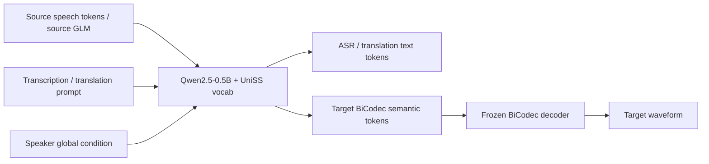
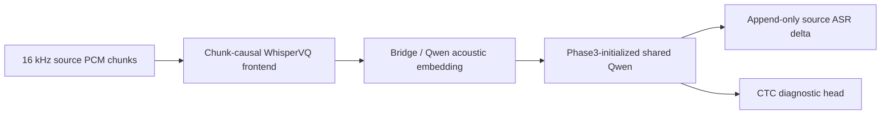
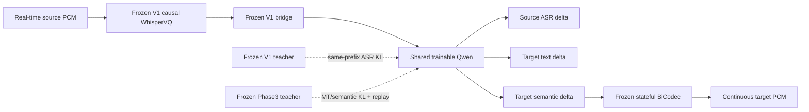

# UniSS 项目总览：Offline Phase1–3 与 Streaming Stage A/B

> 面向对象：第一次接触本项目、需要快速理解训练资产、实验逻辑和当前进度的同事。
>
> 仓库：`/opt/dlami/nvme/jasonleeeli/projects/UniSS`
>
> 状态快照：2026-08-19 06:31 UTC，Git commit `f893ebe`

## 1. 一页结论

本项目目前有两条需要严格区分的主线。

1. **Offline Speech-to-Speech Translation（已完成）**
   - 使用公开 UniST 的全部 198 个 train parquet shard；
   - 采用 Qwen2.5-0.5B-Instruct + UniSS 扩展词表；
   - 在 Megatron-LM 中依次完成 Phase1、Phase2、Phase3；
   - 当前最佳稳定模型是 Phase3 v4 `iter_0009075`；
   - 已完成 UniST dev/test 的文本、语音、时长、韵律和音质评估。

2. **Streaming/Simultaneous S2ST（正在推进）**
   - 目标是让源语音仍在到达时，模型就产生不可回滚的源转录、目标翻译和目标语音 semantic token；
   - Stage A 已训练出 chunk-causal WhisperVQ + streaming ASR 的 V1 checkpoint，但自由运行 ASR 质量门未通过；
   - 当前不再执行旧的“三个独立 Qwen 级联”Stage B，而是执行新的**单模型 E2E Stage B**：冻结 V1 因果声学前端，低学习率联合训练一个共享 Qwen；
   - 当前 Stage B 仍处在正式数据门阶段，正在运行 V1 free-running rollout，尚未开始 optimizer training。

最重要的 checkpoint 继承关系是：

```text
Qwen2.5-0.5B + UniSS vocab
  -> Offline Phase1 recovery
  -> Offline Phase2 v4
  -> Offline Phase3 v4 iter_0009075
       -> Streaming Stage A V1 iter_0000381
            -> 当前 E2E Stage B student 初始化

Offline Phase3 v4 还会作为冻结 teacher 和 replay anchor，
但当前 E2E student 的直接初始化是完整 Stage A V1 compound checkpoint。
```

## 2. 项目边界与术语

### 2.1 当前 offline 不是论文严格全语料复现

当前已完成路线应称为：

```text
UniST-198 full-data public reproduction
```

它不是原论文 1.5B 模型和全部私有/未公开训练语料的严格复现，主要差别是：

- 当前 backbone 是 Qwen2.5-0.5B，而论文主模型是 1.5B；
- Phase1 MT 使用 UniST transcription→translation 作为 proxy；
- 当前 speech 数据来自公开 UniST，不是论文完整约 77.1k 小时语料；
- 当前主要 dev/test 是 UniST dev/test，不能直接把数值当作论文 CVSS-T Table 1 排名。

### 2.2 Offline 与 streaming 的差别

Offline 模型可以等完整源语音可用后一次生成完整目标。Streaming 模型必须满足：

- 输入以真实 PCM chunk 逐步到达，不能提前读取文件尾；
- source ASR、target text 和 target semantic 都采用 append-only commit；
- 已提交内容不能在后续 chunk 回滚；
- 必须在 source EOS 前产生有效 target text 和非静音 target PCM，才算 simultaneous；
- 长音频不能每次把全部历史重新计算，cache 和 backlog 必须有界。

## 3. 关键路径与环境

### 3.1 根目录

| 内容 | 路径 |
|---|---|
| 仓库 | `/opt/dlami/nvme/jasonleeeli/projects/UniSS` |
| 用户数据/环境根目录 | `/opt/dlami/nvme/jasonleeeli` |
| 训练环境 Python | `/opt/dlami/nvme/jasonleeeli/conda_envs/uniss-train/bin/python` |
| 评估环境 Python | `/opt/dlami/nvme/jasonleeeli/conda_envs/uniss-eval/bin/python` |
| 训练环境激活脚本 | `/opt/dlami/nvme/jasonleeeli/env_recovery/uniss-train-20260721/activate_uniss.sh` |
| 原始 UniST | `/opt/dlami/nvme/jasonleeeli/projects/UniSS/data/raw/UniST` |
| Megatron-LM | `/opt/dlami/nvme/jasonleeeli/projects/UniSS/third_party/Megatron-LM` |

常用初始化：

```bash
export USER_ROOT=/opt/dlami/nvme/jasonleeeli
export REPO_ROOT=${USER_ROOT}/projects/UniSS
cd "${REPO_ROOT}"
source ${USER_ROOT}/env_recovery/uniss-train-20260721/activate_uniss.sh
```

### 3.2 资产目录约定

```text
data/raw/          原始 parquet/音频资产
data/processed/    未 packed JSONL、trajectory、rollout、alignment
data/megatron/     18,000-token packed 数据和索引
checkpoints/       Megatron distributed checkpoints 与 HF 导出
runs/              TensorBoard 和完成标记
logs/              训练、数据处理、GPU monitor 日志
reports/           不可变 gate、审计和 Markdown 报告
eval_outputs/      推理结果、音频和客观指标
experiments/       新实验的隔离实现
docs/              计划、复现教程和结果分析
```

所有新实验都应新建 experiment/data/checkpoint/report 子目录，不覆盖历史 Phase1–3、Stage A 或评估结果。

## 4. Offline 模型整体架构

Offline Phase1–3 都使用同一套自回归 Qwen backbone 和统一词表：



模型主体参数：

| 参数 | 值 |
|---|---:|
| layers | 24 |
| hidden size | 896 |
| FFN size | 4864 |
| attention heads / query groups | 14 / 2 |
| logical vocab | 180,407 |
| Megatron padded vocab | 180,480 |
| sequence length | 18,000 |
| max position | 32,768 |
| precision | BF16 |
| GPU | 单机 8 卡 |
| TP / PP | 1 / 1 |
| micro/global batch | 2 / 128 |
| attention | FlashAttention |
| optimizer | AdamW, betas 0.9/0.95 |

## 5. Offline Phase1–3：数据和任务

### 5.1 原始数据

```text
data/raw/UniST/train-00000.parquet ... train-00197.parquet
data/raw/UniST/dev-00000.parquet
data/raw/UniST/test-00000.parquet
```

当前版本的精确记录数：

| split | shard | records |
|---|---:|---:|
| train | 198 | 19,785,924 |
| dev | 1 | 7,965 |
| test | 1 | 23,369 |

关键字段包括：

```text
id, transcription, translation,
source_glm, source_bicodec, target_bicodec, bicodec_global,
src_lang, tgt_lang
```

### 5.2 三个 phase 的任务定义

| 阶段 | 每个 raw row 的任务 | 作用 |
|---|---|---|
| Phase1 | ASR、S2TT、TTS、MT proxy | 建立文本、语音 token 和跨语言基础能力 |
| Phase2 | Quality、Performance、Direct S2ST + Phase1 replay | 学习完整 S2ST，同时防止基础能力遗忘 |
| Phase3 | Quality、Performance | 聚焦最终 offline S2ST 输出质量与速度模式 |

样本规模：

| 阶段 | 未 packed samples |
|---|---:|
| Phase1 | 79,143,696 |
| Phase2 原始任务 | 59,357,772 |
| Phase2 加 2:1 replay 后 | 89,036,658 |
| Phase3 | 39,571,848 |

Phase2 的 `2:1` 表示 Phase2 task : Phase1 replay = 2:1，不是复制 parquet。

### 5.3 数据制作入口

核心脚本：

```text
training/prepare_phase1_alignment.py
training/prepare_unist_s2st.py
training/mix_sample_jsonl.py
training/pack_sequences.py
training/pack_sequences_parallel.py
training/validate_packed_jsonl.py
scripts/pack_unist198_full.sh
```

每个 train shard 生成 Phase1/2/3 JSONL 的核心调用是：

```bash
python training/prepare_phase1_alignment.py \
  --input data/raw/UniST/train-00000.parquet \
  --tokenizer pretrained_models/UniSS \
  --tasks asr s2tt tts --include-mt-proxy \
  --output data/processed/phase1_unist198_sharded/train-00000.jsonl

python training/prepare_unist_s2st.py \
  --input data/raw/UniST/train-00000.parquet \
  --phase phase2 --tokenizer pretrained_models/UniSS \
  --output data/processed/phase2_unist198_sharded/train-00000.jsonl

python training/prepare_unist_s2st.py \
  --input data/raw/UniST/train-00000.parquet \
  --phase phase3 --tokenizer pretrained_models/UniSS \
  --output data/processed/phase3_unist198_sharded/train-00000.jsonl
```

正式处理 198 shard 时使用并行 worker。完整命令见：

```text
docs/uniss_training_reproduction/uniss_full198_phase1_phase3_reproduction_tutorial.md
```

Phase2 replay mix：

```bash
python training/mix_sample_jsonl.py \
  --group "unist=2:<198个Phase2 JSONL>" \
  --group "phase1=1:<198个Phase1 JSONL>" \
  --max-records 89036658 \
  --output data/processed/phase2_unist198_mix/phase2_mix_2to1.jsonl
```

全量 packing：

```bash
PACK_WORKERS=16 \
bash scripts/pack_unist198_full.sh \
  --config configs/experiments/uniss_qwen0p5b_unist198_full_v1.env \
  --start-phase phase1
```

当前 packed 数据：

| 阶段 | 路径 | records |
|---|---|---:|
| Phase1 | `data/megatron/phase1_unist198/packed_train.jsonl` | 800,632 |
| Phase2 | `data/megatron/phase2_unist198_mix/packed_train.jsonl` | 1,968,716 |
| Phase3 | `data/megatron/phase3_unist198/packed_train.jsonl` | 1,161,587 |

三个文件当前都真实存在；大小约为 277 GB、699 GB 和 412 GB。

## 6. Offline Phase1

### 6.1 Motivation

Phase1 负责建立统一 token 空间中的基本映射：

- source speech/GLM → transcription；
- source speech/GLM → translation；
- text + speaker → target semantic；
- transcription → translation proxy。

### 6.2 当前稳定训练链

原始 Phase1 高 LR 后段出现 loss/grad 爆炸，因此保留原始 `iter_0003300`，再用低 LR、cyclic shuffle 和新 optimizer 做 recovery。

从头复现时先得到 3300 checkpoint：

```bash
tmux new-session -d -s uniss_phase1_prefix_3300 \
  "cd ${REPO_ROOT} && \
   source ${USER_ROOT}/env_recovery/uniss-train-20260721/activate_uniss.sh && \
   PHASE1_TRAIN_ITERS=3300 PHASE1_LR_WARMUP_ITERS=6255 \
   bash scripts/run_qwen0p5b_unist198_all_phases.sh \
     --config configs/experiments/uniss_qwen0p5b_unist198_full_v1.env \
     --start-phase phase1 --end-phase phase1"
```

再执行正式 recovery：

```bash
tmux new-session -d -s uniss_phase1_recovery_b1_v2 \
  "cd ${REPO_ROOT} && \
   source ${USER_ROOT}/env_recovery/uniss-train-20260721/activate_uniss.sh && \
   TRAIN_ITERS=15465 \
   bash scripts/run_qwen0p5b_unist198_phase1_recovery_b.sh \
     --config configs/experiments/uniss_qwen0p5b_unist198_phase1_recovery_b1_v2.env"
```

### 6.3 结果和路径

| 内容 | 路径/结果 |
|---|---|
| checkpoint | `checkpoints/uniss_qwen0p5b_phase1_unist198_recovery_b1_v2/iter_0015465` |
| 本地 recovery iterations | 15,465 |
| 有效总预算 | 3,300 + 15,465 = 18,765 steps |
| final validation loss | 约 5.3098 |
| log | `logs/uniss_qwen0p5b_phase1_unist198_recovery_b1_v2.log` |
| TensorBoard | `runs/uniss_qwen0p5b_phase1_unist198_recovery_b1_v2/tensorboard` |

## 7. Offline Phase2

### 7.1 Motivation

Phase2 开始直接训练 Quality、Performance 和 Direct S2ST，同时用 Phase1 replay 防止 ASR、S2TT、TTS 和 MT 基础能力被覆盖。

Phase2 是一个新训练阶段，因此只加载 Phase1 模型权重：

```text
FINETUNE=1
LOAD_OPTIM=0
LOAD_RNG=0
```

### 7.2 训练命令

先 dry-run：

```bash
bash scripts/run_qwen0p5b_unist198_phase2_from_phase1_v4.sh \
  --config configs/experiments/uniss_qwen0p5b_unist198_phase2_from_phase1_v4.env \
  --dry-run
```

正式启动：

```bash
tmux new-session -d -s uniss_phase2_from_phase1_v4 \
  "cd ${REPO_ROOT} && \
   bash scripts/run_qwen0p5b_unist198_phase2_from_phase1_v4.sh \
     --config configs/experiments/uniss_qwen0p5b_unist198_phase2_from_phase1_v4.env"
```

### 7.3 结果和路径

| 内容 | 路径/结果 |
|---|---|
| source | Phase1 recovery `iter_0015465` |
| checkpoint | `checkpoints/uniss_qwen0p5b_phase2_unist198_from_phase1_fast_decay_v4/iter_0015381` |
| iterations | 15,381，约一个 packed-data epoch |
| LR | `1e-5 -> 1e-6` cosine |
| best/last validation loss | 约 4.2881 |
| log | `logs/uniss_qwen0p5b_phase2_unist198_from_phase1_fast_decay_v4.log` |
| TensorBoard | `runs/uniss_qwen0p5b_phase2_unist198_from_phase1_fast_decay_v4/tensorboard` |

## 8. Offline Phase3（当前 offline 最佳）

### 8.1 Motivation

Phase3 从 Phase2 继续，只保留最终 Quality 和 Performance 两种任务，集中优化实际 S2ST 输出。

- Quality：通常更重视翻译与生成质量；
- Performance：通常更重视快速、直接的生成路径。

### 8.2 训练命令

Phase3 waiter 可以在 Phase2 训练期间先启动；它会等待 Phase2 final checkpoint 和 gate：

```bash
tmux new-session -d -s uniss_phase3_after_phase2_v4 \
  "cd ${REPO_ROOT} && \
   bash scripts/run_qwen0p5b_unist198_phase3_after_phase2_recovery_v1.sh \
     --config configs/experiments/uniss_qwen0p5b_unist198_phase3_after_phase2_v4.env"
```

### 8.3 结果和路径

| 内容 | 路径/结果 |
|---|---|
| source | Phase2 v4 `iter_0015381` |
| native checkpoint | `checkpoints/uniss_qwen0p5b_phase3_unist198_after_phase2_v4/iter_0009075` |
| HF checkpoint | `checkpoints/exported_hf/qwen0p5b_phase3_unist198_iter_0009075_hf` |
| iterations | 9,075 |
| final validation loss | 3.80985 |
| log | `logs/uniss_qwen0p5b_phase3_unist198_after_phase2_v4.log` |
| TensorBoard | `runs/uniss_qwen0p5b_phase3_unist198_after_phase2_v4/tensorboard` |

## 9. Offline Phase3 评估与结果

### 9.1 评估入口

准备 manifest：

```bash
experiments/evaluation/uniss_full198_phase2_phase3/prepare_manifests.sh
```

导出 HF：

```bash
CUDA_VISIBLE_DEVICES=0 \
experiments/evaluation/uniss_full198_phase2_phase3/export_exact.sh phase3
```

完整评估：

```bash
RUN_ID=$(date -u +%Y%m%dT%H%M%SZ)

tmux new-session -d -s uniss_full198_evaluation \
  "cd ${REPO_ROOT} && \
   RUN_ID=${RUN_ID} \
   DEV_PHASE2_GPUS=0,1,2,3 DEV_PHASE3_GPUS=4,5,6,7 \
   TEST_PHASE2_GPUS=0,1,2,3 TEST_PHASE3_GPUS=4,5,6,7 \
   ASR_BATCH_SIZE=32 \
   experiments/evaluation/uniss_full198_phase2_phase3/run_complete_evaluation.sh"
```

完整报告：

```text
docs/uniss_training_reproduction/uniss_full198_phase2_phase3_detailed_evaluation_report.md
```

### 9.2 Phase3 UniST test 关键数值

| Mode | Direction | Text-BLEU | Speech-BLEU | AutoPCP | SLC-0.2 | SLC-0.4 | UTMOS |
|---|---|---:|---:|---:|---:|---:|---:|
| Performance | ZH→EN | 32.4509 | 19.3770 | 2.9118 | 0.6324 | 0.8782 | 3.6676 |
| Performance | EN→ZH | 40.5404 | 38.9953 | 3.2765 | 0.7184 | 0.9421 | 3.3516 |
| Quality | ZH→EN | 39.3753 | 22.7268 | 2.8850 | 0.6358 | 0.8712 | 3.6680 |
| Quality | EN→ZH | 48.1698 | 46.3063 | 3.2752 | 0.7246 | 0.9349 | 3.3586 |

指标含义：

- Text-BLEU：生成翻译文本质量；
- Speech-BLEU：目标语音经 ASR 后的翻译质量；
- AutoPCP：跨语言韵律/表达相似度代理；
- SLC：生成与参考音频时长一致性；
- UTMOS：预测语音自然度。

Phase3 相对 Phase2 在 test 的 24 个 higher-is-better 单元中提升 21 项；少量下降主要集中在 UTMOS，翻译和语义指标总体更好。

试听/完整输出示例：

```text
eval_outputs/qwen0p5b_phase3_unist198_iter_0009075_unist_dev_full_20260726T065924Z
eval_outputs/qwen0p5b_phase3_unist198_iter_0009075_unist_test_full_20260726T065924Z
```

## 10. Streaming Stage A

### 10.1 Motivation

原始 Phase3 使用完整 source GLM/offline context，不能直接处理真实逐 PCM chunk 输入。Stage A 的任务是把声学输入改造成因果流式表示，并让模型对每个 source event 输出增量 ASR。

Stage A 架构：



### 10.2 数据和训练几何

Stage A 使用固定 15-shard pilot 数据：

| 项目 | 数值 |
|---|---:|
| source records | 1,325,243 |
| train packs | 16,195 |
| sequence length | 18,000 |
| coverage epochs | 3 |
| train iterations | 381 |
| total consumed packs | 48,768 |
| GPU | 8×H200 |
| micro/global batch | 1 / 128 |

数据和训练目录：

```text
experiments/uniss_phase3_v4_quality_first_true_streaming_pilot15_v1/
data/processed/uniss_phase3_v4_quality_first_true_streaming_pilot15_v1/
data/megatron/uniss_phase3_v4_quality_first_true_streaming_pilot15_v1/
checkpoints/uniss_phase3_v4_quality_first_true_streaming_pilot15_v1/
reports/uniss_phase3_v4_quality_first_true_streaming_pilot15_v1/
```

### 10.3 Stage A 主要 loss

```text
1.00 AR-ASR CE
0.30 source CTC
0.20 same-prefix offline teacher KL
0.10 hidden multi-chunk consistency
0.10 cache/full consistency
1.00 offline ASR replay CE
1.00 exact Phase3 replay CE
```

需要注意：在 V1 正式 run 中，teacher posterior 字段没有进入 collator，所以 `offline_teacher_kl` 实际 denominator 为 0；`cache_full_consistency` 也被放在外部 checkpoint gate，而不是训练 step 内计算。这两个缺口是 Stage A free-running 质量未过门的重要背景。

### 10.4 如何调用 Stage A

Stage00 和数据门：

```bash
bash experiments/uniss_phase3_v4_quality_first_true_streaming_pilot15_v1/scripts/run_stage00_cpu_tests.sh
bash experiments/uniss_phase3_v4_quality_first_true_streaming_pilot15_v1/scripts/launch_stage00_frontend_tmux.sh
bash experiments/uniss_phase3_v4_quality_first_true_streaming_pilot15_v1/scripts/launch_stage00_offline_baseline_tmux.sh

bash experiments/uniss_phase3_v4_quality_first_true_streaming_pilot15_v1/scripts/run_stage_a_cpu_tests.sh
bash experiments/uniss_phase3_v4_quality_first_true_streaming_pilot15_v1/scripts/prepare_stage_a_inputs.sh
```

正式训练：

```bash
RUN_ID=stage_a_formal8_<UTC时间> \
bash experiments/uniss_phase3_v4_quality_first_true_streaming_pilot15_v1/scripts/launch_stage_a_formal_tmux.sh
```

### 10.5 Stage A V1 已完成结果

| 内容 | 结果 |
|---|---|
| run | `stage_a_formal8_20260816T224100Z` |
| checkpoint | `checkpoints/uniss_phase3_v4_quality_first_true_streaming_pilot15_v1/stage_a_formal/stage_a_formal8_20260816T224100Z/iter_0000381` |
| HF export | `checkpoints/exported_hf/uniss_stage_a_formal8_iter_0000381_hf` |
| training | 381/381，3 coverage epochs，0 skipped，0 NaN |
| streaming weighted WER/CER | 27.1432% |
| causal-full weighted WER/CER | 14.4546% |
| streaming 中文 CER | 21.0112% |
| streaming 英文 WER | 35.3399% |
| teacher-forced token accuracy | 92.0737% |
| pre-final 有输出 | 972/972 |
| AR empty/final-only | 0 / 0 |
| sample-level CTC all blank | 15 |
| event stop failure | 27 |

Offline Phase3 pilot anchor 是中文 CER 5.4661%、英文 WER 5.6072%。因此 Stage A 虽然学会了 event grammar，并能在 source EOS 前输出内容，但 free-running 内容质量相对 offline 严重退化，正式 gate 判定为失败。

权威报告：

```text
reports/uniss_phase3_v4_quality_first_true_streaming_pilot15_v1/
  stage_a_formal/stage_a_formal8_20260816T224100Z/
  STAGE_A_RESULT_REPORT.md
```

## 11. “Stage B”命名变化

早期模块化计划中的 Stage B 是：

```text
冻结 Stage A -> 单独训练 committed-source incremental MT
```

因为 Stage A 的 source text 质量门失败，这条旧 Stage B 被阻塞，没有作为正式训练启动。

当前正在执行的 Stage B 是替代后的最终路线：

```text
冻结 V1 causal frontend
+ 一个共享 Qwen
+ streaming ASR / incremental MT / target semantic 联合训练
+ Phase3 replay 与 V1/Phase3 teacher posterior
= 单模型 E2E Simultaneous S2ST student
```

因此同事看到“当前 Stage B”时，应理解为第 12 节的单模型 E2E 训练，不是旧的 incremental-MT-only 模块。

## 12. 当前 E2E Stage B 方案

### 12.1 Motivation

Stage A 的主要问题是 teacher forcing 与 free running 分布不一致：训练时每个 event 看到正确历史，真实推理时看到模型自己的历史，一次错误会在后续 event 累积。

当前 Stage B 通过以下方式修复：

1. 在同一条 trajectory 中联合监督 source ASR delta、target text delta 和 target semantic delta；
2. 训练数据显式包含 V1 free-running ASR history，而不是只用 gold history；
3. 用 same-prefix V1/Phase3 teacher posterior 约束 student；
4. 用 Phase3 Quality/Performance replay 保护 offline 翻译和 TTS 能力；
5. 用 commit consistency 约束已经输出的内容不可回滚；
6. 训练和验证都区分 teacher-forced 与真实 free-running。

### 12.2 架构



准确描述是：

> End-to-end simultaneous S2ST with a frozen causal speech encoder and a frozen neural audio codec.

### 12.3 初始化、冻结和训练参数

直接初始化：

```text
checkpoints/uniss_phase3_v4_quality_first_true_streaming_pilot15_v1/
  stage_a_formal/stage_a_formal8_20260816T224100Z/iter_0000381
```

冻结：

- V1 causal WhisperVQ frontend；
- V1 bridge/adapter 和 CTC head；
- BiCodec encoder/decoder；
- V1 teacher；
- Phase3 v4 teacher。

训练：

| 参数组 | max LR |
|---|---:|
| Qwen transformer body | `2e-6` |
| tied embedding/lm head | `5e-7` |

当前 native Megatron 实现只把共享 Qwen 放入 optimizer。冻结的 `stage_a_objective.*` 参数不进入 optimizer，并有 checkpoint key/fingerprint 和 bitwise 审计。

### 12.4 五类任务

| family | 稳态比例 | 作用 |
|---|---:|---|
| streaming ASR event | 25% | 保护/改进 V1 source ASR |
| incremental MT event | 20% | committed source → target text delta |
| interleaved E2E S2ST | 30% | 同一序列联合 ASR、MT、semantic |
| Phase3 Quality replay | 15% | 保护高质量 offline S2ST |
| Phase3 Performance replay | 10% | 保护快速 direct S2ST |

训练前期和中期会使用 curriculum：早期增加 ASR/replay 和大 chunk，后期逐步增加 320/160 ms chunk、V1 noisy history 和 E2E 比例。它是同一个 run 内的 schedule，不会在阶段切换时丢弃旧 loss。

### 12.5 当前实现的 loss

```text
1.00 ASR delta CE
+ 1.00 incremental MT delta CE
+ 1.00 target semantic delta CE
+ 0.50 Phase3 Quality/Performance replay CE
+ 0.30 V1 same-prefix ASR top-k KL
+ 0.25 Phase3 MT/semantic top-k KL
+ 0.20 committed-prefix consistency KL
+ 0.10 balanced boundary/EOS CE
+ 0.00 speaker continuity
```

speaker continuity 当前为 0，是因为尚无真实跨 fragment speaker-embedding sidecar。代码拒绝用伪标签开启该项。

### 12.6 数据 trajectory 的含义

每条样本将源 PCM、source ASR、target text 和 target semantic 放在同一时间轴上。例如：

```text
0--640 ms source PCM:
  gold source delta = "Good morning"
  V1 source delta   = "Good mourning"
  safe target delta = "早上好"
  semantic span     = target_bicodec[0:36]

640--1440 ms source PCM:
  gold source delta = "everyone"
  V1 source delta   = "everyone"
  safe target delta = "，大家"
  semantic span     = target_bicodec[36:69]
```

硬约束：

- source/target prefix 不可回滚；
- semantic span 无 gap、无 overlap；
- 所有 semantic delta 拼接后必须精确等于完整 `target_bicodec`；
- teacher 只能看到 student 当前可见的相同 source prefix；
- 非最终 event 不允许 EOS；
- 无可靠 alignment 的样本只能进入 Phase3 replay，不能进入严格 E2E 主任务。

## 13. 当前 Stage B 实际进度

### 13.1 已完成

当前正式数据 run：

```text
DATA_RUN_ID=formal_gold_20260818T090515Z
```

Gold trajectory 已通过硬门：

| split | records | events | pre-final target writes |
|---|---:|---:|---:|
| train | 1,325,243 | 25,997,984 | 7,666,418 |
| valid | 13,469 | 263,391 | 77,703 |

路径：

```text
data/processed/uniss_phase3_v4_e2e_simuls2st_pilot15_v1/
  formal_gold_20260818T090515Z/source_events/

reports/uniss_phase3_v4_e2e_simuls2st_pilot15_v1/
  formal_gold_20260818T090515Z/GOLD_TRAJECTORY_GATE.json
```

native Megatron E2E 训练代码、五 family schedule、teacher cache reader、18k packing、loss normalization 和 checkpoint 安全审计已经实现。实现报告记录的隔离测试为 `65 passed`，随后又增加了 rollout quality、all-family canary 和 teacher binding hardening。

### 13.2 正在运行

当前 V1 rollout run：

```text
FORMAL_RUN_ID=v1_rollout_formal_20260818T114000Z
```

2026-08-19 06:31 UTC 快照：

| 状态 | 数值 |
|---|---:|
| train source records | 1,325,243 |
| 已写 rollout records | 904,878，约 68.3% |
| 完成 worker | 38 / 192 |
| active worker | 154 |
| GPU utilization | 8 卡 99%--100% |
| 错误扫描 | 无 traceback/OOM/RuntimeError/NaN |

输出：

```text
data/processed/uniss_phase3_v4_e2e_simuls2st_pilot15_v1/
  formal_gold_20260818T090515Z/v1_rollouts/
  v1_rollout_formal_20260818T114000Z_train/

reports/uniss_phase3_v4_e2e_simuls2st_pilot15_v1/
  formal_gold_20260818T090515Z/v1_rollouts/
  v1_rollout_formal_20260818T114000Z_train/
```

### 13.3 自动后续顺序

```text
V1 train rollout
  -> V1 valid rollout
  -> train/valid rollout quality strata + QUALITY_GATE
  -> Phase3 train/valid teacher cache
  -> V1 train/valid same-prefix teacher cache
  -> 四个 cache audit
  -> 64-worker train/valid five-family task-pool construction
  -> 1--2 update 8-GPU smoke
  -> all-family canary + free-running validation
  -> formal_training_authorized=true
  -> 正式三 coverage E2E Megatron training
```

当前三个 tmux 自动链：

```text
uniss_e2e_v1_rollout_formal
uniss_e2e_phase3_teacher_after_rollout
uniss_e2e_task_pools_after_teacher
```

当前 `GOLD_TRAJECTORY_GATE.json` 的 `formal_training_authorized=false` 是正常状态，因为 rollout、teacher cache 和 task pool 尚未全部通过。此时不应绕过 gate 手动启动正式训练。

## 14. Stage B 的脚本入口

实验根目录：

```text
experiments/uniss_phase3_v4_e2e_simuls2st_pilot15_v1/
```

重要入口：

| 入口 | 作用 |
|---|---|
| `scripts/run_cpu_tests.sh` | isolated CPU/static tests |
| `scripts/launch_formal_gold_tmux.sh` | 构建正式 gold trajectory |
| `scripts/launch_v1_rollout_formal_tmux.sh` | 8-GPU train/valid V1 rollout |
| `scripts/run_rollout_quality_gate.sh` | clean/noisy/quarantine 质量分层 |
| `scripts/launch_phase3_teacher_cache_after_rollout_tmux.sh` | rollout 后自动生成四个 teacher cache |
| `scripts/launch_task_pools_after_teacher_tmux.sh` | cache 后自动构造五类 task pool |
| `scripts/run_formal_task_pools.sh` | 64-worker train/valid 18k packing |
| `scripts/run_e2e_megatron.sh` | 8-GPU native Megatron smoke/formal training |
| `training/pretrain_e2e_megatron.py` | Megatron 正式 entrypoint |

重新启动 rollout 的标准形式：

```bash
DATA_RUN_ID=formal_gold_<UTC时间> \
FORMAL_RUN_ID=v1_rollout_formal_<UTC时间> \
NUM_GPUS=8 PROCESSES_PER_GPU=24 \
bash experiments/uniss_phase3_v4_e2e_simuls2st_pilot15_v1/scripts/launch_v1_rollout_formal_tmux.sh
```

正式训练 gate 通过后，`run_e2e_megatron.sh` 至少需要：

```text
RUN_ID
RUN_TRAIN_BUILD_REPORT
RUN_VALID_BUILD_REPORT
RUN_V1_TRAIN_CACHE_AUDIT / RUN_V1_VALID_CACHE_AUDIT
RUN_PHASE3_TRAIN_CACHE_AUDIT / RUN_PHASE3_VALID_CACHE_AUDIT
RUN_TRAINING_GATE
RUN_SAVE_DIR
RUN_TENSORBOARD_DIR
RUN_LOG
```

正式训练固定使用：

```text
8 GPUs, TP=1, PP=1
MBS=1, GBS=128
seq_length=18000
BF16 + FlashAttention + activation recompute
strict global shuffle
3 primary-trajectory coverage epochs
--finetune --no-load-optim --no-load-rng
--dist-ckpt-strictness raise_all
```

total updates 会在 task pool 完成后按 interleaved primary count、GBS=128 和三次 coverage 自动计算，不复制 Stage A 的 381 或 Phase3 的 9075。

## 15. Stage B 如何验证是否成功

不能只看 total loss。至少需要六条隔离验证链：

| 验证链 | 目的 |
|---|---|
| V1 teacher ASR | 当前上游锚点 |
| E2E student ASR | 检查共享 Qwen 是否破坏 ASR |
| matching Phase3 Q/P | 检查 offline 能力保留 |
| gold ASR → E2E MT | 测 incremental MT 本身上限 |
| free-running ASR → E2E MT | 测真实 ASR→MT 误差传播 |
| PCM → ASR/MT/semantic → PCM | 最终 simultaneous S2ST |

关键指标：

- ASR：中文 CER、英文 WER、empty/final-only、event stop、rollback；
- MT：Text-BLEU、chrF、COMET、target coverage、rollback；
- Speech：ASR-BLEU、AutoPCP、SLC、speaker similarity、静音/重复、fragment discontinuity；
- Streaming：first source WRITE、first target WRITE、first semantic、first PCM、AL、LAAL、ATD、RTF、audio backlog；
- Runtime：cached/full parity、future perturbation、cache growth、30 秒/1 分钟/5 分钟稳定性。

第一轮最低目标不是立即保证 p50<1 秒，而是先证明：

```text
source EOS 前出现正确 target text 和非静音 target PCM
+ ASR 不差于 V1 固定门
+ gold incremental MT 保留 matching Phase3 至少 95%
+ source/target/semantic rollback = 0
+ 没有 offline full-utterance fallback
```

内容和 runtime 通过后，再优化 first target PCM 到 p50<1 秒、p95<1.5 秒。

## 16. 同事如何快速检查当前状态

Git：

```bash
cd /opt/dlami/nvme/jasonleeeli/projects/UniSS
git status --short --branch
git log -5 --oneline
```

Offline checkpoints：

```bash
for root in \
  checkpoints/uniss_qwen0p5b_phase1_unist198_recovery_b1_v2 \
  checkpoints/uniss_qwen0p5b_phase2_unist198_from_phase1_fast_decay_v4 \
  checkpoints/uniss_qwen0p5b_phase3_unist198_after_phase2_v4; do
  printf '%s: ' "$root"
  cat "$root/latest_checkpointed_iteration.txt"
done
```

预期：

```text
15465
15381
9075
```

Streaming Stage B：

```bash
tmux list-sessions | grep uniss_e2e

tail -f logs/uniss_phase3_v4_e2e_simuls2st_pilot15_v1/formal_gold_20260818T090515Z/phase3_teacher_cache/teacher_cache_formal_20260818T175859Z_watcher.log

tail -f logs/uniss_phase3_v4_e2e_simuls2st_pilot15_v1/formal_gold_20260818T090515Z/task_pools/task_pool_formal_20260818T201500Z_watcher.log

nvidia-smi
```

## 17. 推荐阅读顺序

1. 本文：项目和当前路线总览；
2. `docs/uniss_training_reproduction/uniss_full198_phase1_phase3_reproduction_tutorial.md`：Offline 完整复现；
3. `docs/uniss_training_reproduction/uniss_full198_phase2_phase3_detailed_evaluation_report.md`：Offline 结果；
4. `reports/uniss_phase3_v4_quality_first_true_streaming_pilot15_v1/stage_a_formal/stage_a_formal8_20260816T224100Z/STAGE_A_RESULT_REPORT.md`：Stage A 真实结果；
5. `docs/uniss_training_reproduction/uniss_phase3_v4_quality_first_true_streaming_asr_mt_tts_training_plan.md` 第 27 节：当前 E2E Stage B 权威方案；
6. `docs/uniss_training_reproduction/uniss_phase3_v4_e2e_simuls2st_native_megatron_implementation_report.md`：当前实现和 gate 状态；
7. `experiments/uniss_phase3_v4_e2e_simuls2st_pilot15_v1/README.md`：正在运行的脚本链。

## 18. 当前完成度清单

| 模块 | 状态 |
|---|---|
| Offline Phase1 | 完成 |
| Offline Phase2 | 完成 |
| Offline Phase3 | 完成，当前最佳 offline checkpoint |
| UniST dev/test 完整评估 | 完成 |
| Streaming Stage00 frontend/offline audit | 完成 |
| Streaming Stage A V1 训练 | 完成，数值稳定 |
| Streaming Stage A free-running 内容门 | 未通过 |
| 当前 E2E Stage B gold trajectory | 完成并通过 |
| 当前 E2E Stage B V1 rollout | 正在运行 |
| rollout quality gate | 等待 train/valid rollout |
| V1/Phase3 teacher cache | 自动等待 |
| five-family task pool | 自动等待 |
| Stage B Megatron smoke/canary | 脚本已实现，等待数据门 |
| Stage B formal training | 尚未授权、尚未开始 |
| 单模型 streaming Gradio | 必须等待通过的 E2E checkpoint |
